# State Machine — Pet Care Ecosystem

Tài liệu này đặc tả toàn bộ các Finite State Machine (FSM), trạng thái (States), lệnh kích hoạt (Commands), tác nhân (Actors), điều kiện bảo vệ (Guards/RULE-ID) và sự kiện miền (Domain Events) trong hệ thống Pet Care Ecosystem.

---

## 1. Account — AccountStatus

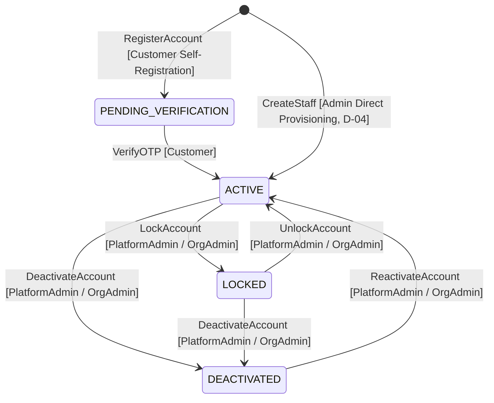
```mermaid
stateDiagram-v2
    [*] --> PENDING_VERIFICATION: RegisterAccount [Customer Self-Registration]
    PENDING_VERIFICATION --> ACTIVE: VerifyOTP [Customer]
    [*] --> ACTIVE: CreateStaff [Admin Direct Provisioning, D-04]
    ACTIVE --> LOCKED: LockAccount [PlatformAdmin / OrgAdmin]
    LOCKED --> ACTIVE: UnlockAccount [PlatformAdmin / OrgAdmin]
    ACTIVE --> DEACTIVATED: DeactivateAccount [PlatformAdmin / OrgAdmin]
    LOCKED --> DEACTIVATED: DeactivateAccount [PlatformAdmin / OrgAdmin]
    DEACTIVATED --> ACTIVE: ReactivateAccount [PlatformAdmin / OrgAdmin]
```

| From State | Command / Trigger | Actor | Guard (RULE-ID) | To State | Domain Event | Actions / Notes |
|---|---|---|---|---|---|---|
| [*] | RegisterAccount [Customer] | Customer | RULE-01-01, RULE-01-02 | PENDING_VERIFICATION | AccountRegistered | Khởi tạo tài khoản tự phục vụ; hệ thống gửi mã OTP xác thực có thời hạn 5 phút (TTL = 300s). |
| PENDING_VERIFICATION | VerifyOTP | Customer | RULE-01-02, RULE-01-03 | ACTIVE | AccountActivated | Xác thực OTP thành công trong thời hạn TTL; kích hoạt tài khoản chính thức. |
| [*] | CreateStaff [Staff] | PlatformAdmin / OrganizationAdmin | RULE-01-03, RULE-02-05 (D-04) | ACTIVE | AccountActivated | Khởi tạo nhân viên trực tiếp; cấp mật khẩu tạm thời (`must_change_password = true`), bỏ qua bước xác thực OTP đăng ký (Quyết định D-04). |
| ACTIVE | LockAccount | PlatformAdmin / OrganizationAdmin | RULE-02-04, RULE-02-05 | LOCKED | AccountLocked | Tạm khóa tài khoản; thu hồi toàn bộ session, Access Token và Refresh Token đang hoạt động (ví dụ: phát hiện nghi vấn hoặc 5 lần login sai). |
| LOCKED | UnlockAccount | PlatformAdmin / OrganizationAdmin | RULE-02-04, RULE-02-05 | ACTIVE | AccountUnlocked | Mở khóa tài khoản; cho phép người dùng đăng nhập lại vào hệ thống. |
| ACTIVE | DeactivateAccount | PlatformAdmin / OrganizationAdmin | RULE-02-05, RULE-02-07 | DEACTIVATED | AccountDeactivated | Vô hiệu hóa tài khoản khi nhân viên nghỉ việc, chấm dứt hợp đồng; thu hồi phiên tức thì và từ chối đăng nhập vĩnh viễn. |
| LOCKED | DeactivateAccount | PlatformAdmin / OrganizationAdmin | RULE-02-05, RULE-02-07 | DEACTIVATED | AccountDeactivated | Chuyển tài khoản bị tạm khóa sang vô hiệu hóa vĩnh viễn do chấm dứt nhân sự/tài khoản. |
| DEACTIVATED | ReactivateAccount | PlatformAdmin / OrganizationAdmin | RULE-02-05, RULE-02-07 | ACTIVE | AccountReactivated | Tái kích hoạt tài khoản đã bị vô hiệu hóa; ghi nhận lý do giải trình bắt buộc vào Audit Log. |

- **Initial State:** `PENDING_VERIFICATION` (khi khách hàng tự đăng ký qua Web/App), `ACTIVE` (khi Platform Admin hoặc Org Admin khởi tạo trực tiếp nhân viên theo Quyết định D-04).
- **Terminal State:** `DEACTIVATED` (khi chấm dứt hợp đồng nhân viên hoặc ngừng sử dụng dịch vụ vĩnh viễn).
- **Technical Invariants:**
  1. *Phân định Kích hoạt D-04:* Khách hàng bắt buộc qua `PENDING_VERIFICATION -> VerifyOTP -> ACTIVE`. Tài khoản Staff tạo bởi Admin kích hoạt thẳng sang `ACTIVE` với cờ `must_change_password = true`.
  2. *Thu hồi Phiên Tức thì (RULE-02-04, RULE-02-07):* Lệnh `LockAccount` hoặc `DeactivateAccount` lập tức vô hiệu hóa JWT/Session Token, đưa token vào blacklist để ngăn chặn mọi truy cập trái phép.
  3. *Thời hạn OTP (RULE-01-02):* Mã OTP đăng ký hết hạn sau 300s; quá 5 lần nhập sai sẽ tạm khóa phiên xác thực 15 phút.
  4. *Ranh giới Khóa vs Vô hiệu hóa:* `LOCKED` là tạm thời (do nhập sai mật khẩu hoặc tạm đình chỉ); `DEACTIVATED` là vô hiệu hóa do nhân viên nghỉ việc hoặc chấm dứt dịch vụ.

---

## 2. Store — StoreStatus

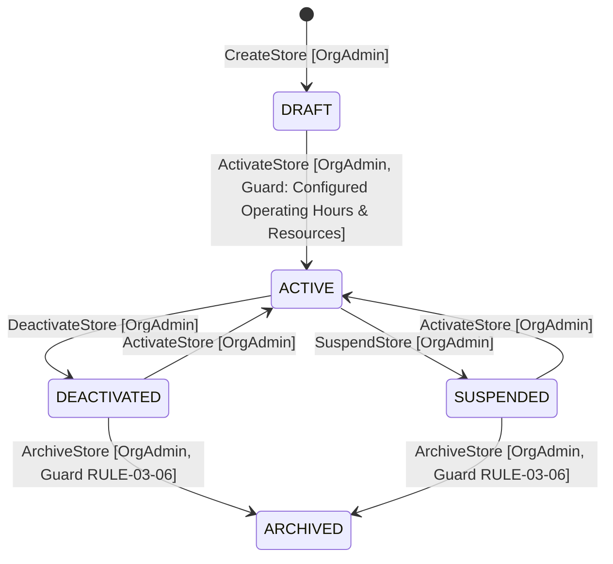
```mermaid
stateDiagram-v2
    [*] --> DRAFT: CreateStore [OrgAdmin]
    DRAFT --> ACTIVE: ActivateStore [OrgAdmin, Guard: Configured Operating Hours & Resources]
    ACTIVE --> SUSPENDED: SuspendStore [OrgAdmin]
    SUSPENDED --> ACTIVE: ActivateStore [OrgAdmin]
    ACTIVE --> DEACTIVATED: DeactivateStore [OrgAdmin]
    DEACTIVATED --> ACTIVE: ActivateStore [OrgAdmin]
    DEACTIVATED --> ARCHIVED: ArchiveStore [OrgAdmin, Guard RULE-03-06]
    SUSPENDED --> ARCHIVED: ArchiveStore [OrgAdmin, Guard RULE-03-06]
```

| From State | Command / Trigger | Actor | Guard (RULE-ID) | To State | Domain Event | Actions / Notes |
|---|---|---|---|---|---|---|
| [*] | CreateStore | OrganizationAdmin | RULE-03-01 | DRAFT | StoreCreated | Khởi tạo chi nhánh Store mới ở trạng thái bản nháp (`DRAFT`); chờ cấu hình giờ mở cửa, danh mục dịch vụ và tài nguyên cơ sở vật chất. |
| DRAFT | ActivateStore | OrganizationAdmin | RULE-03-02, RULE-03-07, RULE-03-08 | ACTIVE | StoreActivated | Kích hoạt Store chính thức đi vào vận hành sau khi đã hoàn tất cấu hình giờ hoạt động (`OperatingHours`), tài nguyên phòng/bàn (`StoreResource`) và danh mục dịch vụ. |
| ACTIVE | SuspendStore | OrganizationAdmin | RULE-03-03, RULE-03-04 | SUSPENDED | StoreSuspended | Tạm ngưng hoạt động; hệ thống tự động khóa tính năng nhận lịch hẹn mới, chặn xếp hàng Walk-in và chặn tạo đơn hàng mới. |
| SUSPENDED | ActivateStore | OrganizationAdmin | RULE-03-02, RULE-03-03 | ACTIVE | StoreActivated | Tái kích hoạt chi nhánh; khôi phục khả năng tiếp nhận lịch hẹn, bán hàng và phục vụ dịch vụ. |
| ACTIVE | DeactivateStore | OrganizationAdmin | RULE-03-03, RULE-03-04 | DEACTIVATED | StoreDeactivated | Ngừng kích hoạt Store; yêu cầu xử lý hoàn tất hoặc hủy/hoàn cọc các đơn hàng và lịch hẹn đang mở trước khi chuyển trạng thái tiếp theo. |
| DEACTIVATED | ActivateStore | OrganizationAdmin | RULE-03-02, RULE-03-03 | ACTIVE | StoreActivated | Mở lại Store từ trạng thái ngừng kích hoạt. |
| DEACTIVATED | ArchiveStore | OrganizationAdmin | RULE-03-06 | ARCHIVED | StoreArchived | Đóng cửa lưu trữ Store vĩnh viễn khi thỏa mãn đồng thời 4 điều kiện bất biến (0 active orders, 0 active appointments, 0 physical stock, 0 unsettled debts/refunds). |
| SUSPENDED | ArchiveStore | OrganizationAdmin | RULE-03-06 | ARCHIVED | StoreArchived | Đóng cửa lưu trữ Store vĩnh viễn từ trạng thái tạm ngưng khi thỏa mãn đồng thời 4 điều kiện bất biến (RULE-03-06). |

- **Initial State:** `DRAFT` (Store mới khởi tạo cần hoàn tất cấu hình trước khi mở cửa đón khách)
- **Terminal State:** `ARCHIVED`
- **Technical Invariants:**
  1. *Độc quyền Tổ chức & Cách ly Dữ liệu (RULE-03-01):* Mỗi Store bắt buộc thuộc đúng một Organization cha duy nhất; dữ liệu cách ly 100% (Multi-Tenancy Isolation).
  2. *Quy trình Kích hoạt từ DRAFT (RULE-03-02):* Store mới tạo ở trạng thái `DRAFT` không được phép nhận lịch hẹn hoặc tạo đơn hàng cho đến khi OrgAdmin gọi `ActivateStore` sau khi đã cấu hình đầy đủ giờ hoạt động và tài nguyên.
  3. *Điều kiện Bất biến Lưu trữ Đóng cửa (Store Archival Invariant - RULE-03-06):* Lệnh `ArchiveStore` chỉ được thực thi khi:
     - Không còn đơn hàng nào đang mở/đang xử lý (`PENDING_PAYMENT`, `PAID`, `PROCESSING`, `READY`).
     - Không còn lịch hẹn nào đang mở hoặc đang phục vụ (`BOOKED`, `CONFIRMED`, `CHECKED_IN`, `IN_PROGRESS`).
     - Tồn kho thực tế tại Store bằng 0 ($\text{PhysicalQuantity} == 0$).
     - Không còn công nợ tài chính, giao dịch chưa đối soát hoặc yêu cầu hoàn tiền đang xử lý.

---

## 3. CaregiverInvitation / Delegation — CaregiverStatus

> `Caregiver` là Actor. `CaregiverStatus` đặc tả vòng đời của lời mời ủy quyền (`CaregiverInvitation`) và quan hệ ủy quyền chăm sóc thú cưng (`PetCaregiverDelegation`).
> Theo quyết định nghiệp vụ đã duyệt: `AcceptCaregiverInvitation` kích hoạt trạng thái `ACTIVE` trực tiếp, không qua bước duyệt trung gian.

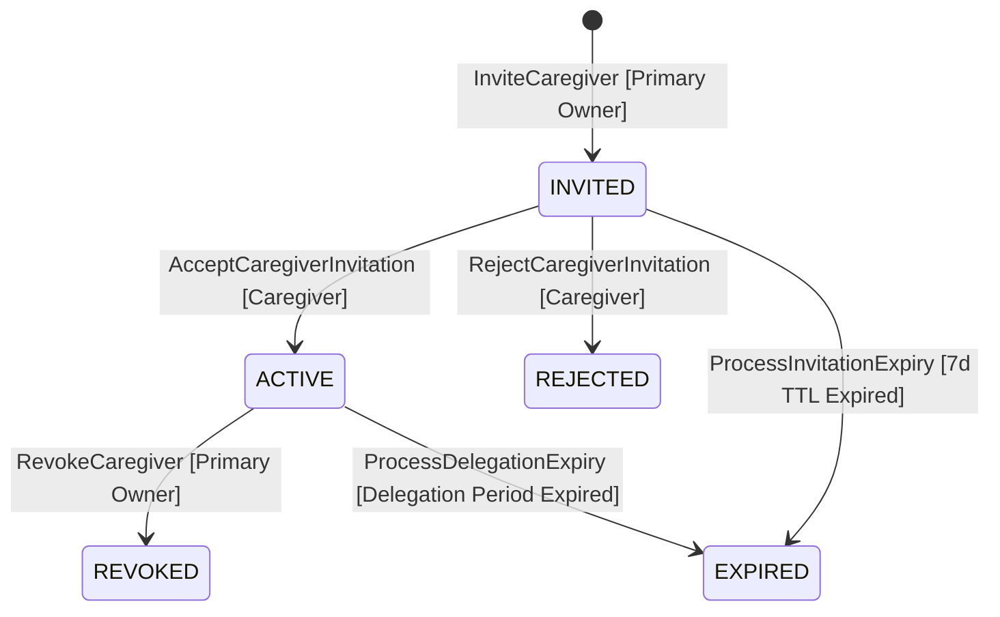
```mermaid
stateDiagram-v2
    [*] --> INVITED: InviteCaregiver [Primary Owner]
    INVITED --> ACTIVE: AcceptCaregiverInvitation [Caregiver]
    INVITED --> REJECTED: RejectCaregiverInvitation [Caregiver]
    INVITED --> EXPIRED: ProcessInvitationExpiry [7d TTL Expired]
    ACTIVE --> REVOKED: RevokeCaregiver [Primary Owner]
    ACTIVE --> EXPIRED: ProcessDelegationExpiry [Delegation Period Expired]
```

| From State | Command / Trigger | Actor | Guard (RULE-ID) | To State | Domain Event | Actions / Notes |
|---|---|---|---|---|---|---|
| [*] | InviteCaregiver | Customer (Primary Owner) | RULE-04-01, RULE-04-04 | INVITED | CaregiverInvited | Khởi tạo lời mời ủy quyền chăm sóc Pet; hệ thống tạo `invitation_token` với thời hạn hiệu lực 7 ngày (TTL = 7 ngày). |
| INVITED | AcceptCaregiverInvitation | Caregiver | RULE-04-05, RULE-04-06 | ACTIVE | CaregiverInvitationAccepted | Người được mời chấp thuận lời mời trong thời hạn TTL; kích hoạt quan hệ ủy quyền `ACTIVE` trực tiếp có hiệu lực ngay lập tức. |
| INVITED | RejectCaregiverInvitation | Caregiver | RULE-04-06 | REJECTED | CaregiverInvitationRejected | Người được mời chủ động từ chối lời mời ủy quyền; hủy bỏ lời mời. |
| INVITED | ProcessInvitationExpiry | System | RULE-04-05 | EXPIRED | CaregiverInvitationExpired | Quá thời hạn 7 ngày không được xác nhận; tác vụ nền tự động quét và đánh dấu lời mời hết hạn. |
| ACTIVE | RevokeCaregiver | Customer (Primary Owner) | RULE-04-04, RULE-04-08 | REVOKED | CaregiverRevoked | Chủ sở hữu chính chủ động thu hồi quyền ủy quyền; lập tức chấm dứt mọi quyền xem và thao tác trên Pet của Caregiver. |
| ACTIVE | ProcessDelegationExpiry | System | RULE-04-07 | EXPIRED | CaregiverDelegationExpired | Hết thời hạn hiệu lực ủy quyền (`DelegationValidityPeriod`); hệ thống tự động chấm dứt quyền hạn ủy quyền. |

- **Initial State:** `INVITED`
- **Terminal State:** `REJECTED`, `EXPIRED`, `REVOKED`
- **Technical Invariants:**
  1. *Quyền Khởi tạo & Thu hồi Độc quyền của Primary Owner (RULE-04-04, RULE-04-08):* Chỉ có Primary Owner của Pet mới có quyền gửi lời mời (`InviteCaregiver`) hoặc thu hồi quyền ủy quyền (`RevokeCaregiver`). Caregiver tuyệt đối không được phép mời thêm Caregiver khác, không được chuyển nhượng quyền sở hữu Pet (`ManagePetOwnership`), và không được sửa đổi thông tin định danh cốt lõi của Pet.
  2. *Ranh giới Quyền hạn của Active Caregiver (RULE-04-09):* Khi ở trạng thái `ACTIVE`, Caregiver được phép: xem thông tin Pet, đặt lịch hẹn (`BookAppointment`), đưa Pet đi khám/spa, tiếp nhận check-in/check-out và xem lịch sử y tế được chia sẻ.
  3. *Thời hạn Lời mời vs Thời hạn Ủy quyền:* Lời mời có TTL 7 ngày (`RULE-04-05`). Khi chuyển sang `ACTIVE`, quan hệ ủy quyền duy trì đến ngày kết thúc ủy quyền (`DelegationValidityPeriod` theo `RULE-04-07`).

---

## 4. Appointment & BookingHold — AppointmentStatus & BookingHoldStatus

### 4.1. BookingHold — BookingHoldStatus (Pre-booking Slot Reservation 15m TTL)

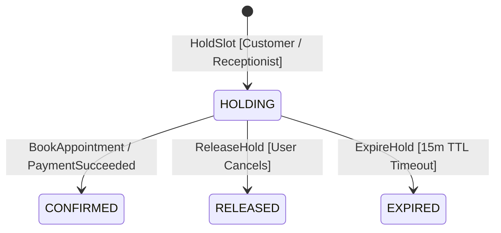
```mermaid
stateDiagram-v2
    [*] --> HOLDING: HoldSlot [Customer / Receptionist]
    HOLDING --> CONFIRMED: BookAppointment / PaymentSucceeded
    HOLDING --> RELEASED: ReleaseHold [User Cancels]
    HOLDING --> EXPIRED: ExpireHold [15m TTL Timeout]
```

| From State | Command / Trigger | Actor | Guard (RULE-ID) | To State | Domain Event | Actions / Notes |
|---|---|---|---|---|---|---|
| [*] | HoldSlot | Customer / Receptionist | RULE-06-01 | HOLDING | SlotHeld | Khóa tạm thời tài nguyên phòng/bàn, lịch nhân sự và lịch Pet trong 15 phút ($\text{Hold\_TTL} = 900\text{s}$). |
| HOLDING | BookAppointment / PaymentSucceeded | Customer / Receptionist / System | RULE-06-01, RULE-06-02 | CONFIRMED | AppointmentBooked | Xác nhận hoặc hoàn tất đặt cọc/thanh toán trong thời hạn 15m; khởi tạo Aggregate `Appointment` chính thức. |
| HOLDING | ReleaseHold | Customer / Receptionist | RULE-06-01 | RELEASED | HoldReleased | Khách hàng hoặc tiếp tân chủ động hủy phiên đặt lịch; giải phóng slot tài nguyên ngay lập tức. |
| HOLDING | ExpireHold | System | RULE-06-01 | EXPIRED | HoldExpired | Quá thời hạn 15 phút không hoàn tất xác nhận/thanh toán; hệ thống tự động quét và giải phóng slot về trạng thái tự do (`FREE`). |

- **Initial State:** `HOLDING`
- **Terminal State:** `CONFIRMED`, `RELEASED`, `EXPIRED`
- **Technical Invariants:**
  1. *Khóa Giữ chỗ 15 Phút (RULE-06-01):* Slot giữ chỗ tạm thời có TTL chính xác 900 giây. Trong thời gian này, slot không thể bị chọn bởi khách hàng khác.
  2. *Cầu nối Giữ chỗ sang Cuộc hẹn:* Khi chuyển sang `CONFIRMED`, `BookingHold` hoàn tất vai trò và phát sinh sự kiện `AppointmentBooked` để khởi tạo `Appointment`.

---

### 4.2. Appointment — AppointmentStatus

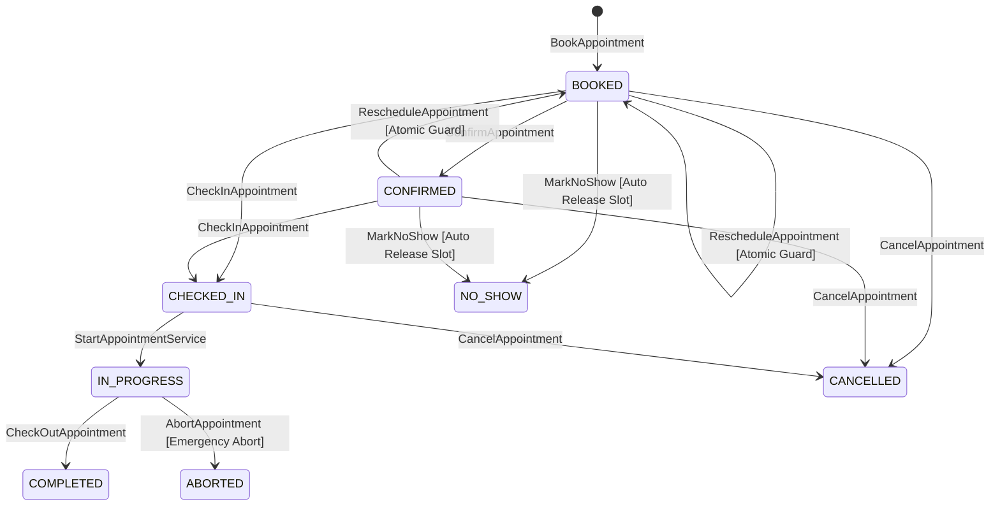
```mermaid
stateDiagram-v2
    [*] --> BOOKED: BookAppointment
    BOOKED --> CONFIRMED: ConfirmAppointment
    BOOKED --> CHECKED_IN: CheckInAppointment
    CONFIRMED --> CHECKED_IN: CheckInAppointment
    BOOKED --> BOOKED: RescheduleAppointment [Atomic Guard]
    CONFIRMED --> BOOKED: RescheduleAppointment [Atomic Guard]
    CHECKED_IN --> IN_PROGRESS: StartAppointmentService
    IN_PROGRESS --> COMPLETED: CheckOutAppointment
    BOOKED --> CANCELLED: CancelAppointment
    CONFIRMED --> CANCELLED: CancelAppointment
    CHECKED_IN --> CANCELLED: CancelAppointment
    BOOKED --> NO_SHOW: MarkNoShow [Auto Release Slot]
    CONFIRMED --> NO_SHOW: MarkNoShow [Auto Release Slot]
    IN_PROGRESS --> ABORTED: AbortAppointment [Emergency Abort]
```

| From State | Command / Trigger | Actor | Guard (RULE-ID) | To State | Domain Event | Actions / Notes |
|---|---|---|---|---|---|---|
| [*] | BookAppointment | Customer / Receptionist / Caregiver | RULE-06-01, RULE-06-02, RULE-06-10, RULE-06-11 | BOOKED | AppointmentBooked | Khởi tạo lịch hẹn mới thỏa mãn đồng thời: Store đang `ACTIVE`, nằm trong giờ mở cửa, và vượt qua kiểm tra xung đột 3 chiều (Staff, StoreResource, Pet Schedule). |
| BOOKED | ConfirmAppointment | Receptionist / System | RULE-06-01, RULE-06-03, RULE-06-10 | CONFIRMED | AppointmentConfirmed | Tiếp tân hoặc hệ thống xác nhận lịch hẹn khi đảm bảo đủ nhân sự trực ca và công suất phòng/bàn. |
| BOOKED | CheckInAppointment | Receptionist | RULE-06-06 | CHECKED_IN | AppointmentCheckedIn | Tiếp tân tiếp nhận khách đến Store trực tiếp từ trạng thái `BOOKED`. |
| CONFIRMED | CheckInAppointment | Receptionist | RULE-06-06 | CHECKED_IN | AppointmentCheckedIn | Tiếp tân tiếp nhận khách đến Store đúng lịch hẹn đã xác nhận. |
| BOOKED | RescheduleAppointment | Customer / Receptionist | RULE-06-03, RULE-06-04, RULE-06-10, RULE-06-11 | BOOKED | AppointmentRescheduled | Đổi lịch hẹn nguyên tử (Atomic Reschedule): Khóa giữ chỗ khung giờ mới trước, chỉ giải phóng slot cũ khi slot mới thành công; rollback toàn phần nếu thất bại. |
| CONFIRMED | RescheduleAppointment | Customer / Receptionist | RULE-06-03, RULE-06-04, RULE-06-10, RULE-06-11 | BOOKED | AppointmentRescheduled | Đổi lịch hẹn nguyên tử từ `CONFIRMED`: Khóa slot mới, giải phóng slot cũ, đưa về `BOOKED` để tái xác nhận. |
| CHECKED_IN | StartAppointmentService | Veterinarian / Groomer | RULE-06-06, RULE-09-01, RULE-11-01 | IN_PROGRESS | AppointmentStarted | Bác sĩ hoặc Groomer tiếp nhận Pet vào phòng khám/bàn làm đẹp bắt đầu phục vụ chuyên môn. |
| IN_PROGRESS | CheckOutAppointment | Receptionist | RULE-06-06, RULE-06-07, RULE-09-06, RULE-11-04 | COMPLETED | AppointmentCompleted | Hoàn tất phiên dịch vụ y tế/spa; giải phóng tài nguyên phòng/bàn (`ReleaseStoreResource`); chuyển tiếp sang lập hóa đơn thanh toán tại quầy (`CreateInvoice`). |
| BOOKED | CancelAppointment | Customer / Receptionist | RULE-06-05, RULE-06-08 | CANCELLED | AppointmentCancelled | Khách hoặc tiếp tân hủy lịch trước giờ hẹn; yêu cầu nhập lý do hủy (`cancellation_reason`); tự động giải phóng tài nguyên và xử lý cọc. |
| CONFIRMED | CancelAppointment | Customer / Receptionist | RULE-06-05, RULE-06-08 | CANCELLED | AppointmentCancelled | Hủy lịch đã xác nhận; yêu cầu `cancellation_reason`; giải phóng tài nguyên phòng/bàn và ca làm việc; hoàn cọc theo chính sách Store. |
| CHECKED_IN | CancelAppointment | Receptionist / Customer | RULE-06-05, RULE-06-08 | CANCELLED | AppointmentCancelled | Khách hủy sau khi đã check-in nhưng chưa bắt đầu phục vụ; giải phóng tài nguyên; xử lý hoàn cọc. |
| BOOKED | MarkNoShow | Receptionist / System | RULE-06-09 | NO_SHOW | AppointmentNoShow | Khách quá hạn ân hạn (Grace Period 15 phút) không đến; tự động giải phóng tài nguyên phòng/bàn (`ReleaseStoreResource`) và lịch nhân sự (`ReleaseStaffSlot`); khấu trừ tiền cọc. |
| CONFIRMED | MarkNoShow | Receptionist / System | RULE-06-09 | NO_SHOW | AppointmentNoShow | Khách đã xác nhận nhưng quá giờ ân hạn không đến; lập tức giải phóng phòng/bàn và lịch nhân sự; phạt cọc theo chính sách chi nhánh. |
| IN_PROGRESS | AbortAppointment | Veterinarian / Groomer | RULE-06-08, RULE-21-01, RULE-21-02, RULE-21-03 | ABORTED | AppointmentAborted | Dừng phục vụ khẩn cấp do sốc y tế, thú cưng hung dữ, hoặc sự cố an toàn; giải phóng tài nguyên; tự động kích hoạt lập biên bản sự cố (`ClinicalIncident` / `GroomingIncident`) và yêu cầu hoàn tiền phần chưa thực hiện. |

- **Initial State:** `BOOKED`
- **Terminal State:** `COMPLETED`, `CANCELLED`, `NO_SHOW`, `ABORTED`
- **Technical Invariants:**
  1. *Cấm Tuyệt đối Bước nhảy Tắt (No Direct Checkout Invariant):* Nghiêm cấm hoàn toàn chuyển trạng thái trực tiếp `CHECKED_IN -> COMPLETED` mà không qua `IN_PROGRESS`. Mọi lịch hẹn hoàn tất bắt buộc phải có thời gian phục vụ thực tế và nhật ký chuyên môn hợp lệ.
  2. *Quy tắc Đổi lịch Nguyên tử (Atomic Reschedule Guard - RULE-06-04):*
     - Bắt buộc kiểm tra và khóa giữ chỗ khung giờ mới trước (thỏa mãn `StaffAvailability`, `StoreResource Collision Guard` và `Pet Schedule Collision Guard`).
     - Chỉ khi khóa thành công slot mới mới thực hiện giải phóng slot cũ và cập nhật `Appointment` về `BOOKED`.
     - Nếu slot mới bị trùng/xung đột, giao dịch rollback toàn phần giữ nguyên lịch hẹn ban đầu (khách hàng không bao giờ bị mất slot cũ khi đổi lịch thất bại).
  3. *Quy tắc Giải phóng Tài nguyên khi Vắng mặt (No-Show Resource & Slot Release - RULE-06-09):* Khi đánh dấu `MarkNoShow`, hệ thống lập tức gọi `ReleaseStoreResource` và `ReleaseStaffSlot` để giải phóng công suất cho khách khác hoặc hàng đợi Walk-in.
  4. *Kiểm tra Xung đột Lịch Tam diện (Triple Collision Guard - RULE-06-10, RULE-06-11):*
     $$\forall A \in \text{Appointments}(P): A.\text{status} \in \{\text{BOOKED, CONFIRMED, CHECKED\_IN, IN\_PROGRESS}\} \implies [A.T_{\text{start}}, A.T_{\text{end}}] \cap [T_{\text{start}}, T_{\text{end}}] = \emptyset$$
  5. *Giao thức Dừng Khẩn cấp (Emergency Abort Protocol - RULE-06-08, RULE-21-01):* `AbortAppointment` bắt buộc cung cấp `abort_reason`, phát sự kiện `AppointmentAborted`, tạo bản ghi Incident loại `HIGH`/`CRITICAL`, và phát sinh yêu cầu hoàn tiền cho các hạng mục chưa thực hiện.

---

## 5. Order — OrderStatus (v1 In-Store Fulfillment)

> Theo quyết định kiến trúc đã duyệt cho v1 (Decision D-03): Loại bỏ trạng thái `SHIPPED`. Hệ thống hỗ trợ hoàn thành đơn hàng tại cửa hàng (In-Store Pickup / Retail Handover).

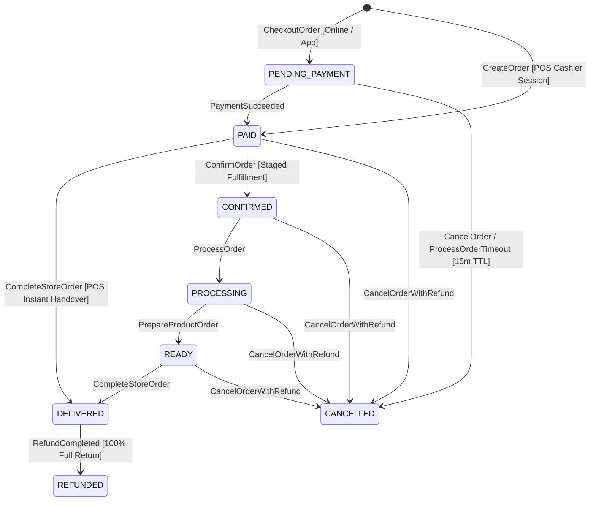
```mermaid
stateDiagram-v2
    [*] --> PENDING_PAYMENT: CheckoutOrder [Online / App]
    [*] --> PAID: CreateOrder [POS Cashier Session]
    
    PENDING_PAYMENT --> PAID: PaymentSucceeded
    PENDING_PAYMENT --> CANCELLED: CancelOrder / ProcessOrderTimeout [15m TTL]
    
    PAID --> DELIVERED: CompleteStoreOrder [POS Instant Handover]
    PAID --> CONFIRMED: ConfirmOrder [Staged Fulfillment]
    
    CONFIRMED --> PROCESSING: ProcessOrder
    PROCESSING --> READY: PrepareProductOrder
    READY --> DELIVERED: CompleteStoreOrder
    
    PAID --> CANCELLED: CancelOrderWithRefund
    CONFIRMED --> CANCELLED: CancelOrderWithRefund
    PROCESSING --> CANCELLED: CancelOrderWithRefund
    READY --> CANCELLED: CancelOrderWithRefund
    
    DELIVERED --> REFUNDED: RefundCompleted [100% Full Return]
```

| From State | Command / Trigger | Actor | Guard (RULE-ID) | To State | Domain Event | Actions / Notes |
|---|---|---|---|---|---|---|
| [*] | CheckoutOrder / CreateOrder [Online / App] | Customer / Receptionist | RULE-14-01, RULE-14-02, RULE-14-04 | PENDING_PAYMENT | OrderCreated | Khách hàng hoặc tiếp tân tạo đơn hàng Online/App; giữ chỗ tồn kho 15 phút ($\text{Hold\_TTL} = 900\text{s}$). |
| [*] | CreateOrder [POS Counter Cashier Session] | Receptionist | RULE-14-01, RULE-14-02, RULE-14-03, RULE-14-04 | PAID | OrderPaid | Thanh toán trực tiếp tại quầy qua phiên thu ngân thời gian thực trong cùng ranh giới transaction. |
| PENDING_PAYMENT | Event: PaymentSucceeded | System | RULE-14-04, RULE-16-04 | PAID | OrderPaid | Nhận xác nhận thanh toán thành công từ cổng thanh toán trực tuyến. |
| PENDING_PAYMENT | CancelOrder | Customer / Receptionist | RULE-14-04, RULE-14-07 | CANCELLED | OrderCancelled | Khách hàng hoặc tiếp tân chủ động hủy đơn hàng chưa thanh toán; giải phóng tồn kho giữ chỗ. |
| PENDING_PAYMENT | ProcessOrderTimeout | System | RULE-14-04, RULE-14-07 | CANCELLED | OrderTimedOut | Quá thời hạn 15 phút không thanh toán; tác vụ nền tự động hủy đơn và giải phóng $\text{ReservedQuantity}$. |
| PAID | CompleteStoreOrder [POS Instant] | Receptionist | RULE-14-03, RULE-14-06 | DELIVERED | OrderDelivered | Bàn giao sản phẩm tại quầy ngay sau khi thu tiền thành công (In-Store Instant Handover). |
| PAID | ConfirmOrder [Staged] | Receptionist / System | RULE-14-03, RULE-14-05 | CONFIRMED | OrderConfirmed | Tiếp tân xác nhận đơn hàng Online đã thanh toán để chuyển bộ phận kho chuẩn bị hàng. |
| CONFIRMED | ProcessOrder | Receptionist / InventoryStaff | RULE-14-05 | PROCESSING | OrderProcessed | Nhân viên kho/bán hàng tiếp nhận xử lý đơn hàng, bắt đầu soạn hàng. |
| PROCESSING | PrepareProductOrder | InventoryStaff | RULE-12-04, RULE-14-05 | READY | ProductOrderPrepared | Soạn hàng và đóng gói hoàn tất; chuyển đơn sang trạng thái sẵn sàng bàn giao cho khách. |
| READY | CompleteStoreOrder | Receptionist | RULE-14-05, RULE-14-06 | DELIVERED | OrderDelivered | Khách xuất trình mã nhận hàng tại Store; tiếp tân bàn giao sản phẩm và hoàn tất đơn hàng. |
| PAID | CancelOrderWithRefund | Customer / StoreManager / Receptionist | RULE-14-07, RULE-17-01 | CANCELLED | OrderCancelledWithRefund | Khách hủy đơn sau khi thanh toán trước khi xác nhận; kích hoạt hoàn tiền 100% và hoàn kho. |
| CONFIRMED | CancelOrderWithRefund | StoreManager / Receptionist | RULE-14-07, RULE-17-01 | CANCELLED | OrderCancelledWithRefund | Hủy đơn đã xác nhận; kích hoạt tạo yêu cầu hoàn tiền 100% và giải phóng tồn kho. |
| PROCESSING | CancelOrderWithRefund | StoreManager / Receptionist | RULE-14-07, RULE-17-01 | CANCELLED | OrderCancelledWithRefund | Hủy đơn đang soạn (hết hàng/hỏng hàng); kích hoạt tạo yêu cầu hoàn tiền 100% và hoàn kho. |
| READY | CancelOrderWithRefund | StoreManager / Receptionist | RULE-14-07, RULE-17-01 | CANCELLED | OrderCancelledWithRefund | Khách từ chối nhận/quá hạn nhận hàng; kích hoạt tạo yêu cầu hoàn tiền và nhập lại hàng vào kho. |
| DELIVERED | Event: RefundCompleted [100% Full Return] | System | RULE-14-07, RULE-17-01, RULE-17-02 | REFUNDED | OrderRefunded | Đổi trả toàn bộ sản phẩm và hoàn tiền 100% sau khi đã bàn giao hàng thành công. |

- **Initial State:** `PENDING_PAYMENT` (Online/App Checkout), `PAID` (POS Counter Synchronous Checkout).
- **Terminal State:** `DELIVERED` (Đã giao hàng thành công), `CANCELLED` (Hủy trước giao hàng, kích hoạt hoàn tiền nếu đã thanh toán và giải phóng kho), `REFUNDED` (Đã nhận hàng sau đó đổi trả và hoàn tiền 100%).
- **Technical Invariants (Decision D-03):**
  1. *Đơn hàng Online/App:* Khi qua bước `CheckoutOrder` chuyển sang `PENDING_PAYMENT` với thời hạn giữ chỗ (Reserved Quantity) 15 phút (`RULE-14-04`). Nếu quá hạn chưa thanh toán, hệ thống tự động kích hoạt `ProcessOrderTimeout` hủy đơn (`CANCELLED`) và giải phóng kho.
  2. *Đơn hàng tại quầy POS:* Thực hiện trực tiếp bởi Receptionist trong phiên thu ngân đồng bộ, thanh toán tiền mặt/quẹt thẻ chuyển thẳng sang `PAID` và bàn giao ngay tại quầy (`DELIVERED`).
  3. *Phân định rõ các trạng thái kết thúc (Terminal States):*
     - Đơn hủy trước khi hoàn tất giao hàng (dù chưa trả tiền hay đã trả tiền và kích hoạt hoàn tiền) đều chuyển sang `CANCELLED` (Terminal, `RULE-14-07`, `RULE-14-08`).
     - Trạng thái `REFUNDED` là trạng thái kết thúc đặc thù áp dụng cho đơn hàng đã hoàn tất giao hàng (`DELIVERED`) sau đó phát sinh đổi trả và hoàn lại 100% giá trị tiền đơn hàng.
     - Trường hợp đổi trả hoàn tiền một phần (`Partial Return`), đơn hàng **GIỮ NGUYÊN** trạng thái `DELIVERED` và cập nhật lũy kế `total_refunded_amount`.

---

## 6. Invoice — InvoiceStatus

> Theo Quyết định Kiến trúc Khóa D-01 & D-02:
> 1. `InvoiceStatus` tuân thủ nghiêm ngặt tập giá trị `[DRAFT, ISSUED, PAID, VOID, CANCELLED]`. Loại bỏ hoàn toàn trạng thái `PARTIALLY_PAID` và `REFUNDED` trên Hóa đơn.
> 2. **Tính bất biến của việc tất toán hóa đơn (Settlement Immutability - Decision D-01):** Hóa đơn sau khi đã chuyển sang `PAID` sẽ **VĨNH VIỄN GIỮ NGUYÊN trạng thái `PAID`** khi có phát sinh hoàn tiền (một phần hoặc toàn phần). Số tiền hoàn và công nợ thực tế được quản lý lũy kế qua thuộc tính `total_refunded_amount`, đối soát qua các thực thể `Payment` (`PARTIALLY_REFUNDED` / `REFUNDED`) và `Refund` (`COMPLETED`).
> 3. **Hóa đơn Phụ phí phát sinh độc lập (Surcharge Invoice - Decision D-02):** Khi phát sinh dịch vụ/phụ phí ngoài dự kiến trong phiên Grooming/Khám bệnh (`ConfirmAdditionalService`), hệ thống tạo một Hóa đơn Phụ phí độc lập (`Surcharge Invoice`) đi qua vòng đời `DRAFT -> ISSUED -> PAID`, tuyệt đối không ghi đè hay chèn mục vào hóa đơn gốc đã thanh toán.

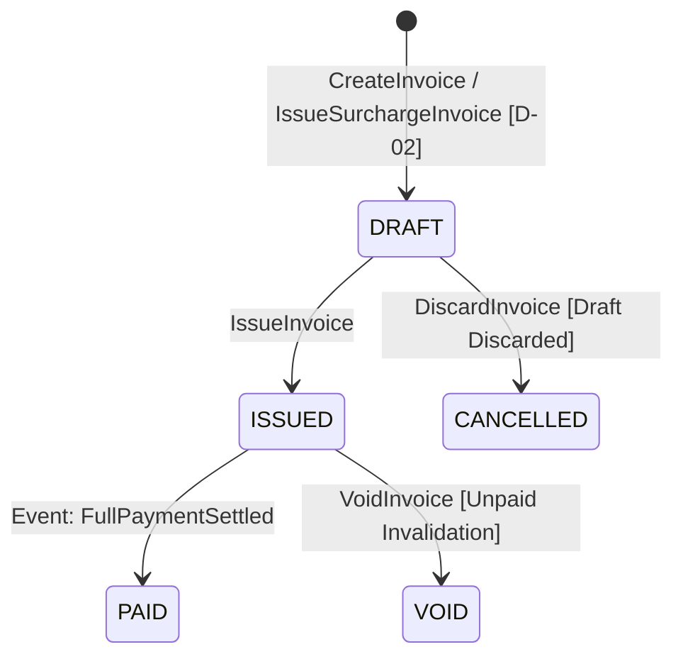
```mermaid
stateDiagram-v2
    [*] --> DRAFT: CreateInvoice / IssueSurchargeInvoice [D-02]
    DRAFT --> ISSUED: IssueInvoice
    DRAFT --> CANCELLED: DiscardInvoice [Draft Discarded]
    ISSUED --> PAID: Event: FullPaymentSettled
    ISSUED --> VOID: VoidInvoice [Unpaid Invalidation]
```

| From State | Command / Trigger | Actor | Guard (RULE-ID) | To State | Domain Event | Actions / Notes |
|---|---|---|---|---|---|---|
| [*] | CreateInvoice | Receptionist / FinanceStaff | RULE-15-01, RULE-15-02 | DRAFT | InvoiceCreated | Khởi tạo bản nháp hóa đơn thanh toán cho dịch vụ hoặc sản phẩm tại Store. |
| [*] | IssueSurchargeInvoice [D-02 Surcharge] | Receptionist / FinanceStaff | RULE-11-03, RULE-15-05 | DRAFT | InvoiceCreated | Khởi tạo Hóa đơn Phụ phí độc lập khi khách hàng duyệt dịch vụ phát sinh trong ca Grooming/Khám. |
| DRAFT | IssueInvoice | FinanceStaff / Receptionist | RULE-15-01, RULE-15-02, RULE-15-03 | ISSUED | InvoiceIssued | Phát hành hóa đơn chính thức; hóa đơn ở trạng thái này mới được phép tiếp nhận thanh toán. |
| DRAFT | DiscardInvoice | Receptionist / FinanceStaff | RULE-15-04 | CANCELLED | InvoiceCancelled | Hủy bản nháp hóa đơn tạo sai; chuyển sang `CANCELLED`. |
| ISSUED | Event: FullPaymentSettled | System | RULE-15-06, RULE-16-04 | PAID | InvoicePaid | Tổng các khoản thanh toán thành công tích lũy đạt đủ 100% `TotalAmount`; tất toán hóa đơn. |
| ISSUED | VoidInvoice | FinanceStaff | RULE-15-04 | VOID | InvoiceVoided | Hủy hóa đơn đã phát hành nhưng chưa thanh toán; vô hiệu hóa nghĩa vụ thanh toán. |

- **Initial State:** `DRAFT`
- **Terminal State:** `PAID`, `VOID`, `CANCELLED`
- **Technical Invariants (Decisions D-01 & D-02):**
  1. Hóa đơn ở trạng thái `ISSUED` cho phép nhận nhiều lần thanh toán qua aggregate `Payment`. Hóa đơn chỉ chuyển sang `PAID` khi sự kiện `FullPaymentSettled` xác nhận tổng số tiền thanh toán thành công tích lũy đạt 100% `TotalAmount` (`RULE-15-06`).
  2. **Tuyệt đối cấm `VoidInvoice` đối với hóa đơn đã `PAID` (`RULE-15-04`, `RULE-15-07`).** Khi muốn trả lại tiền cho khách, bắt buộc phải kích hoạt quy trình hoàn tiền qua aggregate `Refund` độc lập.
  3. Bản nháp hóa đơn hủy bỏ chuyển sang `CANCELLED` (synonym: `InvoiceDraftDiscarded`). Hóa đơn đã phát hành nhưng hủy bỏ nghĩa vụ thanh toán chuyển sang `VOID`.
  4. Các trạng thái `PARTIALLY_PAID` và `REFUNDED` bị cấm hoàn toàn trên `InvoiceStatus`.

---

## 7. Payment — PaymentStatus

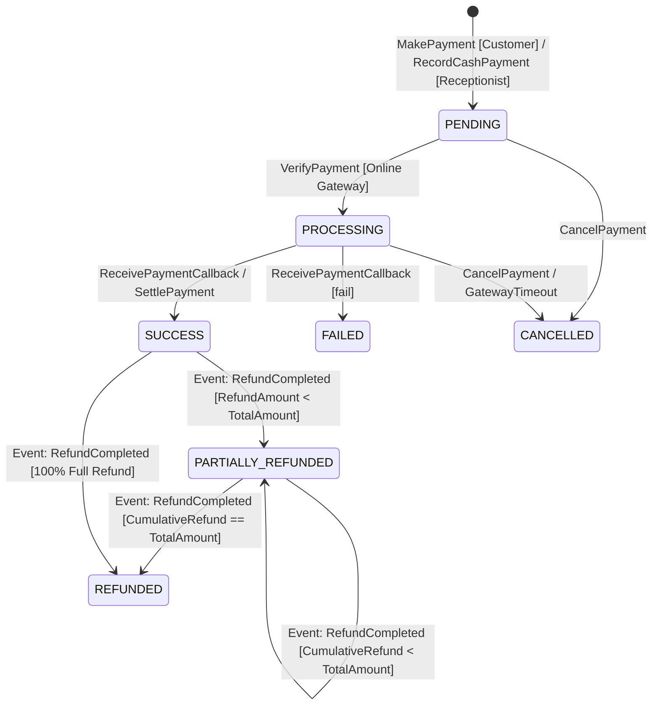
```mermaid
stateDiagram-v2
    [*] --> PENDING: MakePayment [Customer] / RecordCashPayment [Receptionist]
    PENDING --> PROCESSING: VerifyPayment [Online Gateway]
    PROCESSING --> SUCCESS: ReceivePaymentCallback / SettlePayment
    PROCESSING --> FAILED: ReceivePaymentCallback [fail]
    PENDING --> CANCELLED: CancelPayment
    PROCESSING --> CANCELLED: CancelPayment / GatewayTimeout
    
    SUCCESS --> PARTIALLY_REFUNDED: Event: RefundCompleted [RefundAmount < TotalAmount]
    PARTIALLY_REFUNDED --> PARTIALLY_REFUNDED: Event: RefundCompleted [CumulativeRefund < TotalAmount]
    PARTIALLY_REFUNDED --> REFUNDED: Event: RefundCompleted [CumulativeRefund == TotalAmount]
    SUCCESS --> REFUNDED: Event: RefundCompleted [100% Full Refund]
```

| From State | Command / Trigger | Actor | Guard (RULE-ID) | To State | Domain Event | Actions / Notes |
|---|---|---|---|---|---|---|
| [*] | MakePayment | Customer | RULE-16-01, RULE-16-02 | PENDING | PaymentCreated | Khách hàng khởi tạo giao dịch thanh toán trực tuyến qua cổng thanh toán điện tử. |
| [*] | RecordCashPayment | Receptionist | RULE-16-01, RULE-16-02 | PENDING | PaymentCreated | Thu ngân ghi nhận giao dịch thanh toán tiền mặt tại quầy chi nhánh. |
| PENDING | VerifyPayment | System / FinanceStaff | RULE-16-01, RULE-16-02, RULE-16-03 | PROCESSING | PaymentProcessing | Chuyển hướng sang cổng thanh toán hoặc gửi yêu cầu xác thực giao dịch. |
| PROCESSING | ReceivePaymentCallback | System | RULE-16-03, RULE-16-04 | SUCCESS | PaymentSucceeded | Nhận Webhook callback thành công từ cổng thanh toán; xác thực chữ ký HMAC và Idempotency Key. |
| PROCESSING | SettlePayment | FinanceStaff / Receptionist | RULE-16-02, RULE-16-04 | SUCCESS | PaymentSucceeded | Thu ngân hoặc nhân viên tài chính xác nhận thu tiền mặt/chuyển khoản thành công. |
| PROCESSING | ReceivePaymentCallback [fail] | System | RULE-16-04, RULE-16-05 | FAILED | PaymentFailed | Cổng thanh toán phản hồi giao dịch thất bại (thẻ lỗi, số dư không đủ). |
| PENDING | CancelPayment | Customer / System | RULE-16-05 | CANCELLED | PaymentCancelled | Khách hàng chủ động hủy phiên thanh toán trước khi chuyển cổng. |
| PROCESSING | CancelPayment / GatewayTimeout | Customer / System | RULE-16-05 | CANCELLED | PaymentCancelled | Khách hủy phiên hoặc cổng thanh toán phản hồi timeout khi đang xử lý. |
| SUCCESS | Event: RefundCompleted [một phần] | System | RULE-16-06, RULE-17-02 | PARTIALLY_REFUNDED | PaymentPartiallyRefunded | Hoàn tiền một phần; tổng số tiền hoàn tích lũy $< \text{TotalAmount}$. |
| PARTIALLY_REFUNDED | Event: RefundCompleted [tiếp tục hoàn một phần] | System | RULE-16-06, RULE-17-02 | PARTIALLY_REFUNDED | PaymentPartiallyRefunded | Tiếp tục hoàn tiền một phần; tổng số tiền hoàn tích lũy vẫn $< \text{TotalAmount}$. |
| PARTIALLY_REFUNDED | Event: RefundCompleted [hoàn 100%] | System | RULE-16-06, RULE-17-02 | REFUNDED | PaymentRefunded | Hoàn tất số tiền còn lại; tổng số tiền hoàn tích lũy $== \text{TotalAmount}$. |
| SUCCESS | Event: RefundCompleted [hoàn 100% lần đầu] | System | RULE-16-06, RULE-17-01, RULE-17-02 | REFUNDED | PaymentRefunded | Hoàn tiền toàn phần 100% ngay trong lần đầu tiên. |

- **Initial State:** `PENDING`
- **Terminal State:** `FAILED`, `CANCELLED`, `REFUNDED`
- **Trạng thái Đã quyết toán (Settled States):** `SUCCESS` và `PARTIALLY_REFUNDED` là các trạng thái thanh toán thành công có thể chuyển tiếp sang `REFUNDED` khi có các giao dịch hoàn tiền hoàn tất.
- **Bất biến hoàn tiền một phần (Partial Refund Invariant):**
  $$\text{RemainingRefundableAmount} = \text{TotalAmount} - \sum(\text{CompletedRefunds}) \ge 0$$
  Mọi yêu cầu hoàn tiền `RefundRequest` bắt buộc phải thỏa mãn: $\text{RequestedRefundAmount} \le \text{RemainingRefundableAmount}$.

---

## 8. Refund — RefundStatus

> Theo quyết định nghiệp vụ đã duyệt:
> 1. Mỗi `Refund` gắn với đúng một giao dịch `Payment` gốc cụ thể và hoàn tiền theo phương thức thanh toán gốc:
>    - Đối với thanh toán Tiền mặt (`CASH`): Hoàn tiền mặt trực tiếp tại quầy (`Receptionist / StoreManager` thực hiện `ProcessRefund` -> `CompleteRefund` tức thì).
>    - Đối với thanh toán Điện tử (`ONLINE_GATEWAY`): Hoàn tiền qua API cổng thanh toán (`FinanceStaff` kích hoạt lệnh gọi cổng).
> 2. **Loại bỏ hoàn toàn trạng thái `UNDER_REVIEW`:** Quy trình Maker-Checker chuyển thẳng: `REQUESTED -> APPROVED / REJECTED`.
> 3. **Trạng thái `FAILED` là Non-terminal State:** Hệ thống hỗ trợ thử lại qua cổng (`RetryRefund`, tối đa 3 lần theo `RULE-17-07`) hoặc xử lý ngoại tuyến/chuyển khoản thủ công (`ResolveRefundManually` theo `RULE-17-08`).

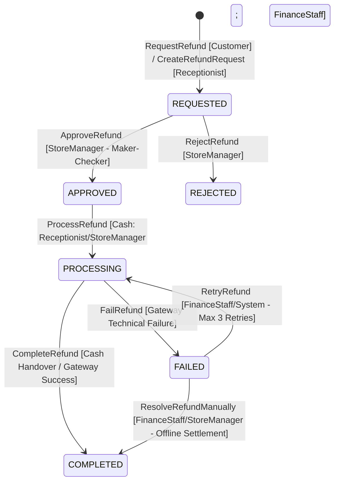
```mermaid
stateDiagram-v2
    [*] --> REQUESTED: RequestRefund [Customer] / CreateRefundRequest [Receptionist]
    REQUESTED --> APPROVED: ApproveRefund [StoreManager - Maker-Checker]
    REQUESTED --> REJECTED: RejectRefund [StoreManager]
    APPROVED --> PROCESSING: ProcessRefund [Cash: Receptionist/StoreManager; Gateway: FinanceStaff]
    PROCESSING --> COMPLETED: CompleteRefund [Cash Handover / Gateway Success]
    PROCESSING --> FAILED: FailRefund [Gateway Technical Failure]
    FAILED --> PROCESSING: RetryRefund [FinanceStaff/System - Max 3 Retries]
    FAILED --> COMPLETED: ResolveRefundManually [FinanceStaff/StoreManager - Offline Settlement]
```

| From State | Command / Trigger | Actor | Guard (RULE-ID) | To State | Domain Event | Actions / Notes |
|---|---|---|---|---|---|---|
| [*] | RequestRefund | Customer | RULE-17-01, RULE-17-02, RULE-17-03 | REQUESTED | RefundRequested | Khách hàng tự gửi yêu cầu hoàn tiền qua App cá nhân trong vòng 30 ngày. |
| [*] | CreateRefundRequest | Receptionist | RULE-17-01, RULE-17-02, RULE-17-03 | REQUESTED | RefundRequested | Tiếp tân lập yêu cầu hoàn tiền tại quầy Store theo đề nghị của khách. |
| REQUESTED | ApproveRefund | StoreManager | RULE-17-02, RULE-17-04 | APPROVED | RefundApproved | Quản lý duyệt hoàn tiền; bắt buộc thực thi Maker-Checker (`created_by != approved_by`). |
| REQUESTED | RejectRefund | StoreManager | RULE-17-04, RULE-17-06 | REJECTED | RefundRejected | Quản lý từ chối yêu cầu hoàn tiền kèm lý do từ chối. |
| APPROVED | ProcessRefund | FinanceStaff / Receptionist / StoreManager | RULE-17-05 | PROCESSING | RefundProcessing | Tiền mặt: Tiếp tân/Quản lý thực hiện tại quầy; Online Gateway: Nhân viên tài chính gọi API cổng. |
| PROCESSING | CompleteRefund | FinanceStaff / Receptionist / StoreManager / System | RULE-17-02, RULE-17-05, RULE-17-09 | COMPLETED | RefundCompleted | Bàn giao tiền mặt hoặc nhận callback thành công từ cổng; cập nhật đa aggregate. |
| PROCESSING | FailRefund | System | RULE-17-06, RULE-17-07 | FAILED | RefundFailed | Lỗi kỹ thuật hoặc gián đoạn mạng từ cổng thanh toán; kích hoạt trạng thái lỗi tạm thời. |
| FAILED | RetryRefund | FinanceStaff / System | RULE-17-07 | PROCESSING | RefundProcessing | Thử lại hoàn tiền qua cổng trực tuyến; giới hạn tối đa 3 lần ($\text{retry\_count} \le 3$). |
| FAILED | ResolveRefundManually | FinanceStaff / StoreManager | RULE-17-08, RULE-17-09 | COMPLETED | RefundCompleted | Chuyển khoản trực tiếp/tiền mặt đối soát thủ công kèm mã chứng từ ngân hàng. |

- **Initial State:** `REQUESTED`
- **Terminal State:** `COMPLETED`, `REJECTED`
- **Non-Terminal State:** `FAILED` (Hỗ trợ khôi phục qua `RetryRefund` tối đa 3 lần hoặc giải quyết thủ công `ResolveRefundManually`).
- **Technical Invariants (Maker-Checker & Gateway Retry):**
  1. **Nguyên tắc Maker-Checker (`RULE-17-04`):** Người lập yêu cầu hoàn tiền (`created_by`) tuyệt đối không được là người phê duyệt (`approved_by`). Nếu `created_by == approved_by`, hệ thống chặn với mã lỗi `MAKER_CHECKER_VIOLATION`.
  2. **Thời hạn yêu cầu hoàn tiền (`RULE-17-03`):** Tối đa 30 ngày kể từ ngày giao dịch thanh toán gốc thành công.
  3. **Đồng bộ đa Aggregate khi hoàn tiền hoàn tất (`RULE-17-09`):**
     - Cập nhật tăng `total_refunded_amount` trên Invoice gốc (giữ nguyên Invoice `PAID` theo Decision D-01).
     - Cập nhật trạng thái `Payment` sang `PARTIALLY_REFUNDED` hoặc `REFUNDED` (theo `RULE-16-06`).
     - Cập nhật `total_refunded_amount` trên Order (hoặc chuyển Order sang `REFUNDED` nếu hoàn 100% theo `RULE-14-07`).

## 9. Membership — MembershipStatus

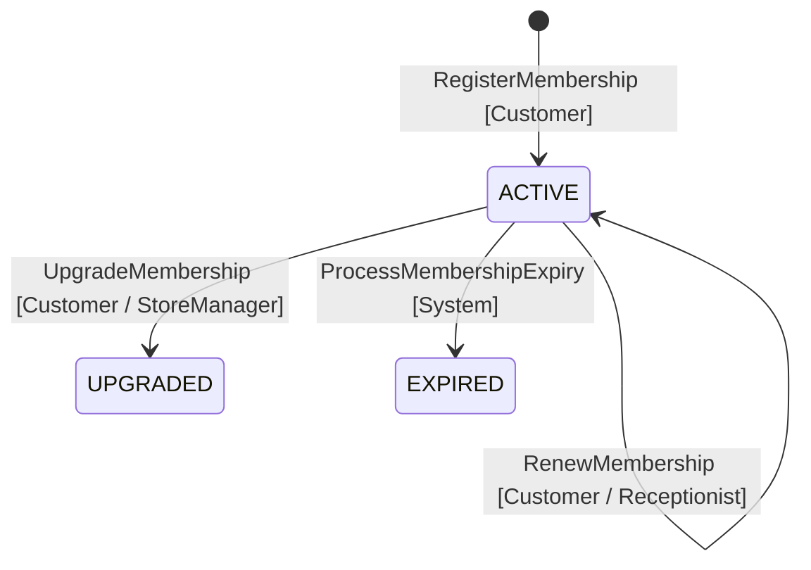
```mermaid
stateDiagram-v2
    [*] --> ACTIVE: RegisterMembership [Customer]
    ACTIVE --> ACTIVE: RenewMembership [Customer / Receptionist]
    ACTIVE --> UPGRADED: UpgradeMembership [Customer / StoreManager]
    ACTIVE --> EXPIRED: ProcessMembershipExpiry [System]
```

| From State | Command / Trigger | Actor | Guard (RULE-ID) | To State | Domain Event | Actions / Notes |
|---|---|---|---|---|---|---|
| [*] | RegisterMembership | Customer | RULE-19-01 | ACTIVE | MembershipCreated | Đăng ký gói hội viên mới hoặc tự động cấp hạng hội viên dựa trên mức chi tiêu tích lũy. |
| ACTIVE | RenewMembership | Customer / Receptionist | RULE-19-01, RULE-19-03 | ACTIVE | MembershipRenewed | Gia hạn gói hội viên đang hoạt động; gia hạn thêm `ExpirationDate` và duy trì quyền lợi hiện có. |
| ACTIVE | UpgradeMembership | Customer / StoreManager | RULE-19-01, RULE-19-04 | UPGRADED | MembershipUpgraded | Nâng cấp lên hạng hội viên cao hơn; đóng bản ghi gói cũ (`UPGRADED`) và tự động khởi tạo bản ghi mới ở trạng thái `ACTIVE`. |
| ACTIVE | ProcessMembershipExpiry | System | RULE-19-02, RULE-19-09 | EXPIRED | MembershipExpired | Quá thời hạn hiệu lực mà không được gia hạn; tác vụ nền tự động đánh dấu gói hội viên hết hạn. |

- **Initial State:** `ACTIVE`
- **Terminal State:** `UPGRADED`, `EXPIRED`
- **Technical Invariants:**
  1. *Gia hạn Hội viên (RULE-19-03):* Khi `RenewMembership`, trạng thái giữ nguyên là `ACTIVE` và gia hạn thêm `ExpirationDate`. Phát Domain Event `MembershipRenewed`.
  2. *Nâng cấp Hạng Hội viên (RULE-19-04):* Khi `UpgradeMembership`, bản ghi gói hội viên hiện tại chuyển sang `UPGRADED` (Terminal), đồng thời hệ thống tự động khởi tạo và kích hoạt một bản ghi `Membership` mới ở trạng thái `ACTIVE` tương ứng với hạng gói nâng cấp mới (`RULE-19-04`).
  3. *Cách ly Dữ liệu Hội viên (RULE-19-10):* Dữ liệu hạng hội viên và điểm tích lũy được quản lý độc lập theo từng Organization cha; không chia sẻ chéo giữa các Organization độc lập.

---

## 10. Package — PackageStatus

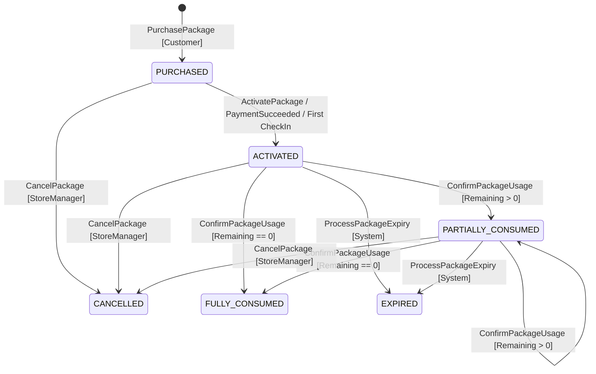
```mermaid
stateDiagram-v2
    [*] --> PURCHASED: PurchasePackage [Customer]
    PURCHASED --> ACTIVATED: ActivatePackage / PaymentSucceeded / First CheckIn
    PURCHASED --> CANCELLED: CancelPackage [StoreManager]
    ACTIVATED --> PARTIALLY_CONSUMED: ConfirmPackageUsage [Remaining > 0]
    ACTIVATED --> FULLY_CONSUMED: ConfirmPackageUsage [Remaining == 0]
    PARTIALLY_CONSUMED --> PARTIALLY_CONSUMED: ConfirmPackageUsage [Remaining > 0]
    PARTIALLY_CONSUMED --> FULLY_CONSUMED: ConfirmPackageUsage [Remaining == 0]
    ACTIVATED --> CANCELLED: CancelPackage [StoreManager]
    PARTIALLY_CONSUMED --> CANCELLED: CancelPackage [StoreManager]
    ACTIVATED --> EXPIRED: ProcessPackageExpiry [System]
    PARTIALLY_CONSUMED --> EXPIRED: ProcessPackageExpiry [System]
```

| From State | Command / Trigger | Actor | Guard (RULE-ID) | To State | Domain Event | Actions / Notes |
|---|---|---|---|---|---|---|
| [*] | PurchasePackage | Customer | RULE-20-01 | PURCHASED | PackagePurchased | Khách hàng mua gói dịch vụ trả trước nhiều lượt; khởi tạo ở trạng thái đã mua. |
| PURCHASED | ActivatePackage / Event: PaymentSucceeded / Event: AppointmentCheckedIn | Receptionist / Customer / System | RULE-20-01 | ACTIVATED | PackageActivated | Kích hoạt đa kênh: (1) Tiếp tân kích hoạt tại quầy POS; (2) Kích hoạt tự động qua `PaymentSucceeded`; (3) Kích hoạt khi khách check-in sử dụng lượt đầu tiên. |
| PURCHASED | CancelPackage | StoreManager | RULE-20-06 | CANCELLED | PackageCancelled | Quản lý chi nhánh hủy gói dịch vụ chưa kích hoạt; kích hoạt tạo yêu cầu hoàn tiền 100% (`RefundRequested`). |
| ACTIVATED | ConfirmPackageUsage | Receptionist | RULE-20-02, RULE-20-04, RULE-20-05 | PARTIALLY_CONSUMED | PackagePartiallyConsumed | Xác nhận sử dụng lượt dịch vụ tại Store; số lượt còn lại $\text{RemainingQuantity} > 0$. |
| ACTIVATED | ConfirmPackageUsage | Receptionist | RULE-20-02, RULE-20-04, RULE-20-05 | FULLY_CONSUMED | PackageFullyConsumed | Xác nhận sử dụng lượt dịch vụ cuối cùng; số lượt còn lại $\text{RemainingQuantity} == 0$. |
| PARTIALLY_CONSUMED | ConfirmPackageUsage | Receptionist | RULE-20-02, RULE-20-04, RULE-20-05 | PARTIALLY_CONSUMED | PackagePartiallyConsumed | Tiếp tục sử dụng lượt dịch vụ; số lượt còn lại vẫn $> 0$. |
| PARTIALLY_CONSUMED | ConfirmPackageUsage | Receptionist | RULE-20-02, RULE-20-04, RULE-20-05 | FULLY_CONSUMED | PackageFullyConsumed | Sử dụng hết toàn bộ số lượt dịch vụ trong gói; kết thúc vòng đời tiêu dùng. |
| ACTIVATED | CancelPackage | StoreManager | RULE-20-06 | CANCELLED | PackageCancelled | Hủy gói đang kích hoạt; tự động tính toán giá trị các lượt chưa sử dụng và phát sinh `RefundRequested`. |
| PARTIALLY_CONSUMED | CancelPackage | StoreManager | RULE-20-06 | CANCELLED | PackageCancelled | Hủy gói đang sử dụng dở dang; tự động tính toán giá trị còn lại và phát sinh `RefundRequested`. |
| ACTIVATED | ProcessPackageExpiry | System | RULE-20-03 | EXPIRED | PackageExpired | Quá thời hạn hiệu lực gói dịch vụ; tác vụ nền tự động chuyển sang hết hạn. |
| PARTIALLY_CONSUMED | ProcessPackageExpiry | System | RULE-20-03 | EXPIRED | PackageExpired | Gói chưa dùng hết nhưng quá thời hạn hiệu lực; tự động khóa số lượt còn lại và chuyển sang hết hạn. |

- **Initial State:** `PURCHASED`
- **Terminal State:** `FULLY_CONSUMED`, `CANCELLED`, `EXPIRED`
- **Technical Invariants:**
  1. *Cơ chế Kích hoạt Đa kênh (RULE-20-01):* (1) Kích hoạt tại quầy POS bởi Receptionist; (2) Tự động kích hoạt khi nhận Domain Event `PaymentSucceeded`; (3) Tự động kích hoạt khi khách hàng check-in sử dụng lượt đầu tiên.
  2. *Hủy Gói & Công thức Hoàn tiền Chưa Tiêu dùng (RULE-20-06):* Hủy gói chuyển sang `CANCELLED` và tự động phát sinh yêu cầu hoàn tiền `RefundRequested` cho các lượt chưa tiêu dùng:
     $$\text{RefundAmount} = \max\left(0, \ PK.\text{PurchasePrice} \times \frac{PK.\text{RemainingQuantity}}{PK.\text{TotalQuantity}} - \text{CancellationAdminFee}\right)$$

---

## 11. StockTransfer — StockTransferStatus

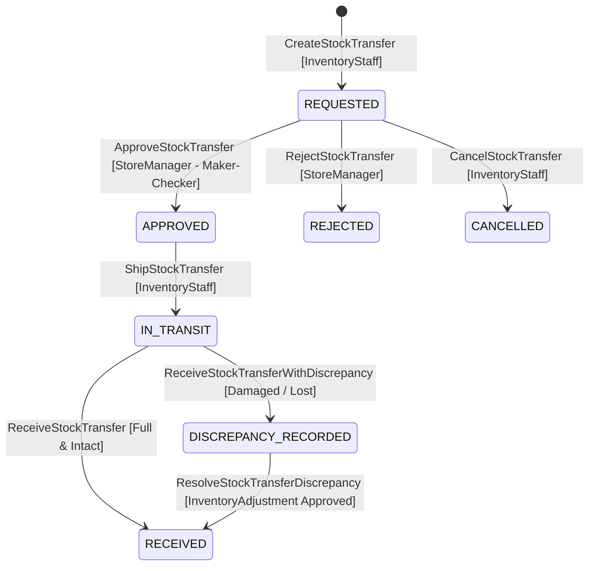
```mermaid
stateDiagram-v2
    [*] --> REQUESTED: CreateStockTransfer [InventoryStaff]
    REQUESTED --> APPROVED: ApproveStockTransfer [StoreManager - Maker-Checker]
    REQUESTED --> REJECTED: RejectStockTransfer [StoreManager]
    REQUESTED --> CANCELLED: CancelStockTransfer [InventoryStaff]
    APPROVED --> IN_TRANSIT: ShipStockTransfer [InventoryStaff]
    IN_TRANSIT --> RECEIVED: ReceiveStockTransfer [Full & Intact]
    IN_TRANSIT --> DISCREPANCY_RECORDED: ReceiveStockTransferWithDiscrepancy [Damaged / Lost]
    DISCREPANCY_RECORDED --> RECEIVED: ResolveStockTransferDiscrepancy [InventoryAdjustment Approved]
```

| From State | Command / Trigger | Actor | Guard (RULE-ID) | To State | Domain Event | Actions / Notes |
|---|---|---|---|---|---|---|
| [*] | CreateStockTransfer | InventoryStaff | RULE-12-04 | REQUESTED | StockTransferCreated | Khởi tạo yêu cầu chuyển kho liên chi nhánh trong cùng Organization; xác định kho xuất, kho nhận, sản phẩm và số lượng. |
| REQUESTED | ApproveStockTransfer | StoreManager | RULE-12-06 | APPROVED | StockTransferApproved | Thẩm định và duyệt yêu cầu chuyển kho; bắt buộc thực thi Maker-Checker (`created_by != approved_by`). |
| REQUESTED | RejectStockTransfer | StoreManager | RULE-12-06 | REJECTED | StockTransferRejected | Từ chối yêu cầu chuyển kho kèm lý do từ chối. |
| REQUESTED | CancelStockTransfer | InventoryStaff | RULE-12-10 | CANCELLED | StockTransferCancelled | Hủy yêu cầu chuyển kho khi chưa được duyệt/chưa xuất hàng. |
| APPROVED | ShipStockTransfer | InventoryStaff | RULE-12-05, RULE-12-07 | IN_TRANSIT | StockTransferShipped | Xuất kho giao hàng cho bên vận chuyển; trừ tồn kho khả dụng tại điểm xuất, chuyển sang trạng thái đang vận chuyển. |
| IN_TRANSIT | ReceiveStockTransfer | InventoryStaff | RULE-12-08 | RECEIVED | StockTransferReceived | Điểm nhận tiếp nhận hàng đủ 100% số lượng và nguyên vẹn; tăng ngay tồn kho khả dụng tại điểm nhận. |
| IN_TRANSIT | ReceiveStockTransferWithDiscrepancy | InventoryStaff | RULE-12-08, RULE-12-09 | DISCREPANCY_RECORDED | StockTransferDiscrepancyReported | Phát hiện hàng hư hỏng hoặc thất thoát; tăng tồn kho phần nguyên vẹn, cách ly hàng hỏng và hạch toán hao hụt. |
| DISCREPANCY_RECORDED | ResolveStockTransferDiscrepancy | StoreManager | RULE-12-03, RULE-12-09 | RECEIVED | StockTransferDiscrepancyResolved | Store Manager tại điểm nhận duyệt phiếu `InventoryAdjustment` (Maker-Checker, lý do `TRANSIT_VARIANCE`), đóng hoàn tất phiếu chuyển kho. |

- **Initial State:** `REQUESTED`
- **Terminal State:** `RECEIVED`, `REJECTED`, `CANCELLED`
- **Technical Invariants:**
  1. *Phê duyệt Maker-Checker (RULE-12-06):* Người tạo yêu cầu chuyển kho (`created_by`) tuyệt đối không được là người phê duyệt (`approved_by`). Nếu `created_by == approved_by`, hệ thống chặn với mã lỗi `MAKER_CHECKER_VIOLATION`.
  2. *Vòng đời Chuyển kho 2 Bước & Hàng Đang đi (RULE-12-07):* Xuất kho trừ tồn khả dụng nguồn và chuyển sang `IN_TRANSIT`. Hàng `IN_TRANSIT` không được tính vào tồn kho khả dụng của điểm nhận cho đến khi điểm nhận xác nhận nhập kho thực tế.
  3. *Phương trình Cân bằng & Xử lý Sai lệch Chuyển kho (RULE-12-08, RULE-12-09):*
     $$\text{ShippedQuantity} = \text{ReceivedQuantity} + \text{DamagedQuantity} + \text{LostQuantity}$$
     - $\text{ReceivedQuantity}$: Tăng ngay tồn kho khả dụng tại Store đích ($\text{AvailableQuantity}_{\text{dest}} += \text{ReceivedQuantity}$).
     - $\text{DamagedQuantity}$: Chuyển vào khu cách ly chờ xử lý/hủy (`DAMAGED_STOCK`).
     - $\text{LostQuantity}$: Hạch toán vào chi phí hao hụt vận chuyển (`TRANSIT_LOSS_EXPENSE`).
     - Store Manager tại điểm nhận lập và phê duyệt phiếu `InventoryAdjustment` (Maker-Checker, lý do `TRANSIT_VARIANCE`), sau đó chuyển phiếu sang `RECEIVED` hoàn tất (không cộng tồn lần 2).

---

## 12. PurchaseRequest — PurchaseRequestStatus

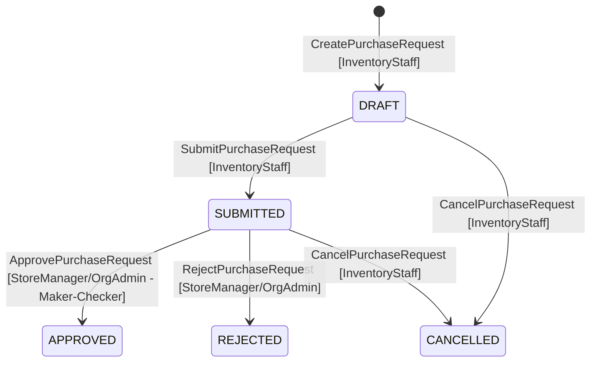
```mermaid
stateDiagram-v2
    [*] --> DRAFT: CreatePurchaseRequest [InventoryStaff]
    DRAFT --> SUBMITTED: SubmitPurchaseRequest [InventoryStaff]
    SUBMITTED --> APPROVED: ApprovePurchaseRequest [StoreManager/OrgAdmin - Maker-Checker]
    SUBMITTED --> REJECTED: RejectPurchaseRequest [StoreManager/OrgAdmin]
    DRAFT --> CANCELLED: CancelPurchaseRequest [InventoryStaff]
    SUBMITTED --> CANCELLED: CancelPurchaseRequest [InventoryStaff]
```

| From State | Command / Trigger | Actor | Guard (RULE-ID) | To State | Domain Event | Actions / Notes |
|---|---|---|---|---|---|---|
| [*] | CreatePurchaseRequest | InventoryStaff | RULE-13-01 | DRAFT | PurchaseRequestCreated | Khởi tạo bản nháp yêu cầu mua hàng nội bộ bổ sung hàng hóa/vật tư cho Store hoặc Warehouse. |
| DRAFT | SubmitPurchaseRequest | InventoryStaff | RULE-13-01 | SUBMITTED | PurchaseRequestSubmitted | Gửi yêu cầu mua hàng lên cấp quản lý để thẩm định và phê duyệt. |
| SUBMITTED | ApprovePurchaseRequest | StoreManager / OrganizationAdmin | RULE-13-02 | APPROVED | PurchaseRequestApproved | Phê duyệt yêu cầu mua hàng; bắt buộc thực thi nguyên tắc Maker-Checker (`created_by != approved_by`); làm căn cứ tạo Purchase Order. |
| SUBMITTED | RejectPurchaseRequest | StoreManager / OrganizationAdmin | RULE-13-02 | REJECTED | PurchaseRequestRejected | Từ chối yêu cầu mua hàng kèm lý do từ chối. |
| DRAFT | CancelPurchaseRequest | InventoryStaff | RULE-13-03 | CANCELLED | PurchaseRequestCancelled | Hủy bản nháp yêu cầu mua hàng trước khi gửi duyệt. |
| SUBMITTED | CancelPurchaseRequest | InventoryStaff | RULE-13-03 | CANCELLED | PurchaseRequestCancelled | Hủy yêu cầu mua hàng đã gửi duyệt khi chưa được cấp quản lý phê duyệt. |

- **Initial State:** `DRAFT` (hoặc `SUBMITTED` nếu tạo và gửi trực tiếp)
- **Terminal State:** `APPROVED`, `REJECTED`, `CANCELLED`
- **Technical Invariants:**
  1. *Phê duyệt Maker-Checker (RULE-13-02):* Người tạo yêu cầu mua hàng (`created_by`) tuyệt đối không được là người phê duyệt (`approved_by`). Nếu `created_by == approved_by`, hệ thống chặn với mã lỗi `MAKER_CHECKER_VIOLATION`.
  2. *Ràng buộc Hủy Yêu cầu (RULE-13-03):* Lệnh hủy chỉ áp dụng khi Purchase Request đang ở `DRAFT` hoặc `SUBMITTED`.

---

## 13. PurchaseOrder — PurchaseOrderStatus

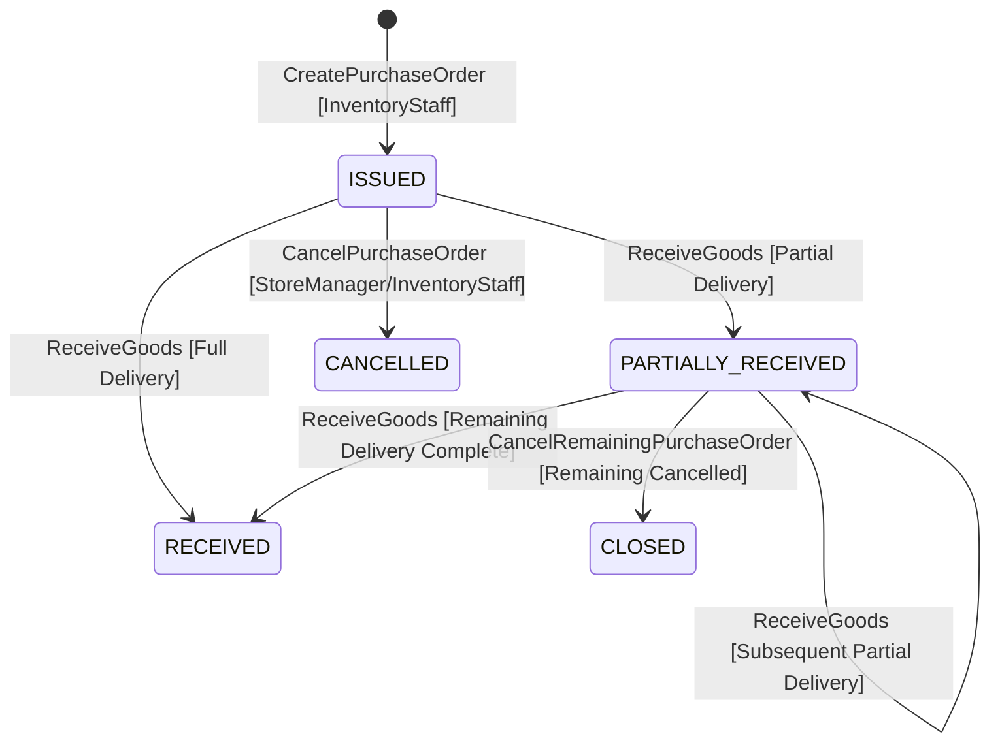
```mermaid
stateDiagram-v2
    [*] --> ISSUED: CreatePurchaseOrder [InventoryStaff]
    ISSUED --> PARTIALLY_RECEIVED: ReceiveGoods [Partial Delivery]
    ISSUED --> RECEIVED: ReceiveGoods [Full Delivery]
    PARTIALLY_RECEIVED --> PARTIALLY_RECEIVED: ReceiveGoods [Subsequent Partial Delivery]
    PARTIALLY_RECEIVED --> RECEIVED: ReceiveGoods [Remaining Delivery Complete]
    PARTIALLY_RECEIVED --> CLOSED: CancelRemainingPurchaseOrder [Remaining Cancelled]
    ISSUED --> CANCELLED: CancelPurchaseOrder [StoreManager/InventoryStaff]
```

| From State | Command / Trigger | Actor | Guard (RULE-ID) | To State | Domain Event | Actions / Notes |
|---|---|---|---|---|---|---|
| [*] | CreatePurchaseOrder | InventoryStaff | RULE-13-04 | ISSUED | PurchaseOrderCreated | Khởi tạo đơn đặt hàng chính thức gửi Nhà cung cấp (`Supplier`) từ Purchase Request đã được duyệt (`APPROVED`). |
| ISSUED | ReceiveGoods | InventoryStaff | RULE-13-05, RULE-13-06 | PARTIALLY_RECEIVED | GoodsReceived | Tiếp nhận đợt giao hàng đầu tiên nhưng chưa đủ số lượng đơn hàng (sau khi thực hiện `InspectGoods`); tăng tồn kho thực nhận. |
| ISSUED | ReceiveGoods | InventoryStaff | RULE-13-05, RULE-13-06 | RECEIVED | GoodsReceived | Tiếp nhận đủ 100% số lượng đơn đặt hàng ngay đợt đầu tiên (sau khi thực hiện `InspectGoods`); tăng tồn kho thực tế và khả dụng. |
| PARTIALLY_RECEIVED | ReceiveGoods | InventoryStaff | RULE-13-05, RULE-13-06 | PARTIALLY_RECEIVED | GoodsReceived | Tiếp tục nhận thêm một phần hàng hóa trong các đợt giao tiếp theo; cập nhật tăng tồn kho phần thực nhận. |
| PARTIALLY_RECEIVED | ReceiveGoods | InventoryStaff | RULE-13-05, RULE-13-06 | RECEIVED | GoodsReceived | Tiếp nhận đủ toàn bộ số lượng hàng còn lại; hoàn tất đơn đặt hàng. |
| PARTIALLY_RECEIVED | CancelRemainingPurchaseOrder | StoreManager / InventoryStaff | RULE-13-07 | CLOSED | PurchaseOrderRemainingCancelled | Nhà cung cấp không thể tiếp tục giao phần thiếu; thống nhất hủy phần còn lại, đóng đơn hàng mà không ảnh hưởng phần đã nhập kho. |
| ISSUED | CancelPurchaseOrder | StoreManager / InventoryStaff | RULE-13-08 | CANCELLED | PurchaseOrderCancelled | Hủy toàn bộ đơn đặt hàng khi nhà cung cấp chưa giao bất kỳ đợt hàng nào. |

- **Initial State:** `ISSUED`
- **Terminal State:** `RECEIVED`, `CLOSED`, `CANCELLED`
- **Technical Invariants:**
  1. *Kiểm tra Chất lượng Tiền điều kiện (InspectGoods Guard - RULE-13-05):* Inventory Staff bắt buộc thực hiện kiểm tra thực tế về số lượng, tình trạng bao bì, quy cách và hạn dùng (`InspectGoods`) trước khi kích hoạt `ReceiveGoods` để cập nhật tăng tồn kho.
  2. *Đóng Đơn hàng Giao thiếu (Partial Close Invariant - RULE-13-07):* Trạng thái `CLOSED` thể hiện đơn hàng đã tiếp nhận một phần hàng hóa thực tế và hủy nghĩa vụ giao phần còn thiếu, giải phóng cam kết đặt hàng.
  3. *Tính Bất biến của Đơn hàng Đã kết thúc (RULE-13-08):* Đơn đặt hàng khi đã ở `CANCELLED` hoặc `CLOSED` tuyệt đối không được phép tiếp nhận thêm hàng, không điều chỉnh số lượng và không cập nhật tăng tồn kho.

---

## 14. Incident — IncidentStatus

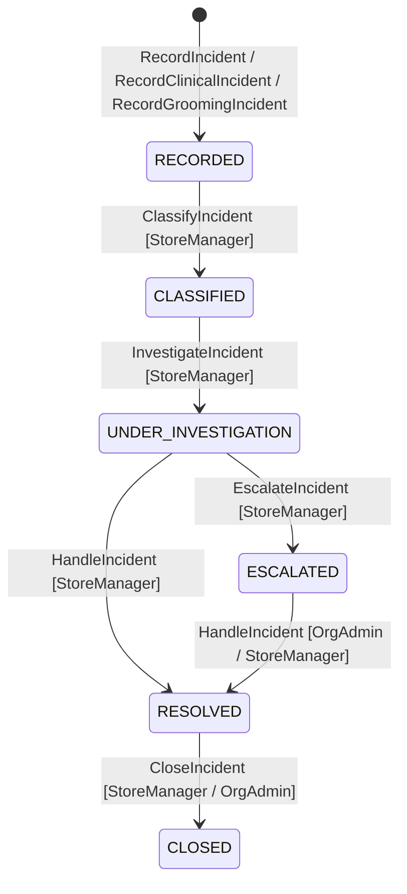
```mermaid
stateDiagram-v2
    [*] --> RECORDED: RecordIncident / RecordClinicalIncident / RecordGroomingIncident
    RECORDED --> CLASSIFIED: ClassifyIncident [StoreManager]
    CLASSIFIED --> UNDER_INVESTIGATION: InvestigateIncident [StoreManager]
    UNDER_INVESTIGATION --> ESCALATED: EscalateIncident [StoreManager]
    UNDER_INVESTIGATION --> RESOLVED: HandleIncident [StoreManager]
    ESCALATED --> RESOLVED: HandleIncident [OrgAdmin / StoreManager]
    RESOLVED --> CLOSED: CloseIncident [StoreManager / OrgAdmin]
```

| From State | Command / Trigger | Actor | Guard (RULE-ID) | To State | Domain Event | Actions / Notes |
|---|---|---|---|---|---|---|
| [*] | RecordIncident / RecordClinicalIncident / RecordGroomingIncident | Staff / Veterinarian / Groomer | RULE-21-01, RULE-21-02, RULE-21-03 | RECORDED | IncidentRecorded | Tiếp nhận và ghi nhận sự cố vận hành, sự cố y tế lâm sàng hoặc sự cố spa/grooming. |
| RECORDED | ClassifyIncident | StoreManager | RULE-21-04 | CLASSIFIED | IncidentClassified | Quản lý chi nhánh đánh giá và phân loại mức độ nghiêm trọng: `LOW`, `MEDIUM`, `HIGH`, `CRITICAL`. |
| CLASSIFIED | InvestigateIncident | StoreManager | RULE-21-07 | UNDER_INVESTIGATION | IncidentInvestigated | Tiến hành điều tra nguyên nhân gốc rễ, phỏng vấn nhân sự và thu thập bằng chứng/camera. |
| UNDER_INVESTIGATION | EscalateIncident | StoreManager | RULE-21-06 | ESCALATED | IncidentEscalated | Chuyển cấp xử lý lên Organization Admin hoặc Platform Admin khi vượt quá thẩm quyền chi nhánh hoặc phát sinh tranh chấp pháp lý lớn. |
| UNDER_INVESTIGATION | HandleIncident | StoreManager | RULE-21-07 | RESOLVED | IncidentResolved | Thực thi các biện pháp khắc phục (bồi thường, miễn giảm phí dịch vụ, điều trị y tế bổ sung) tại cấp Store. |
| ESCALATED | HandleIncident | OrganizationAdmin / StoreManager | RULE-21-07 | RESOLVED | IncidentResolved | Thực thi giải pháp khắc phục sau khi được cấp Organization/Platform chỉ đạo xử lý. |
| RESOLVED | CloseIncident | StoreManager / OrganizationAdmin | RULE-21-08 | CLOSED | IncidentClosed | Nghiệm thu toàn bộ biện pháp khắc phục và chính thức đóng hồ sơ sự cố; hồ sơ chuyển sang trạng thái bất biến. |

- **Initial State:** `RECORDED`
- **Terminal State:** `CLOSED`
- **Technical Invariants:**
  1. *Cơ chế Kích hoạt Sự cố Tự động (Automated Incident Trigger Hooks - RULE-21-01, RULE-21-02, RULE-21-03):*
     - `AbortAppointment` → tự động tạo `ClinicalIncident` hoặc `GroomingIncident` với mức độ tối thiểu `HIGH`.
     - `AbortGrooming` → tự động tạo `GroomingIncident` với mức độ `HIGH`, phát thông báo tới Customer.
     - `EmergencyOverrideAccess` → tự động tạo `ClinicalIncident` (`is_emergency = true`, mức độ `CRITICAL`).
  2. *Chính sách Thông báo Khẩn cấp Bắt buộc (RULE-21-05, RULE-23-02):* Sự cố mức độ `HIGH` và `CRITICAL` bắt buộc hệ thống tự động gửi thông báo khẩn cấp `SendIncidentNotification` tới Khách hàng và Store Manager trong vòng 1-4 giờ.
  3. *Tính Bất biến Tuyệt đối của Hồ sơ Sự cố Đã đóng (RULE-21-08):* Hồ sơ sự cố ở trạng thái `CLOSED` là BẤT BIẾN (Immutable), tuyệt đối không được phép chỉnh sửa nội dung hoặc mở lại.

---

## 15. Grooming — GroomingStatus

> `GroomingStatus` đặc tả toàn bộ vòng đời của một phiên dịch vụ Grooming / Spa thú cưng tại Store, bao gồm quy trình kiểm tra thể trạng, phát sinh dịch vụ thêm, phê duyệt đồng thuận từ khách hàng và tạo Hóa đơn Phụ phí độc lập (Quyết định D-02).

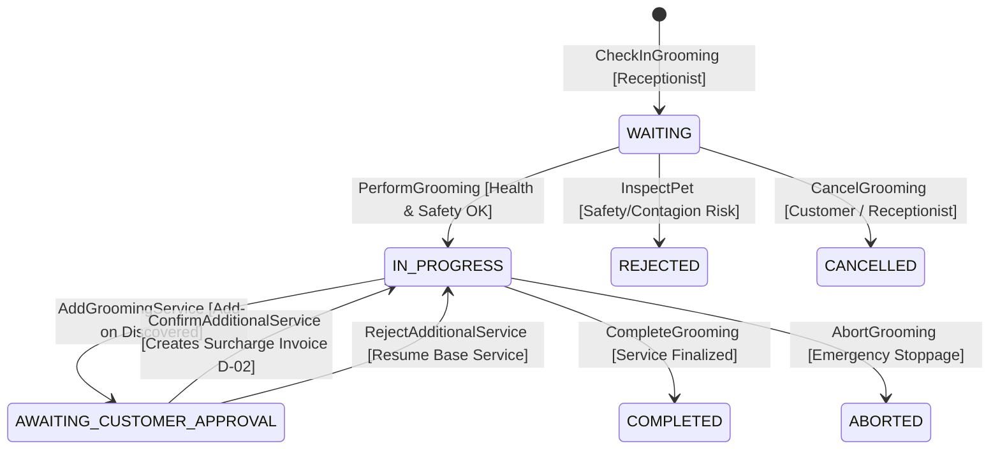
```mermaid
stateDiagram-v2
    [*] --> WAITING: CheckInGrooming [Receptionist]
    WAITING --> IN_PROGRESS: PerformGrooming [Health & Safety OK]
    WAITING --> REJECTED: InspectPet [Safety/Contagion Risk]
    WAITING --> CANCELLED: CancelGrooming [Customer / Receptionist]
    IN_PROGRESS --> AWAITING_CUSTOMER_APPROVAL: AddGroomingService [Add-on Discovered]
    AWAITING_CUSTOMER_APPROVAL --> IN_PROGRESS: ConfirmAdditionalService [Creates Surcharge Invoice D-02]
    AWAITING_CUSTOMER_APPROVAL --> IN_PROGRESS: RejectAdditionalService [Resume Base Service]
    IN_PROGRESS --> COMPLETED: CompleteGrooming [Service Finalized]
    IN_PROGRESS --> ABORTED: AbortGrooming [Emergency Stoppage]
```

| From State | Command / Trigger | Actor | Guard (RULE-ID) | To State | Domain Event | Actions / Notes |
|---|---|---|---|---|---|---|
| [*] | CheckInGrooming | Receptionist | RULE-11-01 | WAITING | GroomingCheckedIn | Tiếp nhận và check-in thú cưng tại quầy spa/grooming chi nhánh; xếp vào danh sách chờ thực hiện. |
| WAITING | PerformGrooming | Groomer | RULE-11-01, RULE-11-02 | IN_PROGRESS | GroomingStarted | Kiểm tra thể trạng đạt yêu cầu (không có bệnh lây nhiễm, tính cách an toàn); đưa thú cưng lên bàn grooming bắt đầu phục vụ. |
| WAITING | InspectPet | Groomer | RULE-11-01, RULE-11-02 | REJECTED | GroomingRejected | Phát hiện bệnh truyền nhiễm nặng, ve rận nghiêm trọng, nấm lây lan hoặc thú hung dữ mất an toàn; từ chối phục vụ, chuyển bác sĩ hội chẩn. |
| WAITING | CancelGrooming | Customer / Receptionist | RULE-11-01 | CANCELLED | GroomingCancelled | Khách hàng hoặc tiếp tân hủy phiên dịch vụ trước khi bắt đầu thực hiện; giải phóng bàn grooming và xử lý cọc. |
| IN_PROGRESS | AddGroomingService | Groomer | RULE-11-02, RULE-11-03 | AWAITING_CUSTOMER_APPROVAL | AdditionalServiceRequested | Phát hiện lông rối nặng, nhu cầu tắm trị liệu đặc biệt hoặc dịch vụ phát sinh; tạm dừng công đoạn và gửi yêu cầu phê duyệt kèm báo giá tới khách hàng. |
| AWAITING_CUSTOMER_APPROVAL | ConfirmAdditionalService | Customer | RULE-11-03 (D-02) | IN_PROGRESS | AdditionalServiceConfirmed | Khách hàng chấp thuận; hệ thống tự động khởi tạo **Hóa đơn Phụ phí độc lập (Surcharge Invoice)** ở trạng thái `DRAFT`/`ISSUED` liên kết với phiên (không sửa hóa đơn gốc D-01) và tiếp tục thực hiện dịch vụ. |
| AWAITING_CUSTOMER_APPROVAL | RejectAdditionalService | Customer | RULE-11-03 | IN_PROGRESS | AdditionalServiceRejected | Khách hàng từ chối phát sinh; Groomer tiếp tục hoàn thành các hạng mục trong gói dịch vụ cơ bản ban đầu. |
| IN_PROGRESS | CompleteGrooming | Groomer | RULE-11-04, RULE-11-05 | COMPLETED | GroomingCompleted | Hoàn thành toàn bộ công đoạn, chụp ảnh kết quả nghiệm thu; giải phóng bàn Grooming (`ReleaseStoreResource`); bàn giao tiếp tân đóng lịch hẹn. |
| IN_PROGRESS | AbortGrooming | Groomer / StoreManager | RULE-11-06, RULE-21-03 | ABORTED | GroomingAborted | Dừng dịch vụ khẩn cấp do thú cưng hoảng loạn, cắn nhân viên, chấn thương hoặc sốc nhiệt; giải phóng bàn grooming; tự động lập biên bản `GroomingIncident` và yêu cầu hoàn cọc/tiền phần chưa thực hiện. |

- **Initial State:** `WAITING`
- **Terminal State:** `COMPLETED`, `CANCELLED`, `ABORTED`, `REJECTED`
- **Technical Invariants:**
  1. *Giao thức Hóa đơn Phụ phí Độc lập (Surcharge Invoice Protocol - Quyết định D-02 & D-01):*
     - Khi `ConfirmAdditionalService` được kích hoạt, hệ thống tạo một Hóa đơn Phụ phí độc lập (`Surcharge Invoice`) ở trạng thái `DRAFT`/`ISSUED` gắn liền với `GroomingSessionId` và `AppointmentId`.
     - Tuyệt đối **KHÔNG** chỉnh sửa số tiền hay chèn thêm dòng item vào Hóa đơn gốc đã thanh toán (`PAID`), đảm bảo tính bất biến tài chính (Settlement Immutability D-01).
  2. *Điểm Kiểm soát Thể trạng & Từ chối Tiền phục vụ (Pre-service Safety Inspection - RULE-11-02):*
     - Lệnh `InspectPet` đánh giá điều kiện da lông và hành vi. Nếu không đạt, chuyển thẳng sang trạng thái kết thúc `REJECTED`, ngăn ngừa lây nhiễm chéo hoặc tai nạn lao động.
  3. *Quy trình Dừng khẩn cấp & Tự động Lập biên bản Sự cố (Emergency Abort & Incident Protocol - RULE-11-06, RULE-21-03):*
     $$\text{AbortGrooming}(\text{sessionId}, \text{abort\_reason}) \implies \begin{cases} \text{GroomingSession}.\text{status} \leftarrow \text{ABORTED} \\ \text{ReleaseStoreResource}(\text{groomingTableId}) \\ \text{CreateGroomingIncident}(\text{reason} = \text{abort\_reason}, \text{severity} = \text{HIGH}) \\ \text{SendIncidentNotification}(\text{Customer}, \text{StoreManager}) \\ \text{RequestPartialRefund}(\text{unconsumedServiceValue}) \end{cases}$$

---

## 16. Consent — ConsentStatus (Cross-Store Medical Consent)

> `ConsentStatus` đặc tả vòng đời của yêu cầu ủy quyền chia sẻ hồ sơ bệnh án thú cưng liên chi nhánh giữa các Store (`Cross-Store Clinical Consent`).
> Hệ thống áp dụng cơ chế đồng thuận 2 giao thức (Dual-Protocol Mechanism):
> 1. **Giao thức Tiêu chuẩn (Standard OTP):** Mã OTP ủy quyền có thời hạn 5 phút ($\text{OTP\_TTL} = 300\text{s}$); khi xác thực thành công (`ACTIVE`), quyền truy cập có thời hạn tối đa 24 giờ ($\text{Consent\_TTL} = 24\text{h}$). Chủ nuôi có quyền thu hồi trước hạn (`REVOKED`).
> 2. **Giao thức Cấp cứu Khẩn cấp (Break-Glass Emergency Override):** Trong tình huống nguy kịch đe dọa tính mạng thú cưng, Bác sĩ thú y được cấp quyền truy cập `ACTIVE` trực tiếp (`is_emergency = true`), đồng thời hệ thống tự động lập biên bản sự cố y tế `ClinicalIncident` (`RULE-21-02`), phát thông báo khẩn cấp `SendIncidentNotification` (`RULE-21-05`, `RULE-23-02`) và ghi nhật ký kiểm toán bất biến (`RULE-25-04`).

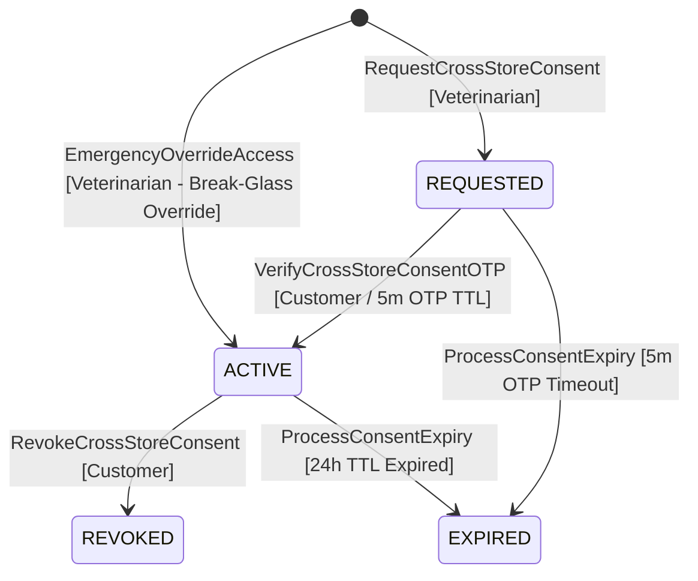
```mermaid
stateDiagram-v2
    [*] --> REQUESTED: RequestCrossStoreConsent [Veterinarian]
    REQUESTED --> ACTIVE: VerifyCrossStoreConsentOTP [Customer / 5m OTP TTL]
    REQUESTED --> EXPIRED: ProcessConsentExpiry [5m OTP Timeout]
    ACTIVE --> REVOKED: RevokeCrossStoreConsent [Customer]
    ACTIVE --> EXPIRED: ProcessConsentExpiry [24h TTL Expired]
    [*] --> ACTIVE: EmergencyOverrideAccess [Veterinarian - Break-Glass Override]
```

| From State | Command / Trigger | Actor | Guard (RULE-ID) | To State | Domain Event | Actions / Notes |
|---|---|---|---|---|---|---|
| [*] | RequestCrossStoreConsent | Veterinarian | RULE-09-02, RULE-22-01, RULE-22-02 | REQUESTED | CrossStoreConsentRequested | Bác sĩ tại Store chi nhánh gửi yêu cầu truy cập EMR liên Store; hệ thống gửi mã OTP xác thực có thời hạn 5 phút tới chủ Pet. |
| REQUESTED | VerifyCrossStoreConsentOTP | Customer / Receptionist | RULE-22-02, RULE-22-08 | ACTIVE | CrossStoreConsentGranted | Chủ Pet xác thực OTP hợp lệ trong vòng 5 phút; kích hoạt quyền xem hồ sơ bệnh án liên Store trong 24 giờ ($\text{Consent\_TTL} = 24\text{h}$). |
| REQUESTED | ProcessConsentExpiry | System | RULE-22-02 | EXPIRED | CrossStoreConsentExpired | Quá thời hạn 5 phút không được xác thực OTP; tác vụ nền tự động đánh dấu yêu cầu hết hạn. |
| ACTIVE | RevokeCrossStoreConsent | Customer | RULE-22-03 | REVOKED | CrossStoreConsentRevoked | Chủ nuôi chủ động thu hồi quyền chia sẻ bệnh án trước hạn qua App; hệ thống lập tức chấm dứt quyền truy cập của bác sĩ Store yêu cầu. |
| ACTIVE | ProcessConsentExpiry | System | RULE-22-08, RULE-22-10 | EXPIRED | CrossStoreConsentExpired | Hết thời hạn 24 giờ kể từ thời điểm kích hoạt; tác vụ nền tự động khóa quyền truy cập bệnh án liên Store. |
| [*] | EmergencyOverrideAccess | Veterinarian | RULE-09-02, RULE-21-02, RULE-22-08 | ACTIVE | EmergencyAccessOverridden | Bác sĩ kích hoạt quyền truy cập khẩn cấp (Break-Glass) khi Pet nguy kịch; cấp quyền `ACTIVE` trực tiếp (`is_emergency = true`), tự động tạo `ClinicalIncident` và gửi cảnh báo khẩn cấp. |

- **Initial State:** `REQUESTED` (Quy trình tiêu chuẩn), `ACTIVE` (Giao thức cấp cứu khẩn cấp Break-Glass).
- **Terminal State:** `REVOKED`, `EXPIRED`
- **Technical Invariants:**
  1. *Giao thức Chuẩn Xác thực OTP (Standard OTP Protocol - RULE-22-02, RULE-22-08):* OTP có thời hạn 5 phút ($\text{OTP\_TTL} = 300\text{s}$). Khi xác thực thành công, quyền truy cập EMR có thời hạn tối đa 24 giờ ($\text{Consent\_TTL} = 24\text{h}$).
  2. *Giao thức Cấp cứu Vượt quyền (Emergency Break-Glass Override Protocol - RULE-09-02, RULE-21-02, RULE-22-08):*
     $$\text{EmergencyOverrideAccess}(\text{petId}, \text{medicalRecordId}, \text{clinical\_reason}) \implies \begin{cases} \text{ConsentGrant}.\text{status} \leftarrow \text{ACTIVE} \ (\text{is\_emergency} = \text{true}) \\ \text{CreateClinicalIncident}(\text{type} = \text{EMERGENCY\_OVERRIDE}, \text{severity} = \text{CRITICAL}) \\ \text{RecordAuditLog}(\text{action} = \text{EMERGENCY\_ACCESS}, \text{actor} = \text{Veterinarian}) \\ \text{SendIncidentNotification}(\text{Customer}, \text{StoreManager}) \end{cases}$$
  3. *Quyền Chủ động Thu hồi Tức thì (RULE-22-03):* Chủ pet có thể thu hồi bất kỳ lúc nào; hệ thống lập tức chấm dứt phiên truy cập EMR của Store yêu cầu.

---

## 17. Walk-in Queue — QueueEntryStatus (Walk-in & Queue Management)

> `QueueEntryStatus` đặc tả vòng đời của lượt chờ khám/grooming trực tiếp tại cửa hàng (Walk-in Queue) theo cơ chế FIFO có ưu tiên cấp cứu.
> Cầu nối dữ liệu: Khi nhân sự bắt đầu phục vụ (`StartQueueService`), hệ thống tự động khởi tạo ngầm một bản ghi `Appointment` nội bộ với nguồn tiếp nhận `Channel = WALK_IN` ở trạng thái `IN_PROGRESS` (`RULE-07-05`).

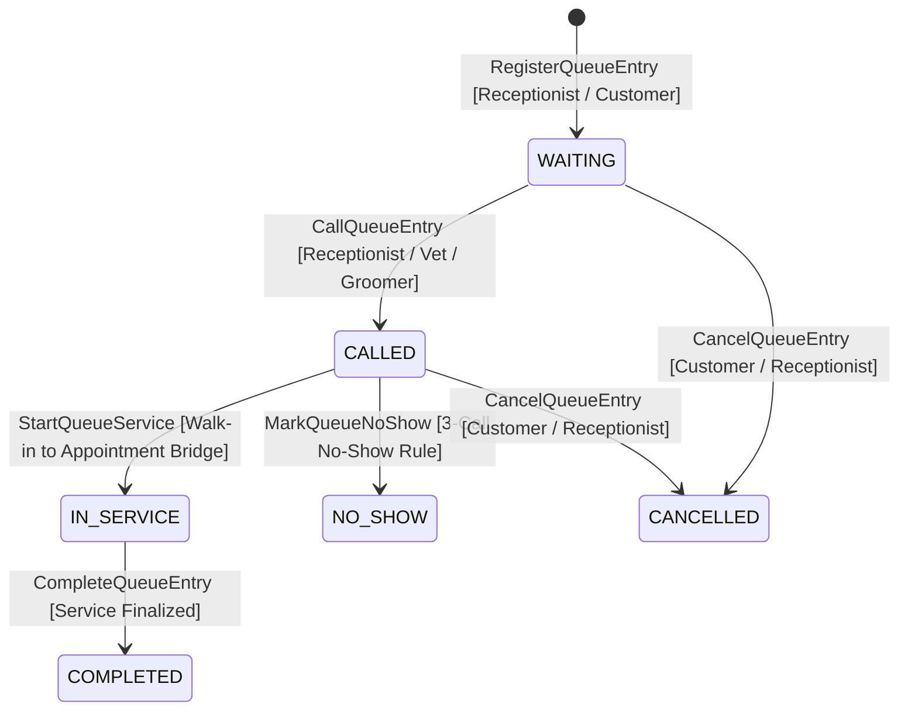
```mermaid
stateDiagram-v2
    [*] --> WAITING: RegisterQueueEntry [Receptionist / Customer]
    WAITING --> CALLED: CallQueueEntry [Receptionist / Vet / Groomer]
    CALLED --> IN_SERVICE: StartQueueService [Walk-in to Appointment Bridge]
    CALLED --> NO_SHOW: MarkQueueNoShow [3-Call No-Show Rule]
    IN_SERVICE --> COMPLETED: CompleteQueueEntry [Service Finalized]
    WAITING --> CANCELLED: CancelQueueEntry [Customer / Receptionist]
    CALLED --> CANCELLED: CancelQueueEntry [Customer / Receptionist]
```

| From State | Command / Trigger | Actor | Guard (RULE-ID) | To State | Domain Event | Actions / Notes |
|---|---|---|---|---|---|---|
| [*] | RegisterQueueEntry | Customer / Receptionist | RULE-07-01 | WAITING | QueueEntryRegistered | Tiếp nhận khách Walk-in tại quầy Store; cấp số thứ tự hàng đợi FIFO theo ngày cho từng phân loại chuyên môn. |
| WAITING | CallQueueEntry | Receptionist / Veterinarian / Groomer | RULE-07-02, RULE-07-03 | CALLED | QueueEntryCalled | Gọi số thứ tự tiếp theo vào phòng khám hoặc bàn làm đẹp; cập nhật bảng hiển thị điện tử và gửi thông báo `SendTurnNotification`. |
| CALLED | StartQueueService | Veterinarian / Groomer | RULE-07-05, RULE-09-01, RULE-11-01 | IN_SERVICE | QueueServiceStarted | Bắt đầu phục vụ chuyên môn; **tự động kích hoạt Cầu nối Walk-in tạo Appointment nội bộ (`Channel = WALK_IN`, `Status = IN_PROGRESS`)**. |
| CALLED | MarkQueueNoShow | Receptionist | RULE-07-06 | NO_SHOW | QueueEntryNoShow | Khách hàng không có mặt sau 3 lần gọi số thứ tự giãn cách theo quy định; hủy lượt chờ và tự động gọi số tiếp theo. |
| IN_SERVICE | CompleteQueueEntry | Veterinarian / Groomer | RULE-07-07, RULE-06-06, RULE-11-04 | COMPLETED | QueueEntryCompleted | Hoàn tất dịch vụ; đồng bộ chuyển bản ghi `Appointment` nội bộ sang `COMPLETED`, giải phóng tài nguyên phòng/bàn và chuyển sang thu ngân. |
| WAITING | CancelQueueEntry | Customer / Receptionist | RULE-07-04 | CANCELLED | QueueEntryCancelled | Khách hàng hoặc tiếp tân chủ động hủy lượt chờ khi đang trong hàng đợi; tự động đôn thứ tự các phiếu phía sau. |
| CALLED | CancelQueueEntry | Customer / Receptionist | RULE-07-04 | CANCELLED | QueueEntryCancelled | Hủy lượt chờ sau khi đã gọi số nhưng chưa bắt đầu phục vụ; giải phóng lượt phục vụ. |

- **Initial State:** `WAITING`
- **Terminal State:** `COMPLETED`, `CANCELLED`, `NO_SHOW`
- **Technical Invariants:**
  1. *Cầu nối Vòng đời Walk-in sang Appointment (Walk-in to Appointment Lifecycle Bridge - RULE-07-05):*
     $$\text{StartQueueService}(\text{ticketId}, \text{staffId}, \text{resourceId}) \implies \begin{cases} \text{QueueTicket}.\text{status} \leftarrow \text{IN\_SERVICE} \\ \text{CreateInternalAppointment}(\text{Channel} = \text{WALK\_IN}, \text{TicketId} = \text{ticketId}) \\ \text{Appointment}.\text{status} \leftarrow \text{IN\_PROGRESS} \end{cases}$$
     Bản ghi Appointment nội bộ này liên kết trực tiếp với `QueueTicketId`, `StaffId` và `StoreResourceId`, cho phép các module EMR, Tiêm chủng, Grooming, Hóa đơn và Báo cáo doanh thu vận hành trên cùng một mô hình dữ liệu đồng nhất.
  2. *Thứ tự Hàng đợi FIFO & Phân luồng Cấp cứu (RULE-07-02):* Thứ tự phục vụ tuân thủ nghiêm ngặt FIFO ($\text{RegisteredAt}$). Riêng ca cấp cứu y tế (`TRIAGE_EMERGENCY`) được gắn quyền ưu tiên cao nhất, bypass hàng đợi vào phòng cấp cứu ngay lập tức.
  3. *Quy tắc Xử lý Vắng mặt sau 3 lần gọi (3-Call No-Show Rule - RULE-07-06):* Quá 3 lần gọi không có mặt → chuyển sang `NO_SHOW`.

---

## 18. Cross-aggregate Transition Triggers & Event Bridges

Bảng ma trận dưới đây đặc tả toàn bộ các luồng liên kết sự kiện (Event Bridges) và chuyển trạng thái chéo giữa các Aggregates trong hệ sinh thái Pet Care:

| STT | Aggregate Nguồn & Trạng thái | Aggregate Đích & Hành động / Chuyển trạng thái | Sự kiện Kích hoạt (Domain Event / Trigger Bridge) | Ràng buộc nghiệp vụ (Rule ID) | Mô tả Luồng Xử lý Nghiệp vụ |
|---|---|---|---|---|---|
| 1 | **BookingHold** / `HOLDING` | **StoreResource** / Khóa tạm thời slot phòng/bàn | `SlotHeld` | RULE-06-01 | Tạm giữ tài nguyên cơ sở vật chất, lịch nhân sự và lịch Pet trong 15 phút ($\text{Hold\_TTL} = 900\text{s}$). |
| 2 | **BookingHold** / `EXPIRED` | **StoreResource** / Giải phóng slot phòng/bàn | `HoldExpired` | RULE-06-01 | Tự động giải phóng slot phòng/bàn và lịch nhân sự về trạng thái `FREE` khi hết hạn giữ chỗ 15 phút mà không xác nhận. |
| 3 | **Payment** / `SUCCESS` | **Invoice** / `FullPaymentSettled` -> `PAID` | `PaymentSucceeded` | RULE-15-06, RULE-16-04 | Cập nhật lũy kế thanh toán; khi $\sum(\text{Payment.SUCCESS}) \ge \text{Invoice.TotalAmount}$, chuyển Invoice sang `PAID`. |
| 4 | **Payment** / `SUCCESS` | **Order** / `PAID` | `PaymentSucceeded` | RULE-14-03, RULE-14-04 | Đơn hàng Online/App chuyển sang `PAID` sau khi nhận thanh toán thành công, chuyển tiếp sang `CONFIRMED`. |
| 5 | **Refund** / `COMPLETED` | **Payment** / `PARTIALLY_REFUNDED` hoặc `REFUNDED` | `RefundCompleted` | RULE-16-06, RULE-17-02, RULE-17-09 | Cập nhật $\text{RemainingRefundableAmount}$. Nếu bằng 0 chuyển `REFUNDED`, ngược lại chuyển `PARTIALLY_REFUNDED`. |
| 6 | **Refund** / `COMPLETED` | **Order** / `REFUNDED` (hoặc giữ nguyên `DELIVERED`) | `RefundCompleted` | RULE-14-07, RULE-17-02, RULE-17-09 (D-03) | Hoàn tiền đơn đã giao: Nếu hoàn 100% chuyển Order sang `REFUNDED`. Nếu hoàn một phần (Partial Return), giữ nguyên `DELIVERED` và cập nhật `total_refunded_amount`. |
| 7 | **Refund** / `COMPLETED` | **Invoice** / Cập nhật `total_refunded_amount` | `RefundCompleted` | RULE-15-07, RULE-17-09 (D-01) | Cập nhật lũy kế tiền hoàn trên Invoice; Invoice **VĨNH VIỄN GIỮ NGUYÊN trạng thái `PAID`** (Settlement Immutability D-01). |
| 8 | **Order** / `CANCELLED` (`ProcessOrderTimeout`) | **Inventory** / Giải phóng $\text{ReservedQuantity}$ | `OrderTimedOut` | RULE-14-04, RULE-14-07, RULE-12-04 | Quá 15 phút chưa thanh toán Online → Hủy đơn, giải phóng số lượng giữ chỗ ảo về lại tồn kho khả dụng. |
| 9 | **Order** / `CANCELLED` (`CancelOrderWithRefund`) | **Refund** / `REQUESTED` & **Inventory** / Hoàn kho | `OrderCancelledWithRefund` | RULE-14-03, RULE-14-07, RULE-17-01 | Đơn đã thanh toán bị hủy trước giao hàng → Tạo yêu cầu hoàn tiền 100% (`RefundRequested`) và nhập lại hàng vào tồn kho thực tế. |
| 10 | **Appointment** / `ABORTED` | **Incident** / `RECORDED` & **Refund** / `REQUESTED` | `AppointmentAborted` | RULE-06-08, RULE-21-01, RULE-21-02 | Dừng khám/phẫu thuật khẩn cấp → Lập biên bản `ClinicalIncident` (`CRITICAL`), giải phóng tài nguyên, tạo `RefundRequested` cho phần chưa thực hiện. |
| 11 | **Grooming** / `AWAITING_CUSTOMER_APPROVAL` (`ConfirmAdditionalService`) | **Invoice** / Tạo Hóa đơn Phụ phí độc lập | `AdditionalServiceConfirmed` | RULE-11-03, RULE-15-05 (D-02, D-01) | Khách duyệt dịch vụ phát sinh → Tạo Hóa đơn Phụ phí độc lập (`Surcharge Invoice`) ở trạng thái `DRAFT`/`ISSUED` gắn với phiên (không sửa hóa đơn gốc). |
| 12 | **Grooming** / `COMPLETED` | **Appointment** / `CheckOutAppointment` | `GroomingCompleted` | RULE-11-04, RULE-11-05, RULE-06-06 | Phiên làm đẹp hoàn tất → Giải phóng bàn Grooming, chuyển lịch hẹn sang `COMPLETED` để tiếp tân thực hiện đóng lịch và xuất hóa đơn. |
| 13 | **Grooming** / `ABORTED` | **Incident** / `RECORDED` & **Refund** / `REQUESTED` | `GroomingAborted` | RULE-11-06, RULE-21-03, RULE-17-01 | Dừng spa khẩn cấp do thú hoảng loạn/cắn → Lập biên bản `GroomingIncident` (`HIGH`), giải phóng bàn spa, tạo yêu cầu hoàn tiền phần chưa thực hiện. |
| 14 | **Walk-in Queue** / `CALLED` (`StartQueueService`) | **Appointment** / Khởi tạo `Channel=WALK_IN`, `IN_PROGRESS` | `QueueServiceStarted` | RULE-07-05, RULE-09-01, RULE-11-01 | Bắt đầu phục vụ khách Walk-in → Tự động tạo bản ghi `Appointment` nội bộ ở trạng thái `IN_PROGRESS` gắn với `QueueTicketId`. |
| 15 | **Consent** / `ACTIVE` (`VerifyCrossStoreConsentOTP`) | **MedicalRecord** / Cho phép truy cập EMR liên Store | `CrossStoreConsentGranted` | RULE-22-02, RULE-22-08 | Xác thực OTP thành công → Cấp quyền truy cập xem bệnh án liên chi nhánh trong 24 giờ. |
| 16 | **Consent** / `EXPIRED` (`ProcessConsentExpiry`) | **MedicalRecord** / Khóa quyền truy cập EMR liên Store | `CrossStoreConsentExpired` | RULE-22-08, RULE-22-10 | Hết hạn TTL 24h → Tác vụ nền tự động khóa quyền truy cập bệnh án liên Store. |
| 17 | **Consent** / `ACTIVE` (`EmergencyOverrideAccess`) | **Incident** / `RECORDED` & **Notification** / Gửi cảnh báo | `EmergencyAccessOverridden` | RULE-09-02, RULE-21-02, RULE-21-05, RULE-23-02 | Bác sĩ truy cập khẩn cấp → Cấp quyền EMR ngay, lập biên bản `ClinicalIncident` (`CRITICAL`) và gửi tin nhắn cảnh báo tức thì tới Chủ pet và Store Manager. |
| 18 | **StockTransfer** / `IN_TRANSIT` | **Inventory** (Kho xuất) / Khấu trừ tồn khả dụng | `StockTransferShipped` | RULE-12-05, RULE-12-07 | Xuất hàng chuyển kho → Trừ tồn khả dụng kho xuất, chuyển số lượng sang trạng thái `IN_TRANSIT`. |
| 19 | **StockTransfer** / `RECEIVED` (đủ hàng) | **Inventory** (Kho nhận) / Tăng tồn khả dụng | `StockTransferReceived` | RULE-12-03, RULE-12-08 | Tiếp nhận đủ hàng nguyên vẹn → Tăng tồn khả dụng kho đích theo `ShippedQuantity`. |
| 20 | **StockTransfer** / `DISCREPANCY_RECORDED` | **Inventory** / Nhập kho phần nguyên vẹn & Lập `InventoryAdjustment` | `StockTransferDiscrepancyReported` | RULE-12-08, RULE-12-09 | Phát hiện hàng hỏng/thiếu → Nhập ngay tồn khả dụng phần nguyên vẹn `ReceivedQuantity`, cách ly `DamagedQuantity` (`DAMAGED_STOCK`), hạch toán `LostQuantity`, lập phiếu điều chỉnh kho. |
| 21 | **StockTransfer** / `RECEIVED` (sau điều chỉnh) | **StockTransfer** / `DISCREPANCY_RECORDED` -> `RECEIVED` | `StockTransferDiscrepancyResolved` | RULE-12-03, RULE-12-09 | Phê duyệt phiếu kiểm kê điều chỉnh → Đóng hoàn tất phiếu chuyển kho (không tăng tồn lặp lại). |
| 22 | **Membership** / `UPGRADED` (`UpgradeMembership`) | **Membership** / Kích hoạt bản ghi hạng mới `ACTIVE` | `MembershipUpgraded` | RULE-19-04, RULE-19-08 | Nâng cấp hội viên → Đóng bản ghi gói cũ (`UPGRADED`) và tự động tạo mới bản ghi Membership hạng cao hơn (`ACTIVE`). |
| 23 | **PurchaseOrder** / `RECEIVED` | **Inventory** / Tăng tồn kho thực tế & khả dụng | `GoodsReceived` | RULE-13-05, RULE-13-06 | Tiếp nhận hàng đạt chuẩn từ PO → Tăng tồn kho thực tế và khả dụng tại kho nhận, lưu vết lô và hạn sử dụng. |
| 24 | **PurchaseOrder** / `CLOSED` | **Procurement** / Giải phóng cam kết đặt hàng | `PurchaseOrderRemainingCancelled` | RULE-13-07, RULE-13-08 | Hủy phần hàng giao thiếu → Đóng PO (`CLOSED`), giải phóng cam kết công nợ cho số lượng chưa giao. |
| 25 | **Package** / `ACTIVATED` / `PARTIALLY_CONSUMED` | **Appointment** / Cấn trừ lượt dịch vụ | `PackagePartiallyConsumed` / `PackageFullyConsumed` | RULE-20-02, RULE-20-05 | Khách sử dụng lượt gói → Trừ lượt khả dụng, ghi nhận `PackageUsageHistory`, chuyển lịch hẹn tương ứng sang hoàn tất. |
| 26 | **Package** / `CANCELLED` (`CancelPackage`) | **Refund** / `REQUESTED` | `PackageCancelled` | RULE-20-06, RULE-17-01 | Quản lý hủy gói → Tự động tính giá trị lượt chưa dùng theo công thức và tạo yêu cầu hoàn tiền `RefundRequested`. |

---

> **Ghi chú kiến trúc (Promotion & Voucher Management):** Promotion và Voucher vận hành theo cơ chế Stateless Rule Validation tại Runtime dựa trên hiệu lực ngày giờ, ngân sách và điều kiện áp dụng (`RULE-18-01 -> RULE-18-08`), không sử dụng FSM đa trạng thái riêng.

---

## 19. Kiến trúc Triển khai Event Bridges & Đảm bảo Tính nhất quán Dữ liệu (Transactional Outbox Pattern)

Nhằm đảm bảo tính nhất quán dữ liệu tuyệt đối (ACID & Eventual Consistency) giữa các Aggregates trong kiến trúc Monolith của hệ sinh thái Pet Care (đặc biệt giữa Tiền, Hóa đơn, Đơn hàng, Lịch hẹn và Tồn kho), hệ thống quy định các nguyên tắc kiến trúc sau:

### 19.1. Phân định Mô hình Giao dịch

1. **Giao dịch Nội vùng Đồng bộ (Intra-Aggregate / Synchronous Transaction):**
   - Áp dụng cho các thao tác trực tiếp tại quầy thu ngân POS bằng tiền mặt (`RecordCashPayment`) hoặc thao tác đơn lẻ trong cùng Aggregate.
   - Tiếp tân thực hiện ghi nhận trong cùng một ranh giới `@Transactional` duy nhất bao gồm: Cập nhật Payment (`SUCCESS`), cập nhật Invoice (`PAID`), cập nhật Order (`PAID`) và trừ tồn kho trực tiếp `PhysicalQuantity`.

2. **Giao dịch Ngoại vùng Bất đồng bộ (Cross-Aggregate / Event-Driven via Transactional Outbox):**
   - Áp dụng cho các sự kiện kích hoạt chéo Aggregate hoặc phát sinh từ bên ngoài: Webhook cổng thanh toán Online, Cron Job hủy timeout đơn hàng 15 phút, yêu cầu hoàn tiền tự động qua cổng thanh toán, duyệt phụ phí grooming tạo Hóa đơn Phụ phí, hủy gói dịch vụ trả trước, cảnh báo sự cố y tế khẩn cấp.
   - **BẮT BUỘC** sử dụng **Transactional Outbox Pattern** để đảm bảo không mất mát sự kiện (Zero Event Loss).

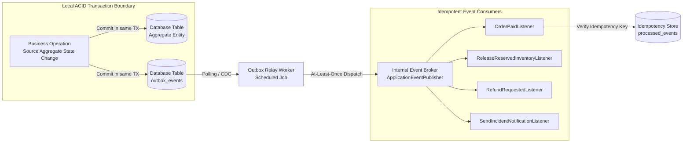
```mermaid
flowchart LR
    subgraph Local_ACID_Transaction ["Local ACID Transaction Boundary"]
        A[Business Operation<br/>Source Aggregate State Change] -->|Commit in same TX| B[(Database Table<br/>Aggregate Entity)]
        A -->|Commit in same TX| C[(Database Table<br/>outbox_events)]
    end
    
    C -->|Polling / CDC| D[Outbox Relay Worker<br/>Scheduled Job]
    D -->|At-Least-Once Dispatch| E[Internal Event Broker<br/>ApplicationEventPublisher]
    
    subgraph Idempotent_Consumers ["Idempotent Event Consumers"]
        E --> F[OrderPaidListener]
        E --> G[ReleaseReservedInventoryListener]
        E --> H[RefundRequestedListener]
        E --> I[SendIncidentNotificationListener]
    end
    
    F -->|Verify Idempotency Key| J[(Idempotency Store<br/>processed_events)]
```

### 19.2. Cấu trúc Bảng Outbox Chuẩn Hóa (`outbox_events`)

Mọi sự kiện miền phát sinh qua ranh giới Aggregate bắt buộc phải được ghi nhận vào bảng `outbox_events` với cấu trúc sau:

| Tên Cột | Kiểu Dữ Liệu | Ràng Buộc | Mô Tả |
|---|---|---|---|
| `event_id` | `UUID` | `PRIMARY KEY` | Khóa định danh duy nhất toàn cục của sự kiện, dùng làm Idempotency Key cho Consumer. |
| `aggregate_type` | `VARCHAR(64)` | `NOT NULL` | Phân loại Aggregate nguồn (ví dụ: `ORDER`, `PAYMENT`, `INVOICE`, `APPOINTMENT`, `GROOMING`, `CONSENT`, `PACKAGE`, `STOCK_TRANSFER`). |
| `aggregate_id` | `VARCHAR(64)` | `NOT NULL` | Khóa chính định danh thực thể Aggregate phát sinh sự kiện. |
| `event_type` | `VARCHAR(128)` | `NOT NULL` | Tên Domain Event chuẩn (ví dụ: `PaymentSucceeded`, `OrderTimedOut`, `RefundCompleted`, `EmergencyAccessOverridden`). |
| `payload` | `JSONB` | `NOT NULL` | Toàn bộ dữ liệu chi tiết của sự kiện (dạng JSON có cấu trúc). |
| `status` | `VARCHAR(32)` | `NOT NULL` | Trạng thái xử lý sự kiện: `PENDING`, `PROCESSING`, `PUBLISHED`, `FAILED`. |
| `retry_count` | `INTEGER` | `NOT NULL DEFAULT 0` | Số lần đã thử lại phát sự kiện khi gặp sự cố tạm thời. |
| `created_at` | `TIMESTAMPTZ` | `NOT NULL DEFAULT NOW()` | Thời điểm tạo sự kiện trong Transaction nguồn. |
| `processed_at` | `TIMESTAMPTZ` | `NULL` | Thời điểm sự kiện được chuyển phát thành công. |

### 19.3. Nguyên tắc Chuyển phát & Tiêu thụ Sự kiện (Delivery & Idempotency Rules)

1. **At-Least-Once Delivery Guarantee:** Tiến trình nền Outbox Relay Worker quét các bản ghi `PENDING` theo lô (Batch Processing) và phát đi sự kiện. Nếu Worker gặp lỗi mạng hoặc dừng đột ngột, sự kiện sẽ được quét lại ở chu kỳ tiếp theo.
2. **Idempotent Consumer Guard:** Mọi Listener/Consumer tiếp nhận Domain Event bắt buộc phải kiểm tra khóa `event_id` hoặc `payment_transaction_id` trong bảng `processed_events` trước khi thực thi xử lý nghiệp vụ. Nếu khóa đã tồn tại (đã xử lý), Consumer bỏ qua thao tác ngay lập tức, ngăn ngừa hoàn toàn rủi ro trùng lặp dữ liệu (Double Spending / Duplicate Inventory Release).
3. **Nghiêm cấm In-Memory Listener thuần túy:** Tuyệt đối **KHÔNG** sử dụng `@TransactionalEventListener(phase = AFTER_COMMIT)` phát trực tiếp trong bộ nhớ mà không lưu vết Outbox, nhằm loại bỏ triệt để rủi ro mất mát sự kiện khi ứng dụng bị dừng hoặc crash ngay sau khi commit transaction nguồn.
