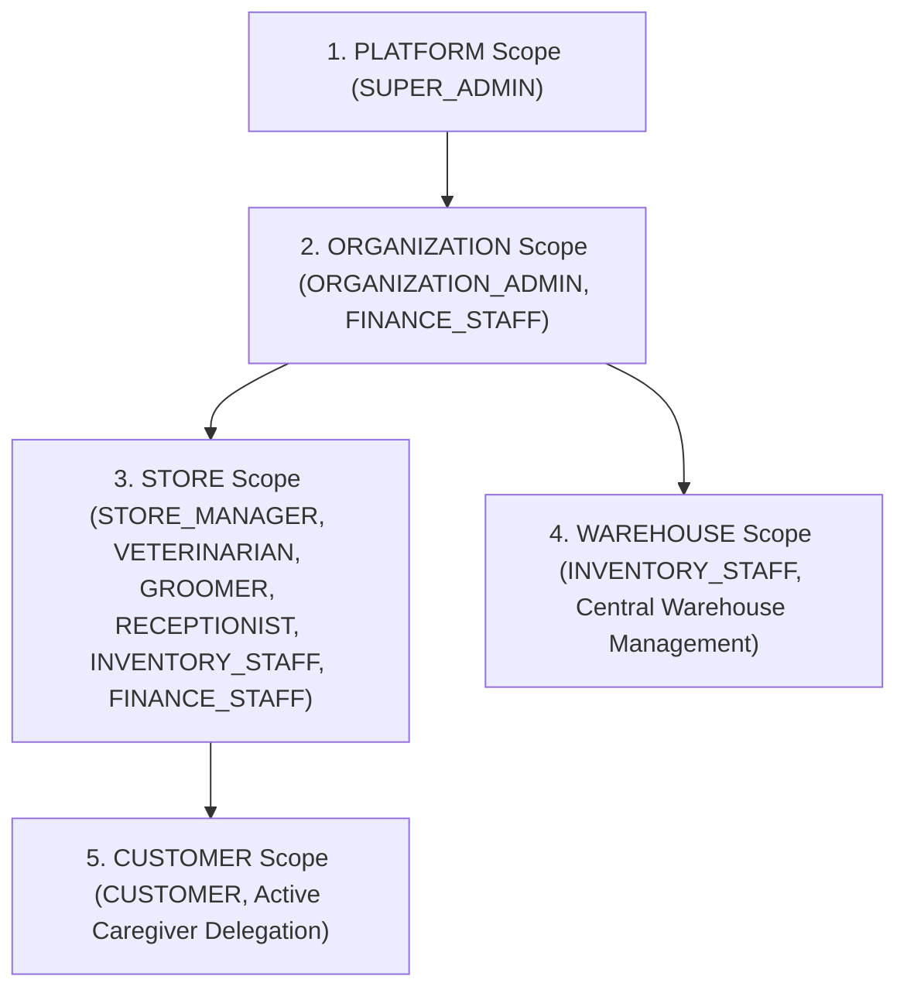
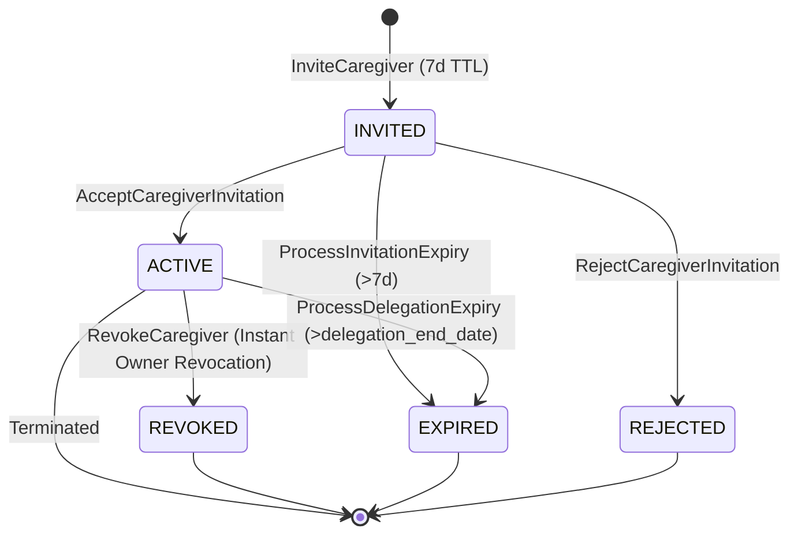
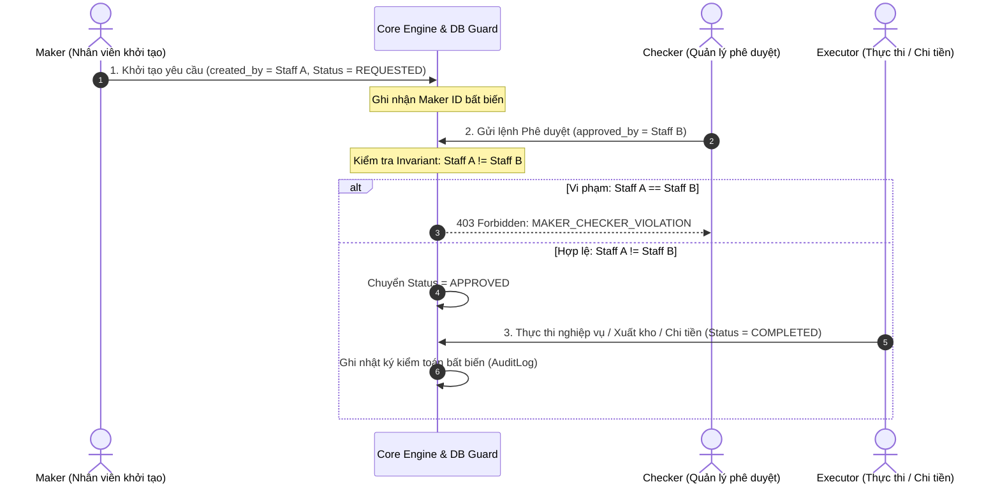
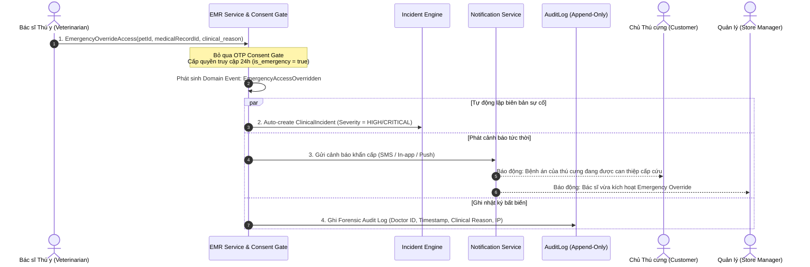

# Pet Care Ecosystem — Ubiquitous Language Glossary

> Tài liệu này chuẩn hóa toàn bộ thuật ngữ chuyên ngành (Ubiquitous Language) của hệ thống Pet Care Ecosystem theo nguyên lý Domain-Driven Design (DDD). Tất cả các thuật ngữ được phân loại rõ ràng thành: Actor, Aggregate Candidate, Entity Candidate, Value Object Candidate, Command Candidate, Status-Enum, và Domain Event Candidate.
>
> Mọi Command Candidate trong tài liệu này đồng bộ 1:1 với `docs/01-business-operations.md` (Source of Truth), các quy tắc nghiệp vụ tại `docs/02-business-rules.md`, và các State Machine tại `docs/03-state-machines.md`.

---

## 00. Architectural Decision Locks (D-01 to D-04)

Hệ thống Pet Care Ecosystem thiết lập và khóa cố định các quyết định kiến trúc cốt lõi (Architectural Decision Locks) làm căn bản bất biến cho toàn bộ Domain Model, State Machine (FSM), Business Rules và Business Operations:

1. **D-01 (Invoice Partial Refund Representation):**
   - Hóa đơn (`Invoice`) giữ nguyên trạng thái `PAID` khi xảy ra hoàn tiền một phần (Partial Refund); không chuyển trạng thái hóa đơn sang hoàn tiền.
   - Số tiền hoàn lũy kế và số dư còn lại được theo dõi qua thuộc tính `total_refunded_amount` (đảm bảo tính bất biến của chứng từ quyết toán - Settlement Immutability).

2. **D-02 (Grooming Add-On / Surcharge Mechanism):**
   - Các dịch vụ hoặc phụ phí phát sinh trong quá trình thực hiện dịch vụ làm đẹp (Grooming Add-on / Surcharge) sẽ tạo ra một Hóa đơn Phụ phí (`Surcharge Invoice`) riêng biệt liên kết với cùng lịch hẹn/ca dịch vụ.
   - Surcharge Invoice trải qua chu trình thanh toán độc lập (Checkout, Issue, Payment, Settle).

3. **D-03 (Order Fulfillment & Cancellation vs Refund Separation):**
   - Đơn hàng bị hủy trước khi giao nhận (chưa thanh toán hoặc đã thanh toán và kích hoạt hoàn tiền) sẽ chuyển sang trạng thái kết thúc `CANCELLED`.
   - Trạng thái kết thúc `REFUNDED` là trạng thái kết thúc áp dụng đặc thù cho đơn hàng đã hoàn tất giao nhận (`DELIVERED`) sau đó phát sinh đổi trả và hoàn lại 100% giá trị đơn hàng (trường hợp đổi trả hoàn tiền một phần, đơn giữ nguyên `DELIVERED` và cập nhật `total_refunded_amount`).

4. **D-04 (Staff Account Provisioning & OTP Exception):**
   - Tài khoản nhân sự do Quản trị viên khởi tạo (`Admin-provisioned staff accounts`) được tạo trực tiếp ở trạng thái `ACTIVE` với mật khẩu tạm thời.
   - Quy trình này là ngoại lệ đặc quyền được phép bỏ qua bước xác thực mã OTP đăng ký ban đầu (`RULE-01-03` Exception); nhân viên đổi mật khẩu ở lần đăng nhập đầu tiên.

---

## 01. Authentication & OTP

| Term | Loại | Định nghĩa | Values (Status-Enum) | Deprecated synonym |
|---|---|---|---|---|
| Customer | Actor | Người sử dụng nền tảng để quản lý thú cưng, đặt lịch và thanh toán dịch vụ (System Role: `CUSTOMER`, Scope: `CUSTOMER`). | — | Pet Owner |
| System | Actor | Chủ thể tự động thực hiện các tác vụ nền, kiểm tra hết hạn và xử lý sự kiện hệ thống (Scope: `Automated Runtime`). | — | Cron / Background Worker |
| Account | Entity Candidate | Tài khoản định danh cho phép User đăng nhập và sử dụng hệ thống. | — | User Account |
| AccountStatus | Status-Enum | Trạng thái vòng đời của tài khoản người dùng (Lưu ý: theo D-04, tài khoản Staff do Admin khởi tạo trực tiếp ở trạng thái ACTIVE; khi nhân viên nghỉ việc chuyển sang DEACTIVATED). | PENDING_VERIFICATION, ACTIVE, LOCKED, DEACTIVATED | — |
| OTP | Value Object Candidate | Mã xác thực một lần dùng để xác minh số điện thoại hoặc email. | — | Verification Code |
| RegisterAccount | Command Candidate | Thao tác đăng ký tài khoản Customer mới trên nền tảng. | — | SignUp |
| SendRegistrationOTP | Command Candidate | Thao tác hệ thống gửi mã OTP xác thực đăng ký. | — | — |
| ResendOTP | Command Candidate | Thao tác người dùng yêu cầu gửi lại mã OTP mới. | — | — |
| VerifyOTP | Command Candidate | Thao tác xác thực mã OTP do người dùng cung cấp. | — | ValidateOTP |
| CreateStaff | Command Candidate | Thao tác Admin khởi tạo tài khoản Staff trực tiếp ở trạng thái ACTIVE với mật khẩu tạm thời (theo D-04, bỏ qua OTP đăng ký). | — | ProvisionStaff |
| CheckOTP | Command Candidate | Thao tác hệ thống kiểm tra tính hợp lệ và thời hạn của OTP. | — | — |
| ExpireOTP | Command Candidate | Thao tác vô hiệu hóa mã OTP khi hết thời gian hiệu lực. | — | — |
| Login | Command Candidate | Thao tác người dùng đăng nhập vào hệ thống. | — | SignIn |
| Logout | Command Candidate | Thao tác đăng xuất và hủy phiên làm việc. | — | SignOut |
| AccountRegistered | Domain Event Candidate | Sự kiện phát sinh khi tài khoản mới được đăng ký. | — | — |
| AccountActivated | Domain Event Candidate | Sự kiện phát sinh khi tài khoản được kích hoạt thành công sau xác thực OTP hoặc do Admin khởi tạo. | — | — |
| AccountLocked | Domain Event Candidate | Sự kiện phát sinh khi tài khoản bị khóa bởi quản trị viên hoặc do nhập sai mật khẩu 5 lần. | — | — |
| AccountUnlocked | Domain Event Candidate | Sự kiện phát sinh khi tài khoản được mở khóa. | — | — |
| AccountDeactivated | Domain Event Candidate | Sự kiện phát sinh khi tài khoản bị vô hiệu hóa do nhân viên nghỉ việc hoặc chấm dứt dịch vụ. | — | — |
| AccountReactivated | Domain Event Candidate | Sự kiện phát sinh khi tài khoản đã vô hiệu hóa được tái kích hoạt lại bởi quản trị viên. | — | — |

---

## 02. Identity & Access Management

| Term | Loại | Định nghĩa | Values (Status-Enum) | Deprecated synonym |
|---|---|---|---|---|
| PlatformAdmin | Actor | Người quản trị toàn bộ nền tảng ở cấp cao nhất (System Role: `SUPER_ADMIN`, Scope: `PLATFORM`). Quản lý tenant, master catalog, cấu hình toàn cục. | — | Super Admin, Tenant Admin |
| OrganizationAdmin | Actor | Người quản trị cấp chuỗi/tổ chức doanh nghiệp (System Role: `ORGANIZATION_ADMIN`, Scope: `ORGANIZATION`). Quản lý warehouse trung tâm, các store trực thuộc, nhân sự tenant và chính sách chuỗi. | — | Org Admin, Chain Admin |
| StoreManager | Actor | Người quản lý và điều hành vận hành tại một Store chi nhánh cụ thể (System Role: `STORE_MANAGER`, Scope: `STORE`). Thẩm quyền phê duyệt Maker-Checker và phân quyền nhân viên. | — | Store Admin, Clinic Admin, Branch Manager |
| Receptionist | Actor | Nhân viên tiếp đón khách, check-in và thu ngân tại Store (System Role: `RECEPTIONIST`, Scope: `STORE`). | — | Front Desk, Front Desk Staff |
| Veterinarian | Actor | Bác sĩ thú y phụ trách khám bệnh, chẩn đoán, kê đơn và tiêm phòng tại Store (System Role: `VETERINARIAN`, Scope: `STORE`; hỗ trợ truy cập liên Store qua Cross-Store Consent OTP / Emergency Override). | — | Doctor, Vet |
| Groomer | Actor | Chuyên viên spa/làm đẹp thú cưng tại Store (System Role: `GROOMER`, Scope: `STORE`). | — | Pet Stylist |
| InventoryStaff | Actor | Nhân viên quản lý và vận hành kho tại Store hoặc Warehouse trung tâm (Functional Role: `INVENTORY_STAFF`, Scope: `STORE / WAREHOUSE` — gói quyền hạn phân bổ). | — | Stock Keeper, Warehouse Staff |
| FinanceStaff | Actor | Nhân viên kế toán, tài chính phụ trách chi tiền hoàn, đối soát hóa đơn và quyết toán (Functional Role: `FINANCE_STAFF`, Scope: `ORGANIZATION / STORE` — gói quyền hạn phân bổ). | — | Accountant, Financial Officer |
| Customer | Actor | Khách hàng/chủ thú cưng sử dụng hệ thống (System Role: `CUSTOMER`, Scope: `CUSTOMER`). | — | Pet Owner, Client |
| RoleScope | Status-Enum | Cấp độ phạm vi dữ liệu và quyền lực áp dụng cho một vai trò người dùng trong hệ thống Multi-tenancy (5 Scopes). | PLATFORM, ORGANIZATION, STORE, WAREHOUSE, CUSTOMER | ScopeLevel |
| Role | Entity Candidate | Vai trò xác định nhóm quyền hạn của người dùng gắn với một `RoleScope` cụ thể. | — | User Role |
| Permission | Entity Candidate | Quyền cho phép thực hiện một nghiệp vụ hoặc Command cụ thể. | — | Privilege |
| User | Entity Candidate | Thực thể người dùng được định danh, cấp tài khoản và gán vai trò trong hệ thống. | — | System User |
| ManageUser | Command Candidate | Thao tác quản lý người dùng trong phạm vi quyền hạn được phép. | — | — |
| ManageRole | Command Candidate | Thao tác quản lý vai trò trong phạm vi quyền hạn được phép. | — | — |
| ManagePermission | Command Candidate | Thao tác quản lý quyền hạn trong phạm vi quyền hạn được phép. | — | — |
| LockAccount | Command Candidate | Thao tác khóa tài khoản không cho phép đăng nhập hoặc thao tác. | — | SuspendAccount |
| UnlockAccount | Command Candidate | Thao tác mở khóa tài khoản người dùng. | — | UnbanAccount |
| DeactivateAccount | Command Candidate | Thao tác vô hiệu hóa tài khoản khi nhân viên nghỉ việc hoặc chấm dứt hợp đồng. | — | DisableAccount |
| ReactivateAccount | Command Candidate | Thao tác tái kích hoạt lại tài khoản đã bị vô hiệu hóa. | — | EnableAccount |
| AssignPermission | Command Candidate | Thao tác phân quyền cho nhân viên trong phạm vi Store/Org. | — | GrantPermission |
| ManageCustomerProfile | Command Candidate | Thao tác Customer tự quản lý thông tin cá nhân hoặc Admin hỗ trợ quản lý. | — | EditProfile |

---

## 03. Organization & Store Management

| Term | Loại | Định nghĩa | Values (Status-Enum) | Deprecated synonym |
|---|---|---|---|---|
| StoreStatus | Status-Enum | Trạng thái vận hành của một Store (Khởi tạo ở DRAFT, cấu hình xong kích hoạt sang ACTIVE). | DRAFT, ACTIVE, SUSPENDED, DEACTIVATED, ARCHIVED | — |
| Organization | Entity Candidate | Tổ chức doanh nghiệp sở hữu và quản lý một hoặc nhiều Store và Warehouse trung tâm (Tenant Entity). | — | Tenant, Chain |
| Store | Entity Candidate | Cơ sở / chi nhánh thuộc Organization nơi dịch vụ được cung cấp trực tiếp cho khách hàng. | — | Branch, Clinic |
| OrganizationPolicy | Entity Candidate | Chính sách quy định cách Organization vận hành và chia sẻ dữ liệu nội bộ. | — | Org Policy |
| StorePolicy | Entity Candidate | Chính sách quy định cách Store vận hành tại chỗ. | — | Operational Policy |
| OperatingHour | Value Object Candidate | Khung thời gian làm việc quy định của Store trong ngày/tuần. | — | Store Hours |
| StoreResource | Entity Candidate | Tài nguyên phòng khám/bàn grooming chuyên dụng được Store quản lý để tránh xung đột lịch hẹn. | — | Facility Resource |
| CreateOrganization | Command Candidate | Thao tác tạo Organization mới trên nền tảng. | — | — |
| UpdateOrganization | Command Candidate | Thao tác cập nhật thông tin Organization. | — | — |
| ManageOrganizationPolicy| Command Candidate | Thao tác quản lý chính sách của Organization. | — | — |
| CreateStore | Command Candidate | Thao tác tạo Store mới thuộc Organization ở trạng thái DRAFT. | — | — |
| UpdateStore | Command Candidate | Thao tác cập nhật thông tin Store. | — | — |
| ActivateStore | Command Candidate | Thao tác kích hoạt Store từ DRAFT, SUSPENDED hoặc DEACTIVATED sang ACTIVE để đi vào vận hành. | — | — |
| SuspendStore | Command Candidate | Thao tác tạm đình chỉ hoạt động của Store. | — | — |
| DeactivateStore | Command Candidate | Thao tác ngừng kích hoạt Store. | — | — |
| ArchiveStore | Command Candidate | Thao tác lưu trữ / đóng cửa vĩnh viễn Store khi không còn nghĩa vụ mở. | — | — |
| ConfigureOperatingHour | Command Candidate | Thao tác thiết lập khung giờ hoạt động của Store. | — | — |
| ConfigureStoreService | Command Candidate | Thao tác cấu hình danh mục dịch vụ cung cấp tại Store. | — | — |
| ConfigureStoreResource | Command Candidate | Thao tác cấu hình tài nguyên vật chất của Store. | — | — |
| ConfigureStorePolicy | Command Candidate | Thao tác cấu hình chính sách vận hành tại Store. | — | — |
| StoreCreated | Domain Event Candidate | Sự kiện phát sinh khi Store mới được tạo. | — | — |
| StoreActivated | Domain Event Candidate | Sự kiện phát sinh khi Store được kích hoạt hoạt động. | — | — |
| StoreSuspended | Domain Event Candidate | Sự kiện phát sinh khi Store bị tạm đình chỉ hoạt động. | — | — |
| StoreDeactivated | Domain Event Candidate | Sự kiện phát sinh khi Store bị ngừng hoạt động. | — | — |
| StoreArchived | Domain Event Candidate | Sự kiện phát sinh khi Store bị lưu trữ vĩnh viễn. | — | — |

---

## 04. Customer & Pet Management

| Term | Loại | Định nghĩa | Values (Status-Enum) | Deprecated synonym |
|---|---|---|---|---|
| Customer | Actor | Người sử dụng nền tảng sở hữu tài khoản và hồ sơ thú cưng cá nhân (System Role: `CUSTOMER`, Scope: `CUSTOMER`). | — | Pet Owner |
| Caregiver | Actor | Người chăm sóc được chủ thú cưng ủy quyền thông qua `PetCaregiverDelegation` để thay mặt thao tác với Pet trong phạm vi được chỉ định. | — | Authorized Person |
| PetCaregiverDelegation| Aggregate Candidate | Hồ sơ quan hệ ủy quyền chăm sóc Pet giữa chủ thú cưng (Customer) và người được ủy quyền (Caregiver). | — | DelegationRecord, CaregiverInvitation |
| CaregiverStatus | Status-Enum | Trạng thái vòng đời của lời mời và quan hệ ủy quyền Caregiver. | INVITED, ACTIVE, REJECTED, EXPIRED, REVOKED | — |
| PetStatus | Status-Enum | Trạng thái hồ sơ của thú cưng. | ACTIVE, DECEASED, TRANSFERRED | — |
| Pet | Entity Candidate | Thú cưng được Customer đăng ký quản lý và sử dụng dịch vụ trong hệ sinh thái. | — | Animal Patient |
| CustomerProfile | Value Object Candidate | Thông tin định danh và liên hệ của Customer. | — | Profile Info |
| PetOwnership | Entity Candidate | Quyền sở hữu và trách nhiệm pháp lý của Customer đối với Pet. | — | Pet Owner Link |
| AuthorizedPet | Value Object Candidate | Phạm vi Pet cụ thể mà Caregiver được cấp quyền thao tác. | — | Delegated Pet |
| ManageCustomerProfile | Command Candidate | Thao tác quản lý hồ sơ thông tin Customer. | — | — |
| AddPet | Command Candidate | Thao tác thêm Pet mới vào danh sách quản lý. | — | CreatePet |
| UpdatePet | Command Candidate | Thao tác cập nhật thông tin Pet. | — | — |
| ViewPet | Command Candidate | Thao tác xem thông tin chi tiết của Pet. | — | — |
| ManagePetOwnership | Command Candidate | Thao tác chuyển giao hoặc quản lý quyền sở hữu Pet. | — | — |
| InviteCaregiver | Command Candidate | Thao tác Customer gửi lời mời ủy quyền cho Caregiver. | — | DelegateCaregiver |
| AcceptCaregiverInvitation| Command Candidate | Thao tác Caregiver chấp nhận ủy quyền (chuyển sang ACTIVE). | — | ConfirmCaregiver |
| RejectCaregiverInvitation| Command Candidate | Thao tác Caregiver từ chối lời mời ủy quyền. | — | DeclineCaregiver |
| ProcessInvitationExpiry | Command Candidate | Thao tác hệ thống xử lý lời mời ủy quyền hết hạn (INVITED -> EXPIRED). | — | — |
| ProcessDelegationExpiry | Command Candidate | Thao tác hệ thống xử lý quan hệ ủy quyền hết thời hạn hiệu lực (ACTIVE -> EXPIRED). | — | — |
| RevokeCaregiver | Command Candidate | Thao tác Customer thu hồi quyền ủy quyền của Caregiver. | — | RemoveCaregiver |
| PerformDelegatedAction | Command Candidate | Thao tác Caregiver thực hiện hành vi trong phạm vi được ủy quyền. | — | — |
| SearchCustomerPet | Command Candidate | Thao tác tra cứu thông tin Customer hoặc Pet. | — | — |
| CaregiverInvited | Domain Event Candidate | Sự kiện phát sinh khi lời mời ủy quyền được gửi đi. | — | — |
| CaregiverInvitationAccepted| Domain Event Candidate | Sự kiện phát sinh khi Caregiver chấp nhận và kích hoạt ủy quyền. | — | — |
| CaregiverInvitationRejected| Domain Event Candidate | Sự kiện phát sinh khi Caregiver từ chối lời mời ủy quyền. | — | — |
| CaregiverInvitationExpired | Domain Event Candidate | Sự kiện phát sinh khi lời mời ủy quyền hết thời hạn. | — | — |
| CaregiverDelegationExpired | Domain Event Candidate | Sự kiện phát sinh khi quan hệ ủy quyền Caregiver hết thời hạn hiệu lực. | — | — |
| CaregiverRevoked | Domain Event Candidate | Sự kiện phát sinh khi Customer thu hồi quyền ủy quyền. | — | — |

---

## 05. Service & Product Catalog

| Term | Loại | Định nghĩa | Values (Status-Enum) | Deprecated synonym |
|---|---|---|---|---|
| ProductCatalog | Entity Candidate | Danh mục sản phẩm mẫu được quản lý ở cấp Platform. | — | Master Catalog |
| Product | Entity Candidate | Sản phẩm hàng hóa được phân phối hoặc bán lẻ trong hệ thống. | — | Item, Merchandise |
| Service | Entity Candidate | Dịch vụ chăm sóc thú cưng (khám, tiêm, grooming) được cung cấp. | — | Service Item |
| ServiceAvailability | Value Object Candidate | Điều kiện xác định dịch vụ có thể cung cấp tại Store hay không. | — | Availability State |
| ProductPrice | Value Object Candidate | Giá bán của sản phẩm được cấu hình riêng tại từng Store. | — | Store Product Price |
| ServicePrice | Value Object Candidate | Giá dịch vụ được cấu hình riêng tại từng Store. | — | Store Service Price |
| ManageProductCatalog | Command Candidate | Thao tác Platform Admin quản lý Product Catalog mẫu. | — | — |
| GrantProductCatalogAccess | Command Candidate | Thao tác cấp quyền sử dụng Product Catalog cho Organization. | — | — |
| ManageProduct | Command Candidate | Thao tác quản lý sản phẩm trong phạm vi Organization. | — | — |
| ManageService | Command Candidate | Thao tác quản lý dịch vụ trong phạm vi Organization. | — | — |
| ConfigureServiceAvailability| Command Candidate | Thao tác cấu hình trạng thái khả dụng của Service tại Store. | — | — |
| ConfigureProductPrice | Command Candidate | Thao tác cấu hình giá sản phẩm tại Store. | — | — |
| ConfigureServicePrice | Command Candidate | Thao tác cấu hình giá dịch vụ tại Store. | — | — |
| ViewProduct | Command Candidate | Thao tác xem danh mục sản phẩm. | — | — |
| ViewService | Command Candidate | Thao tác xem danh mục dịch vụ. | — | — |

---

## 06. Appointment & Scheduling

| Term | Loại | Định nghĩa | Values (Status-Enum) | Deprecated synonym |
|---|---|---|---|---|
| Receptionist | Actor | Nhân viên tiếp đón khách, đặt lịch và thực hiện check-in/out tại Store (System Role: `RECEPTIONIST`, Scope: `STORE`). | — | Front Desk Staff |
| Appointment | Aggregate Candidate | Cuộc hẹn dịch vụ giữa khách hàng và Store cho Pet vào khung giờ cụ thể. | — | Booking |
| AppointmentStatus | Status-Enum | Trạng thái vòng đời của một cuộc hẹn (kèm trạng thái dừng khẩn cấp ABORTED khi có sự cố y tế/grooming). | BOOKED, CONFIRMED, CHECKED_IN, IN_PROGRESS, COMPLETED, CANCELLED, NO_SHOW, ABORTED | — |
| BookingHold | Entity Candidate | Bản ghi tạm giữ chỗ lịch hẹn trong 15 phút (Hold TTL). | — | Slot Hold |
| BookingHoldStatus | Status-Enum | Trạng thái giữ chỗ slot lịch hẹn. | HOLDING, CONFIRMED, EXPIRED, RELEASED | — |
| Schedule | Aggregate Candidate | Lịch vận hành tổng thể và phân bổ thời gian của Store và nhân sự. | — | Master Schedule |
| StaffAssignment | Entity Candidate | Việc phân công nhân viên chuyên môn vào một ca hoặc lịch hẹn. | — | Staff Allocation |
| Availability | Value Object Candidate | Khoảng thời gian trống khả dụng để nhận lịch hẹn tại Store. | — | Free Slot |
| HoldSlot | Command Candidate | Thao tác tạm giữ slot lịch hẹn trong 15 phút (Hold TTL). | — | — |
| ReleaseHold | Command Candidate | Thao tác giải phóng slot lịch hẹn tạm giữ khi khách hủy thao tác. | — | — |
| ExpireHold | Command Candidate | Thao tác hệ thống tự động giải phóng slot giữ chỗ sau 15 phút không thanh toán/xác nhận. | — | — |
| BookAppointment | Command Candidate | Thao tác tạo đặt lịch hẹn dịch vụ mới. | — | CreateAppointment |
| ViewAppointment | Command Candidate | Thao tác xem thông tin chi tiết lịch hẹn. | — | — |
| ConfirmAppointment | Command Candidate | Thao tác xác nhận lịch hẹn (bởi Store hoặc tự động). | — | — |
| UpdateAppointment | Command Candidate | Thao tác cập nhật chi tiết lịch hẹn. | — | — |
| CancelAppointment | Command Candidate | Thao tác hủy lịch hẹn đã đặt trước khi bắt đầu phục vụ (chuyển sang CANCELLED). | — | — |
| AbortAppointment | Command Candidate | Thao tác Bác sĩ thú y hoặc Groomer dừng khẩn cấp phiên phục vụ đang thực hiện (chuyển sang ABORTED và kích hoạt ghi nhận sự cố y tế/grooming). | — | StopService, AbortService |
| RescheduleAppointment | Command Candidate | Thao tác thay đổi khung thời gian của lịch hẹn (Atomic Reschedule). | — | ChangeAppointment |
| CheckInAppointment | Command Candidate | Thao tác tiếp nhận khách và thú cưng đến Store theo lịch hẹn. | — | Check-in |
| StartAppointmentService | Command Candidate | Thao tác nhân viên bắt đầu thực hiện dịch vụ cho thú cưng. | — | BeginService |
| CheckOutAppointment | Command Candidate | Thao tác hoàn tất dịch vụ và tiếp nhận bàn giao sau lịch hẹn. | — | Check-out |
| MarkNoShow | Command Candidate | Thao tác đánh dấu khách vắng mặt không đến lịch hẹn (giải phóng slot & nhân sự). | — | — |
| ManageStoreSchedule | Command Candidate | Thao tác quản lý cấu hình lịch của Store. | — | — |
| AssignStaff | Command Candidate | Thao tác phân công nhân viên phục vụ lịch hẹn. | — | — |
| CoordinateSchedule | Command Candidate | Thao tác điều phối lịch làm việc và lịch hẹn tại Store. | — | — |
| CheckAvailability | Command Candidate | Thao tác kiểm tra thời gian trống khả dụng (Staff, Resource, Pet Collision). | — | — |
| ReleaseStoreResource | Command Candidate | Thao tác giải phóng tài nguyên phòng khám hoặc bàn spa sau khi hoàn tất, hủy hoặc No-show. | — | FreeStoreResource |
| ReleaseStaffSlot | Command Candidate | Thao tác giải phóng ca trực và slot thời gian của nhân sự sau khi hoàn tất, hủy hoặc No-show. | — | FreeStaffSlot |
| SendAppointmentReminder | Command Candidate | Thao tác hệ thống gửi thông báo nhắc lịch hẹn. | — | — |
| SlotHeld | Domain Event Candidate | Sự kiện phát sinh khi slot lịch hẹn được giữ chỗ tạm thời trong 15 phút. | — | — |
| HoldExpired | Domain Event Candidate | Sự kiện phát sinh khi thời hạn giữ chỗ 15 phút kết thúc và slot được giải phóng. | — | — |
| HoldReleased | Domain Event Candidate | Sự kiện phát sinh khi khách hủy giữ chỗ slot lịch hẹn. | — | — |
| AppointmentBooked | Domain Event Candidate | Sự kiện phát sinh khi lịch hẹn được tạo thành công. | — | — |
| AppointmentConfirmed | Domain Event Candidate | Sự kiện phát sinh khi lịch hẹn được xác nhận. | — | — |
| AppointmentCheckedIn | Domain Event Candidate | Sự kiện phát sinh khi khách đã check-in tại Store. | — | — |
| AppointmentStarted | Domain Event Candidate | Sự kiện phát sinh khi dịch vụ được bắt đầu thực hiện. | — | — |
| AppointmentCompleted | Domain Event Candidate | Sự kiện phát sinh khi lịch hẹn hoàn thành đầy đủ. | — | — |
| AppointmentCancelled | Domain Event Candidate | Sự kiện phát sinh khi lịch hẹn bị hủy trước khi phục vụ. | — | — |
| AppointmentAborted | Domain Event Candidate | Sự kiện phát sinh khi phiên phục vụ bị dừng khẩn cấp trong quá trình thực hiện. | — | — |
| AppointmentRescheduled | Domain Event Candidate | Sự kiện phát sinh khi lịch hẹn được dời thời gian. | — | — |
| AppointmentNoShow | Domain Event Candidate | Sự kiện phát sinh khi khách không đến lịch hẹn. | — | — |
| AppointmentReminder | Domain Event Candidate | Sự kiện nhắc nhở khách hàng trước giờ hẹn. | — | — |

---

## 07. Walk-in & Queue Management

| Term | Loại | Định nghĩa | Values (Status-Enum) | Deprecated synonym |
|---|---|---|---|---|
| WalkIn | Aggregate Candidate | Yêu cầu sử dụng dịch vụ trực tiếp tại quầy không qua đặt lịch trước. | — | Direct Visit |
| Queue | Aggregate Candidate | Hàng đợi quản lý danh sách khách đang chờ phục vụ tại Store. | — | Waiting Line |
| QueuePosition | Value Object Candidate | Vị trí thứ tự cụ thể của khách trong hàng đợi. | — | Ticket Number |
| QueueEntryStatus | Status-Enum | Trạng thái lượt xếp hàng của khách trong Queue. | WAITING, CALLED, IN_SERVICE, COMPLETED, CANCELLED, NO_SHOW | — |
| RegisterQueueEntry | Command Candidate | Thao tác tiếp nhận khách và cấp số thứ tự lượt chờ trong Queue theo cơ chế FIFO. | — | CreateWalkIn, EnqueueCustomer, RequestWalkInService |
| CallQueueEntry | Command Candidate | Thao tác gọi số thứ tự tiếp theo vào phòng khám hoặc bàn làm đẹp. | — | CallCustomer, NextCustomer |
| StartQueueService | Command Candidate | Thao tác bắt đầu thực hiện dịch vụ cho lượt hàng đợi (chuyển sang IN_SERVICE và tạo Appointment nội bộ). | — | CheckInWalkIn |
| CompleteQueueEntry | Command Candidate | Thao tác hoàn tất lượt phục vụ hàng đợi (chuyển sang COMPLETED). | — | FinishQueueService |
| MarkQueueNoShow | Command Candidate | Thao tác đánh dấu khách vắng mặt sau 3 lần gọi số trong hàng đợi (chuyển sang NO_SHOW). | — | SkipQueueEntry |
| CancelQueueEntry | Command Candidate | Thao tác hủy lượt chờ trong hàng đợi theo yêu cầu của khách hoặc tiếp tân (chuyển sang CANCELLED). | — | DequeueCustomer |
| CoordinateQueue | Command Candidate | Thao tác Store Manager điều phối thứ tự hàng đợi. | — | — |
| ManageQueueOrder | Command Candidate | Thao tác hệ thống duy trì thứ tự FIFO trong hàng đợi. | — | — |
| SendTurnNotification | Command Candidate | Thao tác gửi thông báo đến lượt phục vụ cho khách. | — | — |
| QueueEntryRegistered | Domain Event Candidate | Sự kiện phát sinh khi lượt chờ được tiếp nhận vào hàng đợi. | — | TurnNotification, QueueAlert |
| QueueEntryCalled | Domain Event Candidate | Sự kiện phát sinh khi số thứ tự trong hàng đợi được gọi. | — | — |
| QueueServiceStarted | Domain Event Candidate | Sự kiện phát sinh khi phiên phục vụ lượt hàng đợi bắt đầu. | — | — |
| QueueEntryCompleted | Domain Event Candidate | Sự kiện phát sinh khi lượt phục vụ hàng đợi hoàn tất. | — | — |
| QueueEntryCancelled | Domain Event Candidate | Sự kiện phát sinh khi lượt chờ trong hàng đợi bị hủy bỏ. | — | — |
| QueueEntryNoShow | Domain Event Candidate | Sự kiện phát sinh khi khách không có mặt sau các lần gọi số. | — | — |

---

## 08. Workforce Management

| Term | Loại | Định nghĩa | Values (Status-Enum) | Deprecated synonym |
|---|---|---|---|---|
| Staff | Entity Candidate | Nhân sự làm việc tại Organization hoặc Store. | — | Employee |
| WorkSchedule | Entity Candidate | Lịch làm việc và ca trực được phân công của Staff. | — | Roster |
| Leave | Entity Candidate | Khoảng thời gian nghỉ phép được phê duyệt của Staff. | — | Time Off |
| StaffAbsence | Entity Candidate | Ghi nhận tình trạng Staff vắng mặt đột xuất trong ca trực. | — | Absence Record |
| StaffReplacement | Entity Candidate | Việc điều động Staff khác vào thay thế ca vắng mặt. | — | Backup Staff |
| ManageStaff | Command Candidate | Thao tác quản lý danh sách nhân sự. | — | — |
| CreateStaff | Command Candidate | Thao tác Admin khởi tạo hồ sơ nhân sự và cấp tài khoản trực tiếp ở trạng thái ACTIVE với mật khẩu tạm thời (theo D-04, bỏ qua OTP đăng ký). | — | — |
| UpdateStaff | Command Candidate | Thao tác cập nhật hồ sơ nhân sự. | — | — |
| AssignStaffToStore | Command Candidate | Thao tác phân công nhân sự vào Store làm việc. | — | — |
| ManageWorkSchedule | Command Candidate | Thao tác quản lý lịch làm việc của nhân sự. | — | — |
| ManageLeave | Command Candidate | Thao tác quản lý và duyệt nghỉ phép của nhân sự. | — | — |
| HandleStaffAbsence | Command Candidate | Thao tác ghi nhận trường hợp nhân sự vắng mặt. | — | — |
| AssignStaffReplacement | Command Candidate | Thao tác phân công nhân viên thay thế ca trực. | — | — |
| ViewWorkSchedule | Command Candidate | Thao tác xem lịch làm việc cá nhân hoặc Store. | — | — |

---

## 09. Veterinary / Clinical Management

| Term | Loại | Định nghĩa | Values (Status-Enum) | Deprecated synonym |
|---|---|---|---|---|
| Veterinarian | Actor | Bác sĩ thú y chịu trách nhiệm khám, chẩn đoán và điều trị Pet tại Store (System Role: `VETERINARIAN`, Scope: `STORE`; truy cập bệnh án liên Store qua cơ chế Cross-Store Consent OTP hoặc Emergency Override). | — | Doctor, Vet |
| MedicalRecord | Aggregate Candidate | Bệnh án ghi nhận toàn bộ quá trình khám chữa bệnh của Pet. | — | Clinical Record |
| Symptom | Entity Candidate | Triệu chứng lâm sàng được ghi nhận trong quá trình khám. | — | Clinical Finding |
| ExaminationResult | Entity Candidate | Kết quả khám tổng quát hoặc kết quả cận lâm sàng. | — | Test Result |
| Diagnosis | Entity Candidate | Kết luận bệnh lý do Bác sĩ thú y xác định. | — | — |
| Treatment | Entity Candidate | Phác đồ và thủ thuật điều trị áp dụng cho Pet. | — | Treatment Plan |
| Prescription | Entity Candidate | Đơn thuốc do Bác sĩ thú y kê cho thú cưng. | — | Drug Order |
| MedicalHistory | Entity Candidate | Toàn bộ lịch sử y tế và các đợt điều trị của Pet. | — | Patient History |
| FollowUp | Entity Candidate | Kế hoạch và lịch hẹn tái khám sau điều trị. | — | Follow-up Plan |
| ExaminePet | Command Candidate | Thao tác khám lâm sàng cho thú cưng. | — | — |
| RecordSymptom | Command Candidate | Thao tác ghi nhận triệu chứng bệnh lý. | — | — |
| RecordExaminationResult | Command Candidate | Thao tác ghi nhận kết quả khám và xét nghiệm. | — | — |
| DiagnosePet | Command Candidate | Thao tác xác định chẩn đoán bệnh cho Pet. | — | — |
| CreateTreatment | Command Candidate | Thao tác thiết lập phác đồ điều trị. | — | — |
| CreatePrescription | Command Candidate | Thao tác kê đơn thuốc cho Pet. | — | — |
| CreateMedicalRecord | Command Candidate | Thao tác khởi tạo hồ sơ bệnh án mới cho thú cưng trong một phiên khám lâm sàng. | — | — |
| UpdateMedicalRecord | Command Candidate | Thao tác cập nhật hồ sơ bệnh án thú cưng đã tồn tại. | — | EditMedicalRecord |
| ViewMedicalHistory | Command Candidate | Thao tác tra cứu lịch sử y tế của Pet. | — | — |
| CreateFollowUp | Command Candidate | Thao tác lập lịch tái khám cho Pet. | — | — |
| RequestCrossStoreConsent | Command Candidate | Thao tác Bác sĩ thú y gửi yêu cầu cấp mã OTP xác thực đồng thuận cho Customer để truy cập hồ sơ bệnh án liên Store. | — | RequestConsent |
| VerifyCrossStoreConsentOTP | Command Candidate | Thao tác Customer hoặc Receptionist xác thực mã OTP do chủ thú cưng nhận được để kích hoạt quyền truy cập bệnh án liên Store (thời hạn hiệu lực 24h). | — | ValidateOTP, ValidateCrossStoreOTP |
| RevokeCrossStoreConsent | Command Candidate | Thao tác Customer chủ động thu hồi quyền truy cập hồ sơ bệnh án liên Store trước khi hết hạn 24h. | — | RevokeMedicalConsent |
| EmergencyOverrideAccess | Command Candidate | Thao tác Bác sĩ thú y kích hoạt quyền truy cập khẩn cấp hồ sơ bệnh án không cần OTP trong tình huống đe dọa tính mạng Pet (bắt buộc ghi nhận kiểm toán Audit Log và thông báo sự cố). | — | DirectAccess, EmergencyAccess, BypassConsentAccess |

---

## 10. Vaccination Management

| Term | Loại | Định nghĩa | Values (Status-Enum) | Deprecated synonym |
|---|---|---|---|---|
| Vaccination | Entity Candidate | Hồ sơ ghi nhận một lần tiêm phòng vaccine cho Pet. | — | Vaccine Shot |
| Vaccine | Entity Candidate | Loại thuốc vaccine phòng bệnh cho thú cưng. | — | Vaccine Item |
| VaccineBatch | Entity Candidate | Lô nhập vaccine cụ thể gắn với hạn sử dụng trong kho. | — | Vaccine Lot |
| VaccineExpiry | Value Object Candidate | Hạn sử dụng của lô vaccine. | — | Expiration Date |
| VaccinationSchedule | Entity Candidate | Lộ trình và lịch tiêm phòng nhắc lại của Pet. | — | Immunization Schedule |
| CheckVaccinationSchedule| Command Candidate | Thao tác kiểm tra lịch tiêm chủng của Pet. | — | — |
| AdministerVaccine | Command Candidate | Thao tác thực hiện tiêm phòng cho Pet (quét mã vạch lô vaccine theo RULE-10-06). | — | Vaccinate |
| RecordVaccination | Command Candidate | Thao tác ghi nhận mũi tiêm vào hồ sơ tiêm chủng. | — | — |
| ScheduleNextVaccination | Command Candidate | Thao tác thiết lập ngày tiêm mũi nhắc lại tiếp theo. | — | — |
| ManageVaccine | Command Candidate | Thao tác quản lý danh mục vaccine. | — | — |
| ManageVaccineBatch | Command Candidate | Thao tác quản lý lô vaccine nhập kho. | — | — |
| ManageVaccineExpiry | Command Candidate | Thao tác quản lý hạn sử dụng của vaccine. | — | — |
| SendVaccineReminder | Command Candidate | Thao tác hệ thống gửi thông báo nhắc lịch tiêm phòng. | — | — |
| ViewVaccinationSchedule | Command Candidate | Thao tác xem lịch tiêm chủng của Pet. | — | — |
| VaccineReminder | Domain Event Candidate | Sự kiện nhắc nhở lịch tiêm phòng định kỳ. | — | — |

---

## 11. Grooming Management

| Term | Loại | Định nghĩa | Values (Status-Enum) | Deprecated synonym |
|---|---|---|---|---|
| Groomer | Actor | Nhân viên chuyên môn thực hiện dịch vụ làm đẹp, cắt tỉa lông cho Pet tại Store (System Role: `GROOMER`, Scope: `STORE`). | — | Pet Stylist |
| Grooming | Aggregate Candidate | Phiên thực hiện dịch vụ chăm sóc ngoại hình và vệ sinh cho Pet. | — | Grooming Session |
| GroomingStatus | Status-Enum | Trạng thái vòng đời của ca dịch vụ grooming (kèm trạng thái ABORTED khi dừng khẩn cấp và REJECTED khi kiểm tra thể trạng không đạt). | WAITING, IN_PROGRESS, AWAITING_CUSTOMER_APPROVAL, COMPLETED, CANCELLED, ABORTED, REJECTED | — |
| GroomingResult | Entity Candidate | Kết quả tình trạng và hình ảnh sau khi hoàn thành grooming. | — | Grooming Outcome |
| AdditionalService | Entity Candidate | Dịch vụ phát sinh thêm trong quá trình grooming (gỡ rối, spa đặc biệt). | — | Extra Service |
| BookAppointment | Command Candidate | Thao tác khách hàng đặt trước lịch hẹn dịch vụ Grooming. | — | CreateAppointment |
| CheckInGrooming | Command Candidate | Thao tác tiếp nhận Pet vào khu vực grooming. | — | — |
| InspectPet | Command Candidate | Thao tác kiểm tra thể trạng và da lông Pet trước grooming. | — | Pre-Grooming Check |
| PerformGrooming | Command Candidate | Thao tác tiến hành thực hiện các bước grooming (chuyển sang IN_PROGRESS). | — | — |
| UpdateGroomingResult | Command Candidate | Thao tác cập nhật tiến độ và kết quả phiên grooming. | — | — |
| AddGroomingService | Command Candidate | Thao tác đề xuất dịch vụ phát sinh (chuyển sang AWAITING_CUSTOMER_APPROVAL). | — | — |
| ConfirmAdditionalService | Command Candidate | Thao tác khách hàng xác nhận đồng ý dịch vụ phát sinh (kích hoạt tạo Surcharge Invoice theo D-02). | — | — |
| RejectAdditionalService | Command Candidate | Thao tác khách hàng từ chối dịch vụ phát sinh thêm. | — | — |
| CompleteGrooming | Command Candidate | Thao tác hoàn tất quy trình grooming (chuyển sang COMPLETED). | — | — |
| CancelGrooming | Command Candidate | Thao tác hủy phiên dịch vụ grooming trước khi phục vụ (chuyển sang CANCELLED). | — | — |
| IssueSurchargeInvoice | Command Candidate | Thao tác tiếp tân / nhân viên tài chính phát hành Hóa đơn Phụ phí độc lập cho dịch vụ phát sinh (theo D-02). | — | CreateSurchargeInvoice |
| AbortGrooming | Command Candidate | Thao tác Groomer hoặc Store Manager dừng khẩn cấp ca grooming đang IN_PROGRESS do sự cố/thú hung dữ (chuyển sang ABORTED, kích hoạt GroomingIncident). | — | — |
| GroomingCheckedIn | Domain Event Candidate | Sự kiện phát sinh khi thú cưng được tiếp nhận vào phòng grooming. | — | — |
| GroomingStarted | Domain Event Candidate | Sự kiện phát sinh khi bắt đầu thực hiện ca làm đẹp. | — | — |
| GroomingRejected | Domain Event Candidate | Sự kiện phát sinh khi kiểm tra thể trạng không đạt yêu cầu an toàn hoặc phát hiện bệnh truyền nhiễm trước khi grooming (InspectPet). | — | — |
| AdditionalServiceRequested | Domain Event Candidate | Sự kiện phát sinh khi Groomer đề xuất dịch vụ phát sinh thêm. | — | — |
| AdditionalServiceConfirmed | Domain Event Candidate | Sự kiện phát sinh khi khách hàng đồng ý dịch vụ phát sinh. | — | — |
| AdditionalServiceRejected | Domain Event Candidate | Sự kiện phát sinh khi khách hàng từ chối dịch vụ phát sinh. | — | — |
| GroomingCompleted | Domain Event Candidate | Sự kiện phát sinh khi ca làm đẹp hoàn tất toàn bộ. | — | — |
| GroomingCancelled | Domain Event Candidate | Sự kiện phát sinh khi ca làm đẹp bị hủy bỏ. | — | — |
| SurchargeInvoiceIssued | Domain Event Candidate | Sự kiện phát sinh khi Hóa đơn Phụ phí cho dịch vụ phát sinh được khởi tạo thành công (theo D-02). | — | — |
| GroomingAborted | Domain Event Candidate | Sự kiện phát sinh khi ca làm đẹp bị dừng khẩn cấp giữa chừng trong quá trình thực hiện. | — | — |

---

## 12. Inventory & Warehouse Management

| Term | Loại | Định nghĩa | Values (Status-Enum) | Deprecated synonym |
|---|---|---|---|---|
| InventoryStaff | Actor | Nhân sự vận hành kho thực hiện nhập/xuất/kiểm kê/chuyển kho (Functional Role: `INVENTORY_STAFF`, Scope: `STORE / WAREHOUSE`). | — | Warehouse Staff, Stock Keeper |
| Inventory | Aggregate Candidate | Quản lý số lượng tồn kho thực tế và khả dụng của sản phẩm tại một vị trí kho. | — | Stock |
| Warehouse | Aggregate Candidate | Kho tổng / kho trung tâm cấp Organization cung cấp hàng cho các Store. | — | Central Warehouse |
| StockTransfer | Aggregate Candidate | Phiếu điều chuyển hàng hóa giữa Store↔Store hoặc Warehouse→Store (Replenishment). | — | Inventory Transfer |
| StockTransferStatus | Status-Enum | Trạng thái vòng đời của phiếu điều chuyển kho (kèm trạng thái DISCREPANCY_RECORDED khi phát hiện sai lệch số lượng/hư hỏng). | REQUESTED, APPROVED, REJECTED, IN_TRANSIT, RECEIVED, DISCREPANCY_RECORDED, CANCELLED | — |
| InventoryAdjustment | Entity Candidate | Phiếu điều chỉnh cân bằng lại số lượng tồn kho thực tế sau kiểm kê hoặc xử lý hao hụt chuyển kho. | — | Stock Adjustment |
| Expiry | Value Object Candidate | Thông tin về thời hạn sử dụng của lô sản phẩm. | — | Expiration Date |
| ReceiveInventory | Command Candidate | Thao tác nhập hàng vào kho. | — | Inward Stock |
| IssueInventory | Command Candidate | Thao tác xuất hàng ra khỏi kho. | — | Outward Stock |
| AdjustInventory | Command Candidate | Thao tác lập phiếu điều chỉnh số lượng tồn kho. | — | — |
| CountInventory | Command Candidate | Thao tác thực hiện kiểm kê kho thực tế. | — | Stocktake |
| TrackInventory | Command Candidate | Thao tác tra cứu và theo dõi số lượng tồn kho. | — | — |
| TrackBatch | Command Candidate | Thao tác theo dõi thông tin lô hàng nhập. | — | — |
| TrackExpiry | Command Candidate | Thao tác theo dõi hạn dùng của sản phẩm trong kho. | — | — |
| CreateStockTransfer | Command Candidate | Thao tác lập phiếu yêu cầu chuyển kho. | — | — |
| ApproveStockTransfer | Command Candidate | Thao tác Store Manager phê duyệt chuyển kho. | — | — |
| RejectStockTransfer | Command Candidate | Thao tác Store Manager từ chối phiếu chuyển kho. | — | — |
| CancelStockTransfer | Command Candidate | Thao tác hủy phiếu yêu cầu chuyển kho. | — | — |
| ShipStockTransfer | Command Candidate | Thao tác xuất hàng vận chuyển sang kho đích (chuyển sang IN_TRANSIT). | — | DispatchStockTransfer |
| ReceiveStockTransfer | Command Candidate | Thao tác tiếp nhận và nhập kho hàng chuyển đến nguyên vẹn (chuyển sang RECEIVED). | — | — |
| ReceiveStockTransferWithDiscrepancy | Command Candidate | Thao tác ghi nhận phát hiện hàng hóa chuyển kho bị hư hỏng/thiếu hụt (chuyển sang DISCREPANCY_RECORDED). | — | — |
| ResolveStockTransferDiscrepancy | Command Candidate | Thao tác Store Manager giải quyết hao hụt chuyển kho qua phiếu InventoryAdjustment (chuyển sang RECEIVED). | — | — |
| ManageWarehouse | Command Candidate | Thao tác quản lý thông tin kho tổng Warehouse. | — | — |
| TriggerLowStockAlert | Command Candidate | Thao tác hệ thống tự động phát cảnh báo khi tồn kho khả dụng dưới ngưỡng tối thiểu. | — | — |
| TriggerExpiryWarning | Command Candidate | Thao tác hệ thống tự động phát cảnh báo khi lô hàng sắp hết hạn sử dụng. | — | — |
| ReceiveAtWarehouse | Command Candidate | Thao tác nhập hàng trực tiếp vào kho tổng Warehouse. | — | — |
| ApproveInventoryAdjustment| Command Candidate | Thao tác phê duyệt phiếu điều chỉnh tồn kho. | — | — |
| LowStock | Domain Event Candidate | Sự kiện tồn kho khả dụng giảm xuống dưới mức an toàn. | — | Low Stock Alert |
| StockTransferCreated | Domain Event Candidate | Sự kiện phát sinh khi tạo phiếu chuyển kho. | — | — |
| StockTransferApproved | Domain Event Candidate | Sự kiện phát sinh khi phiếu chuyển kho được duyệt. | — | — |
| StockTransferRejected | Domain Event Candidate | Sự kiện phát sinh khi phiếu chuyển kho bị từ chối. | — | — |
| StockTransferCancelled | Domain Event Candidate | Sự kiện phát sinh khi phiếu chuyển kho bị hủy. | — | — |
| StockTransferShipped | Domain Event Candidate | Sự kiện phát sinh khi hàng bắt đầu được vận chuyển. | — | — |
| StockTransferReceived | Domain Event Candidate | Sự kiện phát sinh khi kho đích đã nhận đủ hàng. | — | — |
| StockTransferDiscrepancyReported | Domain Event Candidate | Sự kiện phát sinh khi phát hiện hàng hóa chuyển kho bị hư hỏng hoặc sai lệch số lượng. | — | — |
| StockTransferDiscrepancyResolved | Domain Event Candidate | Sự kiện phát sinh khi sự cố sai lệch chuyển kho đã được giải quyết qua điều chỉnh kiểm kê. | — | — |

---

## 13. Procurement Management

| Term | Loại | Định nghĩa | Values (Status-Enum) | Deprecated synonym |
|---|---|---|---|---|
| Supplier | Entity Candidate | Nhà cung cấp hàng hóa / vật tư cho Organization. | — | Vendor |
| PurchaseRequest | Entity Candidate | Phiếu yêu cầu mua hàng nội bộ do nhân viên kho đề xuất. | — | Procurement Request |
| PurchaseRequestStatus | Status-Enum | Trạng thái vòng đời của phiếu yêu cầu mua hàng. | DRAFT, SUBMITTED, APPROVED, REJECTED, CANCELLED | — |
| PurchaseOrder | Aggregate Candidate | Đơn đặt hàng chính thức gửi tới nhà cung cấp (Supplier). | — | PO |
| PurchaseOrderStatus | Status-Enum | Trạng thái vòng đời của đơn đặt hàng nhà cung cấp. | ISSUED, PARTIALLY_RECEIVED, RECEIVED, CLOSED, CANCELLED | — |
| CreatePurchaseRequest | Command Candidate | Thao tác tạo phiếu đề xuất mua hàng. | — | — |
| SubmitPurchaseRequest | Command Candidate | Thao tác gửi yêu cầu mua hàng lên cấp quản lý. | — | — |
| ApprovePurchaseRequest | Command Candidate | Thao tác Store Manager duyệt yêu cầu mua hàng. | — | — |
| RejectPurchaseRequest | Command Candidate | Thao tác từ chối yêu cầu mua hàng. | — | — |
| CancelPurchaseRequest | Command Candidate | Thao tác hủy yêu cầu mua hàng. | — | — |
| CreatePurchaseOrder | Command Candidate | Thao tác lập đơn đặt hàng nhà cung cấp. | — | — |
| TrackPurchaseOrder | Command Candidate | Thao tác theo dõi tiến độ đơn đặt hàng. | — | — |
| ReceiveGoods | Command Candidate | Thao tác tiếp nhận và kiểm tra hàng giao từ Supplier. | — | Receive PO |
| InspectGoods | Command Candidate | Thao tác kiểm tra chất lượng hàng hóa nhập. | — | Quality Check |
| CancelPurchaseOrder | Command Candidate | Thao tác hủy đơn đặt hàng nhà cung cấp khi chưa nhận hàng. | — | — |
| CancelRemainingPurchaseOrder | Command Candidate | Thao tác hủy số lượng hàng còn lại chưa giao khi đã nhận một phần (chuyển sang CLOSED). | — | ClosePO |
| UpdateInventory | Command Candidate | Thao tác cập nhật tăng tồn kho sau khi nhận hàng từ PO. | — | — |
| ManageSupplier | Command Candidate | Thao tác quản lý danh mục nhà cung cấp. | — | — |
| PurchaseRequestCreated | Domain Event Candidate | Sự kiện phát sinh khi tạo mới phiếu yêu cầu mua hàng. | — | — |
| PurchaseRequestSubmitted | Domain Event Candidate | Sự kiện phát sinh khi gửi phiếu yêu cầu mua hàng để phê duyệt. | — | — |
| PurchaseRequestApproved | Domain Event Candidate | Sự kiện phát sinh khi yêu cầu mua hàng được duyệt. | — | — |
| PurchaseRequestRejected | Domain Event Candidate | Sự kiện phát sinh khi yêu cầu mua hàng bị từ chối. | — | — |
| PurchaseRequestCancelled | Domain Event Candidate | Sự kiện phát sinh khi yêu cầu mua hàng bị hủy bỏ. | — | — |
| PurchaseOrderCreated | Domain Event Candidate | Sự kiện phát sinh khi đơn đặt hàng nhà cung cấp được lập. | — | — |
| GoodsReceived | Domain Event Candidate | Sự kiện phát sinh khi hàng mua từ nhà cung cấp đã nhập kho. | — | — |
| PurchaseOrderCancelled | Domain Event Candidate | Sự kiện phát sinh khi đơn đặt hàng nhà cung cấp bị hủy bỏ. | — | — |
| PurchaseOrderRemainingCancelled | Domain Event Candidate | Sự kiện phát sinh khi phần hàng chưa giao của đơn đặt hàng bị hủy và đóng đơn. | — | — |

---

## 14. Order Management (v1 In-Store Fulfillment)

| Term | Loại | Định nghĩa | Values (Status-Enum) | Deprecated synonym |
|---|---|---|---|---|
| Order | Aggregate Candidate | Đơn hàng mua sản phẩm hoặc gói dịch vụ do khách hàng tạo. | — | Sales Order |
| OrderStatus | Status-Enum | Trạng thái vòng đời của đơn hàng trong v1 (In-store fulfillment). | PENDING_PAYMENT, PAID, CONFIRMED, PROCESSING, READY, DELIVERED, CANCELLED, REFUNDED | — |
| CheckoutOrder | Command Candidate | Thao tác xác nhận thông tin giỏ hàng và tạo đơn hàng. | — | Checkout |
| CreateOrder | Command Candidate | Thao tác tạo đơn hàng mới (tại quầy POS hoặc Online). | — | — |
| ViewOrder | Command Candidate | Thao tác tra cứu thông tin chi tiết đơn hàng. | — | — |
| CancelOrder | Command Candidate | Thao tác hủy đơn hàng chưa thanh toán (chuyển sang CANCELLED). | — | — |
| CancelOrderWithRefund | Command Candidate | Thao tác Store Manager / Tiếp tân hủy đơn hàng sau xác nhận kèm hoàn tiền và hoàn kho (chuyển sang CANCELLED). | — | CancelAndRefundOrder |
| ProcessOrderTimeout | Command Candidate | Thao tác hệ thống tự động hủy đơn hàng và giải phóng tồn kho giữ chỗ sau 15 phút chưa thanh toán. | — | ExpireOrder |
| ConfirmOrder | Command Candidate | Thao tác xác nhận đơn hàng sau khi đã thanh toán thành công. | — | — |
| ProcessOrder | Command Candidate | Thao tác chuyển đơn hàng vào giai đoạn soạn hàng tại Store. | — | — |
| PrepareProductOrder | Command Candidate | Thao tác nhân viên kho đóng gói sản phẩm (chuyển sang READY). | — | Pack Order |
| CompleteStoreOrder | Command Candidate | Thao tác bàn giao hàng cho khách tại quầy (chuyển sang DELIVERED). | — | Fulfill Order |
| SendOrderNotification | Command Candidate | Thao tác gửi thông báo cập nhật trạng thái đơn hàng. | — | — |
| OrderCreated | Domain Event Candidate | Sự kiện phát sinh khi đơn hàng mới được tạo. | — | — |
| OrderPaid | Domain Event Candidate | Sự kiện phát sinh khi đơn hàng được thanh toán thành công. | — | — |
| OrderConfirmed | Domain Event Candidate | Sự kiện phát sinh khi đơn hàng được xác nhận hợp lệ. | — | — |
| OrderProcessed | Domain Event Candidate | Sự kiện phát sinh khi bắt đầu xử lý đóng gói hàng. | — | — |
| ProductOrderPrepared | Domain Event Candidate | Sự kiện phát sinh khi hàng đã sẵn sàng nhận tại quầy (READY). | — | — |
| OrderDelivered | Domain Event Candidate | Sự kiện phát sinh khi hàng đã bàn giao thành công cho khách. | — | — |
| OrderCancelled | Domain Event Candidate | Sự kiện phát sinh khi đơn hàng bị hủy. | — | — |
| OrderCancelledWithRefund | Domain Event Candidate | Sự kiện phát sinh khi đơn hàng bị hủy sau khi đã thanh toán (kích hoạt hoàn tiền). | — | — |
| OrderTimedOut | Domain Event Candidate | Sự kiện phát sinh khi đơn hàng hết hạn thanh toán 15 phút và bị hủy tự động. | — | — |
| OrderRefunded | Domain Event Candidate | Sự kiện phát sinh khi đơn hàng được hoàn tiền đầy đủ 100% sau khi đã giao. | — | — |
| OrderNotification | Domain Event Candidate | Sự kiện thông báo trạng thái đơn hàng tới khách hàng. | — | — |

---

## 15. Billing & Invoice Management

| Term | Loại | Định nghĩa | Values (Status-Enum) | Deprecated synonym |
|---|---|---|---|---|
| FinanceStaff | Actor | Nhân sự tài chính quản lý hóa đơn, đối soát và xử lý hoàn tiền (Functional Role: `FINANCE_STAFF`, Scope: `ORGANIZATION / STORE`). | — | Accountant, Financial Officer |
| Invoice | Aggregate Candidate | Hóa đơn tài chính ghi nhận nghĩa vụ thanh toán của Customer đối với Store. | — | Bill |
| InvoiceStatus | Status-Enum | Trạng thái vòng đời của hóa đơn tài chính (theo D-01: khi phát sinh hoàn tiền một phần hoặc toàn phần, hóa đơn giữ nguyên trạng thái PAID để bảo toàn tính bất biến của chứng từ quyết toán; số tiền hoàn và số dư được theo dõi qua thuộc tính total_refunded_amount). | DRAFT, ISSUED, PAID, VOID, CANCELLED | — |
| Discount | Value Object Candidate | Khoản giảm trừ giá trị áp dụng trên hóa đơn từ voucher/khuyến mãi. | — | Price Reduction |
| PaymentObligation | Value Object Candidate | Nghĩa vụ số tiền khách hàng còn phải thanh toán cho hóa đơn. | — | Amount Due |
| CreateInvoice | Command Candidate | Thao tác tạo hóa đơn dạng bản nháp (DRAFT). | — | DraftInvoice |
| DiscardInvoice | Command Candidate | Thao tác hủy bỏ bản nháp hóa đơn tạo sai (chuyển sang CANCELLED). | — | CancelDraftInvoice |
| AddServiceToInvoice | Command Candidate | Thao tác thêm dịch vụ vào hóa đơn. | — | — |
| AddProductToInvoice | Command Candidate | Thao tác thêm sản phẩm vào hóa đơn. | — | — |
| ApplyDiscount | Command Candidate | Thao tác áp dụng mã khuyến mãi/giảm giá vào hóa đơn. | — | — |
| IssueInvoice | Command Candidate | Thao tác phát hành hóa đơn chính thức (chuyển sang ISSUED). | — | PublishInvoice |
| IssueSurchargeInvoice | Command Candidate | Thao tác tiếp tân / nhân viên tài chính phát hành Hóa đơn Phụ phí độc lập (Surcharge Invoice D-02) cho các dịch vụ/phụ phí phát sinh. | — | CreateSurchargeInvoice |
| VoidInvoice | Command Candidate | Thao tác vô hiệu hóa/hủy hóa đơn đã phát hành khi giao dịch bị hủy trước khi thanh toán (chuyển sang VOID). | — | InvalidateInvoice |
| ReconcileInvoice | Command Candidate | Thao tác đối soát số liệu hóa đơn với doanh thu thực tế. | — | — |
| ViewInvoice | Command Candidate | Thao tác xem chi tiết nội dung hóa đơn. | — | — |
| InvoiceCreated | Domain Event Candidate | Sự kiện phát sinh khi hóa đơn được tạo nháp. | — | — |
| InvoiceIssued | Domain Event Candidate | Sự kiện phát sinh khi hóa đơn được phát hành chính thức. | — | — |
| FullPaymentSettled | Domain Event Candidate | Sự kiện phát sinh từ module Payment khi tổng các khoản thanh toán thành công đạt 100% giá trị hóa đơn (kích hoạt chuyển Invoice sang PAID). | — | FullPaymentReceived |
| InvoicePaid | Domain Event Candidate | Sự kiện phát sinh khi hóa đơn được thanh toán đủ 100% số tiền. | — | — |
| InvoiceVoided | Domain Event Candidate | Sự kiện phát sinh khi hóa đơn bị vô hiệu hóa. | — | — |
| InvoiceCancelled | Domain Event Candidate | Sự kiện phát sinh khi bản nháp hóa đơn bị hủy bỏ. | — | InvoiceDraftDiscarded |

---

## 16. Payment Management

| Term | Loại | Định nghĩa | Values (Status-Enum) | Deprecated synonym |
|---|---|---|---|---|
| Payment | Aggregate Candidate | Giao dịch tài chính thanh toán tiền của Customer cho nghĩa vụ thanh toán. | — | Transaction |
| PaymentStatus | Status-Enum | Trạng thái vòng đời của một giao dịch thanh toán. | PENDING, PROCESSING, SUCCESS, PARTIALLY_REFUNDED, FAILED, CANCELLED, REFUNDED | — |
| RemainingRefundableAmount| Value Object Candidate | Số tiền còn lại có thể hoàn trả của giao dịch (`TotalAmount - Sum(CompletedRefunds)`). | — | Refundable Balance |
| CashPayment | Value Object Candidate | Phương thức thanh toán trực tiếp bằng tiền mặt tại quầy. | — | Cash Method |
| PaymentMethod | Value Object Candidate | Phương thức thanh toán sử dụng (CASH, ONLINE_GATEWAY). | — | Channel |
| MakePayment | Command Candidate | Thao tác khách hàng khởi tạo thanh toán qua cổng điện tử. | — | PayOnline |
| RecordCashPayment | Command Candidate | Thao tác thu ngân ghi nhận thanh toán tiền mặt tại quầy. | — | PayCash |
| VerifyPayment | Command Candidate | Thao tác xác minh tính hợp lệ của giao dịch thanh toán. | — | — |
| ReceivePaymentCallback | Command Candidate | Thao tác hệ thống tiếp nhận Webhook kết quả từ cổng thanh toán. | — | HandleCallback |
| SettlePayment | Command Candidate | Thao tác quyết toán xác nhận giao dịch thanh toán thành công (SUCCESS). | — | ConfirmPayment |
| CancelPayment | Command Candidate | Thao tác hủy giao dịch thanh toán đang ở trạng thái PENDING hoặc PROCESSING. | — | — |
| ReconcilePayment | Command Candidate | Thao tác đối soát giao dịch thanh toán với sổ phụ ngân hàng. | — | — |
| PaymentCreated | Domain Event Candidate | Sự kiện phát sinh khi giao dịch thanh toán được khởi tạo. | — | — |
| PaymentProcessing | Domain Event Candidate | Sự kiện phát sinh khi giao dịch đang được cổng thanh toán xử lý. | — | — |
| PaymentSucceeded | Domain Event Candidate | Sự kiện phát sinh khi giao dịch thanh toán thành công hoàn toàn. | — | PaymentSuccess |
| PaymentPartiallyRefunded | Domain Event Candidate | Sự kiện phát sinh khi giao dịch thanh toán được hoàn trả một phần tiền. | — | — |
| PaymentFailed | Domain Event Candidate | Sự kiện phát sinh khi giao dịch thanh toán thất bại hoặc bị từ chối. | — | — |
| PaymentCancelled | Domain Event Candidate | Sự kiện phát sinh khi giao dịch thanh toán bị hủy. | — | — |
| PaymentRefunded | Domain Event Candidate | Sự kiện phát sinh khi số tiền giao dịch đã được hoàn trả lại toàn bộ (100%). | — | — |

---

## 17. Refund Management

| Term | Loại | Định nghĩa | Values (Status-Enum) | Deprecated synonym |
|---|---|---|---|---|
| Refund | Aggregate Candidate | Khoản tiền hoàn trả cho khách gắn với một giao dịch `Payment` gốc cụ thể. | — | Refund Record |
| RefundRequest | Entity Candidate | Hồ sơ yêu cầu hoàn tiền do khách hàng hoặc tiếp tân đề xuất. | — | Refund Proposal |
| RefundStatus | Status-Enum | Trạng thái vòng đời của một khoản hoàn tiền (`FAILED` là trạng thái xử lý sự cố có thể thử lại). | REQUESTED, APPROVED, REJECTED, PROCESSING, COMPLETED, FAILED | — |
| RequestRefund | Command Candidate | Thao tác khách hàng gửi yêu cầu hoàn tiền cho giao dịch Payment. | — | — |
| CreateRefundRequest | Command Candidate | Thao tác tiếp tân tạo yêu cầu hoàn tiền tại quầy cho khách. | — | — |
| ApproveRefund | Command Candidate | Thao tác Store Manager phê duyệt yêu cầu hoàn tiền. | — | — |
| RejectRefund | Command Candidate | Thao tác Store Manager từ chối yêu cầu hoàn tiền có ghi lý do. | — | DeclineRefund |
| ProcessRefund | Command Candidate | Thao tác Finance Staff tiến hành hoàn tiền qua cổng thanh toán/tiền mặt. | — | — |
| CompleteRefund | Command Candidate | Thao tác xác nhận giao dịch hoàn tiền hoàn tất thành công (COMPLETED). | — | SettleRefund |
| FailRefund | Command Candidate | Thao tác hệ thống ghi nhận lỗi xử lý hoàn tiền từ phía cổng thanh toán (chuyển sang FAILED, cho phép Retry/Manual). | — | — |
| RetryRefund | Command Candidate | Thao tác thử lại lệnh hoàn tiền qua cổng thanh toán sau khi bị lỗi (tối đa 3 lần theo RULE-17-07). | — | ReattemptRefund |
| ResolveRefundManually | Command Candidate | Thao tác Finance Staff / Store Manager hoàn tất hoàn tiền ngoại tuyến (chuyển khoản trực tiếp/tiền mặt) khi cổng lỗi (theo RULE-17-08). | — | ManualRefundSettlement |
| ReconcileRefund | Command Candidate | Thao tác đối soát các khoản hoàn tiền với báo cáo tài chính. | — | — |
| SendRefundNotification | Command Candidate | Thao tác gửi thông báo kết quả hoàn tiền cho khách. | — | — |
| RefundRequested | Domain Event Candidate | Sự kiện phát sinh khi yêu cầu hoàn tiền được tạo. | — | — |
| RefundApproved | Domain Event Candidate | Sự kiện phát sinh khi yêu cầu hoàn tiền được phê duyệt. | — | — |
| RefundRejected | Domain Event Candidate | Sự kiện phát sinh khi yêu cầu hoàn tiền bị từ chối. | — | — |
| RefundProcessing | Domain Event Candidate | Sự kiện phát sinh khi giao dịch hoàn tiền đang được thực thi. | — | — |
| RefundCompleted | Domain Event Candidate | Sự kiện phát sinh khi tiền đã được hoàn trả thành công về tài khoản/tiền mặt của khách. | — | — |
| RefundFailed | Domain Event Candidate | Sự kiện phát sinh khi giao dịch hoàn tiền gặp lỗi kỹ thuật. | — | — |
| RefundRetried | Domain Event Candidate | Sự kiện phát sinh khi lệnh hoàn tiền được kích hoạt thử lại. | — | — |
| RefundManuallyResolved | Domain Event Candidate | Sự kiện phát sinh khi khoản hoàn tiền được đối soát và xử lý thành công ngoại tuyến. | — | — |

---

## 18. Promotion & Voucher Management

| Term | Loại | Định nghĩa | Values (Status-Enum) | Deprecated synonym |
|---|---|---|---|---|
| Promotion | Entity Candidate | Chương trình khuyến mãi áp dụng tự động theo điều kiện kinh doanh. | — | Promo Campaign |
| Voucher | Entity Candidate | Mã giảm giá có điều kiện áp dụng và giới hạn lượt sử dụng. | — | Coupon |
| VoucherUsage | Entity Candidate | Lịch sử ghi nhận một lần áp dụng mã Voucher vào đơn hàng / hóa đơn. | — | Coupon Use |
| CreatePromotion | Command Candidate | Thao tác tạo chương trình khuyến mãi mới. | — | — |
| ManagePromotion | Command Candidate | Thao tác quản lý và cấu hình chương trình khuyến mãi. | — | — |
| ConfigureStorePromotion | Command Candidate | Thao tác cấu hình áp dụng Promotion cho Store. | — | — |
| CreateVoucher | Command Candidate | Thao tác tạo mã Voucher mới. | — | — |
| ManageVoucher | Command Candidate | Thao tác quản lý điều kiện và số lượng Voucher. | — | — |
| UseVoucher | Command Candidate | Thao tác áp dụng mã Voucher khi thanh toán. | — | RedeemVoucher |
| ValidateVoucher | Command Candidate | Thao tác hệ thống kiểm tra điều kiện áp dụng Voucher. | — | CheckVoucher |
| TrackVoucherUsage | Command Candidate | Thao tác theo dõi và lưu vết lịch sử sử dụng Voucher. | — | — |

> **Ghi chú kiến trúc (Stateless Rule Evaluation):** Promotion và Voucher vận hành theo cơ chế Stateless Rule Validation tại Runtime dựa trên hiệu lực ngày giờ, ngân sách và điều kiện áp dụng (`RULE-18-01 -> RULE-18-05`), không yêu cầu Stateful Workflow FSM.

---

## 19. Membership & Loyalty Management

| Term | Loại | Định nghĩa | Values (Status-Enum) | Deprecated synonym |
|---|---|---|---|---|
| Membership | Aggregate Candidate | Hồ sơ gói hội viên khách hàng đăng ký để hưởng các quyền lợi ưu đãi. | — | Member Plan |
| MembershipStatus | Status-Enum | Trạng thái vòng đời của gói hội viên. | ACTIVE, UPGRADED, EXPIRED | — |
| LoyaltyPoint | Entity Candidate | Điểm thưởng tích lũy của khách hàng từ các giao dịch thanh toán. | — | Reward Points |
| RegisterMembership | Command Candidate | Thao tác khách hàng đăng ký tham gia gói hội viên mới. | — | EnrollMembership |
| ViewMembership | Command Candidate | Thao tác xem thông tin và quyền lợi gói hội viên. | — | — |
| RenewMembership | Command Candidate | Thao tác gia hạn thời gian hiệu lực của gói hội viên (giữ ACTIVE). | — | ExtendMembership |
| UpgradeMembership | Command Candidate | Thao tác nâng cấp gói hội viên lên hạng cao hơn (chuyển sang UPGRADED). | — | — |
| ManageMembership | Command Candidate | Thao tác quản lý cấu hình các gói hội viên. | — | — |
| ProcessMembershipExpiry | Command Candidate | Thao tác hệ thống xử lý chuyển trạng thái gói hội viên hết hạn (EXPIRED). | — | ExpireMembership |
| ViewLoyaltyPoint | Command Candidate | Thao tác xem số dư điểm thưởng tích lũy. | — | — |
| RedeemLoyaltyPoint | Command Candidate | Thao tác sử dụng điểm tích lũy để đổi quà hoặc trừ tiền hóa đơn. | — | SpendPoints |
| AddLoyaltyPoint | Command Candidate | Thao tác cộng điểm tích lũy sau giao dịch thanh toán. | — | EarnPoints |
| DeductLoyaltyPoint | Command Candidate | Thao tác trừ điểm tích lũy khi sử dụng. | — | — |
| ExpireLoyaltyPoint | Command Candidate | Thao tác hủy điểm tích lũy khi quá hạn sử dụng. | — | — |
| AdjustLoyaltyPoint | Command Candidate | Thao tác Store Manager điều chỉnh số dư điểm tích lũy thủ công. | — | — |
| MembershipCreated | Domain Event Candidate | Sự kiện phát sinh khi khách hàng đăng ký hội viên thành công. | — | — |
| MembershipRenewed | Domain Event Candidate | Sự kiện phát sinh khi gói hội viên được gia hạn thêm thời hạn. | — | — |
| MembershipUpgraded | Domain Event Candidate | Sự kiện phát sinh khi khách hàng nâng cấp lên hạng hội viên mới. | — | — |
| MembershipExpired | Domain Event Candidate | Sự kiện phát sinh khi gói hội viên hết hạn hiệu lực. | — | — |

---

## 20. Package Management

| Term | Loại | Định nghĩa | Values (Status-Enum) | Deprecated synonym |
|---|---|---|---|---|
| Package | Aggregate Candidate | Gói dịch vụ trả trước nhiều lần (ví dụ: combo 10 lần tắm sấy). | — | Service Bundle |
| PackageStatus | Status-Enum | Trạng thái vòng đời của gói dịch vụ trả trước. | PURCHASED, ACTIVATED, PARTIALLY_CONSUMED, FULLY_CONSUMED, CANCELLED, EXPIRED | — |
| PackageUsage | Entity Candidate | Ghi nhận một lần sử dụng cấn trừ quyền lợi từ gói dịch vụ. | — | Package Redemption |
| PackageExpiry | Value Object Candidate | Thời hạn sử dụng của gói dịch vụ trả trước. | — | Bundle Expiry |
| PurchasePackage | Command Candidate | Thao tác khách hàng mua gói dịch vụ trả trước. | — | BuyPackage |
| ViewPackage | Command Candidate | Thao tác xem số dư và lịch sử sử dụng gói dịch vụ. | — | — |
| ActivatePackage | Command Candidate | Thao tác kích hoạt gói dịch vụ sau khi mua để bắt đầu sử dụng. | — | — |
| ConfirmPackageUsage | Command Candidate | Thao tác tiếp tân xác nhận cấn trừ lượt sử dụng dịch vụ từ gói. | — | ConsumePackage |
| CancelPackage | Command Candidate | Thao tác Store Manager hủy gói dịch vụ theo chính sách hoàn tiền. | — | VoidPackage |
| AdjustPackage | Command Candidate | Thao tác Store Manager điều chỉnh số lượt sử dụng còn lại trong gói. | — | — |
| TrackPackageUsage | Command Candidate | Thao tác theo dõi và lưu vết lịch sử trừ quyền lợi gói. | — | — |
| ProcessPackageExpiry | Command Candidate | Thao tác hệ thống xử lý chuyển trạng thái gói đã hết hạn (EXPIRED). | — | — |
| PackagePurchased | Domain Event Candidate | Sự kiện phát sinh khi khách hàng mua gói dịch vụ. | — | — |
| PackageActivated | Domain Event Candidate | Sự kiện phát sinh khi gói dịch vụ được kích hoạt. | — | — |
| PackagePartiallyConsumed | Domain Event Candidate | Sự kiện phát sinh khi gói dịch vụ đã được sử dụng một phần quyền lợi. | — | — |
| PackageFullyConsumed | Domain Event Candidate | Sự kiện phát sinh khi gói dịch vụ đã dùng hết 100% quyền lợi. | — | — |
| PackageCancelled | Domain Event Candidate | Sự kiện phát sinh khi gói dịch vụ bị hủy bỏ. | — | — |
| PackageExpired | Domain Event Candidate | Sự kiện phát sinh khi gói dịch vụ hết hạn sử dụng. | — | — |

---

## 21. Incident Management

| Term | Loại | Định nghĩa | Values (Status-Enum) | Deprecated synonym |
|---|---|---|---|---|
| Incident | Aggregate Candidate | Hồ sơ sự cố phát sinh trong quá trình vận hành dịch vụ tại Store. | — | Issue Record |
| IncidentStatus | Status-Enum | Trạng thái vòng đời xử lý sự cố. | RECORDED, CLASSIFIED, UNDER_INVESTIGATION, ESCALATED, RESOLVED, CLOSED | — |
| ClinicalIncident | Entity Candidate | Sự cố chuyên môn phát sinh trong quá trình khám chữa bệnh hoặc tiêm phòng. | — | Medical Incident |
| GroomingIncident | Entity Candidate | Sự cố phát sinh trong quá trình thực hiện dịch vụ Grooming làm đẹp. | — | Salon Incident |
| IncidentClassification | Value Object Candidate | Phân loại mức độ nghiêm trọng và loại hình sự cố (LOW, MEDIUM, HIGH, CRITICAL). | — | Severity Level |
| RecordIncident | Command Candidate | Thao tác ghi nhận sự cố vận hành chung tại Store. | — | ReportIncident |
| RecordClinicalIncident | Command Candidate | Thao tác bác sĩ ghi nhận sự cố y tế lâm sàng. | — | — |
| RecordGroomingIncident | Command Candidate | Thao tác nhân viên ghi nhận sự cố trong lúc grooming. | — | — |
| ClassifyIncident | Command Candidate | Thao tác Store Manager phân loại mức độ nghiêm trọng sự cố. | — | — |
| InvestigateIncident | Command Candidate | Thao tác tiến hành điều tra nguyên nhân sự cố. | — | — |
| EscalateIncident | Command Candidate | Thao tác chuyển cấp xử lý sự cố lên ban quản lý Organization. | — | — |
| HandleIncident | Command Candidate | Thao tác thực hiện các biện pháp khắc phục và bồi thường (chuyển sang RESOLVED). | — | ResolveIncident |
| CloseIncident | Command Candidate | Thao tác đóng hồ sơ sự cố sau khi đã giải quyết thỏa đáng (chuyển sang CLOSED). | — | ArchiveIncident |
| SendIncidentNotification | Command Candidate | Thao tác phát thông báo cập nhật về sự cố cho khách hàng liên quan. | — | NotifyIncident |
| IncidentRecorded | Domain Event Candidate | Sự kiện phát sinh khi sự cố mới được ghi nhận vào hệ thống. | — | — |
| IncidentClassified | Domain Event Candidate | Sự kiện phát sinh khi sự cố được phân loại mức độ. | — | — |
| IncidentInvestigated | Domain Event Candidate | Sự kiện phát sinh khi bắt đầu tiến trình điều tra sự cố. | — | — |
| IncidentEscalated | Domain Event Candidate | Sự kiện phát sinh khi sự cố được chuyển lên cấp quản lý cao hơn. | — | — |
| IncidentResolved | Domain Event Candidate | Sự kiện phát sinh khi phương án khắc phục sự cố được hoàn tất. | — | — |
| IncidentClosed | Domain Event Candidate | Sự kiện phát sinh khi hồ sơ sự cố chính thức được đóng lại. | — | — |
| IncidentNotification | Domain Event Candidate | Sự kiện phát thông báo cập nhật về sự cố cho khách hàng. | — | — |

---

## 22. Consent & Privacy Management

| Term | Loại | Định nghĩa | Values (Status-Enum) | Deprecated synonym |
|---|---|---|---|---|
| Consent | Entity Candidate | Sự đồng thuận của Customer cho phép hệ thống thu thập và xử lý dữ liệu. | — | Privacy Consent |
| ConsentStatus | Status-Enum | Trạng thái vòng đời của sự đồng thuận dữ liệu/chia sẻ bệnh án liên Store (thời hạn hiệu lực 24 giờ cho Cross-Store Consent). | REQUESTED, ACTIVE, REVOKED, EXPIRED | — |
| DataExport | Entity Candidate | Yêu cầu và gói dữ liệu cá nhân trích xuất theo yêu cầu của khách hàng. | — | Data Portability Package |
| DataDeletion | Entity Candidate | Yêu cầu xóa bỏ hoặc ẩn danh hóa dữ liệu cá nhân theo quyền riêng tư. | — | Right to be Forgotten |
| PrivacyPolicy | Entity Candidate | Chính sách bảo vệ dữ liệu và quyền riêng tư của Organization. | — | Privacy Terms |
| RetentionPolicy | Entity Candidate | Chính sách quy định thời hạn lưu trữ pháp lý của từng loại dữ liệu. | — | Data Retention Rule |
| DataAnonymization | Entity Candidate | Việc loại bỏ định danh cá nhân trên các bản ghi lịch sử theo chính sách. | — | Anonymization |
| GrantConsent | Command Candidate | Thao tác Customer cấp quyền đồng ý xử lý dữ liệu. | — | GiveConsent |
| RevokeConsent | Command Candidate | Thao tác Customer rút lại sự đồng ý xử lý dữ liệu. | — | WithdrawConsent |
| RequestDataExport | Command Candidate | Thao tác Customer yêu cầu trích xuất dữ liệu cá nhân. | — | ExportData |
| RequestDataDeletion | Command Candidate | Thao tác Customer yêu cầu xóa hoặc ẩn danh dữ liệu. | — | DeleteAccountData |
| RequestCrossStoreConsent | Command Candidate | Thao tác yêu cầu sự đồng thuận của chủ thú cưng để chia sẻ hồ sơ bệnh án liên Store qua mã OTP. | — | RequestConsent |
| VerifyCrossStoreConsentOTP | Command Candidate | Thao tác Customer hoặc Receptionist xác thực mã OTP do chủ thú cưng nhận được để kích hoạt quyền truy cập bệnh án liên Store (thời hạn hiệu lực 24h). | — | ValidateOTP, ValidateCrossStoreOTP |
| RevokeCrossStoreConsent | Command Candidate | Thao tác Customer chủ động thu hồi quyền truy cập hồ sơ bệnh án liên Store trước khi hết hạn 24h. | — | RevokeMedicalConsent |
| ProcessConsentExpiry | Command Candidate | Thao tác hệ thống tự động khóa quyền truy cập bệnh án liên Store khi hết hạn hiệu lực 24h (24h TTL) hoặc hết hạn mã OTP 5 phút. | — | ExpireCrossStoreConsent |
| EmergencyOverrideAccess | Command Candidate | Thao tác Bác sĩ thú y kích hoạt quyền truy cập khẩn cấp hồ sơ bệnh án trong trường hợp nguy kịch mà không cần xác thực OTP (bắt buộc lưu vết kiểm toán Audit Log và phát thông báo sự cố). | — | DirectAccess, EmergencyAccess, BypassConsentAccess |
| ManagePrivacyPolicy | Command Candidate | Thao tác Organization Admin cấu hình chính sách bảo mật. | — | — |
| ManageRetentionPolicy | Command Candidate | Thao tác Organization Admin cấu hình thời hạn lưu trữ dữ liệu. | — | — |
| ProcessDataExport | Command Candidate | Thao tác hệ thống tự động tổng hợp gói dữ liệu trích xuất. | — | — |
| ProcessDataDeletion | Command Candidate | Thao tác hệ thống thực hiện xóa hoặc ẩn danh hóa dữ liệu. | — | — |
| CrossStoreConsentRequested | Domain Event Candidate | Sự kiện phát sinh khi yêu cầu chia sẻ bệnh án liên Store được gửi tới khách hàng. | — | — |
| CrossStoreConsentGranted | Domain Event Candidate | Sự kiện phát sinh khi khách hàng xác thực OTP đồng thuận chia sẻ bệnh án thành công (ACTIVE, TTL 24h). | — | — |
| CrossStoreConsentRevoked | Domain Event Candidate | Sự kiện phát sinh khi quyền truy cập liên Store bị thu hồi. | — | — |
| CrossStoreConsentExpired | Domain Event Candidate | Sự kiện phát sinh khi thời hạn đồng thuận 24h đã kết thúc. | — | — |
| EmergencyAccessOverridden | Domain Event Candidate | Sự kiện phát sinh khi Bác sĩ thú y thực hiện truy cập khẩn cấp hồ sơ bệnh án ngoại lệ (kích hoạt lập biên bản sự cố và gửi thông báo cảnh báo). | — | EmergencyAccessLogged |

---

## 23. Notification Management

| Term | Loại | Định nghĩa | Values (Status-Enum) | Deprecated synonym |
|---|---|---|---|---|
| Notification | Entity Candidate | Thông điệp thông báo gửi đến người dùng qua các kênh (In-app, SMS, Email). | — | System Message |
| SendNotification | Command Candidate | Thao tác phát thông báo chung tới người dùng. | — | PushNotification |
| SendAppointmentNotification | Command Candidate | Thao tác gửi thông báo xác nhận đặt lịch hẹn. | — | — |
| SendAppointmentReminder | Command Candidate | Thao tác gửi tin nhắn nhắc lịch hẹn sắp tới. | — | — |
| SendPaymentNotification | Command Candidate | Thao tác gửi thông báo biến động giao dịch thanh toán. | — | — |
| SendOrderNotification | Command Candidate | Thao tác gửi thông báo cập nhật đơn hàng. | — | — |
| SendIncidentNotification | Command Candidate | Thao tác phát thông báo cập nhật về sự cố cho khách hàng liên quan. | — | NotifyIncident |
| SendVaccineReminder | Command Candidate | Thao tác gửi nhắc nhở lịch tiêm phòng vaccine định kỳ. | — | — |
| SendFollowUpReminder | Command Candidate | Thao tác gửi nhắc nhở lịch tái khám thú cưng. | — | — |
| SendMembershipNotification | Command Candidate | Thao tác gửi thông báo quyền lợi hội viên. | — | — |
| RetryNotification | Command Candidate | Thao tác gửi lại thông báo khi lần gửi trước gặp lỗi mạng. | — | ResendNotification |
| ViewNotification | Command Candidate | Thao tác người dùng xem danh sách thông báo đã nhận. | — | — |
| AppointmentNotification | Domain Event Candidate | Sự kiện thông báo liên quan đến lịch hẹn. | — | — |
| PaymentNotification | Domain Event Candidate | Sự kiện thông báo liên quan đến thanh toán. | — | — |
| IncidentNotification | Domain Event Candidate | Sự kiện thông báo liên quan đến sự cố được gửi đi. | — | — |

---

## 24. Reporting & Analytics

| Term | Loại | Định nghĩa | Values (Status-Enum) | Deprecated synonym |
|---|---|---|---|---|
| RevenueReport | Entity Candidate | Báo cáo phân tích doanh thu theo Store hoặc Organization. | — | Sales Report |
| AppointmentReport | Entity Candidate | Báo cáo thống kê tần suất và tỷ lệ phục vụ lịch hẹn. | — | Booking Stats |
| ServiceReport | Entity Candidate | Báo cáo hiệu suất và tỷ trọng sử dụng các dịch vụ. | — | Service Metrics |
| InventoryReport | Entity Candidate | Báo cáo biến động nhập xuất tồn và cảnh báo hàng tồn kho. | — | Stock Report |
| StaffReport | Entity Candidate | Báo cáo năng suất và ca trực làm việc của nhân sự. | — | Staff Productivity |
| CustomerPetReport | Entity Candidate | Báo cáo tăng trưởng khách hàng và hồ sơ thú cưng. | — | Customer Analytics |
| PlatformReport | Entity Candidate | Báo cáo tổng hợp số liệu vận hành toàn bộ nền tảng. | — | Global Dashboard |
| RevenueReconciliation | Entity Candidate | Báo cáo đối soát doanh thu giữa hóa đơn, cổng thanh toán và quỹ tiền mặt. | — | Financial Reconciliation |
| ViewRevenueReport | Command Candidate | Thao tác xem báo cáo doanh thu theo phạm vi quyền. | — | — |
| ViewAppointmentReport | Command Candidate | Thao tác xem báo cáo lịch hẹn. | — | — |
| ViewServiceReport | Command Candidate | Thao tác xem báo cáo dịch vụ. | — | — |
| ViewInventoryReport | Command Candidate | Thao tác xem báo cáo tồn kho. | — | — |
| ViewStaffReport | Command Candidate | Thao tác xem báo cáo nhân sự. | — | — |
| ViewOrganizationRevenue | Command Candidate | Thao tác xem tổng hợp doanh thu Organization. | — | — |
| CompareStoreRevenue | Command Candidate | Thao tác so sánh doanh thu giữa các Store trực thuộc. | — | — |
| ViewCustomerPetReport | Command Candidate | Thao tác xem báo cáo tăng trưởng khách hàng. | — | — |
| ReconcileRevenue | Command Candidate | Thao tác thực hiện đối soát tài chính định kỳ. | — | — |
| ViewPlatformReport | Command Candidate | Thao tác xem báo cáo toàn hệ thống nền tảng. | — | — |

---

## 25. Audit Management

| Term | Loại | Định nghĩa | Values (Status-Enum) | Deprecated synonym |
|---|---|---|---|---|
| AuditLog | Entity Candidate | Bản ghi kiểm toán bất biến ghi nhận mọi hành vi và biến động dữ liệu nhạy cảm. | — | Audit Trail |
| PermissionChange | Entity Candidate | Bản ghi chi tiết việc thay đổi phân quyền của User hoặc Role. | — | Security Audit |
| MedicalRecordAccess | Entity Candidate | Bản ghi truy vết hành vi mở và xem hồ sơ bệnh án của thú cưng. | — | Clinical Access Log |
| PaymentRefundAudit | Entity Candidate | Bản ghi truy vết toàn bộ hoạt động thanh toán, đối soát và hoàn tiền. | — | Financial Audit Log |
| InventoryAudit | Entity Candidate | Bản ghi truy vết mọi hoạt động nhập, xuất, chuyển kho và điều chỉnh tồn kho. | — | Stock Audit Log |
| RecordAuditLog | Command Candidate | Thao tác hệ thống tự động ghi nhật ký kiểm toán. | — | LogEvent |
| ViewAuditLog | Command Candidate | Thao tác tra cứu nhật ký kiểm toán theo phạm vi được cấp phép. | — | QueryAudit |
| TrackPermissionChange | Command Candidate | Thao tác tra cứu lịch sử thay đổi phân quyền. | — | — |
| TrackMedicalRecordAccess | Command Candidate | Thao tác tra cứu lịch sử truy cập hồ sơ bệnh án. | — | — |
| TrackPaymentRefundAudit | Command Candidate | Thao tác tra cứu lịch sử giao dịch tài chính. | — | — |
| TrackInventoryAudit | Command Candidate | Thao tác tra cứu lịch sử biến động kho hàng. | — | — |

## 26. Role-Based Access Control (RBAC) & Multi-Tenancy Governance Matrix

Hệ thống Pet Care Ecosystem thiết lập mô hình kiểm soát truy cập dựa trên vai trò (Role-Based Access Control - RBAC) kết hợp phân cấp quản trị đa tổ chức (Multi-Tenancy Scope Hierarchy) và cơ chế phân tách trách nhiệm kép (Maker-Checker Segregation of Duties) nhằm đảm bảo tính toàn vẹn dữ liệu, bảo mật thông tin y tế và minh bạch tài chính.

---

### 26.1. Multi-Tenancy Scope Hierarchy & Data Boundary Isolation

Hệ thống thiết lập phân cấp 5 tầng phạm vi quản trị dữ liệu (5-Tier Multi-Tenancy Scope Hierarchy). Mọi truy vấn và lệnh thực thi bắt buộc phải được lọc tự động qua ranh giới Scope tương ứng:

| Scope Level | Định danh | Phạm vi Dữ liệu & Thẩm quyền Quản trị | Cơ chế Cách ly Kỹ thuật (Isolation Mechanism) |
|---|---|---|---|
| **Tier 1: PLATFORM** | `PLATFORM` | Quản trị toàn bộ nền tảng SaaS đa tổ chức; quản lý vòng đời Tenant (`Organization`); Master Product Catalog; cấu hình hệ thống và báo cáo toàn cục. | Phân quyền cấp cao nhất, không bị giới hạn bởi `organization_id` hay `store_id`. |
| **Tier 2: ORGANIZATION** | `ORGANIZATION` | Quản trị toàn bộ chuỗi chi nhánh và Warehouse trung tâm của một Tenant; bảng giá dịch vụ; chính sách chuỗi; nhân sự toàn tổ chức; đối soát tài chính chuỗi. | Tự động áp dụng Hibernate Filter `@Filter(name = "tenantFilter", condition = "organization_id = :orgId")`. Cách ly dữ liệu 100% giữa các Organization. |
| **Tier 3: STORE** | `STORE` | Quản trị vận hành cục bộ tại Store chi nhánh: ca kíp nhân sự, đặt lịch, check-in, khám bệnh EMR, tiêm phòng, grooming, bán hàng POS, tồn kho tại điểm bán. | Áp dụng đồng thời Hibernate Filter `@Filter(name = "storeFilter", condition = "store_id = :storeId")` và `tenantFilter`. |
| **Tier 4: WAREHOUSE** | `WAREHOUSE` | Quản trị vận hành kho bãi độc lập / kho trung tâm chuỗi: nhập kho NCC, tiếp nhận hàng mua, điều chuyển kho liên chi nhánh, xuất kho và kiểm kê tổng thể. | Áp dụng đồng thời Hibernate Filter `@Filter(name = "warehouseFilter", condition = "warehouse_id = :warehouseId")` và `tenantFilter`. |
| **Tier 5: CUSTOMER** | `CUSTOMER` | Tự phục vụ quản lý hồ sơ cá nhân, hồ sơ Pet sở hữu, lịch hẹn cá nhân, đơn hàng, hóa đơn thanh toán và quản lý ủy quyền người chăm sóc (`Caregiver`). | Lọc theo `customer_id = :currentUserId` hoặc thông qua quan hệ ủy quyền hợp lệ `PetCaregiverDelegation.status = 'ACTIVE'`. |

---

### 26.2. 9 Canonical System Roles Specification

Hệ thống định nghĩa chính xác 9 System Roles chuẩn hóa (Canonical System Roles). Mọi chức danh khác trong hệ thống cũ đều được quy đổi về 9 Role chuẩn này:

| # | System Role (Canonical) | Scope Mặc định | Mô tả Quyền hạn & Trách nhiệm Vận hành | Deprecated Synonyms (Quy chuẩn về Role này) |
|---|---|---|---|---|
| 1 | **`SUPER_ADMIN`** | `PLATFORM` | Quản trị viên cấp cao nhất của nền tảng SaaS. Tạo và quản lý Organization/Tenant, cấp quyền truy cập Master Catalog, giám sát Audit Log toàn hệ thống, cấu hình tham số toàn cục. | Platform Admin, Tenant Admin, Root Admin |
| 2 | **`ORGANIZATION_ADMIN`** | `ORGANIZATION` | Quản trị viên cấp doanh nghiệp/chuỗi. Quản lý danh mục Store, Warehouse trung tâm, danh mục dịch vụ/sản phẩm tổ chức, nhà cung cấp (Supplier), chính sách khuyến mãi/voucher chuỗi, nhân sự toàn chuỗi và phân quyền cấp Org. | Org Admin, Chain Admin, Enterprise Admin |
| 3 | **`STORE_MANAGER`** | `STORE` | Quản lý trưởng chi nhánh Store. Điều phối vận hành Store, phân ca nhân sự, quản lý tài nguyên phòng khám/bàn grooming, thẩm định và phê duyệt Maker-Checker (`ApproveRefund`, `ApproveStockTransfer`, `ApprovePurchaseRequest`, `ApproveInventoryAdjustment`), xử lý sự cố (`Incident`). | Store Admin, Clinic Admin, Branch Manager |
| 4 | **`FINANCE_STAFF`** | `ORGANIZATION` / `STORE` | Chuyên viên tài chính - kế toán. Phát hành hóa đơn chính thức (`IssueInvoice`), đối soát doanh thu (`ReconcileRevenue`, `ReconcilePayment`), thực thi lệnh chi hoàn tiền qua cổng điện tử (`ProcessRefund`, `CompleteRefund`), xử lý hoàn tiền thủ công (`ResolveRefundManually`). | Accountant, Financial Officer, Cashier Supervisor |
| 5 | **`INVENTORY_STAFF`** | `STORE` / `WAREHOUSE` | Chuyên viên quản lý kho. Nhập kho (`ReceiveInventory`), xuất kho (`IssueInventory`), kiểm kê (`CountInventory`), tạo phiếu điều chỉnh (`AdjustInventory`), tạo và vận chuyển chuyển kho (`CreateStockTransfer`, `ShipStockTransfer`), tiếp nhận hàng mua NCC (`ReceiveGoods`). | Stock Keeper, Warehouse Staff, Inventory Clerk |
| 6 | **`RECEPTIONIST`** | `STORE` | Nhân viên lễ tân và thu ngân tại Store. Tiếp đón khách hàng, tạo hồ sơ Customer/Pet tại quầy, quản lý lịch hẹn (Check-in/Check-out), quản lý hàng đợi Walk-in FIFO, tạo đơn hàng POS, thu tiền mặt (`RecordCashPayment`), tạo yêu cầu hoàn tiền tại quầy (`CreateRefundRequest`). | Front Desk, Front Desk Staff, Cashier, Reception |
| 7 | **`VETERINARIAN`** | `STORE` (+ Cross-Store Consent) | Bác sĩ thú y. Khám lâm sàng (`ExaminePet`), chẩn đoán (`DiagnosePet`), phác đồ điều trị (`CreateTreatment`), kê đơn thuốc (`CreatePrescription`), tiêm phòng (`AdministerVaccine`), cập nhật bệnh án EMR (`UpdateMedicalRecord`), kích hoạt cấp cứu khẩn cấp (`EmergencyOverrideAccess`). | Doctor, Vet, Clinical Doctor |
| 8 | **`GROOMER`** | `STORE` | Chuyên viên spa / làm đẹp thú cưng. Kiểm tra thể trạng trước grooming (`InspectPet`), thực hiện dịch vụ spa/cắt tỉa (`PerformGrooming`), đề xuất dịch vụ phát sinh (`AddGroomingService`), báo cáo sự cố grooming (`RecordGroomingIncident`). | Pet Stylist, Spa Specialist, Pet Groomer |
| 9 | **`CUSTOMER`** | `CUSTOMER` | Khách hàng / Chủ sở hữu thú cưng. Quản lý hồ sơ cá nhân và thú cưng (`AddPet`, `UpdatePet`), đặt lịch hẹn (`BookAppointment`), mua sắm đơn hàng, thanh toán trực tuyến (`MakePayment`), yêu cầu hoàn tiền (`RequestRefund`), quản lý ủy quyền Caregiver (`InviteCaregiver`, `RevokeCaregiver`), cấp/thu hồi quyền chia sẻ bệnh án (`GrantConsent`, `RevokeCrossStoreConsent`). | Pet Owner, Client, End User |

---

### 26.3. Pet Caregiver Delegation Security Model

Hệ thống cho phép Chủ thú cưng chính thức (`Primary Owner` - `CUSTOMER`) ủy quyền quản lý thú cưng cho người chăm sóc (`Caregiver` - cũng là một tài khoản `CUSTOMER` trong hệ thống) thông qua thực thể `PetCaregiverDelegation`:

1. **Ranh giới Quyền hạn Được Ủy quyền (Delegated Permissions):**
   - Caregiver ở trạng thái `ACTIVE` ĐƯỢC PHÉP: Xem hồ sơ thú cưng (`ViewPet`), xem lịch sử y tế/tiêm phòng đã chia sẻ, đặt lịch hẹn (`BookAppointment`), đưa thú cưng đi khám/spa, tiếp nhận check-in/check-out tại quầy Store.
2. **Ràng buộc Bất biến Không thể Ủy quyền tiếp (Non-Delegability Invariant):**
   $$\text{CanInviteCaregiver}(A, P) \iff A = \text{PrimaryOwner}(P)$$
   $$\text{CanTransferOwnership}(A, P) \iff A = \text{PrimaryOwner}(P)$$
   - Caregiver TUYỆT ĐỐI KHÔNG ĐƯỢC: Mời thêm Caregiver khác, chuyển nhượng quyền sở hữu thú cưng (`ManagePetOwnership`), thay đổi thông tin định danh sinh học cốt lõi của Pet (Loài, Giống, Ngày sinh, Giới tính), hoặc yêu cầu xóa dữ liệu Pet (`RequestDataDeletion`).
3. **Cơ chế Thu hồi Tức thì & Hết hạn Tự động:**
   - **Thu hồi tức thì (Instant Revocation):** Primary Owner có quyền gọi `RevokeCaregiver` bất kỳ lúc nào → Quan hệ ủy quyền chuyển sang `REVOKED` ngay lập tức, vô hiệu hóa toàn bộ quyền truy cập và phiên làm việc của Caregiver đối với Pet đó.
   - **Hết hạn kỳ hạn (Time-to-Live Expiry):** Khi quá thời hạn ủy quyền (`delegation_end_date`), tác vụ nền `ProcessDelegationExpiry` tự động chuyển trạng thái sang `EXPIRED`.

---

### 26.4. Automated System Actor (`System`) Runtime Boundaries

Chủ thể `System` đại diện cho môi trường thực thi tự động (Automated Runtime Engine) chạy các tác vụ nền, xử lý hàng đợi sự kiện và bộ lắng nghe webhook:

1. **Phạm vi Quyền hạn (System Execution Scope):**
   - Thực thi các tác vụ quét tự động định kỳ (Cron Workers): Quét mã OTP hết hạn (`ExpireOTP`), hủy đơn hàng giữ chỗ quá 15 phút (`ProcessOrderTimeout`), giải phóng slot giữ chỗ lịch hẹn quá 15 phút (`ExpireHold`), quét gói dịch vụ hết hạn (`ProcessPackageExpiry`), quét điểm thưởng hết hạn (`ExpireLoyaltyPoint`), quét ủy quyền hết hạn (`ProcessDelegationExpiry`, `ProcessConsentExpiry`).
   - Xử lý bất đồng bộ Webhook Idempotency: Tiếp nhận callback từ cổng thanh toán trực tuyến (`ReceivePaymentCallback`), xác thực chữ ký số HMAC và phát sinh sự kiện `PaymentSucceeded`.
   - Phát thông báo tự động (Notification Engine): Gửi tin nhắn xác nhận lịch hẹn (`SendAppointmentNotification`), nhắc lịch hẹn trước giờ (`SendAppointmentReminder`), nhắc lịch tiêm vaccine định kỳ (`SendVaccineReminder`), nhắc tái khám (`SendFollowUpReminder`).
2. **Ranh giới Bảo mật Bất biến (System Security Boundaries):**
   - Mọi thao tác do `System` thực thi đều phải ghi vết kiểm toán `RecordAuditLog` với `actor_id = 'SYSTEM'` và `actor_role = 'SYSTEM_WORKER'`.
   - `System` TUYỆT ĐỐI KHÔNG được mạo danh người dùng để thực hiện các thao tác mang tính quyết định nghiệp vụ như phê duyệt Maker-Checker (`ApproveRefund`, `ApproveStockTransfer`, `ApprovePurchaseRequest`, `ApproveInventoryAdjustment`) hoặc thay đổi chẩn đoán y khoa.

---

### 26.5. Granular 25-Module / 293-Command RBAC Permission Matrix

Bảng ma trận phân quyền chi tiết cho toàn bộ 293 nghiệp vụ / Commands thuộc 25 phân hệ chức năng trong hệ thống Pet Care Ecosystem:

| Phân hệ / Module | Mã Command / Nghiệp vụ | Scope Thực thi | Các Roles Được phép Thực thi | Ràng buộc Bảo vệ & Maker-Checker Constraints |
|---|---|---|---|---|
| **01. Authentication & OTP** | `RegisterAccount` | `CUSTOMER` | `CUSTOMER` | Khởi tạo tài khoản Customer ở trạng thái `PENDING_VERIFICATION`. |
| | `SendRegistrationOTP` | `PLATFORM` | `System` | Tự động phát sinh mã OTP 6 số, TTL = 5 phút. |
| | `ResendOTP` | `CUSTOMER` | `CUSTOMER` | Cooldown 60s, giới hạn tối đa 5 lần/giờ. |
| | `VerifyOTP` | `CUSTOMER` | `CUSTOMER` | Xác thực thành công chuyển trạng thái Account sang `ACTIVE`. |
| | `CreateStaff` | `ORGANIZATION` | `SUPER_ADMIN`, `ORGANIZATION_ADMIN` | D-04: Khởi tạo trực tiếp trạng thái `ACTIVE` kèm mật khẩu tạm, bỏ qua OTP. |
| | `CheckOTP` | `PLATFORM` | `System` | Khóa tạm thời 15 phút nếu nhập sai quá 5 lần liên tiếp. |
| | `ExpireOTP` | `PLATFORM` | `System` | Tự động quét và đánh dấu `EXPIRED` khi quá 5 phút. |
| | `Login` | `PLATFORM` | `CUSTOMER`, `SUPER_ADMIN`, `ORGANIZATION_ADMIN`, `STORE_MANAGER`, `FINANCE_STAFF`, `INVENTORY_STAFF`, `RECEPTIONIST`, `VETERINARIAN`, `GROOMER` | Yêu cầu Account `ACTIVE`, cấp phát Session/JWT Token. |
| | `Logout` | `PLATFORM` | `CUSTOMER`, `SUPER_ADMIN`, `ORGANIZATION_ADMIN`, `STORE_MANAGER`, `FINANCE_STAFF`, `INVENTORY_STAFF`, `RECEPTIONIST`, `VETERINARIAN`, `GROOMER` | Thu hồi Token và xóa phiên làm việc tức thì. |
| **02. IAM** | `ManageCustomerProfile` | `CUSTOMER` / `STORE` | `CUSTOMER`, `RECEPTIONIST` | Customer tự sửa thông tin cá nhân; Receptionist cập nhật tại quầy. |
| | `ManageUser` | `PLATFORM` / `ORGANIZATION` | `SUPER_ADMIN`, `ORGANIZATION_ADMIN` | Quản lý người dùng trong đúng phạm vi Scope quản trị. |
| | `ManageRole` | `PLATFORM` / `ORGANIZATION` | `SUPER_ADMIN`, `ORGANIZATION_ADMIN` | Cấu hình nhóm quyền theo Scope; không được leo thang quyền. |
| | `ManagePermission` | `PLATFORM` / `ORGANIZATION` | `SUPER_ADMIN`, `ORGANIZATION_ADMIN` | Cấu hình quyền hạn hệ thống; SuperAdmin quản trị toàn cục. |
| | `LockAccount` | `PLATFORM` / `ORGANIZATION` | `SUPER_ADMIN`, `ORGANIZATION_ADMIN` | Khóa tài khoản và lập tức thu hồi toàn bộ Active Sessions. |
| | `UnlockAccount` | `PLATFORM` / `ORGANIZATION` | `SUPER_ADMIN`, `ORGANIZATION_ADMIN` | Mở khóa tài khoản về trạng thái `ACTIVE`. |
| | `DeactivateAccount` | `PLATFORM` / `ORGANIZATION` | `SUPER_ADMIN`, `ORGANIZATION_ADMIN` | Vô hiệu hóa tài khoản khi nhân viên nghỉ việc hoặc chấm dứt dịch vụ. |
| | `ReactivateAccount` | `PLATFORM` / `ORGANIZATION` | `SUPER_ADMIN`, `ORGANIZATION_ADMIN` | Tái kích hoạt tài khoản đã vô hiệu hóa (yêu cầu ghi Audit Log). |
| | `AssignPermission` | `STORE` | `STORE_MANAGER` | StoreManager phân quyền nhân viên nội bộ chi nhánh Store. |
| **03. Organization & Store** | `CreateOrganization` | `PLATFORM` | `SUPER_ADMIN`, `ORGANIZATION_ADMIN` | Tạo Tenant mới; thiết lập cô lập dữ liệu 100%. |
| | `UpdateOrganization` | `ORGANIZATION` | `ORGANIZATION_ADMIN` | Cập nhật thông tin định danh Tenant. |
| | `ManageOrganizationPolicy`| `ORGANIZATION` | `ORGANIZATION_ADMIN` | Thiết lập chính sách hoàn tiền, thời hạn lưu trữ toàn chuỗi. |
| | `CreateStore` | `ORGANIZATION` | `ORGANIZATION_ADMIN` | Khởi tạo Store mới ở trạng thái `DRAFT`. |
| | `UpdateStore` | `ORGANIZATION` / `STORE` | `ORGANIZATION_ADMIN`, `STORE_MANAGER` | Cập nhật thông tin liên hệ và vận hành Store. |
| | `ActivateStore` | `ORGANIZATION` | `ORGANIZATION_ADMIN` | Kích hoạt Store từ `DRAFT`, `SUSPENDED` hoặc `DEACTIVATED` sang `ACTIVE`. |
| | `SuspendStore` | `ORGANIZATION` | `ORGANIZATION_ADMIN` | Tạm đình chỉ; chặn đặt lịch và tạo đơn hàng mới. |
| | `DeactivateStore` | `ORGANIZATION` | `ORGANIZATION_ADMIN` | Ngừng kích hoạt Store; yêu cầu xử lý xong đơn dở dang. |
| | `ArchiveStore` | `ORGANIZATION` | `ORGANIZATION_ADMIN` | Đóng vĩnh viễn: Bắt buộc tồn kho = 0, không có nợ/lịch dở dang. |
| | `ConfigureOperatingHour`| `STORE` | `STORE_MANAGER` | Thiết lập khung giờ mở cửa và ngày nghỉ Store. |
| | `ConfigureStoreService` | `STORE` | `STORE_MANAGER` | Kích hoạt/tạm dừng dịch vụ khả dụng tại Store. |
| | `ConfigureStoreResource`| `STORE` | `STORE_MANAGER` | Cấu hình định mức phòng khám, bàn grooming, thiết bị. |
| | `ConfigureStorePolicy`  | `STORE` | `STORE_MANAGER` | Cấu hình chính sách phụ thu tại quầy của Store. |
| **04. Customer & Pet** | `AddPet` | `CUSTOMER` / `STORE` | `CUSTOMER`, `RECEPTIONIST` | Tạo hồ sơ Pet mới gắn với Primary Owner xác định. |
| | `UpdatePet` | `CUSTOMER` / `STORE` | `CUSTOMER`, `RECEPTIONIST` | Chỉ Primary Owner được đổi loài/giống/ngày sinh/giới tính. |
| | `ViewPet` | `CUSTOMER` / `STORE` | `CUSTOMER`, `RECEPTIONIST`, `VETERINARIAN`, `GROOMER`, `Caregiver` | Caregiver chỉ xem Pet khi ủy quyền `ACTIVE`. |
| | `ManagePetOwnership` | `CUSTOMER` | `CUSTOMER` | Chỉ Primary Owner mới có quyền chuyển nhượng Pet. |
| | `InviteCaregiver` | `CUSTOMER` | `CUSTOMER` | Chỉ Primary Owner được gửi lời mời (TTL = 7 ngày). |
| | `RevokeCaregiver` | `CUSTOMER` | `CUSTOMER` | Primary Owner thu hồi ủy quyền tức thì (`REVOKED`). |
| | `AcceptCaregiverInvitation` | `CUSTOMER` | `CUSTOMER` (Caregiver) | Chấp nhận lời mời; chuyển ủy quyền sang `ACTIVE`. |
| | `RejectCaregiverInvitation` | `CUSTOMER` | `CUSTOMER` (Caregiver) | Từ chối lời mời; hủy bỏ quan hệ ủy quyền. |
| | `ProcessInvitationExpiry`   | `PLATFORM` | `System` | Quét tự động chuyển `INVITED` quá 7 ngày sang `EXPIRED`. |
| | `ProcessDelegationExpiry`   | `PLATFORM` | `System` | Quét tự động chuyển `ACTIVE` quá hạn sang `EXPIRED`. |
| | `PerformDelegatedAction`    | `CUSTOMER` | `CUSTOMER` (Caregiver) | Thực hiện thao tác trong phạm vi quyền được ủy quyền. |
| | `SearchCustomerPet`         | `STORE` | `RECEPTIONIST` | Tra cứu theo SĐT, mã Pet, CCCD phục vụ tại quầy. |
| **05. Service & Product Catalog** | `ManageProductCatalog` | `PLATFORM` | `SUPER_ADMIN` | Quản lý Master Product Catalog toàn nền tảng. |
| | `GrantProductCatalogAccess`| `PLATFORM` | `SUPER_ADMIN` | Cấp quyền sử dụng danh mục sản phẩm cho Organization. |
| | `ManageProduct` | `ORGANIZATION` | `ORGANIZATION_ADMIN` | Quản lý sản phẩm kích hoạt trong Organization. |
| | `ManageService` | `ORGANIZATION` | `ORGANIZATION_ADMIN` | Quản lý danh mục dịch vụ, thời lượng và tài nguyên cần thiết. |
| | `ConfigureServiceAvailability` | `STORE` | `STORE_MANAGER` | Bật/tắt dịch vụ cung ứng tại Store. |
| | `ConfigureServicePrice` | `STORE` | `STORE_MANAGER` | Cấu hình bảng giá dịch vụ áp dụng tại Store. |
| | `ConfigureProductPrice` | `STORE` | `STORE_MANAGER` | Cấu hình giá niêm yết bán lẻ sản phẩm tại Store. |
| | `ViewProduct` | `CUSTOMER` / `STORE` | `CUSTOMER`, `RECEPTIONIST`, `STORE_MANAGER` | Xem danh mục sản phẩm đang mở bán. |
| | `ViewService` | `CUSTOMER` / `STORE` | `CUSTOMER`, `RECEPTIONIST`, `STORE_MANAGER` | Xem danh mục dịch vụ đang khả dụng. |
| **06. Appointment & Scheduling** | `HoldSlot` | `CUSTOMER` / `STORE` | `CUSTOMER`, `RECEPTIONIST` | Tạm giữ slot hẹn trước 15 phút (Hold TTL 15m). |
| | `ReleaseHold` | `CUSTOMER` / `STORE` | `CUSTOMER`, `RECEPTIONIST` | Giải phóng slot giữ chỗ khi khách hủy phiên đặt lịch. |
| | `ExpireHold` | `PLATFORM` | `System` | Tác vụ tự động giải phóng slot quá hạn 15 phút. |
| | `BookAppointment` | `CUSTOMER` / `STORE` | `CUSTOMER`, `RECEPTIONIST`, `Caregiver` | Kiểm tra xung đột lịch Pet Collision Guard (RULE-06-11). |
| | `ViewAppointment` | `CUSTOMER` / `STORE` | `CUSTOMER`, `RECEPTIONIST`, `STORE_MANAGER`, `VETERINARIAN`, `GROOMER` | Xem thông tin chi tiết lịch hẹn theo Scope. |
| | `CancelAppointment` | `CUSTOMER` / `STORE` | `CUSTOMER`, `RECEPTIONIST` | Hủy lịch hẹn trước giờ phục vụ; hoàn cọc theo chính sách. |
| | `RescheduleAppointment` | `CUSTOMER` / `STORE` | `CUSTOMER`, `RECEPTIONIST` | Đổi lịch nguyên tử: Khóa giữ slot mới trước khi nhả slot cũ. |
| | `ConfirmAppointment` | `STORE` | `RECEPTIONIST`, `System` | Xác nhận lịch hẹn khi khách đã đặt cọc/xác nhận qua tin nhắn. |
| | `UpdateAppointment` | `STORE` | `RECEPTIONIST` | Cập nhật thông tin dịch vụ, ghi chú lịch hẹn. |
| | `CheckInAppointment` | `STORE` | `RECEPTIONIST` | Tiếp nhận Pet đến Store; chuyển sang `CHECKED_IN`. |
| | `StartAppointmentService` | `STORE` | `VETERINARIAN`, `GROOMER` | Bắt đầu ca phục vụ; chuyển sang `IN_PROGRESS`. |
| | `AbortAppointment` | `STORE` | `VETERINARIAN`, `GROOMER` | Dừng khẩn cấp: Tự động kích hoạt lập biên bản sự cố `ClinicalIncident` / `GroomingIncident`. |
| | `CheckOutAppointment` | `STORE` | `RECEPTIONIST` | Hoàn tất dịch vụ; chuyển sang thanh toán/bàn giao Pet. |
| | `MarkNoShow` | `STORE` | `RECEPTIONIST`, `System` | Đánh dấu vắng mặt; giải phóng phòng khám/bàn grooming và Staff. |
| | `ManageStoreSchedule` | `STORE` | `STORE_MANAGER` | Quản lý khung lịch làm việc và năng lực phục vụ Store. |
| | `AssignStaff` | `STORE` | `STORE_MANAGER` | Phân công nhân sự vào ca/lịch hẹn chi nhánh. |
| | `CoordinateSchedule` | `STORE` | `STORE_MANAGER` | Điều phối điều chỉnh lịch Store khi quá tải. |
| | `CheckAvailability` | `STORE` | `System` | Kiểm tra thời gian trống nhân sự, phòng/bàn và xung đột Pet. |
| | `SendAppointmentReminder` | `PLATFORM` | `System` | Gửi tin nhắn nhắc lịch hẹn trước giờ phục vụ. |
| **07. Walk-in & Queue** | `RegisterQueueEntry` | `CUSTOMER` / `STORE` | `CUSTOMER`, `RECEPTIONIST` | Cấp số thứ tự hàng đợi FIFO tại quầy hoặc qua App. |
| | `CallQueueEntry` | `STORE` | `RECEPTIONIST`, `VETERINARIAN`, `GROOMER` | Gọi số thứ tự tiếp theo vào phục vụ. |
| | `StartQueueService` | `STORE` | `VETERINARIAN`, `GROOMER` | Bắt đầu phục vụ: Cầu nối tạo Appointment nội bộ (`IN_PROGRESS`). |
| | `CompleteQueueEntry` | `STORE` | `VETERINARIAN`, `GROOMER` | Hoàn tất lượt phục vụ hàng đợi (`COMPLETED`). |
| | `MarkQueueNoShow` | `STORE` | `RECEPTIONIST` | Đánh dấu khách vắng mặt sau 3 lần gọi không phản hồi. |
| | `CancelQueueEntry` | `CUSTOMER` / `STORE` | `CUSTOMER`, `RECEPTIONIST` | Hủy lượt chờ trong hàng đợi (`CANCELLED`). |
| | `CoordinateQueue` | `STORE` | `STORE_MANAGER` | Điều phối thứ tự ưu tiên trong hàng đợi (Ưu tiên cấp cứu). |
| | `ManageQueueOrder` | `STORE` | `System` | Tự động sắp xếp và duy trì thứ tự số hàng đợi FIFO. |
| | `SendTurnNotification` | `PLATFORM` | `System` | Gửi thông báo đến lượt phục vụ cho khách hàng. |
| **08. Workforce Management** | `ManageStaff` | `ORGANIZATION` | `ORGANIZATION_ADMIN` | Quản lý hồ sơ nhân sự trên toàn hệ thống Organization. |
| | `UpdateStaff` | `STORE` | `STORE_MANAGER` | Cập nhật thông tin nhân viên trực thuộc Store. |
| | `AssignStaffToStore` | `ORGANIZATION` | `ORGANIZATION_ADMIN`, `STORE_MANAGER` | Điều phối nhân sự làm việc tại Store cụ thể. |
| | `ManageWorkSchedule` | `STORE` | `STORE_MANAGER` | Lập lịch phân ca làm việc tuần/tháng cho nhân viên. |
| | `ManageLeave` | `STORE` | `STORE_MANAGER` | Tiếp nhận và phê duyệt/từ chối đơn nghỉ phép của nhân viên. |
| | `HandleStaffAbsence` | `STORE` | `STORE_MANAGER` | Ghi nhận nhân viên vắng mặt đột xuất; tái phân bổ ca. |
| | `AssignStaffReplacement`| `STORE` | `STORE_MANAGER` | Phân công nhân sự thay thế cho ca trực bị khuyết. |
| | `ViewWorkSchedule` | `STORE` | `VETERINARIAN`, `GROOMER`, `RECEPTIONIST`, `INVENTORY_STAFF`, `FINANCE_STAFF` | Nhân viên tự xem lịch làm việc cá nhân của mình. |
| **09. Veterinary / Clinical** | `ExaminePet` | `STORE` | `VETERINARIAN` | Thực hiện khám lâm sàng chuyên sâu cho thú cưng. |
| | `RecordSymptom` | `STORE` | `VETERINARIAN` | Ghi nhận triệu chứng lâm sàng vào hồ sơ bệnh án. |
| | `RecordExaminationResult`| `STORE` | `VETERINARIAN` | Ghi nhận kết quả xét nghiệm, siêu âm, X-quang. |
| | `DiagnosePet` | `STORE` | `VETERINARIAN` | Xác định kết luận chẩn đoán bệnh lý thú cưng. |
| | `CreateTreatment` | `STORE` | `VETERINARIAN` | Lập phác đồ điều trị và chỉ định thủ thuật y khoa. |
| | `CreatePrescription` | `STORE` | `VETERINARIAN` | Kê đơn thuốc điều trị; kiểm tra tương tác thuốc. |
| | `CreateMedicalRecord` | `STORE` | `VETERINARIAN` | Khởi tạo hồ sơ bệnh án điện tử EMR mới trong phiên khám. |
| | `UpdateMedicalRecord` | `STORE` | `VETERINARIAN` | Cập nhật hồ sơ bệnh án điện tử EMR. |
| | `ViewMedicalHistory` | `STORE` / `CUSTOMER` | `VETERINARIAN`, `CUSTOMER`, `Caregiver` | Xem lịch sử y tế (yêu cầu Consent nếu xem liên Store). |
| | `RequestCrossStoreConsent`| `STORE` | `VETERINARIAN` | Bác sĩ gửi yêu cầu chia sẻ bệnh án liên Store (OTP 5m). |
| | `VerifyCrossStoreConsentOTP`| `CUSTOMER` / `STORE` | `CUSTOMER`, `RECEPTIONIST` | Xác thực OTP thành công → Cấp quyền truy cập 24h. |
| | `RevokeCrossStoreConsent` | `CUSTOMER` | `CUSTOMER` | Chủ Pet chủ động thu hồi quyền truy cập bệnh án tức thì. |
| | `EmergencyOverrideAccess` | `STORE` | `VETERINARIAN` | **Break-Glass**: Kích hoạt cấp cứu khẩn cấp → Tự động tạo `ClinicalIncident` + Ghi `AuditLog`. |
| | `CreateFollowUp` | `STORE` | `VETERINARIAN` | Lập lịch hẹn tái khám định kỳ cho thú cưng. |
| **10. Vaccination Management** | `CheckVaccinationSchedule` | `STORE` | `VETERINARIAN` | Tra cứu phác đồ và lịch sử các mũi tiêm trước đây. |
| | `AdministerVaccine` | `STORE` | `VETERINARIAN` | Quét mã vạch lọ vaccine (Barcode/QR) và thực hiện tiêm. |
| | `RecordVaccination` | `STORE` | `VETERINARIAN` | Ghi nhận mũi tiêm vào hồ sơ tiêm chủng; trừ tồn kho tức thì. |
| | `ScheduleNextVaccination` | `STORE` | `VETERINARIAN` | Tự động lập lịch tiêm nhắc lại theo phác đồ chuẩn. |
| | `ManageVaccine` | `STORE` / `WAREHOUSE` | `INVENTORY_STAFF` | Quản lý danh mục vaccine đang lưu hành. |
| | `ManageVaccineBatch` | `STORE` / `WAREHOUSE` | `INVENTORY_STAFF` | Quản lý số lô sản xuất và thông tin bảo quản lạnh. |
| | `ManageVaccineExpiry` | `STORE` / `WAREHOUSE` | `INVENTORY_STAFF` | Theo dõi hạn sử dụng theo nguyên tắc FEFO. |
| | `SendVaccineReminder` | `PLATFORM` | `System` | Gửi thông báo nhắc lịch tiêm phòng trước ngày hẹn. |
| | `ViewVaccinationSchedule`| `CUSTOMER` / `STORE` | `CUSTOMER`, `RECEPTIONIST`, `VETERINARIAN` | Xem lịch tiêm phòng định kỳ của thú cưng. |
| **11. Grooming Management** | `CheckInGrooming` | `STORE` | `RECEPTIONIST` | Tiếp nhận Pet vào ca dịch vụ làm đẹp / spa. |
| | `CancelGrooming` | `CUSTOMER` / `STORE` | `CUSTOMER`, `RECEPTIONIST` | Hủy dịch vụ làm đẹp trước khi phục vụ (`CANCELLED`). |
| | `InspectPet` | `STORE` | `GROOMER` | Kiểm tra thể trạng da lông, ve rận, tính cách trước khi spa. |
| | `PerformGrooming` | `STORE` | `GROOMER` | Thực hiện các công đoạn tắm, sấy, cắt tỉa, vệ sinh. |
| | `UpdateGroomingResult` | `STORE` | `GROOMER` | Cập nhật tiến độ từng công đoạn và ảnh kết quả. |
| | `AddGroomingService` | `STORE` | `GROOMER` | Đề xuất dịch vụ phát sinh → Chờ khách hàng phê duyệt. |
| | `ConfirmAdditionalService` | `CUSTOMER` | `CUSTOMER` | Khách duyệt: D-02 Tạo Hóa đơn Phụ phí riêng (`Surcharge Invoice`). |
| | `RejectAdditionalService`  | `CUSTOMER` | `CUSTOMER` | Khách từ chối: Groomer tiếp tục gói cơ bản ban đầu. |
| | `AbortGrooming` | `STORE` | `GROOMER`, `STORE_MANAGER` | Dừng khẩn cấp: Tự động tạo `GroomingIncident`, hoàn cọc dở dang. |
| | `CompleteGrooming` | `STORE` | `GROOMER` | Hoàn thành dịch vụ; bàn giao Pet và giải phóng bàn spa. |
| **12. Inventory & Warehouse** | `ReceiveInventory` | `STORE` / `WAREHOUSE` | `INVENTORY_STAFF` | Nhập kho hàng hóa vật tư tại Store hoặc Warehouse. |
| | `IssueInventory` | `STORE` / `WAREHOUSE` | `INVENTORY_STAFF` | Xuất kho phục vụ bán lẻ, khám chữa bệnh hoặc grooming. |
| | `AdjustInventory` | `STORE` / `WAREHOUSE` | `INVENTORY_STAFF`, `STORE_MANAGER` | Tạo phiếu điều chỉnh tồn kho (Hư hại, hết hạn, hao hụt). |
| | `CountInventory` | `STORE` / `WAREHOUSE` | `INVENTORY_STAFF` | Thực hiện kiểm kê định kỳ thực tế so với sổ sách. |
| | `TrackInventory` | `STORE` / `WAREHOUSE` | `INVENTORY_STAFF`, `STORE_MANAGER` | Theo dõi biến động tồn kho khả dụng thời gian thực. |
| | `TrackBatch` | `STORE` / `WAREHOUSE` | `INVENTORY_STAFF` | Quản lý thông tin số lô hàng hóa nhập kho. |
| | `TrackExpiry` | `STORE` / `WAREHOUSE` | `INVENTORY_STAFF` | Quản lý hạn sử dụng; áp dụng nguyên tắc xuất kho FEFO. |
| | `CreateStockTransfer` | `STORE` / `WAREHOUSE` | `INVENTORY_STAFF` | **Maker**: Tạo yêu cầu chuyển kho Store↔Store, Warehouse→Store. |
| | `ApproveStockTransfer` | `STORE` | `STORE_MANAGER` | **Checker**: Phê duyệt yêu cầu chuyển kho (`created_by != approved_by`). |
| | `RejectStockTransfer` | `STORE` | `STORE_MANAGER` | Từ chối yêu cầu chuyển kho kèm lý do từ chối. |
| | `CancelStockTransfer` | `STORE` / `WAREHOUSE` | `INVENTORY_STAFF` | Hủy phiếu chuyển kho khi còn ở trạng thái `REQUESTED`. |
| | `ShipStockTransfer` | `STORE` / `WAREHOUSE` | `INVENTORY_STAFF` | Xuất kho chuyển hàng; hàng chuyển sang `IN_TRANSIT`. |
| | `ReceiveStockTransfer` | `STORE` / `WAREHOUSE` | `INVENTORY_STAFF` | Tiếp nhận hàng chuyển đến nguyên vẹn (`RECEIVED`). |
| | `ReceiveStockTransferWithDiscrepancy` | `STORE` / `WAREHOUSE` | `INVENTORY_STAFF` | Nhận hàng phát hiện sai lệch → `DISCREPANCY_RECORDED`. |
| | `ResolveStockTransferDiscrepancy` | `STORE` | `STORE_MANAGER` | Xử lý chênh lệch: Lập phiếu `InventoryAdjustment` cân bằng. |
| | `ApproveInventoryAdjustment` | `STORE` / `ORG` | `STORE_MANAGER`, `ORGANIZATION_ADMIN` | **Checker**: Phê duyệt phiếu điều chỉnh tồn kho (`created_by != approved_by`). |
| | `ManageWarehouse` | `ORGANIZATION` | `ORGANIZATION_ADMIN` | Quản trị Warehouse trung tâm của Organization. |
| | `ReceiveAtWarehouse` | `ORGANIZATION` | `INVENTORY_STAFF` | Tiếp nhận hàng hóa nhập kho tại Warehouse trung tâm. |
| | `TriggerLowStockAlert` | `STORE` / `WAREHOUSE` | `System` | Tự động cảnh báo tồn kho dưới mức tồn an toàn. |
| | `TriggerExpiryWarning` | `STORE` / `WAREHOUSE` | `System` | Tự động cảnh báo hàng sắp hết hạn trước 30/60/90 ngày. |
| **13. Procurement** | `CreatePurchaseRequest` | `STORE` / `WAREHOUSE` | `INVENTORY_STAFF` | **Maker**: Tạo yêu cầu mua hàng nội bộ (`PurchaseRequest`). |
| | `SubmitPurchaseRequest` | `STORE` / `WAREHOUSE` | `INVENTORY_STAFF` | Gửi yêu cầu mua hàng lên cấp quản lý phê duyệt. |
| | `ApprovePurchaseRequest` | `STORE` / `ORG` | `STORE_MANAGER`, `ORGANIZATION_ADMIN` | **Checker**: Phê duyệt yêu cầu mua hàng (`created_by != approved_by`). |
| | `RejectPurchaseRequest` | `STORE` / `ORG` | `STORE_MANAGER`, `ORGANIZATION_ADMIN` | Từ chối yêu cầu mua hàng kèm lý do. |
| | `CancelPurchaseRequest` | `STORE` / `WAREHOUSE` | `INVENTORY_STAFF` | Hủy yêu cầu mua hàng khi chưa được phê duyệt. |
| | `CreatePurchaseOrder` | `STORE` / `ORG` | `INVENTORY_STAFF`, `ORGANIZATION_ADMIN` | Tạo đơn đặt hàng NCC từ Purchase Request đã duyệt. |
| | `TrackPurchaseOrder` | `STORE` / `WAREHOUSE` | `INVENTORY_STAFF` | Theo dõi tiến độ giao hàng từ nhà cung cấp. |
| | `ReceiveGoods` | `STORE` / `WAREHOUSE` | `INVENTORY_STAFF` | Tiếp nhận hàng hóa thực tế từ nhà cung cấp. |
| | `InspectGoods` | `STORE` / `WAREHOUSE` | `INVENTORY_STAFF` | Kiểm tra số lượng, bao bì, hạn sử dụng hàng nhận. |
| | `CancelPurchaseOrder` | `STORE` / `ORG` | `INVENTORY_STAFF`, `STORE_MANAGER` | Hủy đơn đặt hàng nhà cung cấp khi chưa giao hàng. |
| | `CancelRemainingPurchaseOrder` | `STORE` / `ORG` | `INVENTORY_STAFF`, `STORE_MANAGER` | Hủy phần hàng giao thiếu (`PARTIALLY_RECEIVED -> CLOSED`). |
| | `UpdateInventory` | `STORE` / `WAREHOUSE` | `INVENTORY_STAFF` | Tự động cập nhật tăng tồn kho sau khi nghiệm thu hàng mua. |
| | `ManageSupplier` | `ORGANIZATION` | `ORGANIZATION_ADMIN` | Quản lý danh mục đối tác nhà cung cấp của Organization. |
| **14. Order Fulfillment** | `CreateOrder` | `CUSTOMER` / `STORE` | `CUSTOMER`, `RECEPTIONIST` | POS: Bán lẻ tại quầy; Online: Đặt hàng qua App. |
| | `CheckoutOrder` | `CUSTOMER` | `CUSTOMER` | Khóa giữ tồn kho Optimistic Lock (Hold TTL 15m). |
| | `ViewOrder` | `CUSTOMER` / `STORE` | `CUSTOMER`, `RECEPTIONIST`, `STORE_MANAGER` | Xem chi tiết đơn hàng và trạng thái hoàn tất. |
| | `CancelOrder` | `CUSTOMER` | `CUSTOMER` | Khách tự hủy đơn chưa thanh toán (`CANCELLED`). |
| | `CancelOrderWithRefund` | `STORE` | `STORE_MANAGER`, `RECEPTIONIST` | Hủy đơn đã thanh toán: Kèm hoàn cọc 100% và hoàn kho (`CANCELLED`). |
| | `ConfirmOrder` | `STORE` | `RECEPTIONIST`, `System` | Xác nhận đơn hàng Online đã thanh toán thành công. |
| | `ProcessOrder` | `STORE` | `RECEPTIONIST` | Tiếp nhận và chuyển đơn hàng sang giai đoạn chuẩn bị. |
| | `PrepareProductOrder` | `STORE` | `INVENTORY_STAFF` | Soạn và đóng gói sản phẩm bán lẻ tại Store (`PROCESSING -> READY`). |
| | `CompleteStoreOrder` | `STORE` | `RECEPTIONIST` | Bàn giao đơn hàng tại quầy (`READY -> DELIVERED`). |
| | `ProcessOrderTimeout` | `PLATFORM` | `System` | Tự động hủy đơn hàng quá 15 phút chưa thanh toán và nhả kho. |
| | `SendOrderNotification` | `PLATFORM` | `System` | Gửi thông báo biến động trạng thái đơn hàng tới khách. |
| **15. Billing & Invoice** | `CreateInvoice` | `STORE` | `RECEPTIONIST`, `FINANCE_STAFF` | Khởi tạo bản nháp hóa đơn thanh toán (`DRAFT`). |
| | `DiscardInvoice` | `STORE` | `RECEPTIONIST`, `FINANCE_STAFF` | Hủy bỏ bản nháp hóa đơn tạo sai (`CANCELLED`). |
| | `AddServiceToInvoice` | `STORE` | `RECEPTIONIST` | Thêm hạng mục dịch vụ vào hóa đơn nháp. |
| | `AddProductToInvoice` | `STORE` | `RECEPTIONIST` | Thêm hạng mục sản phẩm bán lẻ vào hóa đơn nháp. |
| | `ApplyDiscount` | `STORE` | `RECEPTIONIST` | Áp dụng chiết khấu / mã khuyến mãi vào hóa đơn. |
| | `IssueInvoice` | `STORE` | `FINANCE_STAFF`, `RECEPTIONIST` | Phát hành hóa đơn chính thức (`ISSUED`) tiếp nhận thanh toán. |
| | `IssueSurchargeInvoice` | `STORE` | `RECEPTIONIST`, `FINANCE_STAFF` | D-02: Phát hành Hóa đơn Phụ phí độc lập cho phát sinh grooming. |
| | `VoidInvoice` | `STORE` | `FINANCE_STAFF` | Hủy vô hiệu hóa đơn đã phát hành chưa thanh toán (`VOID`). |
| | `ReconcileInvoice` | `STORE` / `ORG` | `FINANCE_STAFF` | Đối soát hóa đơn với thanh toán và chứng từ kế toán. |
| | `ViewInvoice` | `CUSTOMER` / `STORE` | `CUSTOMER`, `RECEPTIONIST`, `FINANCE_STAFF` | Tra cứu chi tiết hóa đơn (D-01: Giữ nguyên `PAID` khi hoàn tiền). |
| **16. Payment** | `MakePayment` | `CUSTOMER` | `CUSTOMER` | Thanh toán trực tuyến qua cổng điện tử (VNPay/MoMo/ZaloPay). |
| | `RecordCashPayment` | `STORE` | `RECEPTIONIST` | Ghi nhận thanh toán tiền mặt tại quầy (`CASH -> SUCCESS`). |
| | `VerifyPayment` | `STORE` / `PLATFORM` | `FINANCE_STAFF`, `System` | Xác thực tính hợp lệ của giao dịch thanh toán. |
| | `ReceivePaymentCallback` | `PLATFORM` | `System` | Tiếp nhận Webhook cổng thanh toán; xử lý Idempotency Key. |
| | `SettlePayment` | `STORE` / `ORG` | `FINANCE_STAFF` | Quyết toán giao dịch thanh toán thành công (`SUCCESS`). |
| | `CancelPayment` | `CUSTOMER` / `PLATFORM` | `CUSTOMER`, `System` | Hủy giao dịch thanh toán khi timeout hoặc khách hủy. |
| | `ReconcilePayment` | `STORE` / `ORG` | `FINANCE_STAFF` | Đối soát giao dịch hệ thống với sao kê ngân hàng/cổng. |
| **17. Refund** | `RequestRefund` | `CUSTOMER` | `CUSTOMER` | **Maker**: Khách hàng tạo yêu cầu hoàn tiền qua App. |
| | `CreateRefundRequest` | `STORE` | `RECEPTIONIST` | **Maker**: Tiếp tân tạo yêu cầu hoàn tiền tại quầy Store. |
| | `ApproveRefund` | `STORE` / `ORG` | `STORE_MANAGER`, `ORGANIZATION_ADMIN` | **Checker**: Phê duyệt yêu cầu hoàn tiền (`created_by != approved_by`). |
| | `RejectRefund` | `STORE` / `ORG` | `STORE_MANAGER`, `ORGANIZATION_ADMIN` | Từ chối yêu cầu hoàn tiền kèm lý do nghiệp vụ. |
| | `ProcessRefund` | `STORE` / `ORG` | `FINANCE_STAFF`, `RECEPTIONIST` (Cash) | Thực thi lệnh chi trả: Thu ngân chi tiền mặt / Finance chi qua cổng. |
| | `CompleteRefund` | `STORE` / `ORG` | `FINANCE_STAFF`, `RECEPTIONIST` (Cash), `System` | Ghi nhận hoàn tiền thành công (`COMPLETED`); cập nhật sổ cái. |
| | `RetryRefund` | `PLATFORM` | `FINANCE_STAFF`, `System` | Thử lại hoàn tiền qua cổng tự động (Tối đa 3 lần). |
| | `ResolveRefundManually` | `STORE` / `ORG` | `FINANCE_STAFF`, `STORE_MANAGER` | Hoàn tiền thủ công ngoại tuyến khi cổng lỗi (Kèm mã ủy nhiệm chi). |
| | `FailRefund` | `PLATFORM` | `System` | Ghi nhận thất bại sau 3 lần retry; chuyển sang xử lý thủ công. |
| | `ReconcileRefund` | `STORE` / `ORG` | `FINANCE_STAFF` | Đối soát các khoản chi hoàn tiền với cổng thanh toán và quỹ. |
| | `SendRefundNotification` | `PLATFORM` | `System` | Gửi thông báo kết quả hoàn tiền cho khách hàng. |
| **18. Promotion & Voucher** | `CreatePromotion` | `ORGANIZATION` | `ORGANIZATION_ADMIN` | Tạo chiến dịch khuyến mãi mới cấp Organization. |
| | `ManagePromotion` | `ORGANIZATION` | `ORGANIZATION_ADMIN` | Quản lý thời gian, ngân sách và điều kiện khuyến mãi. |
| | `ConfigureStorePromotion` | `STORE` | `STORE_MANAGER` | Kích hoạt/tạm dừng chương trình khuyến mãi tại Store. |
| | `CreateVoucher` | `ORGANIZATION` | `ORGANIZATION_ADMIN` | Phát hành mã ưu đãi Voucher cấp chuỗi. |
| | `ManageVoucher` | `ORGANIZATION` | `ORGANIZATION_ADMIN` | Quản lý số lượng phát hành, hạn mức và điều kiện Voucher. |
| | `UseVoucher` | `CUSTOMER` / `STORE` | `CUSTOMER`, `RECEPTIONIST` | Áp dụng mã Voucher khi thanh toán đơn hàng/hóa đơn. |
| | `ValidateVoucher` | `STORE` | `System` | Kiểm tra điều kiện hiệu lực, tồn kho và hạn mức Voucher. |
| | `TrackVoucherUsage` | `ORGANIZATION` | `System` | Ghi nhận nhật ký sử dụng Voucher để kiểm soát ngân sách. |
| **19. Membership & Loyalty** | `RegisterMembership` | `CUSTOMER` / `STORE` | `CUSTOMER`, `RECEPTIONIST` | Đăng ký gói hội viên mới cho khách hàng. |
| | `ViewMembership` | `CUSTOMER` / `STORE` | `CUSTOMER`, `RECEPTIONIST`, `STORE_MANAGER` | Xem thông tin hạng thẻ, quyền lợi và thời hạn hội viên. |
| | `RenewMembership` | `CUSTOMER` / `STORE` | `CUSTOMER`, `RECEPTIONIST` | Gia hạn thời hạn gói hội viên. |
| | `UpgradeMembership` | `CUSTOMER` / `STORE` | `CUSTOMER`, `STORE_MANAGER` | Nâng hạng gói hội viên (Bạc, Vàng, Kim Cương). |
| | `ManageMembership` | `STORE` / `ORG` | `STORE_MANAGER`, `ORGANIZATION_ADMIN` | Cấu hình quy chế và quyền lợi các hạng hội viên. |
| | `ProcessMembershipExpiry` | `PLATFORM` | `System` | Quét tự động hạ hạng hoặc chuyển trạng thái hội viên hết hạn. |
| | `ViewLoyaltyPoint` | `CUSTOMER` / `STORE` | `CUSTOMER`, `RECEPTIONIST` | Xem số dư điểm tích lũy và lịch sử biến động điểm. |
| | `RedeemLoyaltyPoint` | `CUSTOMER` | `CUSTOMER` | Sử dụng điểm tích lũy để quy đổi voucher hoặc giảm giá. |
| | `AddLoyaltyPoint` | `PLATFORM` | `System` | Tự động cộng điểm thưởng sau giao dịch thanh toán thành công. |
| | `DeductLoyaltyPoint` | `PLATFORM` | `System` | Tự động khấu trừ điểm khi khách đổi ưu đãi. |
| | `ExpireLoyaltyPoint` | `PLATFORM` | `System` | Quét tự động hủy điểm tích lũy hết hạn theo chu kỳ năm. |
| | `AdjustLoyaltyPoint` | `STORE` | `STORE_MANAGER` | Điều chỉnh điểm tích lũy thủ công kèm lý do nghiệp vụ. |
| **20. Package Management** | `PurchasePackage` | `CUSTOMER` / `STORE` | `CUSTOMER`, `RECEPTIONIST` | Mua gói dịch vụ trả trước nhiều buổi (Spa/Khám/Tiêm). |
| | `ViewPackage` | `CUSTOMER` / `STORE` | `CUSTOMER`, `RECEPTIONIST`, `STORE_MANAGER` | Tra cứu số buổi còn lại và lịch sử đã sử dụng. |
| | `ActivatePackage` | `STORE` / `PLATFORM` | `RECEPTIONIST`, `CUSTOMER`, `System` | Kích hoạt gói dịch vụ tại quầy hoặc sau khi thanh toán. |
| | `ConfirmPackageUsage` | `STORE` | `RECEPTIONIST` | Xác nhận trừ buổi sử dụng gói khi khách check-in dịch vụ. |
| | `CancelPackage` | `STORE` | `STORE_MANAGER` | Hủy gói theo chính sách hoàn cọc buổi chưa dùng. |
| | `AdjustPackage` | `STORE` | `STORE_MANAGER` | Điều chỉnh số lượt sử dụng còn lại của gói kèm lý do. |
| | `TrackPackageUsage` | `STORE` | `System` | Ghi nhận nhật ký lịch sử từng lần trừ buổi gói dịch vụ. |
| | `ProcessPackageExpiry` | `PLATFORM` | `System` | Tự động đóng gói dịch vụ khi quá thời hạn sử dụng. |
| **21. Incident Management** | `RecordIncident` | `STORE` | `RECEPTIONIST` | Ghi nhận sự cố vận hành/dịch vụ tại quầy Store. |
| | `RecordClinicalIncident` | `STORE` | `VETERINARIAN` | Ghi nhận sự cố y tế hoặc kích hoạt qua `AbortAppointment`. |
| | `RecordGroomingIncident` | `STORE` | `GROOMER` | Ghi nhận sự cố spa hoặc kích hoạt qua `AbortGrooming`. |
| | `ClassifyIncident` | `STORE` | `STORE_MANAGER` | Phân loại mức độ nghiêm trọng: `LOW`, `MEDIUM`, `HIGH`, `CRITICAL`. |
| | `InvestigateIncident` | `STORE` | `STORE_MANAGER` | Điều tra nguyên nhân sự cố và thu thập chứng cứ. |
| | `EscalateIncident` | `STORE` / `ORG` | `STORE_MANAGER` | Chuyển cấp xử lý lên Org Admin hoặc Super Admin. |
| | `HandleIncident` | `STORE` | `STORE_MANAGER` | Thực thi biện pháp khắc phục (Bồi thường, điều trị miễn phí). |
| | `CloseIncident` | `STORE` / `ORG` | `STORE_MANAGER`, `ORGANIZATION_ADMIN` | Đóng hồ sơ sự cố (Bất biến, không thể chỉnh sửa). |
| | `SendIncidentNotification`| `PLATFORM` | `System` | Tự động gửi thông báo khẩn sự cố tới Customer và Quản lý. |
| **22. Consent & Privacy** | `GrantConsent` | `CUSTOMER` | `CUSTOMER` | Cấp quyền đồng ý xử lý dữ liệu cá nhân theo mục đích. |
| | `RevokeConsent` | `CUSTOMER` | `CUSTOMER` | Thu hồi quyền đồng thuận xử lý dữ liệu cá nhân. |
| | `RequestCrossStoreConsent`| `STORE` | `VETERINARIAN` | Bác sĩ gửi yêu cầu chia sẻ bệnh án liên Store (OTP 5m). |
| | `VerifyCrossStoreConsentOTP`| `CUSTOMER` / `STORE` | `CUSTOMER`, `RECEPTIONIST` | Xác thực OTP thành công → Cấp quyền truy cập 24h. |
| | `RevokeCrossStoreConsent` | `CUSTOMER` | `CUSTOMER` | Chủ Pet chủ động thu hồi quyền truy cập bệnh án tức thì. |
| | `EmergencyOverrideAccess` | `STORE` | `VETERINARIAN` | **Break-Glass**: Kích hoạt cấp cứu khẩn cấp → Tự động tạo `ClinicalIncident` + Ghi `AuditLog`. |
| | `RequestDataExport` | `CUSTOMER` | `CUSTOMER` | Yêu cầu trích xuất toàn bộ dữ liệu cá nhân và hồ sơ Pet. |
| | `RequestDataDeletion` | `CUSTOMER` | `CUSTOMER` | Yêu cầu xóa/ẩn danh hóa dữ liệu (Ưu tiên lưu trữ pháp lý). |
| | `ManagePrivacyPolicy` | `ORGANIZATION` | `ORGANIZATION_ADMIN` | Quản trị chính sách bảo mật thông tin cấp chuỗi. |
| | `ManageRetentionPolicy` | `ORGANIZATION` | `ORGANIZATION_ADMIN` | Cấu hình thời hạn lưu trữ chứng từ kế toán và bệnh án. |
| | `ProcessDataExport` | `PLATFORM` | `System` | Tự động tổng hợp và mã hóa gói dữ liệu trích xuất. |
| | `ProcessDataDeletion` | `PLATFORM` | `System` | Tự động thực hiện xóa/ẩn danh sau khi kiểm tra pháp lý. |
| | `ProcessConsentExpiry` | `PLATFORM` | `System` | Tự động quét và khóa quyền truy cập bệnh án sau 24h. |
| **23. Notification** | `SendNotification` | `PLATFORM` | `System` | Gửi thông báo chung qua các kênh In-app, SMS, Email. |
| | `SendAppointmentNotification` | `PLATFORM` | `System` | Gửi thông báo xác nhận đặt lịch hẹn thành công. |
| | `SendAppointmentReminder` | `PLATFORM` | `System` | Gửi tin nhắn nhắc lịch hẹn trước giờ phục vụ. |
| | `SendPaymentNotification` | `PLATFORM` | `System` | Gửi thông báo biến động giao dịch thanh toán. |
| | `SendOrderNotification` | `PLATFORM` | `System` | Gửi thông báo cập nhật tiến độ đơn hàng bán lẻ. |
| | `SendVaccineReminder` | `PLATFORM` | `System` | Gửi thông báo nhắc lịch tiêm phòng định kỳ. |
| | `SendFollowUpReminder` | `PLATFORM` | `System` | Gửi tin nhắn nhắc lịch hẹn tái khám thú cưng. |
| | `SendMembershipNotification` | `PLATFORM` | `System` | Gửi thông báo quyền lợi và thời hạn hội viên. |
| | `RetryNotification` | `PLATFORM` | `System` | Thử lại gửi thông báo lỗi (Exponential Backoff tối đa 3 lần). |
| | `ViewNotification` | `PLATFORM` | `CUSTOMER`, `SUPER_ADMIN`, `ORGANIZATION_ADMIN`, `STORE_MANAGER`, `FINANCE_STAFF`, `INVENTORY_STAFF`, `RECEPTIONIST`, `VETERINARIAN`, `GROOMER` | Xem và đánh dấu đã đọc danh sách thông báo cá nhân. |
| **24. Reporting & Analytics** | `ViewRevenueReport` | `STORE` | `STORE_MANAGER`, `FINANCE_STAFF` | Xem báo cáo doanh thu nội bộ trong Store quản lý. |
| | `ViewAppointmentReport` | `STORE` | `STORE_MANAGER` | Xem thống kê số lượng và tỷ lệ phục vụ lịch hẹn Store. |
| | `ViewServiceReport` | `STORE` | `STORE_MANAGER` | Xem báo cáo hiệu suất và tỷ trọng dịch vụ tại Store. |
| | `ViewInventoryReport` | `STORE` | `STORE_MANAGER`, `INVENTORY_STAFF` | Xem báo cáo nhập xuất tồn và cảnh báo hàng tồn kho Store. |
| | `ViewStaffReport` | `STORE` | `STORE_MANAGER` | Xem báo cáo năng suất và ca làm việc của nhân sự Store. |
| | `ViewOrganizationRevenue` | `ORGANIZATION` | `ORGANIZATION_ADMIN`, `FINANCE_STAFF` | Xem báo cáo tổng hợp doanh thu toàn bộ chuỗi Organization. |
| | `CompareStoreRevenue` | `ORGANIZATION` | `ORGANIZATION_ADMIN` | So sánh doanh thu và hiệu suất giữa các Store trong chuỗi. |
| | `ViewCustomerPetReport` | `ORGANIZATION` | `ORGANIZATION_ADMIN` | Xem báo cáo tăng trưởng khách hàng và hồ sơ thú cưng chuỗi. |
| | `ReconcileRevenue` | `STORE` / `ORG` | `FINANCE_STAFF` | Thực hiện đối soát doanh thu hóa đơn, thanh toán và hoàn tiền. |
| | `ViewPlatformReport` | `PLATFORM` | `SUPER_ADMIN` | Xem báo cáo phân tích tổng quan toàn bộ nền tảng SaaS. |
| **25. Audit Management** | `RecordAuditLog` | `PLATFORM` | `System` | Tự động ghi nhật ký kiểm toán bất biến (Append-Only). |
| | `ViewAuditLog` | `PLATFORM` / `ORG` / `STORE` | `SUPER_ADMIN` (Platform), `ORGANIZATION_ADMIN` (Org), `STORE_MANAGER` (Store) | Tra cứu nhật ký kiểm toán theo đúng phạm vi quản lý. |
| | `TrackPermissionChange` | `PLATFORM` / `ORG` | `SUPER_ADMIN`, `ORGANIZATION_ADMIN` | Truy vết lịch sử thay đổi phân quyền IAM và tài khoản. |
| | `TrackMedicalRecordAccess` | `PLATFORM` / `ORG` | `SUPER_ADMIN`, `ORGANIZATION_ADMIN` | Truy vết lịch sử truy cập EMR (Đặc biệt là Emergency Override). |
| | `TrackPaymentRefundAudit` | `STORE` / `ORG` | `FINANCE_STAFF`, `ORGANIZATION_ADMIN` | Truy vết toàn bộ giao dịch thanh toán và hoàn tiền. |
| | `TrackInventoryAudit` | `STORE` / `ORG` | `INVENTORY_STAFF`, `STORE_MANAGER`, `ORGANIZATION_ADMIN` | Truy vết toàn bộ biến động nhập, xuất, chuyển, kiểm kê kho. |

---

### 26.6. Maker-Checker Segregation of Duties Governance Protocol

Hệ thống Pet Care Ecosystem bắt buộc thực thi nguyên tắc phân tách trách nhiệm kép Maker-Checker đối với 4 nhóm nghiệp vụ rủi ro cao về tài chính và tài sản kho hàng.

$$\text{MakerCheckerInvariant}: \quad \forall \text{ApprovalAction}(A, R) \implies \text{created\_by}(R) \ne \text{approved\_by}(R)$$

Nếu $\text{created\_by}(R) == \text{approved\_by}(R)$, hệ thống lập tức chặn thao tác ở tầng Service và trả về mã lỗi `MAKER_CHECKER_VIOLATION`.

#### 4 Quy trình Maker-Checker Bắt buộc:

1. **Phê duyệt Hoàn tiền (Refund Management - `ApproveRefund`):**
   - **Maker (`created_by`):** Khách hàng (`CUSTOMER` qua `RequestRefund`) hoặc Tiếp tân (`RECEPTIONIST` qua `CreateRefundRequest`).
   - **Checker (`approved_by`):** Quản lý chi nhánh (`STORE_MANAGER`) hoặc Quản trị chuỗi (`ORGANIZATION_ADMIN`).
   - **Executor:** Chuyên viên Tài chính (`FINANCE_STAFF` qua `ProcessRefund` cổng điện tử) hoặc Tiếp tân (`RECEPTIONIST` chi tiền mặt tại quầy).
   - **Quy tắc:** Người tạo yêu cầu hoàn tiền TUYỆT ĐỐI KHÔNG được là người phê duyệt (`created_by != approved_by`).

2. **Phê duyệt Chuyển kho (Stock Transfers - `ApproveStockTransfer`):**
   - **Maker (`created_by`):** Nhân viên kho tại Store nguồn (`INVENTORY_STAFF` qua `CreateStockTransfer`).
   - **Checker (`approved_by`):** Quản lý chi nhánh tại Store nguồn (`STORE_MANAGER` qua `ApproveStockTransfer`).
   - **Executor:** Nhân viên kho xuất hàng (`INVENTORY_STAFF` qua `ShipStockTransfer`) → Nhân viên kho tại Store đích nhận hàng (`ReceiveStockTransfer`).
   - **Quy tắc:** Nhân viên kho tạo phiếu chuyển kho không được tự duyệt phiếu chuyển kho của chính mình.

3. **Phê duyệt Yêu cầu Mua hàng (Purchase Requests - `ApprovePurchaseRequest`):**
   - **Maker (`created_by`):** Nhân viên kho (`INVENTORY_STAFF` qua `CreatePurchaseRequest` / `SubmitPurchaseRequest`).
   - **Checker (`approved_by`):** Quản lý chi nhánh (`STORE_MANAGER` với PR chi nhánh) hoặc Quản trị chuỗi (`ORGANIZATION_ADMIN` với PR trung tâm qua `ApprovePurchaseRequest`).
   - **Executor:** Nhân viên kho hoặc Quản trị viên khởi tạo Đơn đặt hàng NCC (`PurchaseOrder`).
   - **Quy tắc:** Nhân viên lập yêu cầu mua hàng không được tự phê duyệt đơn mua hàng.

4. **Phê duyệt Điều chỉnh Tồn kho (Inventory Adjustments - `ApproveInventoryAdjustment`):**
   - **Maker (`created_by`):** Nhân viên kiểm kê kho (`INVENTORY_STAFF` qua `AdjustInventory`).
   - **Checker (`approved_by`):** Quản lý chi nhánh (`STORE_MANAGER` tại Store) hoặc Quản trị chuỗi (`ORGANIZATION_ADMIN` tại Warehouse qua `ApproveInventoryAdjustment`).
   - **Executor:** Hệ thống tự động cập nhật số dư tồn kho sổ sách sau khi được phê duyệt (`APPROVED`).
   - **Quy tắc:** Nhân viên phát hiện sai lệch/kiểm kê không được tự duyệt điều chỉnh tăng/giảm tồn kho sổ sách.

---

### 26.7. Break-Glass Emergency Override Security Governance Protocol

Giao thức Break-Glass Emergency Override cho phép Bác sĩ thú y (`VETERINARIAN`) truy cập ngay lập tức hồ sơ bệnh án điện tử (EMR) của thú cưng mà không cần chờ xác thực mã OTP từ chủ sở hữu trong các tình huống cấp cứu đe dọa tính mạng.

#### Tiêu chí & Điều kiện Tiên quyết (Preconditions & Eligibility):
1. **Tình huống lâm sàng khẩn cấp:** Thú cưng trong tình trạng nguy kịch, suy hô hấp, sốc phản vệ, chấn thương cấp cứu, ngưng tim hoặc cần can thiệp phẫu thuật khẩn cấp để bảo toàn tính mạng.
2. **Chủ thú cưng không thể xác thực:** Chủ thú cưng vắng mặt, không nghe máy, hoặc không có khả năng nhận và nhập mã OTP trong thời gian vàng cấp cứu.

#### 5 Tác dụng Phụ Bắt buộc khi Kích hoạt (Mandatory Side Effects):
1. **Mở khóa truy cập EMR có thời hạn:** Cấp quyền đọc/ghi hồ sơ bệnh án liên Store trong 24 giờ với cờ `is_emergency = true`.
2. **Tự động kích hoạt Domain Event:** Phát sinh sự kiện `EmergencyAccessOverridden` trên toàn hệ thống.
3. **Tự động lập Hồ sơ Sự cố Y tế (`ClinicalIncident`):** Khởi tạo bản ghi sự cố y khoa ở mức độ `HIGH` hoặc `CRITICAL`, gắn kèm lý do lâm sàng (`clinical_reason`) do Bác sĩ cung cấp.
4. **Phát thông báo cảnh báo tức thì (`SendIncidentNotification`):** Gửi cảnh báo khẩn cấp đến ứng dụng/SMS của Chủ thú cưng (`Customer`) và thông báo tới Store Manager / Organization Admin.
5. **Ghi nhật ký kiểm toán pháp y bất biến (`AuditLog`):** Ghi nhận chi tiết vào `MedicalRecordAccess` bao gồm: Danh tính Bác sĩ (`doctor_id`), mã hồ sơ (`pet_id`, `medical_record_id`), thời điểm chính xác, địa chỉ IP và giải trình lý do lâm sàng.
---

## 27. Domain Events & Integration Message Catalog (Outbox Catalog)

Hệ thống Pet Care Ecosystem triển khai mô hình kiến trúc **Event-Driven Architecture** dựa trên **Transactional Outbox Pattern**. Mọi sự kiện miền (Domain Event) phát sinh khi có biến động trạng thái trên Aggregate nguồn đều được ghi nguyên tử vào bảng `outbox_events` trong cùng một Local ACID Transaction và được chuyển phát bất đồng bộ tới các Idempotent Consumers.

Bảng dưới đây danh mục hóa toàn bộ các Domain Events phát sinh xuyên suốt 25 phân hệ nghiệp vụ:

| Domain Event | Aggregate Nguồn | Lệnh Kích hoạt (Triggering Command) | Thuộc tính / Payload Chính | Aggregate Đích & Side Effects (Consumers) |
|---|---|---|---|---|
| **`AccountRegistered`** | `Account` | `RegisterAccount` | `account_id`, `phone_number`, `role`, `otp_code`, `registered_at` | **Notification:** Gửi mã OTP xác thực (SMS / Push). |
| **`AccountActivated`** | `Account` | `VerifyOTP` / `CreateStaff` | `account_id`, `role`, `organization_id`, `store_id`, `activated_at` | **Customer / Staff:** Kích hoạt profile, phân quyền mặc định; thông báo chào mừng. |
| **`StaffAccountProvisioned`** | `Account` | `CreateStaff` (D-04) | `account_id`, `email`, `role`, `temp_password`, `must_change_password` | **Notification:** Gửi email thông tin tài khoản và mật khẩu tạm thời cho nhân viên. |
| **`AccountLocked`** | `Account` | `LockAccount` | `account_id`, `reason`, `locked_by`, `locked_at` | **IAM / Session:** Lập tức vô hiệu hóa token (JWT Blacklist), chấm dứt mọi phiên làm việc. |
| **`AccountUnlocked`** | `Account` | `UnlockAccount` | `account_id`, `unlocked_by`, `unlocked_at` | **IAM:** Mở lại quyền đăng nhập vào hệ thống; thông báo cho người dùng. |
| **`UserLoggedIn`** | `Session` | `Login` | `account_id`, `ip_address`, `device_id`, `logged_in_at` | **AuditLog:** Ghi nhật ký đăng nhập, giám sát truy cập bất thường. |
| **`UserLoggedOut`** | `Session` | `Logout` | `account_id`, `token_id`, `logged_out_at` | **IAM:** Thu hồi Session Token và Refresh Token. |
| **`PermissionAssigned`** | `Role` | `AssignPermission` | `role_id`, `permission_id`, `assigned_by`, `assigned_at` | **AuditLog:** Ghi vết thay đổi phân quyền quản trị (TrackPermissionChange). |
| **`StoreCreated`** | `Store` | `CreateStore` | `store_id`, `organization_id`, `store_name`, `created_at` | **Catalog / Inventory:** Khởi tạo kho chi nhánh mặc định, cấu hình danh mục dịch vụ. |
| **`StoreActivated`** | `Store` | `ActivateStore` | `store_id`, `organization_id`, `activated_at` | **Appointment / POS:** Mở tiếp nhận lịch hẹn, bán hàng và xếp hàng Walk-in. |
| **`StoreSuspended`** | `Store` | `SuspendStore` | `store_id`, `organization_id`, `reason`, `suspended_at` | **Appointment / POS:** Tạm khóa nhận lịch hẹn mới, chặn xếp hàng Walk-in, giữ đơn hiện hữu. |
| **`StoreDeactivated`** | `Store` | `DeactivateStore` | `store_id`, `organization_id`, `deactivated_at` | **Appointment / Order:** Chặn toàn bộ giao dịch mới; yêu cầu tất toán đơn mở trước khi archive. |
| **`StoreArchived`** | `Store` | `ArchiveStore` | `store_id`, `organization_id`, `archived_at` | **System:** Đóng băng toàn bộ dữ liệu Store vĩnh viễn (0 stock, 0 debt, 0 active orders). |
| **`CustomerRegistered`** | `Customer` | `ManageCustomerProfile` | `customer_id`, `account_id`, `full_name`, `phone` | **Loyalty:** Khởi tạo tài khoản tích điểm và phân hạng hội viên tiêu chuẩn. |
| **`CustomerProfileUpdated`** | `Customer` | `ManageCustomerProfile` | `customer_id`, `updated_fields`, `updated_at` | **Notification:** Gửi thông báo bảo mật nếu cập nhật thông tin nhạy cảm (SĐT/Email). |
| **`PetAdded`** | `Pet` | `AddPet` | `pet_id`, `owner_id`, `pet_name`, `species`, `breed`, `dob` | **EMR / Vaccination:** Tạo sổ y bạ điện tử gốc và lịch tiêm chủng khuyến nghị theo độ tuổi. |
| **`PetUpdated`** | `Pet` | `UpdatePet` | `pet_id`, `owner_id`, `updated_fields`, `updated_at` | **EMR:** Cập nhật thông tin thể trạng (cân nặng, tiền sử dị ứng). |
| **`PetTransferred`** | `Pet` | `ManagePetOwnership` | `pet_id`, `previous_owner_id`, `new_owner_id`, `transferred_at` | **Caregiver / Consent:** Thu hồi toàn bộ quyền Caregiver cũ, cập nhật quyền chủ sở hữu mới. |
| **`CaregiverInvited`** | `CaregiverInvitation` | `InviteCaregiver` | `invitation_id`, `pet_id`, `primary_owner_id`, `caregiver_phone`, `token` | **Notification:** Gửi SMS/Push lời mời ủy quyền chăm sóc Pet (TTL = 7 ngày). |
| **`CaregiverInvitationAccepted`** | `CaregiverDelegation` | `AcceptCaregiverInvitation` | `delegation_id`, `pet_id`, `caregiver_id`, `valid_until` | **Pet / Appointment:** Kích hoạt quan hệ ủy quyền `ACTIVE`, cho phép xem EMR và đặt lịch. |
| **`CaregiverInvitationRejected`** | `CaregiverInvitation` | `RejectCaregiverInvitation` | `invitation_id`, `pet_id`, `caregiver_phone`, `rejected_at` | **Notification:** Báo cho Primary Owner lời mời đã bị từ chối. |
| **`CaregiverInvitationExpired`** | `CaregiverInvitation` | `ProcessInvitationExpiry` | `invitation_id`, `pet_id`, `expired_at` | **Caregiver:** Đánh dấu lời mời hết hạn sau 7 ngày không phản hồi. |
| **`CaregiverRevoked`** | `CaregiverDelegation` | `RevokeCaregiver` | `delegation_id`, `pet_id`, `revoked_by`, `revoked_at` | **IAM / EMR:** Lập tức thu hồi quyền truy cập Pet và EMR của Caregiver. |
| **`CaregiverDelegationExpired`** | `CaregiverDelegation` | `ProcessDelegationExpiry` | `delegation_id`, `pet_id`, `caregiver_id`, `expired_at` | **IAM:** Tự động chấm dứt quyền ủy quyền khi đến ngày kết thúc hiệu lực. |
| **`ProductCreated`** | `Product` | `ManageProduct` | `product_id`, `sku`, `organization_id`, `name`, `base_price` | **Inventory:** Tạo danh mục hàng hóa tại các kho chi nhánh. |
| **`ServiceCreated`** | `Service` | `ManageService` | `service_id`, `service_code`, `name`, `duration_minutes`, `price` | **Booking / Resource:** Khởi tạo danh mục dịch vụ có thể đặt lịch hẹn. |
| **`SlotHeld`** | `BookingHold` | `HoldSlot` | `hold_id`, `store_id`, `resource_id`, `staff_id`, `pet_id`, `time_slot` | **StoreResource / Staff:** Khóa tạm slot tài nguyên trong 15 phút (TTL = 900s). |
| **`HoldReleased`** | `BookingHold` | `ReleaseHold` | `hold_id`, `store_id`, `resource_id`, `released_at` | **StoreResource:** Giải phóng slot phòng/bàn về trạng thái `FREE`. |
| **`HoldExpired`** / **`BookingHoldExpired`** | `BookingHold` | `ExpireHold` | `hold_id`, `store_id`, `resource_id`, `expired_at` | **StoreResource:** Tự động giải phóng slot sau 15 phút không thanh toán/xác nhận. |
| **`AppointmentBooked`** | `Appointment` | `BookAppointment` | `appointment_id`, `customer_id`, `pet_id`, `store_id`, `time_slot`, `services` | **Staff / Resource / Notification:** Khóa lịch chính thức; gửi SMS/Push xác nhận tới khách. |
| **`AppointmentConfirmed`** | `Appointment` | `ConfirmAppointment` | `appointment_id`, `confirmed_by`, `confirmed_at` | **Notification:** Gửi thông báo nhắc lịch cho khách hàng trước giờ hẹn. |
| **`AppointmentCheckedIn`** | `Appointment` | `CheckInAppointment` | `appointment_id`, `checked_in_at`, `store_id` | **Queue / Package:** Chuyển vào hàng chờ phục vụ; tự động kích hoạt gói nếu có liên kết. |
| **`AppointmentRescheduled`** | `Appointment` | `RescheduleAppointment` | `appointment_id`, `old_slot`, `new_slot`, `rescheduled_by` | **Resource / Staff / Notification:** Khóa slot mới, giải phóng slot cũ, gửi lịch mới cho khách. |
| **`AppointmentStarted`** | `Appointment` | `StartAppointmentService` | `appointment_id`, `staff_id`, `started_at` | **EMR / Grooming:** Khởi tạo phiên khám lâm sàng hoặc phiên làm đẹp thực tế. |
| **`AppointmentCompleted`** | `Appointment` | `CheckOutAppointment` | `appointment_id`, `completed_at`, `total_amount` | **Resource / Invoice:** Giải phóng bàn/phòng; chuyển tiếp sang lập hóa đơn tại quầy POS. |
| **`AppointmentCancelled`** | `Appointment` | `CancelAppointment` | `appointment_id`, `cancellation_reason`, `cancelled_by` | **Resource / Staff / Refund:** Giải phóng phòng/bàn; kích hoạt hoàn cọc theo chính sách Store. |
| **`AppointmentNoShow`** | `Appointment` | `MarkNoShow` | `appointment_id`, `marked_at`, `forfeited_deposit` | **Resource / Staff:** Lập tức giải phóng tài nguyên cho khách vãng lai; khấu trừ cọc. |
| **`AppointmentAborted`** | `Appointment` | `AbortAppointment` | `appointment_id`, `abort_reason`, `aborted_by`, `aborted_at` | **Resource / Incident / Refund:** Giải phóng tài nguyên; tạo `ClinicalIncident` (`CRITICAL`); tạo `RefundRequested`. |
| **`QueueEntryRegistered`** | `QueueTicket` | `RegisterQueueEntry` | `ticket_id`, `store_id`, `queue_number`, `triage_level`, `created_at` | **Walk-in Display:** Cập nhật màn hình hàng đợi; cấp số thứ tự FIFO cho khách. |
| **`QueueEntryCalled`** | `QueueTicket` | `CallQueueEntry` | `ticket_id`, `queue_number`, `service_counter`, `called_at` | **Notification / Display:** Phát loa, hiển thị số lên bảng điện tử, gửi Push thông báo tới lượt. |
| **`QueueServiceStarted`** | `QueueTicket` | `StartQueueService` | `ticket_id`, `staff_id`, `resource_id`, `started_at` | **Appointment Bridge:** **Tự động tạo bản ghi `Appointment` nội bộ (`Channel = WALK_IN`, `IN_PROGRESS`)**. |
| **`QueueEntryCompleted`** | `QueueTicket` | `CompleteQueueEntry` | `ticket_id`, `appointment_id`, `completed_at` | **Resource / Billing:** Đồng bộ Appointment `COMPLETED`; giải phóng bàn/phòng; chuyển sang POS. |
| **`QueueEntryNoShow`** | `QueueTicket` | `MarkQueueNoShow` | `ticket_id`, `queue_number`, `no_show_at` | **Queue:** Hủy lượt sau 3 lần gọi không có mặt; tự động gọi số tiếp theo. |
| **`QueueEntryCancelled`** | `QueueTicket` | `CancelQueueEntry` | `ticket_id`, `cancelled_by`, `cancelled_at` | **Queue:** Hủy lượt chờ; đôn thứ tự phục vụ các phiếu tiếp theo trong hàng đợi. |
| **`StaffCreated`** | `Staff` | `ManageStaff` | `staff_id`, `account_id`, `store_id`, `role`, `created_at` | **Workforce:** Phân quyền ca trực và lịch phân công công việc. |
| **`StaffAssignedToStore`** | `Staff` | `AssignStaffToStore` | `staff_id`, `store_id`, `assigned_by`, `assigned_at` | **Workforce / RBAC:** Cập nhật phạm vi dữ liệu chi nhánh của nhân viên. |
| **`WorkScheduleAssigned`** | `WorkSchedule` | `ManageWorkSchedule` | `schedule_id`, `staff_id`, `shift_id`, `work_date` | **Appointment:** Mở khung giờ nhận đặt lịch hẹn cho Bác sĩ/Groomer. |
| **`MedicalRecordCreated`** | `MedicalRecord` | `ExaminePet` / `CreateTreatment` | `medical_record_id`, `pet_id`, `doctor_id`, `diagnosis`, `created_at` | **EMR / Pet:** Lưu vết bệnh án điện tử; cập nhật tiểu sử bệnh lý vào hồ sơ Pet. |
| **`MedicalRecordUpdated`** | `MedicalRecord` | `UpdateMedicalRecord` | `medical_record_id`, `pet_id`, `doctor_id`, `updated_at` | **EMR / AuditLog:** Ghi nhật ký chỉnh sửa bệnh án trong cửa sổ 24 giờ. |
| **`PrescriptionCreated`** | `Prescription` | `CreatePrescription` | `prescription_id`, `medical_record_id`, `medications`, `created_at` | **Inventory / Billing:** Giữ chỗ thuốc tại kho lẻ; xuất dòng sản phẩm vào Hóa đơn. |
| **`TreatmentCreated`** | `Treatment` | `CreateTreatment` | `treatment_id`, `medical_record_id`, `treatment_plan`, `cost` | **Billing:** Đồng bộ chi phí phác đồ điều trị vào Hóa đơn dịch vụ. |
| **`FollowUpScheduled`** | `FollowUp` | `CreateFollowUp` | `follow_up_id`, `pet_id`, `customer_id`, `scheduled_date`, `doctor_id` | **Notification / Booking:** Tự động gửi tin nhắn nhắc tái khám trước 1-3 ngày. |
| **`VaccineAdministered`** | `VaccineRecord` | `AdministerVaccine` | `record_id`, `pet_id`, `vaccine_id`, `batch_number`, `administered_at` | **Inventory / Vaccine:** Trừ 1 liều tồn kho theo đúng số lô (Lot/Batch); cấp chứng nhận tiêm. |
| **`VaccinationRecorded`** | `VaccineRecord` | `RecordVaccination` | `record_id`, `pet_id`, `doctor_id`, `reaction_notes` | **EMR:** Cập nhật nhật ký phản ứng sau tiêm vào bệnh án điện tử. |
| **`NextVaccinationScheduled`** | `VaccineSchedule` | `ScheduleNextVaccination` | `schedule_id`, `pet_id`, `vaccine_type`, `next_due_date` | **Notification:** Đặt lịch gửi thông báo nhắc mũi tiêm kế tiếp. |
| **`VaccineReminderSent`** | `Notification` | `SendVaccineReminder` | `pet_id`, `customer_id`, `vaccine_name`, `due_date` | **Customer:** Gửi tin nhắn nhắc lịch tiêm chủng định kỳ. |
| **`VaccineBatchExpired`** | `VaccineBatch` | `ManageVaccineExpiry` | `batch_id`, `vaccine_id`, `store_id`, `expired_quantity` | **Inventory:** Cách ly lô vaccine hết hạn; lập phiếu xuất hủy hao hụt. |
| **`GroomingCheckedIn`** | `GroomingSession` | `CheckInGrooming` | `session_id`, `pet_id`, `groomer_id`, `service_id`, `checked_in_at` | **Grooming / Resource:** Đưa Pet vào danh sách chờ; xếp bàn làm đẹp. |
| **`GroomingStarted`** | `GroomingSession` | `PerformGrooming` | `session_id`, `pet_id`, `groomer_id`, `started_at` | **Resource:** Đánh dấu bàn Grooming `IN_USE`; ghi nhận giờ bắt đầu thực tế. |
| **`GroomingRejected`** | `GroomingSession` | `InspectPet` | `session_id`, `pet_id`, `rejection_reason`, `rejected_by` | **Resource / Notification:** Từ chối do bệnh truyền nhiễm/hung dữ; giải phóng bàn; thông báo khách. |
| **`AdditionalServiceRequested`** / **`GroomingAddOnRequested`** | `GroomingSession` | `AddGroomingService` | `session_id`, `pet_id`, `additional_service_id`, `extra_price`, `reason` | **Customer App:** Gửi thông báo yêu cầu khách hàng phê duyệt dịch vụ phát sinh. |
| **`AdditionalServiceConfirmed`** | `GroomingSession` | `ConfirmAdditionalService` | `session_id`, `additional_service_id`, `confirmed_price` | **Invoice (D-02):** **Tự động tạo Hóa đơn Phụ phí độc lập (`Surcharge Invoice`)**; tiếp tục dịch vụ. |
| **`AdditionalServiceRejected`** | `GroomingSession` | `RejectAdditionalService` | `session_id`, `rejected_by`, `rejected_at` | **Grooming:** Groomer tiếp tục hoàn thành các hạng mục theo gói cơ bản ban đầu. |
| **`GroomingCompleted`** | `GroomingSession` | `CompleteGrooming` | `session_id`, `pet_id`, `result_image_url`, `completed_at` | **Resource / Appointment:** Giải phóng bàn Grooming; đồng bộ Appointment `COMPLETED`. |
| **`GroomingAborted`** | `GroomingSession` | `AbortGrooming` | `session_id`, `abort_reason`, `aborted_by`, `aborted_at` | **Resource / Incident / Refund:** Giải phóng bàn; tạo `GroomingIncident` (`HIGH`); tạo `RefundRequested`. |
| **`GroomingCancelled`** | `GroomingSession` | `CancelGrooming` | `session_id`, `cancellation_reason`, `cancelled_by` | **Resource / Refund:** Giải phóng bàn grooming; hoàn cọc theo quy định. |
| **`InventoryReceived`** | `Inventory` | `ReceiveInventory` / `ReceiveGoods` | `store_id`, `sku`, `batch_no`, `quantity`, `received_at` | **Inventory:** Tăng tồn kho thực tế (`PhysicalQuantity`) và khả dụng (`AvailableQuantity`). |
| **`InventoryIssued`** | `Inventory` | `IssueInventory` | `store_id`, `sku`, `quantity`, `issued_for`, `issued_at` | **Inventory:** Giảm tồn kho thực tế khi xuất bán lẻ, điều trị EMR hoặc chuyển kho. |
| **`InventoryAdjusted`** | `Inventory` | `AdjustInventory` / `ApproveInventoryAdjustment` | `adjustment_id`, `store_id`, `sku`, `delta_qty`, `reason`, `approved_by` | **Inventory / Finance:** Cân bằng số dư sổ sách; hạch toán chênh lệch thừa/thiếu. |
| **`InventoryCounted`** | `InventoryAudit` | `CountInventory` | `audit_id`, `store_id`, `counted_items`, `counted_by` | **Inventory:** Lập biên bản kiểm kê định kỳ; phát hiện sai lệch thực tế vs sổ sách. |
| **`LowStockAlertTriggered`** | `Inventory` | `TriggerLowStockAlert` | `store_id`, `sku`, `current_stock`, `reorder_threshold` | **Procurement:** Gửi cảnh báo tự động tới Store Manager và nhân viên phụ trách kho. |
| **`StockTransferCreated`** | `StockTransfer` | `CreateStockTransfer` | `transfer_id`, `source_store_id`, `dest_store_id`, `items`, `created_by` | **StoreManager:** Gửi yêu cầu chuyển kho lên quản lý chi nhánh để duyệt (Maker-Checker). |
| **`StockTransferApproved`** | `StockTransfer` | `ApproveStockTransfer` | `transfer_id`, `approved_by`, `approved_at` | **InventoryStaff:** Cho phép thủ kho nguồn xuất hàng đóng gói gửi đi. |
| **`StockTransferRejected`** | `StockTransfer` | `RejectStockTransfer` | `transfer_id`, `rejected_by`, `rejection_reason` | **InventoryStaff:** Thông báo từ chối chuyển kho tới người lập phiếu. |
| **`StockTransferCancelled`** | `StockTransfer` | `CancelStockTransfer` | `transfer_id`, `cancelled_by`, `cancelled_at` | **Inventory:** Hủy phiếu chuyển kho khi chưa xuất hàng. |
| **`StockTransferShipped`** | `StockTransfer` | `ShipStockTransfer` | `transfer_id`, `shipped_quantity`, `shipped_at` | **Inventory:** Trừ tồn khả dụng kho nguồn; chuyển số lượng sang `IN_TRANSIT`. |
| **`StockTransferReceived`** | `StockTransfer` | `ReceiveStockTransfer` | `transfer_id`, `received_quantity`, `dest_store_id`, `received_at` | **Inventory:** Tăng tồn kho thực tế và khả dụng tại kho đích đúng số lượng thực nhận. |
| **`StockTransferDiscrepancyReported`** / **`StockDiscrepancyRecorded`** | `StockTransfer` | `ReceiveStockTransferWithDiscrepancy` | `transfer_id`, `received_qty`, `damaged_qty`, `lost_qty` | **Inventory / Incident:** Nhập kho phần nguyên vẹn, cách ly hàng hỏng, tạo `InventoryAdjustment`. |
| **`StockTransferDiscrepancyResolved`** | `StockTransfer` | `ResolveStockTransferDiscrepancy` | `transfer_id`, `adjustment_id`, `resolved_by` | **StockTransfer:** Đóng hoàn tất phiếu chuyển kho sau khi duyệt điều chỉnh kiểm kê. |
| **`PurchaseRequestCreated`** | `PurchaseRequest` | `CreatePurchaseRequest` | `request_id`, `store_id`, `items`, `estimated_cost`, `created_by` | **Inventory:** Tạo bản nháp đề xuất mua hàng. |
| **`PurchaseRequestSubmitted`** | `PurchaseRequest` | `SubmitPurchaseRequest` | `request_id`, `submitted_by`, `submitted_at` | **StoreManager / OrgAdmin:** Gửi yêu cầu mua hàng lên cấp quản lý thẩm định. |
| **`PurchaseRequestApproved`** | `PurchaseRequest` | `ApprovePurchaseRequest` | `request_id`, `approved_by`, `approved_at` | **Procurement:** Cấp phép khởi tạo Đơn đặt hàng Nhà cung cấp (`PurchaseOrder`). |
| **`PurchaseRequestRejected`** | `PurchaseRequest` | `RejectPurchaseRequest` | `request_id`, `rejected_by`, `rejection_reason` | **InventoryStaff:** Thông báo từ chối đề xuất mua hàng kèm lý do. |
| **`PurchaseRequestCancelled`** | `PurchaseRequest` | `CancelPurchaseRequest` | `request_id`, `cancelled_by`, `cancelled_at` | **Procurement:** Hủy đề xuất mua hàng khi chưa được phê duyệt. |
| **`PurchaseOrderCreated`** | `PurchaseOrder` | `CreatePurchaseOrder` | `po_id`, `request_id`, `supplier_id`, `items`, `total_amount` | **Supplier / Finance:** Phát hành đơn đặt hàng chính thức; ghi nhận cam kết mua hàng. |
| **`GoodsReceived`** | `PurchaseOrder` | `ReceiveGoods` | `po_id`, `store_id`, `received_items`, `is_full_delivery` | **Inventory:** Tăng tồn kho thực tế và khả dụng; lưu số lô và hạn dùng. |
| **`PurchaseOrderRemainingCancelled`** | `PurchaseOrder` | `CancelRemainingPurchaseOrder` | `po_id`, `cancelled_items`, `cancelled_by` | **Finance / Procurement:** Đóng đơn hàng giao thiếu (`CLOSED`), giải phóng công nợ phần thiếu. |
| **`PurchaseOrderCancelled`** | `PurchaseOrder` | `CancelPurchaseOrder` | `po_id`, `cancellation_reason`, `cancelled_by` | **Procurement:** Hủy toàn bộ đơn hàng khi NCC chưa giao bất kỳ đợt nào. |
| **`OrderCreated`** | `Order` | `CheckoutOrder` / `CreateOrder` | `order_id`, `customer_id`, `store_id`, `items`, `total_amount` | **Inventory:** Giữ chỗ tồn kho bán hàng trong 15 phút ($	ext{ReservedQuantity}$). |
| **`OrderPaid`** | `Order` | `CreateOrder` (POS) / Event: `PaymentSucceeded` | `order_id`, `payment_id`, `paid_amount`, `paid_at` | **Inventory / Fulfillment:** Xác nhận đơn đã thanh toán; chuyển bộ phận kho chuẩn bị hàng. |
| **`OrderConfirmed`** | `Order` | `ConfirmOrder` | `order_id`, `confirmed_by`, `confirmed_at` | **InventoryStaff:** Tiếp nhận đơn hàng Online đã thanh toán để soạn hàng. |
| **`OrderProcessed`** | `Order` | `ProcessOrder` | `order_id`, `processed_by`, `processed_at` | **Fulfillment:** Đang tiến hành lấy hàng và đóng gói sản phẩm tại Store. |
| **`ProductOrderPrepared`** | `Order` | `PrepareProductOrder` | `order_id`, `pickup_code`, `prepared_at` | **Notification:** Gửi mã nhận hàng (Pickup Code / QR) tới ứng dụng khách hàng. |
| **`OrderDelivered`** | `Order` | `CompleteStoreOrder` | `order_id`, `delivered_to`, `staff_id`, `delivered_at` | **Inventory / Finance:** Trừ tồn kho thực tế vĩnh viễn; hoàn tất chu trình bán lẻ In-Store. |
| **`OrderCancelled`** | `Order` | `CancelOrder` | `order_id`, `cancellation_reason`, `cancelled_by` | **Inventory:** Hủy đơn chưa thanh toán; giải phóng $	ext{ReservedQuantity}$ về tồn khả dụng. |
| **`OrderTimedOut`** / **`OrderPaymentTimedOut`** | `Order` | `ProcessOrderTimeout` | `order_id`, `timeout_seconds`, `expired_at` | **Inventory:** Tự động hủy đơn quá 15 phút chưa thanh toán; giải phóng kho giữ chỗ. |
| **`OrderCancelledWithRefund`** | `Order` | `CancelOrderWithRefund` | `order_id`, `paid_amount`, `cancelled_by`, `reason` | **Refund / Inventory:** Hủy đơn đã thanh toán trước giao hàng; tạo `RefundRequested` 100% & hoàn kho. |
| **`OrderRefunded`** / **`DeliveredOrderRefunded`** | `Order` | Event: `RefundCompleted` (100% Return) | `order_id`, `refund_id`, `refunded_amount`, `refunded_at` | **Finance / Inventory:** Đơn đã giao sau đó đổi trả 100% → chuyển `REFUNDED` (D-03). |
| **`InvoiceCreated`** | `Invoice` | `CreateInvoice` / `IssueSurchargeInvoice` | `invoice_id`, `order_id` / `appointment_id`, `total_amount` | **Billing:** Khởi tạo bản nháp hóa đơn thanh toán tiền mặt/chuyển khoản. |
| **`InvoiceIssued`** | `Invoice` | `IssueInvoice` | `invoice_id`, `issued_by`, `issue_date`, `due_date` | **Payment:** Cho phép tiếp nhận các giao dịch thanh toán qua cổng hoặc tiền mặt. |
| **`InvoicePaid`** | `Invoice` | Event: `FullPaymentSettled` | `invoice_id`, `settled_amount`, `settled_at` | **Fulfillment / Appointment:** Xác nhận tất toán 100%; bàn giao hàng hoặc đóng lịch hẹn. |
| **`InvoiceVoided`** | `Invoice` | `VoidInvoice` | `invoice_id`, `void_reason`, `voided_by`, `voided_at` | **Billing / Finance:** Hủy nghĩa vụ thanh toán của hóa đơn phát hành sai trước thanh toán. |
| **`InvoiceCancelled`** | `Invoice` | `DiscardInvoice` | `invoice_id`, `discarded_by`, `discarded_at` | **Billing:** Hủy bỏ bản nháp hóa đơn tạo nhầm. |
| **`PaymentCreated`** | `Payment` | `MakePayment` / `RecordCashPayment` | `payment_id`, `invoice_id`, `payment_method`, `amount` | **Payment Gateway / POS:** Khởi tạo phiên thanh toán trực tuyến hoặc ghi nhận tại quầy. |
| **`PaymentProcessing`** | `Payment` | `VerifyPayment` | `payment_id`, `transaction_reference`, `gateway_url` | **Payment Gateway:** Chuyển hướng người dùng sang giao diện thanh toán của đối tác. |
| **`PaymentSucceeded`** | `Payment` | `ReceivePaymentCallback` / `SettlePayment` | `payment_id`, `invoice_id`, `gateway_ref`, `idempotency_key` | **Invoice / Order / Booking:** Kích hoạt tất toán Invoice, xác nhận Order, hoàn tất Booking. |
| **`PaymentFailed`** | `Payment` | `ReceivePaymentCallback` (failure) | `payment_id`, `error_code`, `error_message`, `failed_at` | **Notification:** Báo lỗi thanh toán cho người dùng để thực hiện lại hoặc đổi phương thức. |
| **`PaymentCancelled`** | `Payment` | `CancelPayment` | `payment_id`, `cancelled_by`, `cancelled_at` | **Payment:** Khách hàng hủy phiên thanh toán trực tuyến. |
| **`PaymentPartiallyRefunded`** | `Payment` | Event: `RefundCompleted` (Partial) | `payment_id`, `refunded_amount`, `cumulative_refund`, `remaining_amt` | **Invoice:** Cập nhật `total_refunded_amount` trên Invoice (Invoice giữ nguyên `PAID` D-01). |
| **`PaymentRefunded`** | `Payment` | Event: `RefundCompleted` (100% Full) | `payment_id`, `total_refunded`, `settled_refund_at` | **Order / Invoice:** Cập nhật trạng thái Payment sang `REFUNDED`; tất toán toàn bộ tiền hoàn. |
| **`RefundRequested`** | `Refund` | `RequestRefund` / `CreateRefundRequest` | `refund_id`, `payment_id`, `requested_amount`, `reason`, `created_by` | **StoreManager / OrgAdmin:** Đưa yêu cầu vào danh sách chờ phê duyệt Maker-Checker. |
| **`RefundApproved`** | `Refund` | `ApproveRefund` | `refund_id`, `approved_by`, `approved_amount`, `approved_at` | **Finance / POS:** Cho phép thực hiện chi trả tiền mặt hoặc kích hoạt gọi API hoàn tiền. |
| **`RefundRejected`** | `Refund` | `RejectRefund` | `refund_id`, `rejected_by`, `rejection_reason` | **Notification:** Gửi thông báo từ chối hoàn tiền tới khách hàng kèm giải trình. |
| **`RefundProcessing`** | `Refund` | `ProcessRefund` / `RetryRefund` | `refund_id`, `gateway_refund_id`, `processing_at` | **Payment Gateway:** Gọi API hoàn tiền trực tuyến tới cổng thanh toán. |
| **`RefundCompleted`** | `Refund` | `CompleteRefund` / `ResolveRefundManually` | `refund_id`, `payment_id`, `refunded_amount`, `completed_at` | **Multi-Aggregate Bridge:** Cập nhật Payment, Order, Invoice, Loyalty Points. |
| **`RefundFailed`** | `Refund` | `FailRefund` | `refund_id`, `gateway_error`, `retry_count`, `failed_at` | **FinanceStaff:** Báo động lỗi cổng hoàn tiền; cho phép `RetryRefund` (max 3) hoặc xử lý tay. |
| **`RefundManuallyResolved`** | `Refund` | `ResolveRefundManually` | `refund_id`, `bank_ref_code`, `resolved_by`, `resolved_at` | **Finance / AuditLog:** Hoàn tất hoàn tiền ngoại tuyến kèm mã đối soát ngân hàng. |
| **`PromotionCreated`** | `Promotion` | `CreatePromotion` | `promotion_id`, `organization_id`, `discount_type`, `validity` | **Marketing / POS:** Kích hoạt chương trình khuyến mãi theo phạm vi cửa hàng. |
| **`PromotionUpdated`** | `Promotion` | `ManagePromotion` | `promotion_id`, `budget_limit`, `status`, `updated_at` | **POS / Pricing:** Cập nhật quy tắc giảm giá thời gian thực. |
| **`VoucherCreated`** | `Voucher` | `CreateVoucher` | `voucher_code`, `discount_value`, `min_order_value`, `ttl` | **Customer Wallet:** Phát hành mã giảm giá vào ví điện tử của khách hàng. |
| **`VoucherRedeemed`** | `Voucher` | `UseVoucher` | `voucher_code`, `order_id` / `invoice_id`, `redeemed_by` | **Billing / Voucher:** Đánh dấu voucher đã sử dụng; khóa tái sử dụng mã. |
| **`MembershipCreated`** | `Membership` | `RegisterMembership` | `membership_id`, `customer_id`, `tier_id`, `start_date`, `expiry_date` | **Loyalty:** Kích hoạt quyền lợi giảm giá và chính sách tích điểm của hạng hội viên. |
| **`MembershipRenewed`** | `Membership` | `RenewMembership` | `membership_id`, `new_expiry_date`, `renewed_by` | **Notification:** Gửi thông báo gia hạn hội viên thành công. |
| **`MembershipUpgraded`** | `Membership` | `UpgradeMembership` | `old_membership_id`, `new_tier_id`, `customer_id`, `upgraded_at` | **Loyalty:** Đóng bản ghi cũ (`UPGRADED`), kích hoạt bản ghi hạng mới `ACTIVE`. |
| **`MembershipExpired`** | `Membership` | `ProcessMembershipExpiry` | `membership_id`, `customer_id`, `expired_at` | **Loyalty:** Tác vụ nền chuyển trạng thái hết hạn; đưa khách về hạng mặc định. |
| **`LoyaltyPointEarned`** | `LoyaltyTransaction` | `AddLoyaltyPoint` | `customer_id`, `invoice_id`, `points_earned`, `total_balance` | **Customer App:** Thông báo cộng điểm thưởng sau thanh toán thành công. |
| **`LoyaltyPointRedeemed`** | `LoyaltyTransaction` | `RedeemLoyaltyPoint` | `customer_id`, `invoice_id`, `points_redeemed`, `discount_val` | **Billing:** Áp dụng chiết khấu giảm giá trực tiếp trên Hóa đơn. |
| **`PackagePurchased`** | `ServicePackage` | `PurchasePackage` | `package_id`, `customer_id`, `service_id`, `total_units`, `price` | **Customer Wallet:** Khởi tạo gói dịch vụ trả trước nhiều lượt (`PURCHASED`). |
| **`PackageActivated`** | `ServicePackage` | `ActivatePackage` / Event: `PaymentSucceeded` | `package_id`, `activated_at`, `valid_until` | **Booking / POS:** Cho phép đặt lịch và cấn trừ lượt sử dụng dịch vụ trong gói. |
| **`PackagePartiallyConsumed`** | `ServicePackage` | `ConfirmPackageUsage` | `package_id`, `units_used`, `remaining_units`, `appointment_id` | **Package / Appointment:** Cấn trừ lượt dịch vụ; đóng phiên lịch hẹn không thu tiền lẻ. |
| **`PackageFullyConsumed`** | `ServicePackage` | `ConfirmPackageUsage` | `package_id`, `total_units_used`, `consumed_at` | **Package:** Đóng gói dịch vụ (`FULLY_CONSUMED`) khi số lượt còn lại bằng 0. |
| **`PackageCancelled`** | `ServicePackage` | `CancelPackage` | `package_id`, `cancelled_by`, `unconsumed_value`, `refund_id` | **Refund:** Hủy gói; tự động tính giá trị lượt chưa dùng và tạo `RefundRequested`. |
| **`PackageExpired`** | `ServicePackage` | `ProcessPackageExpiry` | `package_id`, `remaining_units`, `expired_at` | **Package:** Tác vụ nền khóa các lượt chưa sử dụng khi quá thời hạn hiệu lực. |
| **`IncidentRecorded`** | `Incident` | `RecordIncident` | `incident_id`, `store_id`, `category`, `description`, `reported_by` | **StoreManager:** Khởi tạo hồ sơ sự cố vận hành; chuyển vào danh mục thẩm định. |
| **`ClinicalIncidentRecorded`** | `ClinicalIncident` | `RecordClinicalIncident` / `AbortAppointment` | `incident_id`, `pet_id`, `doctor_id`, `severity`, `clinical_notes` | **StoreManager / OrgAdmin:** Báo động sự cố y khoa; tự động kích hoạt quy trình giải trình. |
| **`GroomingIncidentRecorded`** | `GroomingIncident` | `RecordGroomingIncident` / `AbortGrooming` | `incident_id`, `pet_id`, `groomer_id`, `severity`, `injury_notes` | **StoreManager / OrgAdmin:** Báo động sự cố chấn thương/an toàn spa; gửi cảnh báo cho khách. |
| **`IncidentClassified`** | `Incident` | `ClassifyIncident` | `incident_id`, `severity_level` (`LOW`/`MEDIUM`/`HIGH`/`CRITICAL`) | **Notification:** Gửi báo động khẩn cấp tới Org Admin nếu mức `HIGH`/`CRITICAL`. |
| **`IncidentInvestigated`** | `Incident` | `InvestigateIncident` | `incident_id`, `root_cause`, `evidence_urls`, `investigator_id` | **StoreManager:** Cập nhật kết quả điều tra nguyên nhân gốc rễ và camera. |
| **`IncidentEscalated`** | `Incident` | `EscalateIncident` | `incident_id`, `escalated_to` (`OrgAdmin`/`PlatformAdmin`), `reason` | **OrgAdmin:** Chuyển cấp xử lý vượt quá thẩm quyền chi nhánh. |
| **`IncidentResolved`** | `Incident` | `HandleIncident` | `incident_id`, `resolution_plan`, `compensation_amount`, `handled_by` | **Customer / Refund:** Thực thi phương án bồi thường, miễn giảm phí hoặc chữa trị. |
| **`IncidentClosed`** | `Incident` | `CloseIncident` | `incident_id`, `closed_by`, `closed_at`, `final_outcome` | **AuditLog:** Nghiệm thu và khóa vĩnh viễn hồ sơ sự cố (Bất biến). |
| **`CrossStoreConsentRequested`** | `Consent` | `RequestCrossStoreConsent` | `consent_id`, `pet_id`, `requesting_doctor_id`, `target_store_id`, `otp` | **Notification:** Gửi mã OTP xác thực tới chủ thú cưng (TTL = 5 phút / 300s). |
| **`CrossStoreConsentGranted`** | `Consent` | `VerifyCrossStoreConsentOTP` | `consent_id`, `pet_id`, `doctor_id`, `valid_until` (24h TTL) | **EMR Gate:** Mở khóa quyền truy cập xem hồ sơ bệnh án liên chi nhánh trong 24 giờ. |
| **`CrossStoreConsentExpired`** | `Consent` | `ProcessConsentExpiry` | `consent_id`, `pet_id`, `expired_at` | **EMR Gate:** Tác vụ nền tự động khóa quyền truy cập sau 24h hoặc sau 5m hết hạn OTP. |
| **`CrossStoreConsentRevoked`** | `Consent` | `RevokeCrossStoreConsent` | `consent_id`, `pet_id`, `revoked_by_customer`, `revoked_at` | **EMR Gate:** Lập tức chấm dứt phiên truy cập EMR của bác sĩ Store yêu cầu. |
| **`EmergencyAccessOverridden`** | `Consent` / `EMR` | `EmergencyOverrideAccess` | `consent_id`, `pet_id`, `doctor_id`, `clinical_reason`, `timestamp` | **Multi-Side Effect:** (1) Mở EMR 24h `is_emergency=true`; (2) Tạo `ClinicalIncident` (`CRITICAL`); (3) Gửi cảnh báo khẩn cấp tới Khách hàng và Store Manager; (4) Ghi Forensic `AuditLog`. |
| **`NotificationDispatched`** | `Notification` | `SendNotification` / `SendAppointmentReminder` | `notification_id`, `recipient_id`, `channel` (`SMS`/`PUSH`/`EMAIL`), `content` | **Notification Service:** Chuyển tiếp tới nhà cung cấp hạ tầng SMS Gateway / Firebase Push. |
| **`AuditLogRecorded`** | `AuditLog` | `RecordAuditLog` | `audit_id`, `actor_id`, `role`, `action`, `resource`, `ip`, `timestamp` | **Audit Trail:** Ghi nhật ký kiểm toán bảo mật bất biến (Append-Only). |

---

## 28. Bilingual Ubiquitous Language Index & Cross-Document Traceability Matrix

### 28.1. Bảng Tra cứu Thuật ngữ Anh - Việt Toàn diện (Comprehensive Bilingual Ubiquitous Language Index)

Bảng tra cứu đối chiếu song ngữ toàn bộ 140+ thuật ngữ ngôn ngữ chung (Ubiquitous Language) cốt lõi của hệ sinh thái Pet Care Ecosystem, được sắp xếp theo thứ tự bảng chữ cái tiếng Anh (A-Z) kèm phân loại DDD và module nghiệp vụ chuẩn:

| Thuật ngữ tiếng Anh (English Term) | Thuật ngữ tiếng Việt (Vietnamese Translation) | Phân loại DDD (DDD Category) | Module Nghiệp vụ Chính (Primary Module) |
|---|---|---|---|
| **`Account`** | Tài khoản định danh | `Aggregate Candidate` | Module 01: Authentication & OTP |
| **`AccountStatus`** | Trạng thái tài khoản | `Status-Enum` | Module 01: Authentication & OTP |
| **`AdditionalService`** | Dịch vụ phát sinh (Phụ phí) | `Entity Candidate` | Module 11: Grooming Management |
| **`Appointment`** | Lịch hẹn khám / dịch vụ | `Aggregate Candidate` | Module 06: Appointment & Scheduling |
| **`AppointmentStatus`** | Trạng thái cuộc hẹn | `Status-Enum` | Module 06: Appointment & Scheduling |
| **`AuditLog`** | Nhật ký kiểm toán bảo mật | `Aggregate Candidate` | Module 25: Audit Management |
| **`BookingHold`** | Giữ chỗ slot lịch hẹn tạm thời | `Entity Candidate` | Module 06: Appointment & Scheduling |
| **`BookingHoldStatus`** | Trạng thái giữ chỗ slot | `Status-Enum` | Module 06: Appointment & Scheduling |
| **`Break-Glass Emergency Override`** | Giao thức cấp cứu vượt quyền EMR | `Value Object Candidate` | Module 22: Consent & Privacy Management |
| **`Caregiver`** | Người được ủy quyền chăm sóc Pet | `Actor` | Module 04: Customer & Pet Management |
| **`CaregiverInvitation`** | Lời mời ủy quyền chăm sóc | `Entity Candidate` | Module 04: Customer & Pet Management |
| **`CaregiverStatus`** | Trạng thái ủy quyền chăm sóc | `Status-Enum` | Module 04: Customer & Pet Management |
| **`ClinicalIncident`** | Sự cố y khoa lâm sàng | `Aggregate Candidate` | Module 21: Incident Management |
| **`Consent`** | Đồng thuận chia sẻ bệnh án EMR | `Aggregate Candidate` | Module 22: Consent & Privacy Management |
| **`ConsentStatus`** | Trạng thái đồng thuận EMR | `Status-Enum` | Module 22: Consent & Privacy Management |
| **`Cross-Store Consent`** | Đồng thuận liên chi nhánh | `Value Object Candidate` | Module 22: Consent & Privacy Management |
| **`Customer`** | Khách hàng / Chủ thú cưng | `Actor` | Module 04: Customer & Pet Management |
| **`CustomerProfile`** | Hồ sơ thông tin khách hàng | `Entity Candidate` | Module 04: Customer & Pet Management |
| **`DailyClosing`** | Chốt sổ doanh thu ngày | `Command Candidate` | Module 24: Reporting & Analytics |
| **`Doctor`** *(Deprecated -> Veterinarian)* | Bác sĩ thú y | `Actor` | Module 09: Veterinary Management |
| **`Electronic Medical Record (EMR)`** | Hồ sơ bệnh án điện tử | `Aggregate Candidate` | Module 09: Veterinary Management |
| **`EmergencyAccessOverridden`** | Sự kiện kích hoạt cấp cứu EMR | `Domain Event Candidate` | Module 22: Consent & Privacy Management |
| **`FinanceStaff`** | Nhân viên tài chính / Thu ngân | `Actor` | Module 15: Billing & Invoice Management |
| **`FollowUp`** | Lịch hẹn tái khám | `Entity Candidate` | Module 09: Veterinary Management |
| **`GoodsReceipt`** | Phiếu tiếp nhận nhập hàng | `Entity Candidate` | Module 13: Procurement Management |
| **`Groomer`** | Nhân viên chăm sóc làm đẹp | `Actor` | Module 11: Grooming Management |
| **`GroomingAddOnRequested`** | Yêu cầu phụ phí grooming | `Domain Event Candidate` | Module 11: Grooming Management |
| **`GroomingIncident`** | Sự cố trong phiên spa/grooming | `Aggregate Candidate` | Module 21: Incident Management |
| **`GroomingSession`** | Phiên dịch vụ làm đẹp thú cưng | `Aggregate Candidate` | Module 11: Grooming Management |
| **`GroomingStatus`** | Trạng thái phiên làm đẹp | `Status-Enum` | Module 11: Grooming Management |
| **`IdempotencyKey`** | Khóa chống lặp giao dịch | `Value Object Candidate` | Module 16: Payment Management |
| **`Incident`** | Hồ sơ sự cố vận hành / y khoa | `Aggregate Candidate` | Module 21: Incident Management |
| **`IncidentClassification`** | Phân loại mức độ nghiêm trọng sự cố | `Status-Enum` | Module 21: Incident Management |
| **`IncidentStatus`** | Trạng thái xử lý sự cố | `Status-Enum` | Module 21: Incident Management |
| **`Inventory`** | Tồn kho sản phẩm / dược phẩm | `Aggregate Candidate` | Module 12: Inventory Management |
| **`InventoryAdjustment`** | Phiếu điều chỉnh tồn kho | `Entity Candidate` | Module 12: Inventory Management |
| **`InventoryStaff`** | Nhân viên quản lý kho | `Actor` | Module 12: Inventory Management |
| **`Invoice`** | Hóa đơn tài chính / thanh toán | `Aggregate Candidate` | Module 15: Billing & Invoice Management |
| **`InvoiceStatus`** | Trạng thái hóa đơn | `Status-Enum` | Module 15: Billing & Invoice Management |
| **`JWT Token`** | Khóa xác thực phiên làm việc | `Value Object Candidate` | Module 01: Authentication & OTP |
| **`LeaveRequest`** | Đơn xin nghỉ phép nhân viên | `Entity Candidate` | Module 08: Workforce Management |
| **`LoyaltyPoint`** | Điểm thưởng tích lũy hội viên | `Value Object Candidate` | Module 19: Membership & Loyalty Management |
| **`Maker-Checker`** | Nguyên tắc phân định lập - duyệt | `Value Object Candidate` | Module 26: RBAC & Governance |
| **`MedicalHistory`** | Lịch sử bệnh án thú cưng | `Value Object Candidate` | Module 09: Veterinary Management |
| **`MedicalRecord`** | Bệnh án điều trị thú cưng | `Aggregate Candidate` | Module 09: Veterinary Management |
| **`Membership`** | Gói hội viên / Hạng khách hàng | `Aggregate Candidate` | Module 19: Membership & Loyalty Management |
| **`MembershipStatus`** | Trạng thái gói hội viên | `Status-Enum` | Module 19: Membership & Loyalty Management |
| **`MembershipTier`** | Hạng mức hội viên | `Entity Candidate` | Module 19: Membership & Loyalty Management |
| **`Multi-Tenancy Isolation`** | Cách ly dữ liệu đa người thuê | `Value Object Candidate` | Module 26: RBAC & Governance |
| **`Notification`** | Thông báo đa kênh (SMS/Push/Mail) | `Aggregate Candidate` | Module 23: Notification Management |
| **`OperatingHour`** | Khung giờ mở cửa hoạt động | `Value Object Candidate` | Module 03: Organization & Store |
| **`Order`** | Đơn hàng bán lẻ sản phẩm | `Aggregate Candidate` | Module 14: Order Management |
| **`OrderStatus`** | Trạng thái đơn hàng bán lẻ | `Status-Enum` | Module 14: Order Management |
| **`Organization`** | Tổ chức / Chuỗi doanh nghiệp cha | `Aggregate Candidate` | Module 03: Organization & Store |
| **`OrganizationAdmin`** | Quản trị viên cấp Tổ chức | `Actor` | Module 03: Organization & Store |
| **`OutboxEvent`** | Sự kiện miền lưu bảng Outbox | `Entity Candidate` | Module 27: Outbox Integration Catalog |
| **`Package`** | Gói dịch vụ trả trước nhiều lượt | `Aggregate Candidate` | Module 20: Package Management |
| **`PackageStatus`** | Trạng thái gói dịch vụ | `Status-Enum` | Module 20: Package Management |
| **`PackageUsageHistory`** | Lịch sử cấn trừ lượt gói dịch vụ | `Entity Candidate` | Module 20: Package Management |
| **`Payment`** | Giao dịch thanh toán tiền | `Aggregate Candidate` | Module 16: Payment Management |
| **`PaymentMethod`** | Phương thức thanh toán | `Status-Enum` | Module 16: Payment Management |
| **`PaymentStatus`** | Trạng thái giao dịch thanh toán | `Status-Enum` | Module 16: Payment Management |
| **`Permission`** | Quyền hạn thao tác chi tiết | `Entity Candidate` | Module 02: IAM |
| **`Pet`** | Hồ sơ thú cưng | `Aggregate Candidate` | Module 04: Customer & Pet Management |
| **`PetCaregiverDelegation`** | Quan hệ ủy quyền chăm sóc Pet | `Entity Candidate` | Module 04: Customer & Pet Management |
| **`PetStatus`** | Trạng thái sinh học thú cưng | `Status-Enum` | Module 04: Customer & Pet Management |
| **`PickupCode`** | Mã nhận hàng tại cửa hàng | `Value Object Candidate` | Module 14: Order Management |
| **`Platform`** | Toàn bộ nền tảng hệ sinh thái | `Value Object Candidate` | Module 26: RBAC & Governance |
| **`Prescription`** | Đơn thuốc điều trị y tế | `Entity Candidate` | Module 09: Veterinary Management |
| **`Product`** | Sản phẩm hàng hóa bán lẻ | `Aggregate Candidate` | Module 05: Service & Product Catalog |
| **`ProductPrice`** | Giá bán niêm yết sản phẩm | `Value Object Candidate` | Module 05: Service & Product Catalog |
| **`Promotion`** | Chương trình khuyến mãi | `Aggregate Candidate` | Module 18: Promotion & Voucher Management |
| **`PurchaseOrder`** | Đơn đặt hàng Nhà cung cấp | `Aggregate Candidate` | Module 13: Procurement Management |
| **`PurchaseOrderStatus`** | Trạng thái đơn đặt hàng NCC | `Status-Enum` | Module 13: Procurement Management |
| **`PurchaseRequest`** | Đề xuất mua hàng nội bộ | `Aggregate Candidate` | Module 13: Procurement Management |
| **`PurchaseRequestStatus`** | Trạng thái đề xuất mua hàng | `Status-Enum` | Module 13: Procurement Management |
| **`QueueEntry`** | Lượt chờ hàng đợi Walk-in | `Entity Candidate` | Module 07: Walk-in & Queue Management |
| **`QueueEntryStatus`** | Trạng thái lượt chờ Walk-in | `Status-Enum` | Module 07: Walk-in & Queue Management |
| **`QueueTicket`** | Phiếu số thứ tự hàng đợi | `Aggregate Candidate` | Module 07: Walk-in & Queue Management |
| **`Receptionist`** | Nhân viên lễ tân / Tiếp tân | `Actor` | Module 06: Appointment & Scheduling |
| **`Refund`** | Giao dịch hoàn tiền | `Aggregate Candidate` | Module 17: Refund Management |
| **`RefundStatus`** | Trạng thái yêu cầu hoàn tiền | `Status-Enum` | Module 17: Refund Management |
| **`ReservedQuantity`** | Số lượng tồn kho giữ chỗ ảo | `Value Object Candidate` | Module 12: Inventory Management |
| **`RevenueReport`** | Báo cáo phân tích doanh thu | `Entity Candidate` | Module 24: Reporting & Analytics |
| **`Role`** | Vai trò quyền hạn hệ thống | `Aggregate Candidate` | Module 02: IAM |
| **`RoleScope`** | Phạm vi quyền hạn vai trò (5 Scopes) | `Status-Enum` | Module 02: IAM |
| **`Service`** | Dịch vụ spa / khám / điều trị | `Aggregate Candidate` | Module 05: Service & Product Catalog |
| **`ServicePrice`** | Bảng giá dịch vụ theo chi nhánh | `Value Object Candidate` | Module 05: Service & Product Catalog |
| **`Settlement Immutability`** | Tính bất biến của việc tất toán (D-01) | `Value Object Candidate` | Module 00: Decision Locks |
| **`Staff`** | Nhân viên làm việc tại chi nhánh | `Aggregate Candidate` | Module 08: Workforce Management |
| **`StockDiscrepancy`** | Sai lệch tồn kho thực tế vs sổ sách | `Value Object Candidate` | Module 12: Inventory Management |
| **`StockTransfer`** | Phiếu điều chuyển kho liên chi nhánh | `Aggregate Candidate` | Module 12: Inventory Management |
| **`StockTransferStatus`** | Trạng thái phiếu điều chuyển kho | `Status-Enum` | Module 12: Inventory Management |
| **`Store`** | Chi nhánh cửa hàng / Phòng khám | `Aggregate Candidate` | Module 03: Organization & Store |
| **`StoreManager`** | Quản lý chi nhánh cửa hàng | `Actor` | Module 03: Organization & Store |
| **`StoreResource`** | Tài nguyên bàn khám / bàn spa | `Aggregate Candidate` | Module 06: Appointment & Scheduling |
| **`StoreStatus`** | Trạng thái chi nhánh cửa hàng | `Status-Enum` | Module 03: Organization & Store |
| **`SuperAdmin`** | Quản trị viên cấp cao toàn nền tảng | `Actor` | Module 02: IAM |
| **`Supplier`** | Nhà cung cấp hàng hóa / thuốc men | `Aggregate Candidate` | Module 13: Procurement Management |
| **`Surcharge Invoice`** | Hóa đơn phụ phí độc lập (D-02) | `Aggregate Candidate` | Module 15: Billing & Invoice Management |
| **`System Worker`** | Tác nhân tự động hóa hệ thống | `Actor` | Module 26: RBAC & Governance |
| **`TotalRefundedAmount`** | Số tiền hoàn tích lũy trên hóa đơn | `Value Object Candidate` | Module 15: Billing & Invoice Management |
| **`Transactional Outbox`** | Mô hình lưu trữ sự kiện ra ngoài giao dịch | `Value Object Candidate` | Module 27: Outbox Integration Catalog |
| **`Treatment`** | Liệu trình / Phác đồ điều trị | `Entity Candidate` | Module 09: Veterinary Management |
| **`TriageLevel`** | Mức độ phân loại ưu tiên cấp cứu | `Status-Enum` | Module 07: Walk-in & Queue Management |
| **`VaccinationRecord`** | Bản ghi lịch sử tiêm chủng | `Entity Candidate` | Module 10: Vaccination Management |
| **`VaccineBatch`** | Lô vắc xin kèm hạn sử dụng | `Entity Candidate` | Module 10: Vaccination Management |
| **`VaccineCertificate`** | Chứng nhận tiêm chủng điện tử | `Value Object Candidate` | Module 10: Vaccination Management |
| **`Veterinarian`** | Bác sĩ thú y chuyên môn | `Actor` | Module 09: Veterinary Management |
| **`Voucher`** | Mã phiếu giảm giá điện tử | `Aggregate Candidate` | Module 18: Promotion & Voucher Management |
| **`Warehouse`** | Kho tổng / Kho trung tâm chuỗi | `Aggregate Candidate` | Module 12: Inventory Management |
| **`WorkSchedule`** | Lịch phân ca làm việc nhân sự | `Aggregate Candidate` | Module 08: Workforce Management |

---

### 28.2. Ma trận Đối soát & Truy vết Toàn diện 4 Chiều (4-Way Cross-Specification Traceability Matrix)

Bảng ma trận dưới đây thiết lập sự liên kết và truy vết 1:1 tuyệt đối giữa cả 4 tài liệu đặc tả kiến trúc cốt lõi:
- **`01.md`**: Business Operations Catalog (Nguồn Chân lý Vận hành - 293 Commands / 25 Modules)
- **`02.md`**: Business Rules Catalog (Bộ Luật Nghiệp vụ Chuẩn hóa - 207 Rules / `RULE-01-01` → `RULE-25-07`)
- **`03.md`**: State Machines & Outbox Bridges (8 Core FSMs + 9 Supporting Lifecycles + 26 Event Bridges)
- **`04.md`**: Ubiquitous Language Glossary & RBAC Governance (Sections 00 - 28)

| STT | Phân hệ Nghiệp vụ (Domain Module) | 01.md (Operations) | 02.md (Business Rules) | 03.md (FSM / Event Bridges) | 04.md (Glossary & RBAC) | Ràng buộc Khóa & Quyết định Kiến trúc |
|---|---|---|---|---|---|---|
| **00** | **Architectural Decision Locks** | Quy định thiết kế hệ thống | Invariants toàn cục | FSM Invariants & Outbox | Section 00 | Khóa kiến trúc D-01 (Settlement Immutability), D-02 (Surcharge Invoice), D-03 (Fulfillment Split), D-04 (Staff Provisioning). |
| **01** | **Authentication & OTP** | Mục 1 (9 ops: `RegisterAccount`, `VerifyOTP`, `CreateStaff`, `Login`, ...) | `RULE-01-01` → `RULE-01-08` | FSM 1 (`AccountStatus`: `PENDING_VERIFICATION`, `ACTIVE`, `LOCKED`, `DEACTIVATED`) | Section 01, 26.5 | OTP TTL = 300s; tối đa 5 lần thử; Direct Staff Provisioning (D-04) kích hoạt thẳng `ACTIVE`; Nhân viên nghỉ việc chuyển `DEACTIVATED`. |
| **02** | **Identity & Access Management (IAM)** | Mục 2 (7 ops: `ManageUser`, `ManageRole`, `LockAccount`, `AssignPermission`, ...) | `RULE-02-01` → `RULE-02-07` | FSM 1 (`AccountStatus`) | Section 02, 26.1, 26.2 | 9 Roles chuẩn, 5 Scopes (`PLATFORM`, `ORGANIZATION`, `STORE`, `WAREHOUSE`, `CUSTOMER`); Khóa/Vô hiệu hóa tức thì thu hồi JWT blacklist (`RULE-02-04`, `RULE-02-07`). |
| **03** | **Organization & Store Management** | Mục 3 (13 ops: `CreateOrganization`, `CreateStore`, `ActivateStore`, `ArchiveStore`, ...) | `RULE-03-01` → `RULE-03-08` | FSM 2 (`StoreStatus`: `DRAFT`, `ACTIVE`, `SUSPENDED`, `DEACTIVATED`, `ARCHIVED`) | Section 03, 26.5 | Store tạo mới ở `DRAFT` qua `CreateStore`, cấu hình xong kích hoạt sang `ACTIVE` qua `ActivateStore`. Điều kiện đóng cửa (`RULE-03-06`): 0 đơn, 0 lịch, 0 kho, 0 nợ. |
| **04** | **Customer & Pet Management** | Mục 4 (13 ops: `AddPet`, `InviteCaregiver`, `RevokeCaregiver`, ...) | `RULE-04-01` → `RULE-04-09` | FSM 3 (`CaregiverStatus`) | Section 04, 26.3 | Caregiver Invitation TTL = 7d; chỉ Primary Owner có quyền mời/hủy ủy quyền (`RULE-04-04`); không được chuyển nhượng Pet. |
| **05** | **Service & Product Catalog** | Mục 5 (9 ops: `ManageProduct`, `ManageService`, ...) | `RULE-05-01` → `RULE-05-06` | Catalog Lifecycle | Section 05, 26.5 | Độc lập danh mục: Tổ chức quản lý danh mục dùng chung; Store cấu hình giá và tình trạng sẵn sàng. |
| **06** | **Appointment & Scheduling** | Mục 6 (19 ops: `HoldSlot`, `BookAppointment`, `RescheduleAppointment`, `AbortAppointment`, ...) | `RULE-06-01` → `RULE-06-14` | FSM 4.1 (`BookingHold`), FSM 4.2 (`Appointment`) | Section 06, 26.5 | Hold TTL = 15m (900s); Atomic Reschedule Guard; cấm nhảy tắt `CHECKED_IN -> COMPLETED`; Triple Collision Guard. |
| **07** | **Walk-in & Queue Management** | Mục 7 (9 ops: `RegisterQueueEntry`, `StartQueueService`, ...) | `RULE-07-01` → `RULE-07-08` | FSM 17 (`QueueEntryStatus`) | Section 07, 26.5 | Cơ chế FIFO; Ưu tiên cấp cứu bypass hàng đợi; Cầu nối Walk-in tạo `Appointment` nội bộ (`Channel=WALK_IN`, `IN_PROGRESS`). |
| **08** | **Workforce Management** | Mục 8 (10 ops: `ManageStaff`, `CreateStaff`, `AssignStaffToStore`, `ManageWorkSchedule`, ...) | `RULE-08-01` → `RULE-08-07` | Staff Schedule Lifecycle | Section 08, 26.5 | Kiểm tra xung đột ca làm việc; phân công nhân sự chi nhánh theo phạm vi `STORE`. |
| **09** | **Veterinary / Clinical Management** | Mục 9 (14 ops: `ExaminePet`, `CreateMedicalRecord`, `UpdateMedicalRecord`, `EmergencyOverrideAccess`, ...) | `RULE-09-01` → `RULE-09-08` | EMR & Consent Lifecycle | Section 09, 26.5, 26.7 | Bệnh án điện tử EMR bất biến sau 24h; Break-Glass Emergency Override cấp quyền trực tiếp kèm 5 tác dụng phụ bắt buộc. |
| **10** | **Vaccination Management** | Mục 10 (9 ops: `AdministerVaccine`, `RecordVaccination`, `ScheduleNextVaccination`, ...) | `RULE-10-01` → `RULE-10-07` | Vaccine Batch Lifecycle | Section 10, 26.5 | Trừ tồn kho chính xác theo số lô và hạn dùng; cảnh báo vắc xin hết hạn; tự động tạo lịch tiêm nhắc mũi tiếp theo. |
| **11** | **Grooming Management** | Mục 11 (11 ops: `CheckInGrooming`, `PerformGrooming`, `ConfirmAdditionalService`, `AbortGrooming`, ...) | `RULE-11-01` → `RULE-11-06` | FSM 15 (`GroomingStatus`) | Section 11, 26.5 | Kiểm tra an toàn thể trạng tiền phục vụ; Phụ phí phát sinh tạo Hóa đơn Phụ phí độc lập (D-02); Dừng khẩn cấp lập `GroomingIncident`. |
| **12** | **Inventory & Warehouse Management** | Mục 12 (17 ops: `CreateStockTransfer`, `ShipStockTransfer`, ...) | `RULE-12-01` → `RULE-12-13` | FSM 11 (`StockTransferStatus`) | Section 12, 26.5, 26.6 | Chuyển kho 2 bước (`IN_TRANSIT`); Phương trình cân bằng sai lệch; Maker-Checker duyệt điều chỉnh kho (`created_by != approved_by`). |
| **13** | **Procurement Management** | Mục 13 (13 ops: `CreatePurchaseRequest`, `ReceiveGoods`, ...) | `RULE-13-01` → `RULE-13-08` | FSM 12 (`PurchaseRequest`), FSM 13 (`PurchaseOrder`) | Section 13, 26.5, 26.6 | Maker-Checker duyệt PR; Đơn hàng giao thiếu đóng sang `CLOSED`; Đơn đã kết thúc cấm nhập thêm hàng. |
| **14** | **Order Management (v1 In-Store Fulfillment)** | Mục 14 (10 ops: `CheckoutOrder`, `CompleteStoreOrder`, ...) | `RULE-14-01` → `RULE-14-09` | FSM 5 (`OrderStatus`) | Section 14, 26.5 | Giữ chỗ kho 15m; Hủy trước giao sang `CANCELLED`; Đổi trả 100% sau giao sang `REFUNDED`; Trả một phần giữ `DELIVERED` (D-03). |
| **15** | **Billing & Invoice Management** | Mục 15 (10 ops: `CreateInvoice`, `IssueSurchargeInvoice`, ...) | `RULE-15-01` → `RULE-15-08` | FSM 6 (`InvoiceStatus`) | Section 15, 26.5 | Settlement Immutability (D-01): Invoice `PAID` giữ nguyên khi hoàn tiền; cấm `VoidInvoice` khi đã trả tiền; Phụ phí tạo Surcharge Invoice (D-02). |
| **16** | **Payment Management** | Mục 16 (7 ops: `MakePayment`, `RecordCashPayment`, `ReceivePaymentCallback`, `SettlePayment`, ...) | `RULE-16-01` → `RULE-16-07` | FSM 7 (`PaymentStatus`) | Section 16, 26.5 | Idempotency Key chống trùng lặp; Hỗ trợ thanh toán từng phần; Trạng thái `PARTIALLY_REFUNDED` và `REFUNDED`. |
| **17** | **Refund Management** | Mục 17 (11 ops: `RequestRefund`, `ApproveRefund`, `RetryRefund`, ...) | `RULE-17-01` → `RULE-17-10` | FSM 8 (`RefundStatus`) | Section 17, 26.5, 26.6 | Maker-Checker (`created_by != approved_by`); Giới hạn 30 ngày; `FAILED` hỗ trợ `RetryRefund` (max 3) hoặc `ResolveRefundManually`. |
| **18** | **Promotion & Voucher Management** | Mục 18 (8 ops: `CreatePromotion`, `UseVoucher`, ...) | `RULE-18-01` → `RULE-18-08` | Stateless Rules Engine | Section 18, 26.5 | Đánh giá điều kiện thời gian thực tại runtime; kiểm soát ngân sách khuyến mãi và chống cộng dồn mã sai quy định. |
| **19** | **Membership & Loyalty Management** | Mục 19 (12 ops: `RegisterMembership`, `UpgradeMembership`, `RedeemLoyaltyPoint`, `AddLoyaltyPoint`, ...) | `RULE-19-01` → `RULE-19-10` | FSM 9 (`MembershipStatus`) | Section 19, 26.5 | Nâng hạng đóng bản ghi cũ (`UPGRADED`) và tạo mới `ACTIVE`; Dữ liệu hội viên cách ly độc lập theo từng Organization. |
| **20** | **Package Management** | Mục 20 (8 ops: `PurchasePackage`, `ConfirmPackageUsage`, ...) | `RULE-20-01` → `RULE-20-07` | FSM 10 (`PackageStatus`) | Section 20, 26.5 | Kích hoạt đa kênh; Cấn trừ lượt dịch vụ chính xác; Hủy gói tính toán hoàn tiền cho các lượt chưa tiêu dùng theo công thức. |
| **21** | **Incident Management** | Mục 21 (9 ops: `RecordIncident`, `ClassifyIncident`, ...) | `RULE-21-01` → `RULE-21-08` | FSM 14 (`IncidentStatus`) | Section 21, 26.5 | Tự động tạo incident khi `AbortAppointment`, `AbortGrooming`, `EmergencyOverrideAccess`; Hồ sơ `CLOSED` là bất biến tuyệt đối. |
| **22** | **Consent & Privacy Management** | Mục 22 (12 ops: `GrantConsent`, `RequestCrossStoreConsent`, `EmergencyOverrideAccess`, `ProcessDataExport`, ...) | `RULE-22-01` → `RULE-22-10` | FSM 16 (`ConsentStatus`) | Section 22, 26.5, 26.7 | Giao thức kép: OTP chuẩn TTL = 300s (Quyền 24h) & Break-Glass khẩn cấp; Quyền chủ động thu hồi tức thì của khách hàng. |
| **23** | **Notification Management** | Mục 23 (10 ops: `SendNotification`, `SendAppointmentReminder`, `SendVaccineReminder`, `RetryNotification`, ...) | `RULE-23-01` → `RULE-23-06` | Notification Outbox | Section 23, 26.5 | Hỗ trợ SMS, Push, Email; Tự động thử lại khi lỗi mạng; Đảm bảo gửi thông báo khẩn cấp sự cố trong vòng 1-4 giờ. |
| **24** | **Reporting & Analytics** | Mục 24 (10 ops: `ViewRevenueReport`, `ReconcileRevenue`, ...) | `RULE-24-01` → `RULE-24-08` | Financial Reporting | Section 24, 26.5 | Báo cáo doanh thu đa chiều; Đối soát chốt sổ cuối ngày; Dữ liệu thống kê phân quyền chặt chẽ theo Scope. |
| **25** | **Audit Management** | Mục 25 (7 ops: `RecordAuditLog`, `ViewAuditLog`, `TrackMedicalRecordAccess`, `TrackPaymentRefundAudit`, ...) | `RULE-25-01` → `RULE-25-07` | Append-Only Audit Trail | Section 25, 26.5 | Ghi nhật ký kiểm toán bất biến (WORM); Lưu vết pháp y mọi hành động phân quyền, truy cập EMR và can thiệp tài chính. |
| **26** | **RBAC Matrix & Multi-Tenancy Governance** | Toàn bộ 293 nghiệp vụ | Toàn bộ 207 Business Rules | Phân quyền Actor & FSM | Section 26.1 → 26.7 | Chuẩn hóa 9 Roles, 5 Scopes (`PLATFORM`, `ORGANIZATION`, `STORE`, `WAREHOUSE`, `CUSTOMER`), Caregiver Delegation, System Actor, Maker-Checker Segregation, Break-Glass Override. |
| **27** | **Domain Events & Outbox Catalog** | Toàn bộ các sự kiện miền phát sinh | Event-Driven Invariants | 26 Event Bridges & Outbox | Section 27 | Transactional Outbox Pattern, cấu trúc bảng `outbox_events`, Idempotent Consumers, Zero Event Loss. |
| **28** | **Bilingual Ubiquitous Language Index & Matrix** | Đối chiếu toàn bộ thuật ngữ Anh - Việt | Đối chiếu 207 Rules | Đối chiếu 17 FSMs & Trạng thái | Section 28.1 → 28.2 | Từ điển ngôn ngữ chung chuẩn hóa, Ma trận truy vết 4 chiều 100% nhất quán giữa 01.md, 02.md, 03.md và 04.md. |
