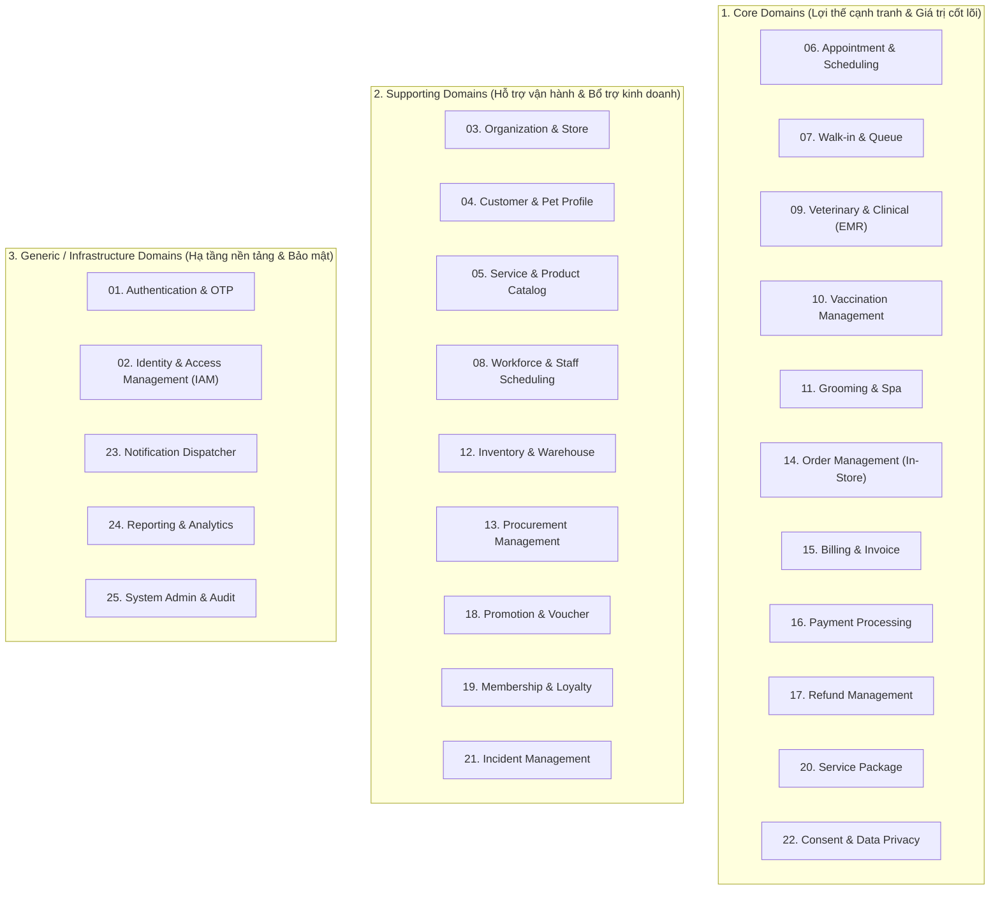

# Pet Care Ecosystem — Domain Model Specification

> **Tài liệu Đặc tả Mô hình Miền (Domain Model)** cho toàn bộ hệ thống Pet Care Ecosystem.
> **Nguồn chân lý nghiệp vụ (Source of Truth):** `docs/01-business-operations.md`.
> **Tài liệu bổ trợ đồng bộ:** `docs/02-business-rules.md` (Business Rules & Invariants), `docs/03-state-machines.md` (FSM & Event Bridges), `docs/04-glossary.md` (Ubiquitous Language & RBAC).
> **Nguyên tắc thiết kế:** Domain-Driven Design (DDD) chuẩn mực, phân định rõ Bounded Contexts, Aggregates, Aggregate Roots, Entities, Value Objects, Domain Commands, Domain Events, Lifecycle States và Business Invariants.

---

# 1. Khóa Quyết định Kiến trúc Toàn cục (Architectural Decision Locks)

Toàn bộ mô hình miền được xây dựng dựa trên 4 Khóa Kiến trúc Cốt lõi đã được phê duyệt:

1. **D-01 — Tính Bất biến Tất toán Hóa đơn (Settlement Immutability):**
   Hóa đơn (`Invoice`) sau khi đã chuyển sang trạng thái `PAID` là BẤT BIẾN (không bao giờ chuyển sang `REFUNDED` hay `PARTIALLY_PAID` khi phát sinh hoàn tiền). Mọi khoản tiền hoàn được theo dõi lũy kế qua thuộc tính `total_refunded_amount` và đối soát qua các thực thể `Payment` (`PARTIALLY_REFUNDED` / `REFUNDED`) và `Refund` (`COMPLETED`). Nghiêm cấm `VoidInvoice` đối với hóa đơn đã `PAID`.

2. **D-02 — Giao thức Hóa đơn Phụ phí Độc lập (Surcharge Invoice Protocol):**
   Khi phát sinh chi phí hoặc dịch vụ làm thêm trong quá trình phục vụ Grooming hoặc Khám bệnh (`ConfirmAdditionalService`), hệ thống tự động khởi tạo một Hóa đơn Phụ phí độc lập (`Invoice` với `InvoiceType = SURCHARGE`) đi qua vòng đời `DRAFT -> ISSUED -> PAID`, tuyệt đối không chèn dòng hay sửa đổi hóa đơn gốc ban đầu.

3. **D-03 — Phân định Luồng Hoàn tất Đơn hàng theo Kênh (Order Fulfillment Split):**
   - **Kênh Bán lẻ tại quầy POS (`In-Store Instant Handover`):** Đồng bộ tức thời trong một phiên giao dịch: `PAID -> DELIVERED`, trừ trực tiếp tồn kho thực tế.
   - **Kênh Đặt hàng Online / App (`Staged Fulfillment`):** Quy trình tuần tự đa bước: `PENDING_PAYMENT (Hold TTL 15m) -> PAID -> CONFIRMED -> PROCESSING -> READY -> DELIVERED`.
   - **Trạng thái Kết thúc Đơn hàng (Terminal States):** Hủy trước khi bàn giao chuyển sang `CANCELLED` (kèm hoàn tiền 100% nếu đã thanh toán). Đổi trả 100% sau khi đã nhận hàng (`DELIVERED`) chuyển sang `REFUNDED`. Đổi trả một phần (`Partial Return`) giữ nguyên `DELIVERED` và cập nhật `total_refunded_amount`.

4. **D-04 — Phân cấp Khởi tạo Tài khoản Nhân viên Trực tiếp (Direct Staff Provisioning):**
   Khách hàng tự đăng ký bắt buộc qua xác thực OTP (`PENDING_VERIFICATION -> VerifyOTP -> ACTIVE`). Tài khoản Nhân viên do Quản trị viên khởi tạo được kích hoạt thẳng sang `ACTIVE` với mật khẩu tạm thời (`must_change_password = true`), bỏ qua bước xác thực OTP đăng ký.

---

# 2. Bản đồ Phân rã Miền & Bounded Contexts (Domain Decomposition)

Hệ sinh thái Pet Care được phân rã thành **25 Bounded Contexts** thuộc **3 Nhóm Miền Chính (Domain Categories)** tương ứng 1:1 với 25 Modules nghiệp vụ trong `docs/01-business-operations.md`:

---

# 3. Danh mục Toàn cục: Aggregates, Aggregate Roots & Value Objects

| Mã Module | Bounded Context | Aggregate Root | Thực thể con (Child Entities) | Value Objects (VOs) | Ranh giới Trách nhiệm Nghiệp vụ (Boundary) |
|---|---|---|---|---|---|
| **01** | Authentication & OTP | **Account** | `OtpSession` | `PhoneNumber`, `EmailAddress`, `PasswordHash`, `OtpCode` | Định danh tài khoản, phiên OTP đăng ký và đổi mật khẩu. |
| **02** | IAM & Access Control | **UserAccount** | `RoleAssignment`, `PermissionGrant` | `RoleCode`, `PermissionCode`, `SecurityScope` | 9 Canonical Roles, 5 Scopes (`PLATFORM`, `ORGANIZATION`, `STORE`, `WAREHOUSE`, `CUSTOMER`). |
| **03** | Organization & Store | **Organization**, **Store** | `OperatingHours`, `StoreResource`, `StoreServiceCatalog` | `OrgCode`, `StoreCode`, `TimeWindow`, `CapacityLimit` | Multi-tenancy chuỗi chi nhánh, giờ mở cửa, tài nguyên phòng/bàn. |
| **04** | Customer & Pet Profile | **CustomerProfile**, **Pet** | `PetCaregiverDelegation` | `PetBreed`, `WeightRecord`, `InvitationToken`, `ValidityPeriod` | Hồ sơ khách hàng, thông tin thú cưng, ủy quyền chăm sóc Pet. |
| **05** | Service & Product Catalog | **ServiceMaster**, **ProductMaster** | `ServiceRequiredResource`, `ProductCategory` | `Money`, `DurationMinutes`, `SKU`, `Barcode` | Danh mục sản phẩm, dịch vụ mẫu dùng chung toàn tổ chức. |
| **06** | Appointment & Scheduling | **BookingHold**, **Appointment** | `AppointmentStageHistory` | `TimeSlot`, `HoldTTL`, `CancellationReason`, `AbortReason` | Giữ chỗ 15 phút, đặt lịch hẹn, kiểm tra xung đột lịch 3 chiều. |
| **07** | Walk-in & Queue | **DailyQueue** | `QueueEntry`, `WalkinTicket` | `QueueNumber`, `TriagePriority`, `EstimatedWaitTime` | Xếp hàng chờ tại quầy chi nhánh (FIFO), ưu tiên cấp cứu. |
| **08** | Workforce Management | **StaffWorkSchedule** | `StaffAbsenceRequest`, `ShiftAssignment` | `ShiftWindow`, `AbsenceType`, `AbsenceStatus` | Phân ca kíp nhân sự, quản lý vắng mặt/nghỉ phép. |
| **09** | Veterinary / Clinical (EMR) | **MedicalRecord** | `Diagnosis`, `Prescription`, `PrescriptionItem`, `FollowUpPlan` | `ChiefComplaint`, `Dosage`, `DiagnosticCode`, `TreatmentPlan` | Hồ sơ bệnh án điện tử, chẩn đoán, kê đơn thuốc, tái khám. |
| **10** | Vaccination Management | **VaccineBatch**, **VaccinationRecord** | — | `BatchNumber`, `ExpiryDate`, `DoseVolume`, `NextDueDate` | Quản lý tiêm phòng, trừ kho theo số lô và hạn dùng, nhắc tiêm. |
| **11** | Grooming Management | **GroomingSession** | `GroomingServiceLine`, `HealthInspectionReport` | `InspectionResult`, `GroomingStage`, `AddonServiceDetail` | Quy trình làm đẹp thú cưng, phụ phí phát sinh độc lập, dừng khẩn cấp. |
| **12** | Inventory & Warehouse | **InventoryItem**, **StockTransfer** | `InventoryAdjustment`, `StockTransferLine` | `QuantityAvailable`, `QuantityPhysical`, `QuantityReserved`, `TransitVariance` | Quản lý kho, điều chuyển kho liên chi nhánh, xử lý sai lệch. |
| **13** | Procurement Management | **PurchaseRequest**, **PurchaseOrder** | `PurchaseRequestLine`, `PurchaseOrderLine`, `GoodsReceiptRecord` | `SupplierRef`, `PoNumber`, `ReceivedQuantity`, `DamagedQuantity` | Yêu cầu mua hàng nội bộ, đặt hàng nhà cung cấp, nhập kho. |
| **14** | Order Management (In-Store) | **Order** | `OrderItem`, `FulfillmentStageLog` | `OrderNumber`, `FulfillmentType`, `TotalAmount`, `RefundedAmount` | Đơn hàng bán lẻ POS tại quầy và đơn hàng đặt Online nhận tại quầy. |
| **15** | Billing & Invoice | **Invoice** | `InvoiceItem` | `InvoiceNumber`, `InvoiceType`, `TaxAmount`, `DiscountAmount` | Hóa đơn dịch vụ chuẩn, hóa đơn gói, hóa đơn phụ phí. |
| **16** | Payment Management | **Payment** | - | `TransactionId`, `PaymentMethod`, `IdempotencyKey`, `GatewaySignature` | Xử lý thanh toán tiền mặt, quẹt thẻ POS, cổng trực tuyến (1-1 Invoice). |
| **17** | Refund Management | **Refund** | `RefundExecutionLog` | `RefundReason`, `RefundAmount`, `MakerCheckerVerification` | Yêu cầu hoàn tiền, phê duyệt Maker-Checker, chi tiền hoàn. |
| **18** | Promotion & Voucher | **PromotionCampaign**, **Voucher** | `VoucherUsageRecord` | `DiscountType`, `VoucherCode`, `BudgetCap`, `MinSpend` | Chiến dịch khuyến mãi, mã giảm giá, kiểm tra điều kiện runtime. |
| **19** | Membership & Loyalty | **CustomerMembership** | `LoyaltyPointLedger` | `MembershipTier`, `PointBalance`, `TierBenefit` | Hạng hội viên, tích/tiêu điểm thưởng theo từng Organization. |
| **20** | Package Management | **ServicePackage** | `PackageUsageRecord` | `PackageCode`, `TotalUnits`, `RemainingUnits`, `ValidityPeriod` | Gói dịch vụ trả trước nhiều lượt, cấn trừ và hoàn trả lượt. |
| **21** | Incident Management | **IncidentReport** | `IncidentInvestigation`, `CorrectiveActionLog` | `IncidentSeverity`, `IncidentCategory`, `ResolutionSummary` | Ghi nhận và xử lý sự cố y tế, sự cố spa và vượt quyền cấp cứu. |
| **22** | Consent & Data Privacy | **ClinicalConsent** | `CrossStoreConsentGrant` | `ConsentType`, `ConsentScope`, `OtpToken`, `ConsentTTL` | Quản lý đồng thuận chia sẻ bệnh án liên Store (OTP & Break-Glass). |
| **23** | Notification Management | **NotificationTask** | `NotificationDeliveryLog` | `NotificationChannel`, `TemplateCode`, `NotificationStatus` | Điều phối gửi thông báo đa kênh (SMS, Email, Push, Zalo ZNS). |
| **24** | Reporting & Analytics | **AnalyticsReport** | `ReportMetricData` | `DateRange`, `RevenueMetric`, `OccupancyRate` | Báo cáo doanh thu, tồn kho, công suất phòng khám chi nhánh. |
| **25** | System Admin & Audit | **SystemAuditLog**, **TenantConfig** | `AuditRecord` | `AuditAction`, `ClientIp`, `UserAgent`, `EntitySnapshot` | Nhật ký kiểm toán bảo mật bất biến, cấu hình hệ thống toàn cục. |

---
# 4. Đặc tả Chi tiết Mô hình Miền theo 25 Phân hệ Nghiệp vụ

---

## 4.1. Module 01: Authentication & OTP
- **Phạm vi Bounded Context:** Quản lý danh tính đăng nhập, phiên xác thực OTP và bảo mật mật khẩu.
- **Aggregate Root:** `Account`
- **Child Entities:** `OtpSession` (gắn với số điện thoại hoặc tài khoản)
- **Value Objects:**
  - `PhoneNumber`: Chuỗi định dạng chuẩn số điện thoại di động (10 chữ số).
  - `EmailAddress`: Định dạng email hợp lệ.
  - `PasswordHash`: Chuỗi băm BCrypt.
  - `OtpCode`: Mã số gồm 6 chữ số ngẫu nhiên, có thời hạn hiệu lực `OTP_TTL = 300s`.
  - `AccountStatus`: Enum `[PENDING_VERIFICATION, ACTIVE, LOCKED, DEACTIVATED]`.
- **Commands (docs/01-business-operations.md):**
  - `RegisterAccount` [Customer]
  - `SendRegistrationOTP` [System]
  - `ResendOTP` [Customer]
  - `VerifyOTP` [Customer]
  - `CreateStaff` [Platform Admin / Org Admin] (D-04 Direct Provisioning)
  - `CheckOTP` [System]
  - `ExpireOTP` [System]
  - `Login` [Customer / Staff]
  - `Logout` [Customer / Staff]
- **Domain Events (docs/03-state-machines.md):**
  - `AccountRegistered` (payload: `accountId`, `phone`, `otpId`)
  - `AccountActivated` (payload: `accountId`, `activatedAt`)
  - `AccountLocked` (payload: `accountId`, `reason`)
  - `AccountUnlocked` (payload: `accountId`, `unlockedBy`)
  - `AccountDeactivated` (payload: `accountId`, `deactivatedAt`)
  - `AccountReactivated` (payload: `accountId`, `reactivatedAt`)
- **State Machine Lifecycle (FSM 1 - docs/03-state-machines.md#1):**
  - Khách hàng: `[*] -> PENDING_VERIFICATION -> ACTIVE -> LOCKED / DEACTIVATED`.
  - Nhân viên (D-04): `[*] -> ACTIVE -> LOCKED / DEACTIVATED`.
- **Business Invariants (docs/02-business-rules.md):**
  - `RULE-01-01`: Điều kiện tiên quyết đăng nhập — Account chỉ đăng nhập được khi `Credentials` hợp lệ và đang ở trạng thái `ACTIVE`.
  - `RULE-01-02`: OTP hết hạn sau 300 giây; nhập sai quá 5 lần sẽ khóa phiên xác thực 15 phút.
  - `RULE-01-03`: Tài khoản Staff tạo trực tiếp được kích hoạt `ACTIVE` ngay, gán cờ `must_change_password = true`.
  - `RULE-01-09` (bổ sung Phase 4): Mật khẩu tối thiểu 8 ký tự; không ép độ phức tạp bổ sung hay đổi định kỳ.
  - `RULE-01-10` (bổ sung Phase 5, đóng CONTRADICTION-02/ORPHAN-01; **sửa 2026-09-13**: đổi danh tính chính từ `phone` sang `email` — xem Decision Log `docs/02-business-rules.md` mục 01): Email (`accounts.email`) là danh tính đăng nhập chính, bắt buộc và duy nhất trên **toàn nền tảng** (Scope `PLATFORM`); số điện thoại (`accounts.phone`, khi có) vẫn duy nhất nhưng không còn bắt buộc, chỉ là liên hệ tùy chọn. Một Account có thể tương tác với nhiều Organization độc lập; không mâu thuẫn với cách ly dữ liệu vận hành 100% theo Organization (`RULE-02-01`, `RULE-03-01`, vốn áp dụng cho dữ liệu vận hành chứ không phải danh tính đăng nhập).

---

## 4.2. Module 02: Identity & Access Management (IAM)
- **Phạm vi Bounded Context:** Kiểm soát truy cập, quản lý phân quyền theo vai trò (RBAC) và phân cấp phạm vi (5 Scopes).
- **Aggregate Root:** `UserAccount`
- **Child Entities:** `RoleAssignment`, `PermissionGrant`
- **Value Objects:**
  - `SecurityScope`: `[PLATFORM, ORGANIZATION, STORE, WAREHOUSE, CUSTOMER]`.
  - `UserRole`: `[SUPER_ADMIN, ORGANIZATION_ADMIN, STORE_MANAGER, RECEPTIONIST, VETERINARIAN, GROOMER, INVENTORY_STAFF, FINANCE_STAFF, CUSTOMER]`.
  - `PermissionCode`: Mã quyền chuẩn hóa (ví dụ: `REFUND_APPROVE`, `STOCK_TRANSFER_SHIP`, `EMR_EMERGENCY_OVERRIDE`).
- **Commands (docs/01-business-operations.md):**
  - `ManageUser`, `ManageRole`, `AssignPermission`, `ManagePermission`, `LockAccount`, `UnlockAccount`, `DeactivateAccount`, `ReactivateAccount`, `ManageCustomerProfile`
- **Domain Events:**
  - `PermissionAssigned`, `AccountLocked`, `AccountUnlocked`
- **Business Invariants (docs/02-business-rules.md):**
  - `RULE-02-01`: Thực thi ranh giới 5 Scopes nghiêm ngặt; từ chối quyền ngoài Scope với mã lỗi `ACCESS_DENIED_SCOPE_MISMATCH`.
  - `RULE-02-02`: Role chỉ có hiệu lực trong phạm vi quản lý hợp lệ của người được gán.
  - `RULE-02-04`, `RULE-02-07`: Khi tài khoản bị `LOCKED` hoặc `DEACTIVATED`, lập tức thu hồi toàn bộ JWT Access Token và Session vào Blacklist.

---

## 4.3. Module 03: Organization & Store Management
- **Phạm vi Bounded Context:** Quản trị tổ chức đa chi nhánh (Multi-Tenancy), cấu hình Store, giờ mở cửa và tài nguyên vật chất.
- **Aggregate Root:** `Organization`, `Store`
- **Child Entities:** `OperatingHours`, `StoreResource`, `StoreServiceCatalog`, `OrganizationPolicy`, `StorePolicy`
- **Value Objects:**
  - `StoreStatus`: `[DRAFT, ACTIVE, SUSPENDED, DEACTIVATED, ARCHIVED]`.
  - `ResourceType`: `[CLINIC_ROOM, GROOMING_TABLE, ULTRASOUND_MACHINE, XRAY_MACHINE]`.
  - `TimeWindow`: Khung giờ mở/đóng (`open_time`, `close_time`, `is_closed`).
  - `SecurityFrameworkLevel`: `[STANDARD, ENHANCED, STRICT]`.
  - `SurchargeType`: `[PERCENTAGE, FIXED_AMOUNT]` — kiểu phụ thu tại quầy của `StorePolicy` (RULE-03-10).
- **Commands (docs/01-business-operations.md):**
  - `CreateOrganization`, `UpdateOrganization`, `CreateStore`, `UpdateStore`, `ActivateStore`, `SuspendStore`, `DeactivateStore`, `ArchiveStore`, `ConfigureOperatingHour`, `ConfigureStoreResource`, `ManageOrganizationPolicy`, `ConfigureStorePolicy`
- **Domain Events (docs/03-state-machines.md):**
  - `StoreCreated`, `StoreActivated`, `StoreSuspended`, `StoreDeactivated`, `StoreArchived`
- **State Machine Lifecycle (FSM 2 - docs/03-state-machines.md#2):**
  - `[*] -> DRAFT -> ACTIVE <-> SUSPENDED / DEACTIVATED -> ARCHIVED`.
- **Business Invariants (docs/02-business-rules.md):**
  - `RULE-03-01`: Mỗi Store thuộc đúng 1 Organization cha duy nhất; cách ly dữ liệu 100% giữa các Organization.
  - `RULE-03-02`: Store tạo mới ở `DRAFT`, chỉ chuyển sang `ACTIVE` khi đã cấu hình đầy đủ Giờ mở cửa, Tài nguyên và Danh mục dịch vụ.
  - `RULE-03-03`: Phân cấp và kế thừa chính sách — `OrganizationPolicy` áp dụng bắt buộc cho toàn bộ Store trực thuộc; `StorePolicy` chỉ có hiệu lực trong phạm vi Store đó và không được mâu thuẫn với `OrganizationPolicy`.
  - `RULE-03-06`: Lệnh `ArchiveStore` chỉ thực thi khi thỏa mãn đồng thời 4 điều kiện: 0 đơn hàng active, 0 lịch hẹn active, 0 tồn kho thực tế, 0 công nợ/yêu cầu hoàn tiền mở. Sau khi Archive, dữ liệu cấu hình con trở thành bất biến chỉ đọc (bổ sung Phase 4, đóng `GAP-ORG-01`).
  - `RULE-03-07`: Toàn bộ `Appointment`/Walk-in bắt buộc nằm trong khung giờ hoạt động hợp lệ (`OperatingHours`) đã cấu hình của Store.
  - `RULE-03-08`: Tổng số lượng lịch hẹn/lượt phục vụ đồng thời trong cùng khung thời gian không được vượt quá định mức công suất tối đa của từng loại `StoreResource`.
  - `RULE-03-09`: `OrganizationPolicy` (`refundWindowDays`, `refundRequiresApproval`, `dataRetentionDays`, `securityFrameworkLevel`) — đúng 1 bản ghi hiện hành/Organization, không versioning riêng (lịch sử qua `audit_logs`).
  - `RULE-03-10`: `StorePolicy` (`surchargeEnabled`, `surchargeType`, `surchargeValue`) — đúng 1 bản ghi hiện hành/Store, không versioning riêng (lịch sử qua `audit_logs`); không bao gồm giờ mở cửa (`OperatingHours`/RULE-03-07) hay ca kíp nhân sự (ngoài phạm vi — Module 08).

---

## 4.4. Module 04: Customer & Pet Management
- **Phạm vi Bounded Context:** Hồ sơ chủ nuôi, lý lịch thú cưng và cơ chế phân quyền ủy quyền chăm sóc (ReBAC).
- **Aggregate Root:** `CustomerProfile`, `Pet`
- **Child Entities:** `PetCaregiverDelegation`
- **Value Objects:**
  - `CaregiverStatus`: `[INVITED, ACTIVE, REJECTED, EXPIRED, REVOKED]`.
  - `PetSpecies`: `[DOG, CAT, BIRD, OTHER]`.
  - `PetStatus`: `[ACTIVE, DECEASED, TRANSFERRED]` — Terminal: `DECEASED`, `TRANSFERRED` (`RULE-04-11`).
  - `InvitationToken`: Token xác thực lời mời ủy quyền, có thời hạn hiệu lực 7 ngày (TTL = 7d).
- **Commands (docs/01-business-operations.md):**
  - `ManageCustomerProfile`, `AddPet`, `UpdatePet`, `ViewPet`, `ManagePetOwnership`, `InviteCaregiver`, `AcceptCaregiverInvitation`, `RejectCaregiverInvitation`, `RevokeCaregiver`, `ProcessInvitationExpiry`, `ProcessDelegationExpiry`, `PerformDelegatedAction`, `SearchCustomerPet`
- **Domain Events (docs/03-state-machines.md):**
  - `PetAdded`, `CaregiverInvited`, `CaregiverInvitationAccepted`, `CaregiverInvitationRejected`, `CaregiverInvitationExpired`, `CaregiverRevoked`, `CaregiverDelegationExpired`
- **State Machine Lifecycle (FSM 3 - docs/03-state-machines.md#3):**
  - `[*] -> INVITED -> ACTIVE / REJECTED / EXPIRED`; `ACTIVE -> REVOKED / EXPIRED`.
- **Business Invariants (docs/02-business-rules.md):**
  - `RULE-04-04`, `RULE-04-08`: Duy nhất Primary Owner có quyền mời/hủy Caregiver, ký phẫu thuật lớn hoặc xóa Pet. Caregiver không được mời thêm người khác.
  - `RULE-04-05`: Lời mời ủy quyền hết hạn sau 7 ngày nếu không được chấp thuận.
  - `RULE-04-11`: `PetStatus` là `ACTIVE` mặc định; chuyển `DECEASED` khi thú cưng qua đời hoặc `TRANSFERRED` khi rời hoàn toàn hệ sinh thái (khác với chuyển chủ sở hữu nội bộ theo `RULE-04-10`, vẫn giữ `ACTIVE`). Cả hai là Terminal, chặn `BookAppointment`/`RegisterQueueEntry`/`PurchasePackage` mới.

---

## 4.5. Module 05: Service & Product Catalog
- **Phạm vi Bounded Context:** Quản lý danh mục sản phẩm/dịch vụ gốc ở cấp Organization và bản ghi override giá/khả dụng riêng theo từng Store.
- **Aggregate Root:** `ServiceMaster`, `ProductMaster` (sở hữu bởi Organization) — `StoreServiceOverride`, `StoreProductOverride` (sở hữu bởi Store, tham chiếu tới `ServiceMaster`/`ProductMaster`)
- **Child Entities:** `ServiceRequiredResource`, `ProductCategory`
- **Value Objects:**
  - `Money`: Số tiền và đơn vị tiền tệ (`VND`).
  - `DurationMinutes`: Thời lượng phục vụ định mức (phút).
  - `SKU`, `Barcode`: Mã định danh hàng hóa duy nhất.
  - `ProductPrice`, `ServicePrice`: Giá override riêng theo từng Store (`store_products.price`, `store_services.price`); khi chưa override thì kế thừa `base_price` của Organization.
  - `ServiceAvailability`: Trạng thái khả dụng override riêng theo từng Store (`store_services.is_active`).
- **Commands (docs/01-business-operations.md):**
  - `ManageProduct` (Organization Admin: tạo, sửa, vô hiệu hóa Product gốc — không hard-delete nếu đã phát sinh giao dịch, `RULE-05-02`)
  - `ManageService` (Organization Admin: tạo, sửa, đổi trạng thái Service gốc của Organization)
  - `ConfigureServiceAvailability`, `ConfigureServicePrice`, `ConfigureProductPrice` (Store Manager ghi đè giá/khả dụng riêng tại Store)
  - `ViewProduct`, `ViewService` (Customer tra cứu danh mục đang `ACTIVE`)
- **Domain Events:**
  - `ServiceCreated`, `ServiceUpdated`, `ProductCreated`, `StoreProductPriceConfigured`, `StoreServiceAvailabilityConfigured`
- **Business Invariants (docs/02-business-rules.md):**
  - `RULE-05-01` → `RULE-05-07`: Organization sở hữu toàn quyền danh mục sản phẩm/dịch vụ gốc (không có tầng gatekeeper Platform); mỗi Product thuộc đúng một Organization (`UNIQUE(organization_id, sku)`); Store chỉ override giá/khả dụng riêng qua `store_products`/`store_services`, được khởi tạo tự động kế thừa giá trị gốc khi Store chuyển `ACTIVE`.

---

## 4.6. Module 06: Appointment & Scheduling
- **Phạm vi Bounded Context:** Đặt lịch hẹn khám/grooming, khóa giữ chỗ tài nguyên 15 phút, giải quyết xung đột lịch 3 chiều.
- **Aggregate Root:**
  1. `BookingHold` (aggregate quản lý phiên giữ chỗ 15m)
  2. `Appointment` (aggregate quản lý vòng đời cuộc hẹn chính thức)
- **Child Entities:** `AppointmentStageHistory`
- **Value Objects:**
  - `BookingHoldStatus`: `[HOLDING, CONFIRMED, RELEASED, EXPIRED]`.
  - `AppointmentStatus`: `[BOOKED, CONFIRMED, CHECKED_IN, IN_PROGRESS, COMPLETED, CANCELLED, NO_SHOW, ABORTED]`.
  - `TimeSlot`: Khoảng thời gian [T_start, T_end).
  - `HoldTTL = 900s` (15 phút).
- **Commands (docs/01-business-operations.md):**
  - `HoldSlot`, `ReleaseHold`, `ExpireHold`, `BookAppointment`, `ConfirmAppointment`, `CheckInAppointment`, `StartAppointmentService`, `CheckOutAppointment`, `RescheduleAppointment`, `CancelAppointment`, `MarkNoShow`, `AbortAppointment`
- **Domain Events (docs/03-state-machines.md):**
  - `SlotHeld`, `HoldReleased`, `HoldExpired`, `AppointmentBooked`, `AppointmentConfirmed`, `AppointmentCheckedIn`, `AppointmentStarted`, `AppointmentCompleted`, `AppointmentRescheduled`, `AppointmentCancelled`, `AppointmentNoShow`, `AppointmentAborted`
- **State Machine Lifecycle (FSM 4.1 & FSM 4.2 - docs/03-state-machines.md#4):**
  - BookingHold: `[*] -> HOLDING -> CONFIRMED / RELEASED / EXPIRED`.
  - Appointment: `[*] -> BOOKED -> CONFIRMED -> CHECKED_IN -> IN_PROGRESS -> COMPLETED`; Hủy: `CANCELLED`, Vắng mặt: `NO_SHOW`, Dừng khẩn cấp: `ABORTED`.
- **Business Invariants (docs/02-business-rules.md):**
  - `RULE-06-04`: Đổi lịch nguyên tử (Atomic Reschedule Guard) — khóa slot mới thành công mới giải phóng slot cũ; rollback toàn phần nếu thất bại.
  - `RULE-06-06`: Nghiêm cấm nhảy tắt `CHECKED_IN -> COMPLETED` mà không qua `IN_PROGRESS`.
  - `RULE-06-08`, `RULE-21-01`: `AbortAppointment` bắt buộc có lý do dừng, tự động lập biên bản sự cố y tế (`ClinicalIncident` `CRITICAL`) và kích hoạt yêu cầu hoàn tiền phần dịch vụ chưa thực hiện.
  - `RULE-06-10`, `RULE-06-11`: Triple Collision Guard — không trùng lịch giữa Pet, Nhân sự và Tài nguyên phòng/bàn.

---

## 4.7. Module 07: Walk-in & Queue Management
- **Phạm vi Bounded Context:** Tiếp đón khách vãng lai không đặt trước, cấp số thứ tự FIFO và điều phối phòng phục vụ.
- **Aggregate Root:** `DailyQueue`
- **Child Entities:** `QueueEntry`, `WalkinTicket`
- **Value Objects:**
  - `QueueEntryStatus`: `[WAITING, CALLED, IN_SERVICE, COMPLETED, CANCELLED, NO_SHOW]`.
  - `TriagePriority`: `[NORMAL, URGENT, TRIAGE_EMERGENCY]`.
- **Commands (docs/01-business-operations.md):**
  - `RegisterQueueEntry`, `CallQueueEntry`, `StartQueueService`, `CompleteQueueEntry`, `CancelQueueEntry`, `MarkQueueNoShow`, `CoordinateQueue`, `ManageQueueOrder`, `SendTurnNotification`
- **Domain Events (docs/03-state-machines.md):**
  - `QueueEntryRegistered`, `QueueEntryCalled`, `QueueServiceStarted`, `QueueEntryCompleted`, `QueueEntryCancelled`, `QueueEntryNoShow`
- **State Machine Lifecycle (FSM 17 - docs/03-state-machines.md#17):**
  - `[*] -> WAITING -> CALLED -> IN_SERVICE -> COMPLETED`; Hủy: `CANCELLED`, Vắng mặt: `NO_SHOW`.
- **Business Invariants (docs/02-business-rules.md):**
  - `RULE-07-02`: Thứ tự phục vụ FIFO theo thời gian đăng ký; ca cấp cứu (`TRIAGE_EMERGENCY`) được ưu tiên cao nhất, bypass hàng đợi.
  - `RULE-07-05`: **Walk-in to Appointment Lifecycle Bridge** — Lệnh `StartQueueService` tự động kích hoạt tạo bản ghi `Appointment` nội bộ (`Channel = WALK_IN`, `Status = IN_PROGRESS`).
  - `RULE-07-06`: Quá 3 lần gọi không có mặt chuyển sang `NO_SHOW`.

---

## 4.8. Module 08: Workforce Management
- **Phạm vi Bounded Context:** Quản trị lịch trực ca, phân công nhân sự tại Store chi nhánh và duyệt đơn nghỉ phép.
- **Aggregate Root:** `StaffWorkSchedule`
- **Child Entities:** `StaffAbsenceRequest`, `ShiftAssignment`
- **Value Objects:**
  - `ShiftWindow`: Thời gian bắt đầu và kết thúc ca làm việc.
  - `AbsenceType`: `[SICK, VACATION, UNPAID]`.
  - `AbsenceStatus`: `[PENDING, APPROVED, REJECTED]`.
- **Commands (docs/01-business-operations.md):**
  - `ManageStaff`, `CreateStaff`, `UpdateStaff`, `AssignStaffToStore`, `ManageWorkSchedule`, `ManageLeave`, `HandleStaffAbsence`, `AssignStaffReplacement`, `ViewWorkSchedule`
- **Domain Events:**
  - `StaffAssignedToStore`, `WorkScheduleAssigned`, `LeaveApproved`, `LeaveRejected`, `StaffAbsenceRecorded`
- **Business Invariants (docs/02-business-rules.md):**
  - `RULE-08-01`, `RULE-08-03`: Nhân viên chỉ được phân công ca trực tại Store trực thuộc; không cho phép trùng ca trực giữa các Store.
---

## 4.9. Module 09: Veterinary / Clinical Management (EMR)
- **Phạm vi Bounded Context:** Hồ sơ bệnh án điện tử (EMR), khám lâm sàng, chẩn đoán, kê đơn thuốc và tái khám.
- **Aggregate Root:** `MedicalRecord`
- **Child Entities:** `Diagnosis`, `Treatment` (bổ sung bảng riêng ở Phase 4, đóng `GAP-CLN-02`), `Prescription`, `PrescriptionItem`, `FollowUpPlan`
- **Value Objects:**
  - `ChiefComplaint`: Triệu chứng ban đầu khi nhập viện.
  - `DiagnosticCode`: Mã danh mục bệnh học.
  - `DosageInstruction`: Liều lượng, tần suất, thời gian dùng thuốc.
  - `MedicalRecordStatus`: Enum `[DRAFT, FINALIZED, LOCKED]` — vòng đời chỉnh sửa của bệnh án (`RULE-09-09`).
- **Commands (docs/01-business-operations.md):**
  - `ExaminePet`, `RecordSymptom`, `RecordExaminationResult`, `DiagnosePet`, `CreateTreatment`, `CreatePrescription`, `CreateMedicalRecord`, `UpdateMedicalRecord`, `ViewMedicalHistory`, `CreateFollowUp`, `EmergencyOverrideAccess`, `LockMedicalRecord` [System]
- **Domain Events (docs/03-state-machines.md):**
  - `MedicalRecordCreated`, `MedicalRecordUpdated`, `MedicalRecordFinalized`, `MedicalRecordLocked`, `PrescriptionCreated`, `TreatmentCreated`, `FollowUpScheduled`, `EmergencyAccessOverridden`
- **Business Invariants (docs/02-business-rules.md):**
  - `RULE-09-02`, `RULE-21-02`: Break-Glass Emergency Override — Truy cập khẩn cấp EMR liên chi nhánh tự động lập biên bản sự cố `ClinicalIncident` (`CRITICAL`), ghi nhật ký `audit_logs` và gửi cảnh báo khẩn cấp tức thì.
  - `RULE-09-06`: Bác sĩ thú y có trách nhiệm lập lịch tái khám (`CreateFollowUp`) cho Pet sau đợt điều trị; hệ thống tự động ghi vào lịch theo dõi của Pet và gửi thông báo nhắc hẹn trước ngày tái khám.
  - `RULE-09-08`: Phân định ranh giới bệnh án EMR (`MedicalRecord`) vs hồ sơ tiêm phòng định kỳ (`VaccinationRecord`) — chỉ tiêm vaccine điều trị bệnh lý (Therapeutic Vaccination) mới bắt buộc gắn với `MedicalRecord`/`Treatment`.
  - `RULE-09-09`: Bệnh án tự động chốt phiên (`FINALIZED`) khi lịch hẹn liên kết `CheckOutAppointment`; trong 24h tiếp theo vẫn chỉnh sửa được nhưng phải ghi `AuditLog`; sau 24h hệ thống tự động khóa bất biến (`LOCKED`, `LockMedicalRecord`), tuyệt đối không còn chỉnh sửa được.

---

## 4.10. Module 10: Vaccination Management
- **Phạm vi Bounded Context:** Quản lý tiêm phòng, trừ kho vaccine theo lô/hạn dùng (FEFO) và tự động nhắc lịch mũi kế tiếp.
- **Aggregate Root:** `VaccineBatch`, `VaccinationRecord`
- **Child Entities:** — (sửa Phase 5 Final Audit: `VaccinationSchedule` không phải Entity riêng có bảng vật lý — được hiện thực qua `vaccinations.next_due_date` của mũi tiêm gần nhất; xem `docs/06-erd.md`)
- **Value Objects:**
  - `BatchNumber`: Số lô sản xuất duy nhất của vaccine.
  - `ExpiryDate`: Hạn sử dụng.
  - `VaccineScheduleStatus`: `[SCHEDULED, COMPLETED, OVERDUE, CANCELLED]`.
- **Commands (docs/01-business-operations.md):**
  - `CheckVaccinationSchedule`, `AdministerVaccine`, `RecordVaccination`, `ScheduleNextVaccination`, `ManageVaccine`, `ManageVaccineBatch`, `ManageVaccineExpiry`, `SendVaccineReminder`
- **Domain Events (docs/03-state-machines.md):**
  - `VaccineAdministered`, `VaccinationRecorded`, `NextVaccinationScheduled`, `VaccineReminderSent`, `VaccineBatchExpired`
- **Business Invariants (docs/02-business-rules.md):**
  - `RULE-10-02`, `RULE-12-11`: Khấu trừ tồn kho vaccine chính xác theo số lô (`batch_number`) theo nguyên tắc Hết hạn trước - Xuất trước (FEFO).
  - `RULE-10-04`: Tự động lập lịch tiêm nhắc mũi tiếp theo (`VaccinationSchedule`) sau khi hoàn tất tiêm phòng.

---

## 4.11. Module 11: Grooming Management
- **Phạm vi Bounded Context:** Dịch vụ spa, làm đẹp thú cưng, kiểm tra thể trạng tiền phục vụ và xử lý phụ phí phát sinh độc lập.
- **Aggregate Root:** `GroomingSession`
- **Child Entities:** `GroomingServiceLine`, `HealthInspectionReport`
- **Value Objects:**
  - `GroomingStatus`: `[WAITING, IN_PROGRESS, AWAITING_CUSTOMER_APPROVAL, COMPLETED, CANCELLED, ABORTED, REJECTED]`.
  - `AddonServiceDetail`: Tên dịch vụ phát sinh, đơn giá phụ thu và ghi chú tình trạng lông/da.
- **Commands (docs/01-business-operations.md):**
  - `CheckInGrooming`, `InspectPet`, `PerformGrooming`, `AddGroomingService`, `ConfirmAdditionalService`, `RejectAdditionalService`, `UpdateGroomingResult`, `CompleteGrooming`, `AbortGrooming`, `CancelGrooming`
- **Domain Events (docs/03-state-machines.md):**
  - `GroomingCheckedIn`, `GroomingStarted`, `GroomingRejected`, `AdditionalServiceRequested`, `AdditionalServiceConfirmed`, `AdditionalServiceRejected`, `GroomingCompleted`, `GroomingAborted`, `GroomingCancelled`
- **State Machine Lifecycle (FSM 15 - docs/03-state-machines.md#15):**
  - `[*] -> WAITING -> IN_PROGRESS -> COMPLETED`; Phát sinh phụ phí: `IN_PROGRESS -> AWAITING_CUSTOMER_APPROVAL -> IN_PROGRESS`; Dừng: `ABORTED`, Từ chối: `REJECTED`, Hủy: `CANCELLED`.
- **Business Invariants (docs/02-business-rules.md):**
  - `RULE-11-02`: Kiểm tra thể trạng trước khi lên bàn grooming (`InspectPet`); nếu có bệnh truyền nhiễm hoặc quá hung dữ -> chuyển trạng thái kết thúc `REJECTED`.
  - `RULE-11-03`: **Surcharge Invoice Protocol (D-02)** — Khi khách duyệt dịch vụ phát sinh (`ConfirmAdditionalService`), tạo một Hóa đơn Phụ phí độc lập (`Surcharge Invoice`), tuyệt đối không sửa hóa đơn gốc đã thanh toán (Settlement Immutability D-01).
  - `RULE-11-06`, `RULE-21-03`: `AbortGrooming` tự động lập biên bản sự cố `GroomingIncident` (`HIGH`), giải phóng bàn spa và kích hoạt hoàn tiền phần chưa làm.

---

## 4.12. Module 12: Inventory & Warehouse Management
- **Phạm vi Bounded Context:** Quản trị tồn kho tại Store/Warehouse, chuyển kho 2 bước liên chi nhánh và cân bằng sai lệch hao hụt.
- **Aggregate Root:** `InventoryItem`, `StockTransfer`
- **Child Entities:** `InventoryAdjustment`, `InventoryBatch` (V15 — chi tiết theo lô cho
  `RULE-12-11` FEFO, xem `docs/06-erd.md` §3.5 bảng `inventory_batches`), `StockTransferLine`
- **Value Objects:**
  - `StockTransferStatus`: `[REQUESTED, APPROVED, REJECTED, CANCELLED, IN_TRANSIT, DISCREPANCY_RECORDED, RECEIVED]`.
  - `AdjustmentReason`: `[DAMAGE, EXPIRY, THEFT, COUNT_VARIANCE, TRANSIT_VARIANCE]`.
  - `QuantityAvailable`, `QuantityPhysical`, `QuantityReserved`.
- **Commands (docs/01-business-operations.md):**
  - `ReceiveInventory`, `IssueInventory`, `TrackInventory`, `AdjustInventory`, `ApproveInventoryAdjustment`, `CountInventory`, `CreateStockTransfer`, `ApproveStockTransfer`, `RejectStockTransfer`, `CancelStockTransfer`, `ShipStockTransfer`, `ReceiveStockTransfer`, `ReceiveStockTransferWithDiscrepancy`, `ResolveStockTransferDiscrepancy`, `TrackBatch`, `TrackExpiry`, `TriggerLowStockAlert`
- **Domain Events (docs/03-state-machines.md):**
  - `InventoryAdjusted`, `LowStockAlertTriggered` (docs/04-glossary.md — `TriggerLowStockAlert`,
    background job side-effect, không có endpoint riêng), `StockTransferCreated`,
    `StockTransferApproved`, `StockTransferShipped`, `StockTransferReceived`,
    `StockTransferDiscrepancyReported`, `StockTransferDiscrepancyResolved`
- **State Machine Lifecycle (FSM 11 - docs/03-state-machines.md#11):**
  - `[*] -> REQUESTED -> APPROVED -> IN_TRANSIT -> RECEIVED / DISCREPANCY_RECORDED`; `DISCREPANCY_RECORDED -> RECEIVED` (sau khi duyệt điều chỉnh kho).
- **Business Invariants (docs/02-business-rules.md):**
  - `RULE-12-01`: Tồn kho theo dõi/phân bổ riêng biệt theo từng Store/Warehouse, cách ly tuyệt
    đối giữa các Organization (Multi-Tenancy Isolation).
  - `RULE-12-02`: Phiếu điều chỉnh (`InventoryAdjustment`) phải gắn Store/Warehouse và lý do hợp
    lệ (`DAMAGE`/`EXPIRY`/`THEFT`/`COUNT_VARIANCE`/`TRANSIT_VARIANCE`).
  - `RULE-12-03`, `RULE-12-06`: Maker-Checker bắt buộc cho Điều chỉnh kho và Chuyển kho (`created_by != approved_by`).
  - `RULE-12-11`: FEFO — biến động hàng hóa quản lý theo `batch_number`/`manufacture_date`/
    `expiry_date` (`InventoryBatch`); xuất kho ưu tiên lô hết hạn sớm nhất trước.
  - `RULE-12-12`: `TriggerLowStockAlert` — cảnh báo tự động khi `AvailableQuantity ≤
    min_stock_level`; side-effect edge-triggered trong Receive/Issue/ApproveInventoryAdjustment
    (không phải endpoint riêng, xem `docs/api/inventory-v1.md` "Đóng băng phạm vi").
  - `RULE-12-07`: Vòng đời chuyển kho 2 bước — hàng `IN_TRANSIT` bị trừ khỏi kho xuất nhưng chưa cộng vào kho nhận cho đến khi xác nhận thực tế.
  - `RULE-12-08`, `RULE-12-09`: **Phương trình Cân bằng Sai lệch Chuyển kho:**
    $$\text{ShippedQuantity} = \text{ReceivedQuantity} + \text{DamagedQuantity} + \text{LostQuantity}$$
    Điểm nhận nhập kho ngay phần nguyên vẹn, cách ly phần hư hại (`DAMAGED_STOCK`), hạch toán phần thất thoát và lập phiếu `InventoryAdjustment` (`TRANSIT_VARIANCE`) trước khi đóng phiếu chuyển kho.

---

## 4.13. Module 13: Procurement Management
- **Phạm vi Bounded Context:** Quản lý quy trình mua hàng bổ sung tồn kho từ Nhà cung cấp (Supplier) từ Purchase Request đến Purchase Order.
- **Aggregate Root:** `PurchaseRequest`, `PurchaseOrder`, `Supplier` (bổ sung Aggregate Root riêng ở Phase 4, thay thế trường tự do `supplier_name` — đóng `GAP-PRC-01`)
- **Child Entities:** `PurchaseRequestLine`, `PurchaseOrderLine`, `GoodsReceiptRecord`
- **Value Objects:**
  - `PurchaseRequestStatus`: `[DRAFT, SUBMITTED, APPROVED, REJECTED, CANCELLED]`.
  - `PurchaseOrderStatus`: `[ISSUED, PARTIALLY_RECEIVED, RECEIVED, CLOSED, CANCELLED]`.
  - `SupplierStatus`: `[ACTIVE, INACTIVE]` — chỉ Supplier `ACTIVE` mới được gắn vào Purchase Order mới (`RULE-13-04`).
- **Commands (docs/01-business-operations.md):**
  - `CreatePurchaseRequest`, `SubmitPurchaseRequest`, `ApprovePurchaseRequest`, `RejectPurchaseRequest`, `CancelPurchaseRequest`, `CreatePurchaseOrder`, `ReceiveGoods`, `InspectGoods`, `CancelPurchaseOrder`, `CancelRemainingPurchaseOrder`, `ManageSupplier`
- **Domain Events (docs/03-state-machines.md):**
  - `PurchaseRequestCreated`, `PurchaseRequestSubmitted`, `PurchaseRequestApproved`,
    `PurchaseRequestRejected`, `PurchaseRequestCancelled`, `PurchaseOrderCreated`, `GoodsReceived`,
    `PurchaseOrderRemainingCancelled`, `PurchaseOrderCancelled`, `SupplierCreated`, `SupplierUpdated`
    (2 event Supplier cuối KHÔNG có trong Domain Event Catalog docs/04-glossary.md — bổ sung đối
    xứng cho `ManageSupplier` CRUD, cùng tinh thần `LowStockAlertTriggered` ở Module 12).
- **State Machine Lifecycle (FSM 12 & FSM 13 - docs/03-state-machines.md#12, #13):**
  - PurchaseRequest: `[*] -> DRAFT -> SUBMITTED -> APPROVED / REJECTED / CANCELLED`.
  - PurchaseOrder: `[*] -> ISSUED -> PARTIALLY_RECEIVED / RECEIVED / CLOSED / CANCELLED`. Triển khai
    hiện tại (BE-2, RULE-13-01→04) chỉ làm tới `[*] -> ISSUED`; `InspectGoods`/`ReceiveGoods`/
    `CancelPurchaseOrder`/`CancelRemainingPurchaseOrder` (RULE-13-05→08) để dành task sau (cần tích
    hợp Inventory — `UpdateInventory`).
- **Business Invariants (docs/02-business-rules.md):**
  - `RULE-13-01`: PurchaseRequest phải xuất phát từ Store/Warehouse, xác định rõ sản phẩm/vật tư,
    số lượng đề xuất, đơn giá dự kiến và nhà cung cấp khuyến nghị.
  - `RULE-13-02`: Maker-Checker bắt buộc khi phê duyệt Purchase Request (`created_by != approved_by`).
  - `RULE-13-03`: Inventory Staff chỉ được hủy Purchase Request khi `DRAFT`/`SUBMITTED`.
  - `RULE-13-04`: PurchaseOrder khởi tạo từ PurchaseRequest đã `APPROVED`, gắn Supplier `ACTIVE` do
    Organization Admin quản lý.
  - `RULE-13-05`: Bắt buộc kiểm tra thực tế hàng hóa (`InspectGoods`) trước khi kích hoạt `ReceiveGoods`.
  - `RULE-13-07`, `RULE-13-08`: Đơn hàng ở trạng thái `CLOSED` hoặc `CANCELLED` là bất biến, tuyệt đối không nhập thêm hàng.

---

## 4.14. Module 14: Order Management (v1 In-Store Fulfillment)
- **Phạm vi Bounded Context:** Quản lý đơn hàng bán lẻ sản phẩm, giỏ hàng, giữ chỗ tồn kho 15 phút và phân luồng hoàn tất đơn hàng.
- **Aggregate Root:** `Order`
- **Child Entities:** `OrderItem`, `FulfillmentStageLog`
- **Value Objects:**
  - `OrderStatus`: `[PENDING_PAYMENT, PAID, CONFIRMED, PROCESSING, READY, DELIVERED, CANCELLED, REFUNDED]`.
  - `OrderChannel`: `[POS_RETAIL, ONLINE_APP]`.
  - `HoldTTL = 15m` (900 giây).
- **Commands (docs/01-business-operations.md):**
  - `CreateOrder`, `CheckoutOrder`, `ViewOrder`, `CancelOrder`, `CancelOrderWithRefund`, `ConfirmOrder`, `ProcessOrder`, `PrepareProductOrder`, `CompleteStoreOrder`, `ProcessOrderTimeout`, `SendOrderNotification`
- **Domain Events (docs/03-state-machines.md):**
  - `OrderCreated`, `OrderPaid`, `OrderConfirmed`, `OrderProcessed`, `ProductOrderPrepared`, `OrderDelivered`, `OrderCancelled`, `OrderCancelledWithRefund`, `OrderTimedOut`, `OrderRefunded`
- **State Machine Lifecycle (FSM 5 - docs/03-state-machines.md#5):**
  - Kênh POS: `[*] -> PAID -> DELIVERED`.
  - Kênh Online: `[*] -> PENDING_PAYMENT -> PAID -> CONFIRMED -> PROCESSING -> READY -> DELIVERED`.
  - Hủy trước giao: `CANCELLED`; Trả 100% sau giao: `REFUNDED`.
- **Business Invariants (docs/02-business-rules.md):**
  - `RULE-14-03`, `RULE-14-04`: **Fulfillment Split (Decision D-03)** — POS trừ kho trực tiếp trong single transaction; Online áp dụng Optimistic Locking tạm giữ tồn kho 15 phút.
  - `RULE-14-07`: Đổi trả sau khi đã giao hàng (`DELIVERED`): nếu hoàn 100% chuyển sang `REFUNDED`; nếu đổi trả một phần (`Partial Return`) giữ nguyên `DELIVERED` và cộng dồn `total_refunded_amount`.

---

## 4.15. Module 15: Billing & Invoice Management
- **Phạm vi Bounded Context:** Lập hóa đơn dịch vụ, hóa đơn gói, hóa đơn phụ phí phát sinh và quản lý doanh thu.
- **Aggregate Root:** `Invoice`
- **Child Entities:** `InvoiceItem`
- **Value Objects:**
  - `InvoiceStatus`: `[DRAFT, ISSUED, PAID, VOID, CANCELLED]`.
  - `InvoiceType`: `[SERVICE_INVOICE, PACKAGE_INVOICE, SURCHARGE_INVOICE]`.
- **Commands (docs/01-business-operations.md):**
  - `CreateInvoice`, `AddServiceToInvoice`, `AddProductToInvoice`, `ApplyDiscount`, `IssueInvoice`, `IssueSurchargeInvoice`, `VoidInvoice`, `DiscardInvoice`, `ReconcileInvoice`, `ViewInvoice`
- **Domain Events (docs/03-state-machines.md):**
  - `InvoiceCreated`, `InvoiceIssued`, `InvoicePaid`, `InvoiceVoided`, `InvoiceCancelled`
- **State Machine Lifecycle (FSM 6 - docs/03-state-machines.md#6):**
  - `[*] -> DRAFT -> ISSUED -> PAID`; Hủy bản nháp: `CANCELLED`, Vô hiệu hóa đơn chưa trả tiền: `VOID`.
- **Business Invariants (docs/02-business-rules.md):**
  - `RULE-15-04`, `RULE-15-07`: **Settlement Immutability (Decision D-01)** — Hóa đơn đã `PAID` là bất biến khi có hoàn tiền; tuyệt đối cấm `VoidInvoice` khi hóa đơn đã ở trạng thái `PAID`.
  - `RULE-15-05`: Surcharge Invoice Protocol (Decision D-02) — Phụ phí tạo hóa đơn độc lập, không sửa hóa đơn gốc.

---

## 4.16. Module 16: Payment Management
- **Phạm vi Bounded Context:** Xử lý các giao dịch thanh toán đa kênh (Tiền mặt, Cổng trực tuyến). Mô hình thanh toán: 1 Hóa đơn có thể tiếp nhận nhiều giao dịch thanh toán (`Invoice 1 -> N Payment`), mỗi giao dịch thanh toán `Payment` chỉ phục vụ cấn trừ cho đúng 1 `Invoice` mục tiêu (`RULE-16-01`).
- **Aggregate Root:** `Payment`
- **Child Entities:** Không có (Mỗi `Payment` liên kết N-1 với 1 `Invoice`)
- **Value Objects:**
  - `PaymentStatus`: `[PENDING, PROCESSING, SUCCESS, FAILED, CANCELLED, PARTIALLY_REFUNDED, REFUNDED]`.
  - `PaymentMethod`: `[CASH, ONLINE_GATEWAY]`.
  - `IdempotencyKey`: Khóa chống trùng lặp giao dịch thanh toán.
- **Commands (docs/01-business-operations.md):**
  - `MakePayment`, `RecordCashPayment`, `VerifyPayment`, `ReceivePaymentCallback`, `CancelPayment`, `ReconcilePayment`
- **Domain Events (docs/03-state-machines.md):**
  - `PaymentCreated`, `PaymentProcessing`, `PaymentSucceeded`, `PaymentFailed`, `PaymentCancelled`, `PaymentPartiallyRefunded`, `PaymentRefunded`
- **State Machine Lifecycle (FSM 7 - docs/03-state-machines.md#7):**
  - Tiền mặt tại quầy (`CASH`): `[*] -> SUCCESS -> PARTIALLY_REFUNDED / REFUNDED`.
  - Cổng trực tuyến (`ONLINE_GATEWAY`): `[*] -> PENDING -> PROCESSING -> SUCCESS -> PARTIALLY_REFUNDED / REFUNDED`; Lỗi: `FAILED`, Hủy: `CANCELLED`.
- **Business Invariants (docs/02-business-rules.md):**
  - `RULE-16-01`, `RULE-16-02`: Mỗi giao dịch Payment gắn liền với đúng 1 Invoice mục tiêu. Một Invoice được phép tiếp nhận nhiều Payment cho đến khi tổng số tiền thanh toán thành công đạt 100% `TotalAmount` (phát sinh sự kiện `FullPaymentSettled` chuyển Invoice sang `PAID`).
  - `RULE-16-02`: Tiền mặt quyết toán tức thì sang `SUCCESS` trong ranh giới `@Transactional` của phiên POS.
  - `RULE-16-03`: Idempotency Key bảo vệ giao dịch không bị trừ tiền lặp lại khi mạng chập chờn.
  - `RULE-16-05`: `CancelPayment` chỉ áp dụng cho kênh Online Gateway ở trạng thái `PENDING` hoặc `PROCESSING`.
  - `RULE-16-06`: Khi nhận sự kiện hoàn tiền `RefundCompleted`, Payment chuyển sang `PARTIALLY_REFUNDED` (nếu hoàn một phần) hoặc `REFUNDED` (nếu hoàn 100%).

---

## 4.17. Module 17: Refund Management
- **Phạm vi Bounded Context:** Tiếp nhận yêu cầu hoàn tiền, phê duyệt Maker-Checker và thực thi chi tiền hoàn.
- **Aggregate Root:** `Refund`
- **Child Entities:** `RefundExecutionLog`
- **Value Objects:**
  - `RefundStatus`: `[REQUESTED, APPROVED, REJECTED, PROCESSING, COMPLETED, FAILED]`.
  - `RefundMethod`: `[CASH, ONLINE_GATEWAY, MANUAL_BANK_TRANSFER]`.
- **Commands (docs/01-business-operations.md):**
  - `RequestRefund`, `CreateRefundRequest`, `ApproveRefund`, `RejectRefund`, `ProcessRefund`, `CompleteRefund`, `FailRefund`, `RetryRefund`, `ResolveRefundManually`
- **Domain Events (docs/03-state-machines.md):**
  - `RefundRequested`, `RefundApproved`, `RefundRejected`, `RefundProcessing`, `RefundCompleted`, `RefundFailed`
- **State Machine Lifecycle (FSM 8 - docs/03-state-machines.md#8):**
  - `[*] -> REQUESTED -> APPROVED -> PROCESSING -> COMPLETED`; Từ chối: `REJECTED`; Lỗi: `FAILED -> RetryRefund (max 3) / ResolveRefundManually -> COMPLETED`.
- **Business Invariants (docs/02-business-rules.md):**
  - `RULE-17-03`: Thời hạn gửi yêu cầu hoàn tiền tối đa 30 ngày kể từ ngày giao dịch gốc thành công.
  - `RULE-17-04`: Maker-Checker bắt buộc — `created_by != approved_by`.
  - `RULE-17-09`: Khi hoàn tất (`COMPLETED`), đồng bộ đa aggregate: tăng `total_refunded_amount` trên Invoice/Order và cập nhật trạng thái `Payment`.
---

## 4.18. Module 18: Promotion & Voucher Management
- **Phạm vi Bounded Context:** Chiến dịch khuyến mãi, mã giảm giá; áp dụng vào đơn hàng cụ thể tại runtime là Stateless (kiểm tra điều kiện tại checkout), nhưng bản thân đối tượng `PromotionCampaign`/`Voucher` có vòng đời trạng thái riêng (FSM 18, FSM 19 — bổ sung sau Phase 3 Traceability Audit).
- **Aggregate Root:** `PromotionCampaign`, `Voucher`
- **Child Entities:** `VoucherUsageRecord`
- **Value Objects:**
  - `DiscountType`: `[PERCENTAGE, FIXED_AMOUNT]`.
  - `VoucherCode`: Chuỗi mã định danh duy nhất (ví dụ: `CHAOMUNG2026`).
  - `PromotionStatus`: Enum `[DRAFT, ACTIVE, PAUSED, EXPIRED]` (`docs/03-state-machines.md` FSM 18).
  - `VoucherStatus`: Enum `[ACTIVE, DISABLED, EXPIRED]` (`docs/03-state-machines.md` FSM 19).
- **Commands (docs/01-business-operations.md):**
  - `CreatePromotion`, `ManagePromotion`, `ConfigureStorePromotion`, `ProcessPromotionExpiry` [System], `CreateVoucher`, `ManageVoucher`, `ProcessVoucherExpiry` [System], `UseVoucher`, `ValidateVoucher`, `TrackVoucherUsage`
- **Domain Events:**
  - `PromotionCreated`, `PromotionActivated`, `PromotionPaused`, `PromotionExpired`, `VoucherCreated`, `VoucherDisabled`, `VoucherExpired`, `VoucherRedeemed`
- **State Machine Lifecycle (FSM 18 & FSM 19 - docs/03-state-machines.md#18, #19):**
  - Promotion: `[*] -> DRAFT -> ACTIVE <-> PAUSED -> EXPIRED`.
  - Voucher: `[*] -> ACTIVE <-> DISABLED -> EXPIRED`.
- **Business Invariants (docs/02-business-rules.md):**
  - `RULE-18-02`, `RULE-18-04`: Kiểm tra điều kiện giá trị đơn hàng tối thiểu, ngân sách chiến dịch và số lần sử dụng tối đa của từng khách hàng tại thời điểm checkout.
  - `RULE-18-01`, `RULE-18-03`: Vòng đời đối tượng Promotion/Voucher độc lập với việc áp dụng runtime; chỉ đối tượng `ACTIVE` mới được xét áp dụng.

---

## 4.19. Module 19: Membership & Loyalty Management
- **Phạm vi Bounded Context:** Chương trình khách hàng thân thiết, nâng hạng thành viên và tích lũy/quy đổi điểm thưởng.
- **Aggregate Root:** `CustomerMembership`
- **Child Entities:** `LoyaltyPointLedger`
- **Value Objects:**
  - `MembershipStatus`: `[ACTIVE, UPGRADED, EXPIRED]`.
  - `MembershipTier`: `[BRONZE, SILVER, GOLD, PLATINUM, DIAMOND]`.
- **Commands (docs/01-business-operations.md):**
  - `RegisterMembership`, `RenewMembership`, `UpgradeMembership`, `ProcessMembershipExpiry`, `AddLoyaltyPoint`, `RedeemLoyaltyPoint`, `AdjustLoyaltyPoint`
- **Domain Events (docs/03-state-machines.md):**
  - `MembershipCreated`, `MembershipRenewed`, `MembershipUpgraded`, `MembershipExpired`, `LoyaltyPointsAdded`, `LoyaltyPointsRedeemed`
- **State Machine Lifecycle (FSM 9 - docs/03-state-machines.md#9):**
  - `[*] -> ACTIVE -> UPGRADED / EXPIRED`; Gia hạn giữ nguyên `ACTIVE`.
- **Business Invariants (docs/02-business-rules.md):**
  - `RULE-19-04`: Nâng hạng hội viên — chuyển bản ghi cũ sang `UPGRADED` (Terminal) và tự động tạo mới bản ghi `Membership` hạng mới ở trạng thái `ACTIVE`.
  - `RULE-19-10`: Dữ liệu hội viên và điểm thưởng được phân lập độc lập theo từng Organization cha.

---

## 4.20. Module 20: Package Management
- **Phạm vi Bounded Context:** Gói dịch vụ trả trước nhiều lượt (Combo tắm/spa/tiêm phòng), quản lý số dư lượt và chính sách hoàn hủy.
- **Aggregate Root:** `ServicePackage`
- **Child Entities:** `PackageUsageRecord`
- **Value Objects:**
  - `PackageStatus`: `[PURCHASED, ACTIVATED, PARTIALLY_CONSUMED, FULLY_CONSUMED, CANCELLED, EXPIRED]`.
- **Commands (docs/01-business-operations.md):**
  - `PurchasePackage`, `ViewPackage`, `ActivatePackage`, `ConfirmPackageUsage`, `CancelPackage`, `AdjustPackage`, `RefundPackageUnit`, `TrackPackageUsage`, `ProcessPackageExpiry`
- **Domain Events (docs/03-state-machines.md):**
  - `PackagePurchased`, `PackageActivated`, `PackagePartiallyConsumed`, `PackageFullyConsumed`, `PackageCancelled`, `PackageExpired`
- **State Machine Lifecycle (FSM 10 - docs/03-state-machines.md#10):**
  - `[*] -> PURCHASED -> ACTIVATED -> PARTIALLY_CONSUMED -> FULLY_CONSUMED`; Hủy: `CANCELLED`, Hết hạn: `EXPIRED`.
- **Business Invariants (docs/02-business-rules.md):**
  - `RULE-20-02`, `RULE-20-05`: Tạm giữ lượt dịch vụ tại thời điểm `CheckIn`, trừ lượt chính thức khi `COMPLETED`, hoàn trả lượt khi ca phục vụ bị `ABORTED`.
  - `RULE-20-06`: Hủy gói chuyển sang `CANCELLED` và tự động tính toán hoàn tiền cho các lượt chưa tiêu dùng theo công thức:
    $$\text{RefundAmount} = \max\left(0, \text{PurchasePrice} \times \frac{\text{RemainingQuantity}}{\text{TotalQuantity}} - \text{AdminFee}\right)$$
  - `RULE-20-08`: No-Show Penalty — Khi lịch hẹn giữ chỗ bằng lượt gói bị đánh dấu `NO_SHOW`, hệ thống tự động khấu trừ 01 lượt và ghi nhận `PackageUsageRecord (consumption_type = 'NO_SHOW_PENALTY')`. Store Manager có quyền kích hoạt `RefundPackageUnit` khi có lý do bất khả kháng hợp lệ.
  - `RULE-20-09`: Package-to-Appointment Binding at Booking Time (đã chốt) — `HoldSlot`/`BookAppointment` gán `service_package_id` lên `BookingHold`/`Appointment` khi khách chọn thanh toán bằng gói, kèm kiểm tra khả dụng sớm (gói `ACTIVATED`/`PARTIALLY_CONSUMED`, còn hạn, còn ≥1 lượt) — từ chối với `PACKAGE_BALANCE_INSUFFICIENT` nếu không đạt. Không trừ lượt ngay; lượt chỉ trừ chính thức khi `ConfirmPackageUsage` hoặc No-Show Penalty.

---

## 4.21. Module 21: Incident Management
- **Phạm vi Bounded Context:** Tiếp nhận và xử lý sự cố an toàn, tai nạn lao động, sự cố y tế lâm sàng và sự cố spa.
- **Aggregate Root:** `IncidentReport`
- **Child Entities:** `IncidentInvestigation`, `CorrectiveActionLog`
- **Value Objects:**
  - `IncidentStatus`: `[RECORDED, CLASSIFIED, UNDER_INVESTIGATION, ESCALATED, RESOLVED, CLOSED]`.
  - `IncidentSeverity`: `[LOW, MEDIUM, HIGH, CRITICAL]`.
- **Commands (docs/01-business-operations.md):**
  - `RecordIncident`, `RecordClinicalIncident`, `RecordGroomingIncident`, `ClassifyIncident`, `InvestigateIncident`, `EscalateIncident`, `HandleIncident`, `CloseIncident`
- **Domain Events (docs/03-state-machines.md):**
  - `IncidentRecorded`, `IncidentClassified`, `IncidentInvestigated`, `IncidentEscalated`, `IncidentResolved`, `IncidentClosed`
- **State Machine Lifecycle (FSM 14 - docs/03-state-machines.md#14):**
  - `[*] -> RECORDED -> CLASSIFIED -> UNDER_INVESTIGATION -> ESCALATED / RESOLVED -> CLOSED`.
- **Business Invariants (docs/02-business-rules.md):**
  - `RULE-21-01`, `RULE-21-02`, `RULE-21-03`: Tự động lập biên bản sự cố khi `AbortAppointment` (`HIGH`/`CRITICAL`), `AbortGrooming` (`HIGH`), `EmergencyOverrideAccess` (`CRITICAL`).
  - `RULE-21-08`: Hồ sơ sự cố khi đã chuyển sang `CLOSED` là BẤT BIẾN tuyệt đối.

---

## 4.22. Module 22: Consent & Privacy Management
- **Phạm vi Bounded Context:** Quyền riêng tư dữ liệu, chia sẻ bệnh án liên chi nhánh và giao thức cấp cứu khẩn cấp (Dual-Protocol).
- **Aggregate Root:** `ClinicalConsent`
- **Child Entities:** `CrossStoreConsentGrant`
- **Value Objects:**
  - `ConsentStatus`: `[REQUESTED, ACTIVE, REVOKED, EXPIRED]`.
  - `ConsentTTL = 24h`, `OtpTTL = 300s`.
- **Commands (docs/01-business-operations.md):**
  - `GrantConsent`, `RevokeConsent`, `RequestCrossStoreConsent`, `VerifyCrossStoreConsentOTP`, `RevokeCrossStoreConsent`, `EmergencyOverrideAccess`, `ProcessConsentExpiry`, `ProcessDataExport`, `ProcessDataDeletion`
- **Domain Events (docs/03-state-machines.md):**
  - `CrossStoreConsentRequested`, `CrossStoreConsentGranted`, `CrossStoreConsentRevoked`, `CrossStoreConsentExpired`, `EmergencyAccessOverridden`
- **State Machine Lifecycle (FSM 16 - docs/03-state-machines.md#16):**
  - Luồng chuẩn: `[*] -> REQUESTED -> ACTIVE (24h) -> EXPIRED / REVOKED`.
  - Break-Glass: `[*] -> ACTIVE (is_emergency = true)`.
- **Business Invariants (docs/02-business-rules.md):**
  - `RULE-22-02`: Xác thực OTP cấp quyền xem EMR liên chi nhánh có hiệu lực tối đa 24 giờ.
  - `RULE-22-03`: Khách hàng có quyền chủ động thu hồi (`RevokeCrossStoreConsent`) tức thì bất kỳ lúc nào.

---

## 4.23. Module 23: Notification Management
- **Phạm vi Bounded Context:** Điều phối tin nhắn thông báo tự động đa kênh (SMS OTP, Email hóa đơn, In-App, Push App). Zalo ZNS được ghi nhận trong roadmap nhưng ngoài phạm vi milestone hiện tại (chốt 2026-09-09, xem `.planning/RHD-PROPOSAL.md`).
- **Aggregate Root:** `NotificationTask`
- **Child Entities:** `NotificationDeliveryLog`
- **Value Objects:**
  - `NotificationChannel`: `[IN_APP, PUSH, SMS, EMAIL]` (đồng bộ với `notification_channel_enum` tại `docs/06-erd.md`; `ZALO_ZNS` sẽ bổ sung sau bằng `ALTER TYPE ... ADD VALUE` khi vào scope).
  - `NotificationStatus`: `[PENDING, PROCESSING, SENT, FAILED]` (sửa Phase 5 Final Audit — khớp `notification_status_enum` tại `docs/06-erd.md`; tên cũ `DeliveryStatus` và giá trị `DELIVERED` không khớp schema thật, đã hiệu chỉnh).
- **Commands (docs/01-business-operations.md):**
  - `SendNotification`, `SendAppointmentNotification`, `SendAppointmentReminder`, `SendPaymentNotification`, `SendOrderNotification`, `SendIncidentNotification`, `SendVaccineReminder`, `SendFollowUpReminder`, `SendMembershipNotification`, `SendTurnNotification`, `RetryNotification`, `ViewNotification`
- **Domain Events:**
  - `NotificationDispatched`, `AppointmentNotification`, `PaymentNotification`, `IncidentNotification`
- **Business Invariants (docs/02-business-rules.md):**
  - `RULE-21-05`, `RULE-23-02`: Thông báo sự cố `HIGH` và `CRITICAL` bắt buộc gửi khẩn cấp tới Khách hàng và Quản lý Store trong vòng 1-4 giờ.

---

## 4.24. Module 24: Reporting & Analytics
- **Phạm vi Bounded Context:** Tổng hợp dữ liệu phân tích doanh thu, báo cáo kiểm kê tồn kho, công suất phòng khám và hiệu suất nhân viên.
- **Aggregate Root:** `AnalyticsReport`
- **Child Entities:** `ReportMetricData`
- **Value Objects:**
  - `ReportType`: `[FINANCIAL_REVENUE, CLINICAL_OCCUPANCY, INVENTORY_TURNOVER, AUDIT_SUMMARY]`.
- **Commands (docs/01-business-operations.md):**
  - `ViewRevenueReport`, `ViewAppointmentReport`, `ViewServiceReport`, `ViewInventoryReport`, `ViewStaffReport`, `ViewOrganizationRevenue`, `CompareStoreRevenue`, `ViewCustomerPetReport`, `ReconcileRevenue`, `ViewPlatformReport`
- **Business Invariants (docs/02-business-rules.md):**
  - `RULE-24-01`: Báo cáo phân lập nghiêm ngặt theo Tenant Scope; Store Manager chỉ xem số liệu trong Store mình phụ trách.

---

## 4.25. Module 25: System Administration & Audit
- **Phạm vi Bounded Context:** Kiểm toán hệ thống bất biến, cấu hình tham số toàn cục và giám sát cách ly Multi-tenancy.
- **Aggregate Root:** `SystemAuditLog`, `TenantConfig`
- **Child Entities:** `AuditRecord`
- **Value Objects:**
  - `AuditAction`: Hành vi thực thi (ví dụ: `LOGIN`, `EMERGENCY_OVERRIDE`, `MAKER_CHECKER_APPROVE`, `PASSWORD_RESET`).
- **Commands (docs/01-business-operations.md):**
  - `RecordAuditLog`, `ViewAuditLog`, `TrackPermissionChange`, `TrackMedicalRecordAccess`, `TrackPaymentRefundAudit`, `TrackInventoryAudit`
- **Domain Events:**
  - `AuditLogRecorded`
- **Business Invariants (docs/02-business-rules.md):**
  - `RULE-25-04`: Toàn bộ các thao tác vượt quyền cấp cứu, phê duyệt Maker-Checker và phân quyền Admin bắt buộc ghi Audit Log bất biến kèm Client IP và User Agent.

---

# 5. Bản đồ Ngữ cảnh & Mối quan hệ Chéo Giữa các Miền (Context Map)

```mermaid
flowchart TB
    subgraph Upstream_Core ["Upstream Core Aggregates"]
        Acc["Account & Auth (01, 02)"]
        Store["Store & Org (03)"]
        Pet["Customer & Pet (04)"]
        Cat["Service/Product Catalog (05)"]
    end

    subgraph Service_Execution ["Service Execution Engines"]
        Appt["Appointment Engine (06)"]
        Queue["Walk-in Queue (07)"]
        EMR["Clinical & Vaccine (09, 10)"]
        Groom["Grooming Session (11)"]
        Order["Order Fulfillment (14)"]
    end

    subgraph Financial_Core ["Financial & Settlement Core"]
        Inv["Invoice Engine (15)"]
        Pay["Payment Processing (16)"]
        Ref["Refund Management (17)"]
    end

    subgraph Inventory_Supply ["Inventory & Supply Chain"]
        InvStore["Inventory & Warehouse (12)"]
        Proc["Procurement (13)"]
    end

    subgraph Value_Add ["Value-Add & Governance"]
        Pkg["Package Management (20)"]
        Mem["Membership & Loyalty (19)"]
        Inc["Incident Management (21)"]
        Cons["Consent Management (22)"]
        Notif["Notification Dispatcher (23)"]
    end

    %% Context Relationships
    Acc -->|Shared Kernel: Identity| Store
    Acc -->|Shared Kernel: Identity| Pet
    Store -->|Customer/Supplier: Resource Lock| Appt
    Store -->|Customer/Supplier: Inventory Allocation| InvStore
    Pet -->|Upstream Data| Appt
    Pet -->|Upstream Data| EMR
    Pet -->|Upstream Data| Groom
    
    Appt -->|Outbox: AppointmentBooked| InvStore
    Appt -->|Outbox: AbortAppointment| Inc
    Appt -->|Outbox: AbortAppointment| Ref
    Queue -->|Event Bridge: StartQueueService| Appt
    
    Groom -->|Outbox: AdditionalServiceConfirmed| Inv
    Groom -->|Outbox: AbortGrooming| Inc
    Groom -->|Outbox: AbortGrooming| Ref
    
    EMR -->|Outbox: EmergencyOverride| Cons
    EMR -->|Outbox: EmergencyOverride| Inc
    
    Order -->|Outbox: PaymentSucceeded| InvStore
    Order -->|Outbox: CancelOrderWithRefund| Ref
    
    Inv -->|Customer/Supplier: Bill Settlement| Pay
    Pay -->|Outbox: PaymentSucceeded| Inv
    Pay -->|Outbox: PaymentSucceeded| Order
    Pay -->|Outbox: PaymentSucceeded| Pkg
    
    Ref -->|Outbox: RefundCompleted| Pay
    Ref -->|Outbox: RefundCompleted| Inv
    Ref -->|Outbox: RefundCompleted| Order
    
    Pkg -->|Outbox: UsageConfirmed| Appt
    Pkg -->|Outbox: PackageCancelled| Ref
    
    Inc -->|Outbox: HighSeverityAlert| Notif
    Cons -->|Outbox: OTPGenerated| Notif
```

---

# 6. Bảng Ma trận Sự kiện Miền Chéo Aggregate (26 Event Bridges)

Tất cả 26 Event Bridges dưới đây liên kết trực tiếp giữa các Aggregate và vận hành thông qua bảng `outbox_events` (`docs/03-state-machines.md#20` & `#21`):

| STT | Aggregate Nguồn & Trạng thái | Domain Event | Aggregate Đích & Hành động Tiếp nhận | Ràng buộc Nghiệp vụ |
|---|---|---|---|---|
| 1 | `BookingHold` (`HOLDING`) | `SlotHeld` | `StoreResource` / Khóa tạm thời slot phòng/bàn 15m | `RULE-06-01` |
| 2 | `BookingHold` (`EXPIRED`) | `HoldExpired` | `StoreResource` / Giải phóng slot phòng/bàn về `FREE` | `RULE-06-01` |
| 3 | `Payment` (`SUCCESS`) | `PaymentSucceeded` | `Invoice` / Chuyển sang `PAID` khi thanh toán hoàn tất | `RULE-15-06`, `RULE-16-04` |
| 4 | `Payment` (`SUCCESS`) | `PaymentSucceeded` | `Order` / Chuyển sang `PAID` -> `CONFIRMED` | `RULE-14-03`, `RULE-14-04` |
| 5 | `Refund` (`COMPLETED`) | `RefundCompleted` | `Payment` / Chuyển `PARTIALLY_REFUNDED` hoặc `REFUNDED` | `RULE-16-06`, `RULE-17-02` |
| 6 | `Refund` (`COMPLETED`) | `RefundCompleted` | `Invoice` / Giữ nguyên `PAID`, tăng `total_refunded_amount` | `RULE-15-07` (D-01) |
| 7 | `Refund` (`COMPLETED`) | `RefundCompleted` | `Order` / Đổi trả 100% sang `REFUNDED`, một phần giữ `DELIVERED` | `RULE-14-07` (D-03) |
| 8 | `Order` (`CANCELLED`) | `OrderTimedOut` | `Inventory` / Giải phóng `ReservedQuantity` | `RULE-14-04` |
| 9 | `Order` (`CANCELLED`) | `OrderCancelledWithRefund` | `Refund` (`REQUESTED`) & `Inventory` / Nhập lại hàng vào kho | `RULE-14-03`, `RULE-14-07` |
| 10 | `Appointment` (`ABORTED`) | `AppointmentAborted` | `Incident` (`RECORDED`) & `Refund` (`REQUESTED`) | `RULE-06-08`, `RULE-21-01` |
| 11 | `GroomingSession` (`AWAITING_CUSTOMER_APPROVAL`) | `AdditionalServiceConfirmed` | `Invoice` / Tạo Surcharge Invoice độc lập (`DRAFT`/`ISSUED`) | `RULE-11-03` (D-02) |
| 12 | `GroomingSession` (`COMPLETED`) | `GroomingCompleted` | `Appointment` / Chuyển `COMPLETED` để đóng lịch | `RULE-11-04`, `RULE-11-05` |
| 13 | `GroomingSession` (`ABORTED`) | `GroomingAborted` | `Incident` (`RECORDED`) & `Refund` (`REQUESTED`) | `RULE-11-06`, `RULE-21-03` |
| 14 | `DailyQueue` (`CALLED`) | `QueueServiceStarted` | `Appointment` / Tạo bản ghi nội bộ `Channel=WALK_IN`, `IN_PROGRESS` | `RULE-07-05` |
| 15 | `Consent` (`ACTIVE`) | `CrossStoreConsentGranted` | `MedicalRecord` / Mở quyền truy cập EMR liên Store trong 24h | `RULE-22-02`, `RULE-22-08` |
| 16 | `Consent` (`EXPIRED`) | `CrossStoreConsentExpired` | `MedicalRecord` / Khóa quyền truy cập EMR liên Store | `RULE-22-08`, `RULE-22-10` |
| 17 | `Consent` (`ACTIVE`) | `EmergencyAccessOverridden` | `Incident` (`RECORDED`) & `Notification` / Gửi cảnh báo khẩn | `RULE-09-02`, `RULE-21-02` |
| 18 | `StockTransfer` (`IN_TRANSIT`) | `StockTransferShipped` | `Inventory` (Kho xuất) / Khấu trừ tồn khả dụng | `RULE-12-05`, `RULE-12-07` |
| 19 | `StockTransfer` (`RECEIVED`) | `StockTransferReceived` | `Inventory` (Kho nhận) / Tăng tồn khả dụng | `RULE-12-03`, `RULE-12-08` |
| 20 | `StockTransfer` (`DISCREPANCY_RECORDED`) | `StockTransferDiscrepancyReported` | `Inventory` / Nhập phần nguyên, cách ly hàng hỏng, lập `InventoryAdjustment` | `RULE-12-08`, `RULE-12-09` |
| 21 | `StockTransfer` (`RECEIVED` sau điều chỉnh) | `StockTransferDiscrepancyResolved` | `StockTransfer` / Đóng hoàn tất phiếu chuyển kho | `RULE-12-03`, `RULE-12-09` |
| 22 | `Membership` (`UPGRADED`) | `MembershipUpgraded` | `Membership` / Kích hoạt bản ghi hạng mới `ACTIVE` | `RULE-19-04` |
| 23 | `PurchaseOrder` (`RECEIVED`) | `GoodsReceived` | `Inventory` / Tăng tồn kho thực tế và khả dụng kho nhận | `RULE-13-05`, `RULE-13-06` |
| 24 | `PurchaseOrder` (`CLOSED`) | `PurchaseOrderRemainingCancelled` | `Procurement` / Giải phóng cam kết đặt hàng phần thiếu | `RULE-13-07`, `RULE-13-08` |
| 25 | `Package` (`PARTIALLY_CONSUMED`) | `PackagePartiallyConsumed` | `Appointment` / Cấn trừ 1 lượt dịch vụ | `RULE-20-02`, `RULE-20-05` |
| 26 | `Package` (`CANCELLED`) | `PackageCancelled` | `Refund` / Tính hoàn tiền lượt chưa dùng phát sinh `RefundRequested` | `RULE-20-06` |

---

# 7. Ghi nhận Vấn đề Chờ Quyết định từ Con người (Requires Human Decision Log)

> **Lưu ý:** Các mục dưới đây là nhật ký ghi nhận các tình huống nghiệp vụ đặc thù từng chưa được chốt cứng trong `docs/01-business-operations.md` -> `docs/04-glossary.md`. Tính đến 2026-09-09, toàn bộ 4 mục đã được Business Owner phê duyệt (xem `.planning/RHD-PROPOSAL.md`) và có `RULE-ID` chính thức tương ứng trong `docs/02-business-rules.md`.

| Mã Ghi nhận | Phân hệ Liên quan | Hiện trạng Mâu thuẫn / Thiếu thông tin trong 01-04 | Quyết định Xử lý Kỹ thuật (Đã chốt) |
|---|---|---|---|
| **RHD-01** | 04. Customer & Pet | Khi Pet đổi chủ sở hữu chính (`ManagePetOwnership`), toàn bộ quan hệ `PetCaregiverDelegation` cũ nên bị hủy tự động hay giữ lại? | **Đã chốt (`RULE-04-10`):** Tự động chuyển toàn bộ Caregiver cũ sang `REVOKED` để bảo vệ quyền riêng tư của chủ sở hữu mới. |
| **RHD-02** | 16. Payment & 15. Invoice | Khi khách thanh toán cả Invoice dịch vụ ban đầu và Surcharge Invoice phụ phí tại quầy, xử lý giao dịch thanh toán thế nào? | **Khẳng định theo `RULE-16-01`:** Thực hiện 2 giao dịch thanh toán độc lập (hoặc 2 bản ghi `Payment` riêng biệt cho từng `invoice_id`). Tuyệt đối không dùng quan hệ gộp N-N. |
| **RHD-03** | 10. Vaccination & 12. Inventory | Khi một liều vaccine bị rơi vỡ/hỏng trong quá trình chuẩn bị tiêm tại Store, quy trình xử lý kho diễn ra thế nào? | **Đã chốt (`RULE-10-08`):** Lập phiếu `InventoryAdjustment` (lý do `DAMAGE`) và yêu cầu Store Manager duyệt Maker-Checker (`RULE-12-03`). |
| **RHD-04** | 20. Package & 06. Appointment | Khi khách đặt lịch hẹn bằng lượt Package nhưng sau đó vắng mặt (`NO_SHOW`), lượt dịch vụ của gói có bị trừ không? | **Đã chốt chuẩn hóa (`RULE-20-08`):** Tự động khấu trừ 01 lượt dịch vụ của gói (`NO_SHOW_PENALTY`) để bù đắp chi phí giữ tài nguyên. Cho phép Store Manager hoàn lại lượt (`RefundPackageUnit`) khi có lý do bất khả kháng. |