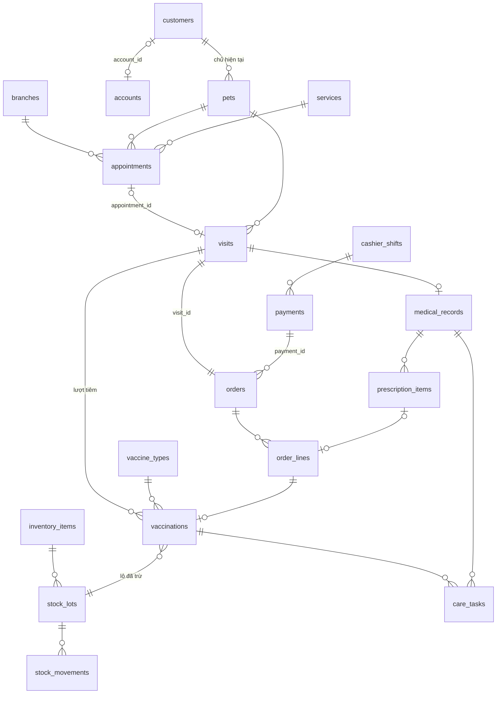

# Pet Care Ecosystem — ERD

> Thiết kế bảng vật lý, đi kèm `business-rules.md`, `state-machine.md`, `domain-model.md`, `use-case.md`. File này là tầng thấp nhất: **chỉ cụ thể hóa** model đã có trong `domain-model.md` thành bảng, cột, khóa, ràng buộc và index. Không thêm nghiệp vụ mới.
>
> **Thứ tự nguồn gốc khi mâu thuẫn:** `business-rules.md` → `state-machine.md` → `domain-model.md` → file này. Chỗ nào file này phải tự quyết định (vì tài liệu trên chưa nói) được đánh dấu **[ERD]**; các quyết định đã chốt ở tầng trên được ghi ở mục *Nhật ký quyết định* cuối file.
>

## 0. Quy ước

**Hệ quản trị:** viết theo PostgreSQL 15+. Nếu dùng MySQL 8: `BIGINT GENERATED ALWAYS AS IDENTITY` → `BIGINT AUTO_INCREMENT`; `TIMESTAMPTZ` → `DATETIME` (lưu UTC); `JSONB` → `JSON`; partial unique index → cột sinh (generated column) + unique index; `CHECK` vẫn dùng được.

**Đặt tên:** bảng `snake_case` số nhiều, cột `snake_case`. Khóa chính luôn là `id BIGINT` tự tăng, trừ bảng 1–1 dùng luôn khóa ngoại làm khóa chính. Khóa ngoại đặt tên `<bảng số ít>_id`.

**Cột chung [ERD]:** mọi bảng ROOT, PART, REF có `created_at TIMESTAMPTZ NOT NULL DEFAULT now()` và `updated_at TIMESTAMPTZ NOT NULL DEFAULT now()`. Bảng LOG chỉ có `created_at`. Các cột này không lặp lại trong bảng chi tiết bên dưới.

**Kiểu dữ liệu [ERD]:**

| Loại dữ liệu | Kiểu | Lý do |
|---|---|---|
| Tiền | `BIGINT` (đơn vị đồng) | VND không có phần lẻ; tránh sai số số thực |
| Thời điểm | `TIMESTAMPTZ` | Lưu UTC, hiển thị theo `Asia/Ho_Chi_Minh` |
| Ngày nghiệp vụ (ngày hẹn, ngày tiêm, ngày nhận/trả) | `DATE` | Hiểu theo giờ Việt Nam (BR-BC-01) |
| Giờ trong ngày | `TIME` | Giờ mở cửa, khung giờ |
| Cân nặng | `NUMERIC(6,2)` | kg, 2 chữ số lẻ |
| Trạng thái, loại | `VARCHAR(30)` + `CHECK` | Dễ thêm giá trị hơn kiểu ENUM của DB. Áp dụng cho mọi cột có `CHECK` danh sách giá trị; độ dài ghi ở từng bảng bên dưới chỉ để tham khảo (*Nhật ký quyết định* mục 7) |
| Mã chứng từ hiển thị | `VARCHAR(20)` `UNIQUE` | Tách khỏi `id` nội bộ, ví dụ `LH-260115-0007` |

**Enum dùng mã ASCII [ERD].** Một số giá trị trong `state-machine.md` có dấu tiếng Việt. Trong DB và code dùng mã ASCII theo bảng dưới; giao diện hiển thị nhãn tiếng Việt.

| Trong tài liệu nghiệp vụ | Mã trong DB |
|---|---|
| Care Task `TÁI_CHỦNG` / `QUÁ_HẠN_TÁI_CHỦNG` / `TÁI_KHÁM` / `QUÁ_HẠN_ĐÓN` | `VACCINE_DUE` / `VACCINE_OVERDUE` / `FOLLOW_UP_DUE` / `PICKUP_OVERDUE` |
| Kết quả Care Task `LIÊN_HỆ_ĐƯỢC` / `KHÔNG_LIÊN_LẠC_ĐƯỢC` | `REACHED` / `UNREACHABLE` |
| Lý do kết thúc lưu trú `TRẢ_THÚ` / `THÚ_MẤT` | `RETURNED` / `PET_DECEASED` |
| Feedback `MỚI` / `ĐÃ_XEM` / `ĐÃ_XỬ_LÝ` | `NEW` / `SEEN` / `RESOLVED` |
| Nhóm dịch vụ Khám/Tiêm / Thẩm mỹ / Lưu trú | `MEDICAL` / `GROOMING` / `BOARDING` |
| Loại dịch vụ `KHÁM` / `TIÊM` | `EXAM` / `VACCINE` |

**Ký hiệu trong bảng cột:** `PK` khóa chính · `FK→bảng` khóa ngoại · `NN` NOT NULL · `UQ` unique · `?` cho phép NULL.

**Xóa dữ liệu:** mọi khóa ngoại mặc định `ON DELETE RESTRICT`. Chỉ các trường hợp xóa cứng mà business rules cho phép mới xóa thật (BR-KH-06, BR-TK-08, BR-TK-19, BR-BV-02, BR-KB-04); khi đó ứng dụng xóa các bản ghi con trong cùng transaction, không dựa vào `CASCADE`.

---

## Sơ đồ luồng chính

Sơ đồ chỉ gồm các bảng của luồng đặt lịch → tiếp nhận → khám/tiêm → Order → thu tiền → kho → nhắc. Bảng đầy đủ xem các mục bên dưới.

---

## 1. Định danh & quản trị (TK, QT)

### `accounts` — ROOT · SM #1

| Cột | Kiểu | Ràng buộc | Ghi chú |
|---|---|---|---|
| id | BIGINT | PK | |
| email | VARCHAR(255) | NN, UQ | Lưu chữ thường. Tên đăng nhập (BR-TK-01) |
| phone | VARCHAR(15) | ? | Chuẩn hóa dạng `0xxxxxxxxx`. Chỉ dùng cho nhân viên; SĐT của khách nằm ở `customers.phone`. Không duy nhất (BR-TK-01, v16) |
| password_hash | VARCHAR(255) | NN | bcrypt/argon2 |
| role | VARCHAR(30) | NN, CHECK | `CUSTOMER`, `ADMIN`, `SUPER_MANAGER`, `BRANCH_MANAGER`, `RECEPTIONIST`, `VET`, `CARETAKER` |
| status | VARCHAR(20) | NN, CHECK | `PENDING`, `ACTIVE`, `DISABLED` |
| is_locked | BOOLEAN | NN, DEFAULT false | Khóa bởi ADMIN, độc lập với `status` (BR-QT-11, 12) |
| locked_reason | TEXT | ? | Lý do khóa gần nhất |
| locked_until | TIMESTAMPTZ | ? | Khóa tạm do đăng nhập sai (BR-TK-09, ST01) |
| failed_login_count | INT | NN, DEFAULT 0 | Đếm lần sai liên tiếp |
| first_failed_login_at | TIMESTAMPTZ | ? | Mốc đầu của cửa sổ 15 phút |
| must_change_password | BOOLEAN | NN, DEFAULT false | BR-TK-17, BR-QT-10 |
| last_seen_at | TIMESTAMPTZ | ? | Trạng thái online (BR-TN-06) |
| notification_settings | JSONB | NN, DEFAULT '{}' | Cài đặt nhận thông báo của khách (UC88) [ERD] |
| pending_expires_at | TIMESTAMPTZ | ? | Hạn xác thực của tài khoản `PENDING` = lúc đăng ký + `account.pending_ttl_hours` [CFG], chốt theo BR-QT-13; ST02 xóa khi `now >= pending_expires_at` (BR-TK-08). Xác thực thì về NULL [ERD] (V5, §13 mục 12) |

- `CHECK ((role = 'CUSTOMER') = (phone IS NULL))` — nhân viên bắt buộc có SĐT, tài khoản khách không lưu SĐT (BR-TK-01)
- `CHECK (status <> 'DISABLED' OR role <> 'CUSTOMER')` — chỉ nhân viên bị vô hiệu hóa (BR-QT-07)
- `CHECK ((status = 'PENDING') = (pending_expires_at IS NOT NULL))` — có hạn ⇔ `PENDING` (V5)
- Index: `(status, created_at)` (V1, dự kiến cho ST02; từ V5 ST02 dùng index dưới, index này không còn query nào dùng)
- Index: `(pending_expires_at) WHERE status = 'PENDING'` cho ST02 dọn tài khoản `PENDING` (V5)

### `staff_profiles` — PART của Account

| Cột | Kiểu | Ràng buộc | Ghi chú |
|---|---|---|---|
| account_id | BIGINT | PK, FK→accounts | 1–1 |
| full_name | VARCHAR(100) | NN | |
| avatar_url | VARCHAR(500) | ? | |
| branch_id | BIGINT | ?, FK→branches | NULL với `ADMIN`, `SUPER_MANAGER` (BR-QT-03) |
| specialty | VARCHAR(200) | ? | Hồ sơ công khai của VET (BR-TK-20) |
| bio | VARCHAR(500) | ? | Mô tả ngắn, tối đa 500 ký tự [CFG] — kiểm tra ở ứng dụng |

Ràng buộc "A05–A08 phải có chi nhánh" kiểm tra ở ứng dụng vì `role` nằm ở bảng `accounts`.

### `sessions` — PART của Account

| Cột | Kiểu | Ràng buộc | Ghi chú |
|---|---|---|---|
| id | BIGINT | PK | |
| account_id | BIGINT | NN, FK→accounts | |
| token_hash | VARCHAR(255) | NN, UQ | Không lưu token gốc |
| ip_address | VARCHAR(45) | ? | |
| user_agent | VARCHAR(500) | ? | |
| expires_at | TIMESTAMPTZ | NN | |
| revoked_at | TIMESTAMPTZ | ? | Hủy phiên khi khóa, vô hiệu hóa, đổi/đặt lại mật khẩu (BR-TK-11, 13, 14) |

- Index: `(account_id) WHERE revoked_at IS NULL`
- Index: `(account_id)` — kiểm FK khi xóa `accounts` (V7, ADR-0018)

### `otp_tokens` — LOG

| Cột | Kiểu | Ràng buộc | Ghi chú |
|---|---|---|---|
| id | BIGINT | PK | |
| account_id | BIGINT | ?, FK→accounts | |
| purpose | VARCHAR(20) | NN, CHECK | `REGISTER`, `RESET_PASSWORD`, `CHANGE_EMAIL`, `LINK_PROFILE` |
| target_email | VARCHAR(255) | NN | Email nhận mã (BR-TK-04) |
| customer_id | BIGINT | ?, FK→customers | Hồ sơ tại quầy cần liên kết, chỉ khi `purpose = 'LINK_PROFILE'` (BR-TK-19) |
| code_hash | VARCHAR(255) | NN | Không lưu mã gốc |
| expires_at | TIMESTAMPTZ | NN | Chốt hạn lúc sinh, nên đổi [CFG] không ảnh hưởng (BR-QT-13) |
| failed_attempts | INT | NN, DEFAULT 0 | Tối đa 5 [CFG] (BR-TK-06) |
| consumed_at | TIMESTAMPTZ | ? | Đã dùng |
| invalidated_at | TIMESTAMPTZ | ? | Bị thay bởi mã mới cùng mục đích (BR-TK-05) |

- `CHECK ((purpose = 'LINK_PROFILE') = (customer_id IS NOT NULL))`
- Index: `(target_email, created_at)` để đếm quota 5 mã/giờ và khoảng cách 60 giây (BR-TK-07)
- Index: `(account_id)` cho ST02 xóa mã của tài khoản `PENDING` và kiểm FK khi xóa `accounts` (V5)
- Index partial `(customer_id) WHERE customer_id IS NOT NULL` — kiểm FK khi xóa `customers` (hồ sơ online lúc liên kết BR-TK-19, ST02) (V9, mục 15 Nhật ký quyết định, ADR-0025)
- Là LOG nhưng cho phép cập nhật `failed_attempts`, `consumed_at`, `invalidated_at` [ERD]

### `audit_logs` — LOG

| Cột | Kiểu | Ràng buộc | Ghi chú |
|---|---|---|---|
| id | BIGINT | PK | |
| actor_account_id | BIGINT | ? | Không đặt FK (*Nhật ký quyết định* mục 9). NULL khi đăng nhập thất bại với email không tồn tại |
| actor_email | VARCHAR(255) | ? | Email nhập vào khi đăng nhập thất bại |
| action | VARCHAR(50) | NN | Ví dụ `LOGIN_FAILED`, `PRICE_CHANGED`, `ORDER_PAID` |
| entity_type | VARCHAR(50) | ? | Tên bảng |
| entity_id | BIGINT | ? | |
| before_data | JSONB | ? | |
| after_data | JSONB | ? | |
| reason | TEXT | ? | Lý do bắt buộc với khóa, hủy Order, gán lại lượt… |
| ip_address | VARCHAR(45) | ? | |

- Chỉ INSERT: trigger chặn `UPDATE`, `DELETE`, `TRUNCATE` với mọi user, kể cả owner (BR-QT-16, *Nhật ký quyết định* mục 6)
- Index: `(entity_type, entity_id)`, `(actor_account_id, created_at)`, `(created_at)`

### `system_configs` — REF

| Cột | Kiểu | Ràng buộc | Ghi chú |
|---|---|---|---|
| key | VARCHAR(100) | PK | Ví dụ `otp.ttl_minutes`, `appointment.max_reschedules` |
| value | VARCHAR(255) | NN | |
| value_type | VARCHAR(10) | NN, CHECK | `INT`, `DECIMAL`, `BOOL`, `TIME` |
| min_value | VARCHAR(50) | ? | Khoảng hợp lệ (BR-QT-13) |
| max_value | VARCHAR(50) | ? | |
| unit | VARCHAR(20) | ? | `phút`, `giờ`, `ngày`… |
| description | TEXT | NN | |
| updated_by | BIGINT | ?, FK→accounts | |

"Chỉ áp dụng cho giao dịch tạo sau" (BR-QT-13) cài bằng cách chốt giá trị vào giao dịch lúc tạo khi cần, ví dụ `otp_tokens.expires_at`. Lịch sử đổi tham số nằm trong `audit_logs`.

- Index: `(updated_by) WHERE updated_by IS NOT NULL` — kiểm FK khi xóa `accounts` (V7, ADR-0018)

### `notification_templates` — REF

| Cột | Kiểu | Ràng buộc | Ghi chú |
|---|---|---|---|
| code | VARCHAR(50) | PK | Ví dụ `OTP_REGISTER`, `VACCINE_REMINDER` |
| channel | VARCHAR(10) | NN, CHECK | `EMAIL`, `IN_APP` |
| subject | VARCHAR(255) | ? | |
| body | TEXT | NN | |
| default_subject | VARCHAR(255) | ? | Để khôi phục mặc định (BR-QT-14) |
| default_body | TEXT | NN | |
| allowed_vars | JSONB | NN | Danh sách biến dùng được |
| required_vars | JSONB | NN | Danh sách biến bắt buộc |
| updated_by | BIGINT | ?, FK→accounts | |

Dữ liệu seed sẵn; ứng dụng không có chức năng thêm hay xóa mẫu.

---

- Index: `(updated_by) WHERE updated_by IS NOT NULL` — kiểm FK khi xóa `accounts` (V7, ADR-0018)

## 2. Chi nhánh (CN)

### `branches` — ROOT · SM #2

| Cột | Kiểu | Ràng buộc | Ghi chú |
|---|---|---|---|
| id | BIGINT | PK | |
| name | VARCHAR(150) | NN, UQ | |
| address | VARCHAR(300) | NN | |
| phone | VARCHAR(15) | NN | Hiển thị công khai (UC15) |
| latitude | NUMERIC(9,6) | NN | |
| longitude | NUMERIC(9,6) | NN | |
| status | VARCHAR(10) | NN, CHECK | `DRAFT`, `ACTIVE` |
| accepts_after_hours_emergency | BOOLEAN | NN, DEFAULT false | BR-CN-05 |
| activated_at | TIMESTAMPTZ | ? | |

### `opening_hours` — PART của Branch

Mỗi dòng là giờ mở cửa của **một thứ trong tuần** theo một **ngày hiệu lực**. Tối đa 2 khoảng nên dùng 2 cặp cột thay vì nhiều dòng; nhờ vậy kiểm tra không chồng nhau bằng `CHECK` [ERD].

| Cột | Kiểu | Ràng buộc | Ghi chú |
|---|---|---|---|
| id | BIGINT | PK | |
| branch_id | BIGINT | NN, FK→branches | |
| effective_from | DATE | NN | Sớm nhất là ngày mai khi sửa (BR-CN-04) |
| day_of_week | SMALLINT | NN, CHECK 1–7 | 1 = Thứ Hai … 7 = Chủ nhật (ISO) |
| open_1 | TIME | ? | Cả 4 cột NULL = nghỉ cố định ngày đó |
| close_1 | TIME | ? | |
| open_2 | TIME | ? | |
| close_2 | TIME | ? | |

- `UNIQUE (branch_id, effective_from, day_of_week)`
- `CHECK ((open_1 IS NULL) = (close_1 IS NULL) AND (open_2 IS NULL) = (close_2 IS NULL))`
- `CHECK (open_1 IS NULL OR open_1 < close_1)`
- `CHECK (open_2 IS NULL OR (open_1 IS NOT NULL AND close_1 <= open_2 AND open_2 < close_2))`
- Tra cứu giờ áp dụng ngày D: dòng có `day_of_week` = thứ của D và `effective_from` lớn nhất ≤ D (BR-CN-02)

### `holidays` — PART của Branch

| Cột | Kiểu | Ràng buộc | Ghi chú |
|---|---|---|---|
| id | BIGINT | PK | |
| branch_id | BIGINT | NN, FK→branches | |
| holiday_date | DATE | NN | Nghỉ cả ngày (BR-CN-03) |
| reason | VARCHAR(200) | ? | |
| created_by | BIGINT | NN, FK→accounts | |

- `UNIQUE (branch_id, holiday_date)`
- Index: `(created_by)` — kiểm FK khi xóa `accounts` (V7, ADR-0018)

### `branch_services` — PART của Branch

| Cột | Kiểu | Ràng buộc | Ghi chú |
|---|---|---|---|
| branch_id | BIGINT | PK, FK→branches | |
| service_id | BIGINT | PK, FK→services | Gồm cả loại chuồng (BR-SP-04) |
| is_enabled | BOOLEAN | NN, DEFAULT true | UC33 |

### `branch_quota_defaults` — PART của Branch

Quota mặc định của một nhóm dịch vụ tại chi nhánh, áp dụng cho mọi khung giờ (BR-LH-03).

| Cột | Kiểu | Ràng buộc | Ghi chú |
|---|---|---|---|
| branch_id | BIGINT | PK, FK→branches | |
| service_group | VARCHAR(10) | PK, CHECK | `MEDICAL`, `GROOMING` |
| default_quota | SMALLINT | NN, CHECK ≥ 0 | |
| updated_by | BIGINT | NN, FK→accounts | |

- Index: `(updated_by)` — kiểm FK khi xóa `accounts` (V7, ADR-0018)

### `slot_quotas` — PART của Branch

Quota riêng của một khung giờ cụ thể, ghi đè quota mặc định (BR-LH-03). Quota của khung = `slot_quotas.quota` nếu có dòng, nếu không thì `branch_quota_defaults.default_quota`, nếu không thì 1.

| Cột | Kiểu | Ràng buộc | Ghi chú |
|---|---|---|---|
| id | BIGINT | PK | |
| branch_id | BIGINT | NN, FK→branches | |
| service_group | VARCHAR(10) | NN, CHECK | `MEDICAL`, `GROOMING` |
| slot_date | DATE | NN | |
| slot_start | TIME | NN | Khung 30 phút bắt đầu lúc này |
| quota | SMALLINT | NN, CHECK ≥ 0 | 0 = khóa khung |
| updated_by | BIGINT | NN, FK→accounts | |

- `UNIQUE (branch_id, service_group, slot_date, slot_start)`

---

- Index: `(updated_by)` — kiểm FK khi xóa `accounts` (V7, ADR-0018)

## 3. Khách hàng & thú cưng (KH)

### `customers` — ROOT

| Cột | Kiểu | Ràng buộc | Ghi chú |
|---|---|---|---|
| id | BIGINT | PK | |
| account_id | BIGINT | ?, UQ, FK→accounts | Liên kết tài khoản (BR-TK-19, BR-KH-01) |
| full_name | VARCHAR(100) | NN | |
| phone | VARCHAR(15) | ? | Không duy nhất (BR-KH-01, BR-KH-10, v16). Bắt buộc với hồ sơ tại quầy |
| email | VARCHAR(255) | ? | Không bắt buộc với hồ sơ tại quầy; quyết định kênh nhắc (BR-TB-02) |
| avatar_url | VARCHAR(500) | ? | |
| created_channel | VARCHAR(10) | NN, CHECK | `ONLINE`, `COUNTER` |
| created_by | BIGINT | ?, FK→accounts | Lễ tân tạo tại quầy |
| link_decision_pending | BOOLEAN | NN, DEFAULT false | Hồ sơ online chờ khách quyết định liên kết vào hồ sơ tại quầy (BR-TK-19) |

- `CHECK (created_channel = 'ONLINE' OR phone IS NOT NULL)` — hồ sơ tại quầy bắt buộc có SĐT (BR-KH-01)
- `CHECK (created_channel = 'COUNTER' OR account_id IS NOT NULL)` — hồ sơ online luôn gắn tài khoản
- `CHECK (created_channel = 'ONLINE' OR NOT link_decision_pending)`
- Index: `(phone)` tra cứu và tìm hồ sơ trùng SĐT (BR-KH-10, BR-TK-19), không unique; `(email)` để tra cứu; `(full_name)` dùng cho tìm kiếm (UC23)
- Index: `(created_by) WHERE created_by IS NOT NULL` — kiểm FK khi xóa `accounts` (V7, ADR-0018)

### `addresses` — PART của Customer

| Cột | Kiểu | Ràng buộc | Ghi chú |
|---|---|---|---|
| id | BIGINT | PK | |
| customer_id | BIGINT | NN, FK→customers | |
| receiver_name | VARCHAR(100) | NN | |
| receiver_phone | VARCHAR(15) | NN | |
| address_line | VARCHAR(300) | NN | |
| ward | VARCHAR(100) | ? | |
| province | VARCHAR(100) | NN | |
| is_default | BOOLEAN | NN, DEFAULT false | |

- `UNIQUE (customer_id) WHERE is_default` — đúng 1 địa chỉ mặc định (BR-TK-18). Giới hạn 5 địa chỉ [CFG] kiểm tra ở ứng dụng.

### `pets` — ROOT

| Cột | Kiểu | Ràng buộc | Ghi chú |
|---|---|---|---|
| id | BIGINT | PK | |
| customer_id | BIGINT | NN, FK→customers | Chủ hiện tại (BR-KH-08) |
| name | VARCHAR(100) | NN | |
| species | VARCHAR(10) | NN, CHECK | `DOG`, `CAT`, `OTHER` (BR-KH-02) |
| sex | VARCHAR(10) | NN, CHECK | `MALE`, `FEMALE`, `UNKNOWN` |
| breed | VARCHAR(100) | ? | |
| birth_date | DATE | ? | `CHECK (birth_date <= CURRENT_DATE)` kiểm tra ở ứng dụng |
| birth_date_estimated | BOOLEAN | NN, DEFAULT false | |
| color | VARCHAR(50) | ? | |
| is_neutered | BOOLEAN | ? | |
| photo_url | VARCHAR(500) | ? | |
| deceased_on | DATE | ? | Khác NULL = đã mất, chỉ đọc (BR-KH-05) |

- Index: `(customer_id)`; `(customer_id, name, species)` để cảnh báo nghi trùng
- Khóa loài (BR-KH-03) kiểm tra ở ứng dụng: tồn tại `medical_records` hoặc `vaccinations` của thú

### `weight_records` — LOG

| Cột | Kiểu | Ràng buộc | Ghi chú |
|---|---|---|---|
| id | BIGINT | PK | |
| pet_id | BIGINT | NN, FK→pets | |
| weight_kg | NUMERIC(6,2) | NN, CHECK > 0 | BR-KH-04 |
| source | VARCHAR(10) | NN, CHECK | `VET`, `INTAKE` (nhận lưu trú), `OWNER` (chủ tự khai) |
| visit_id | BIGINT | ?, FK→visits | |
| boarding_booking_id | BIGINT | ?, FK→boarding_bookings | |
| recorded_by | BIGINT | ?, FK→accounts | |
| measured_at | TIMESTAMPTZ | NN | |

- Index: `(pet_id, measured_at DESC)` — cân nặng hiện tại là bản ghi đầu tiên

---

- Index: `(recorded_by) WHERE recorded_by IS NOT NULL` — kiểm FK khi xóa `accounts` (V7, ADR-0018)

## 4. Danh mục sản phẩm & dịch vụ (SP)

### `product_categories` — REF

| Cột | Kiểu | Ràng buộc | Ghi chú |
|---|---|---|---|
| id | BIGINT | PK | |
| name | VARCHAR(100) | NN, UQ | |
| is_active | BOOLEAN | NN, DEFAULT true | |

### `vaccine_types` — REF

| Cột | Kiểu | Ràng buộc | Ghi chú |
|---|---|---|---|
| id | BIGINT | PK | |
| name | VARCHAR(100) | NN | Ví dụ "Dại", "5 bệnh cho chó" |
| species | VARCHAR(10) | NN, CHECK | `DOG`, `CAT`, `OTHER` |
| is_active | BOOLEAN | NN, DEFAULT true | Đã dùng thì chỉ ngừng, không xóa (BR-SP-07) |

- `UNIQUE (name, species)`

### `products` — REF

| Cột | Kiểu | Ràng buộc | Ghi chú |
|---|---|---|---|
| id | BIGINT | PK | |
| category_id | BIGINT | NN, FK→product_categories | |
| sku | VARCHAR(50) | NN, UQ | |
| name | VARCHAR(200) | NN | |
| product_type | VARCHAR(10) | NN, CHECK | `GOODS` (bán lẻ), `DRUG` (thuốc), `VACCINE` [ERD] |
| is_prescription | BOOLEAN | NN, DEFAULT false | BR-SP-01 |
| tracks_expiry | BOOLEAN | NN, DEFAULT false | BR-SP-05 |
| vaccine_type_id | BIGINT | ?, FK→vaccine_types | Bắt buộc với vaccine (BR-SP-07) |
| unit | VARCHAR(20) | NN | `hộp`, `lọ`, `viên`, `liều`… |
| price | BIGINT | NN, CHECK ≥ 0 | Giá bán hiện tại, thống nhất toàn chuỗi |
| description | TEXT | ? | |
| image_url | VARCHAR(500) | ? | |
| is_active | BOOLEAN | NN, DEFAULT true | Ngừng kinh doanh |

- `CHECK ((product_type = 'VACCINE') = (vaccine_type_id IS NOT NULL))`
- `CHECK (NOT is_prescription OR product_type = 'DRUG')`
- `CHECK (NOT (is_prescription OR product_type = 'VACCINE') OR tracks_expiry)` — BR-SP-05
- Không tắt `tracks_expiry` khi còn tồn: kiểm tra ở ứng dụng

### `services` — REF

| Cột | Kiểu | Ràng buộc | Ghi chú |
|---|---|---|---|
| id | BIGINT | PK | |
| name | VARCHAR(150) | NN, UQ | |
| service_group | VARCHAR(10) | NN, CHECK | `MEDICAL`, `GROOMING`, `BOARDING` |
| medical_type | VARCHAR(10) | ?, CHECK | `EXAM`, `VACCINE` (BR-SP-06) |
| price | BIGINT | NN, CHECK ≥ 0 | Với nhóm `BOARDING` là giá theo đêm |
| price_is_from | BOOLEAN | NN, DEFAULT true | Hiển thị "Từ X đ" (BR-CK-02) |
| description | TEXT | ? | |
| is_active | BOOLEAN | NN, DEFAULT true | |

- `CHECK ((service_group = 'MEDICAL') = (medical_type IS NOT NULL))`
- `CHECK (service_group <> 'BOARDING' OR price > 0)` — BR-SP-04

### `kennel_types` — PART của Service (nhóm `BOARDING`)

| Cột | Kiểu | Ràng buộc | Ghi chú |
|---|---|---|---|
| service_id | BIGINT | PK, FK→services | 1–1; giá đêm lấy từ `services.price` |
| species | VARCHAR(10) | NN, CHECK | Loài phù hợp |
| max_weight_kg | NUMERIC(6,2) | NN, CHECK > 0 | |

### `vaccination_protocols` — REF

| Cột | Kiểu | Ràng buộc | Ghi chú |
|---|---|---|---|
| id | BIGINT | PK | |
| species | VARCHAR(10) | NN, CHECK | |
| vaccine_type_id | BIGINT | NN, FK→vaccine_types | |
| dose_number | SMALLINT | NN, CHECK ≥ 1 | Mũi thứ mấy |
| interval_days | INT | NN, CHECK > 0 | Khoảng cách tới mũi kế (BR-SP-02) |
| min_age_weeks | SMALLINT | NN, CHECK ≥ 0 | |
| required_for_boarding | BOOLEAN | NN, DEFAULT false | BR-LT-05 |
| is_active | BOOLEAN | NN, DEFAULT true | |

- `UNIQUE (species, vaccine_type_id, dose_number)`
- Sửa phác đồ không ảnh hưởng mũi cũ (BR-SP-03) vì `vaccinations.next_due_date` đã được tính và lưu lúc tiêm.

---

## 5. Lịch hẹn (LH)

### `appointments` — ROOT · SM #3

| Cột | Kiểu | Ràng buộc | Ghi chú |
|---|---|---|---|
| id | BIGINT | PK | |
| code | VARCHAR(20) | NN, UQ | Giữ nguyên khi đổi lịch (BR-LH-06) |
| customer_id | BIGINT | NN, FK→customers | |
| pet_id | BIGINT | NN, FK→pets | |
| branch_id | BIGINT | NN, FK→branches | |
| service_id | BIGINT | NN, FK→services | Nhóm `MEDICAL` hoặc `GROOMING` (BR-LH-01) |
| service_group | VARCHAR(10) | NN, CHECK | Sao chép từ `services` lúc đặt để đếm quota nhanh [ERD] |
| slot_date | DATE | NN | |
| slot_start | TIME | NN | |
| status | VARCHAR(15) | NN, CHECK | `BOOKED`, `CHECKED_IN`, `COMPLETED`, `CANCELLED`, `NO_SHOW` |
| channel | VARCHAR(10) | NN, CHECK | `ONLINE` (khách), `COUNTER` (lễ tân đặt hộ) |
| booked_by | BIGINT | NN, FK→accounts | |
| reschedule_count | SMALLINT | NN, DEFAULT 0 | Tối đa 3 [CFG] (BR-LH-06) |
| late_cancel | BOOLEAN | NN, DEFAULT false | BR-LH-07 |
| cancel_source | VARCHAR(10) | ?, CHECK | `CUSTOMER`, `STAFF`, `CLINIC` (hủy do phòng khám, BR-LH-10) |
| cancel_reason | VARCHAR(300) | ? | |
| cancelled_at | TIMESTAMPTZ | ? | |
| reminded_at | TIMESTAMPTZ | ? | ST03 đã nhắc |
| note | VARCHAR(500) | ? | Ghi chú của khách |

- `CHECK (status = 'CANCELLED' OR (cancel_source IS NULL AND late_cancel = false))`
- `CHECK (service_group IN ('MEDICAL','GROOMING'))`
- Index đếm quota: `(branch_id, service_group, slot_date, slot_start) WHERE status IN ('BOOKED','CHECKED_IN','COMPLETED')` — xem ghi chú dưới
- Index: `(pet_id, status)` cho BR-LH-05; `(customer_id, created_at)`; `(status, slot_date, slot_start)` cho ST05
- `UNIQUE (pet_id, slot_date, slot_start) WHERE status = 'BOOKED'` — thú không trùng khung (BR-LH-05)

**Quota tính những lịch nào [ERD]:** lịch đã `CHECKED_IN`/`COMPLETED` vẫn chiếm quota của khung đó; `CANCELLED`, `NO_SHOW` trả lại quota. Đếm quota và INSERT phải trong cùng transaction có khóa (ví dụ `SELECT … FOR UPDATE` trên dòng `branches`, hoặc advisory lock theo `branch_id + service_group + slot`) để hai khách không cùng lấy khung cuối.

- Index: `(booked_by)` — kiểm FK khi xóa `accounts` (V7, ADR-0018)

### `booking_restrictions` — ROOT

| Cột | Kiểu | Ràng buộc | Ghi chú |
|---|---|---|---|
| id | BIGINT | PK | |
| customer_id | BIGINT | NN, FK→customers | |
| starts_at | TIMESTAMPTZ | NN | |
| ends_at | TIMESTAMPTZ | NN | starts_at + 30 ngày [CFG] (BR-LH-09) |
| violation_count | SMALLINT | NN | Số lần vi phạm lúc bị hạn chế (để hiển thị) |
| lifted_at | TIMESTAMPTZ | ? | Gỡ sớm |
| lifted_by | BIGINT | ?, FK→accounts | Lễ tân hoặc BRANCH_MANAGER |
| lift_reason | VARCHAR(300) | ? | |

- Index: `(customer_id, ends_at)`
- Khách đang bị hạn chế ⇔ có dòng `starts_at ≤ now() < ends_at AND lifted_at IS NULL`

---

- Index: `(lifted_by) WHERE lifted_by IS NOT NULL` — kiểm FK khi xóa `accounts` (V7, ADR-0018)

## 6. Tiếp nhận & khám (TN, KB)

### `visits` — ROOT · SM #4

| Cột | Kiểu | Ràng buộc | Ghi chú |
|---|---|---|---|
| id | BIGINT | PK | |
| code | VARCHAR(20) | NN, UQ | |
| branch_id | BIGINT | NN, FK→branches | |
| customer_id | BIGINT | NN, FK→customers | Chủ tại thời điểm tiếp nhận |
| pet_id | BIGINT | NN, FK→pets | |
| appointment_id | BIGINT | ?, UQ, FK→appointments | NULL = walk-in |
| service_group | VARCHAR(10) | NN, CHECK | `MEDICAL`, `GROOMING`; quyết định chức vụ được gán (BR-TN-05) |
| status | VARCHAR(15) | NN, CHECK | `WAITING`, `IN_PROGRESS`, `COMPLETED`, `CANCELLED` |
| priority_class | VARCHAR(15) | NN, CHECK | `EMERGENCY`, `APPOINTMENT`, `WALK_IN` (BR-TN-03, 04) |
| queue_sort_key | TIMESTAMPTZ | NN | Giờ hẹn hoặc giờ check-in; lễ tân sắp lại thì sửa cột này |
| assignee_id | BIGINT | ?, FK→accounts | NULL khi `WAITING` chưa gán |
| needs_reassign | BOOLEAN | NN, DEFAULT false | Đánh dấu khi người phụ trách bị khóa (BR-QT-11) |
| checked_in_by | BIGINT | NN, FK→accounts | |
| checked_in_at | TIMESTAMPTZ | NN | |
| called_at | TIMESTAMPTZ | ? | |
| completed_at | TIMESTAMPTZ | ? | |
| cancelled_at | TIMESTAMPTZ | ? | |
| cancel_reason | VARCHAR(300) | ? | |

- `CHECK (status = 'WAITING' OR status = 'CANCELLED' OR assignee_id IS NOT NULL)`
- Index hàng đợi: `(branch_id, status, priority_class, queue_sort_key)`
- Index: `(assignee_id, status)`; `(pet_id, checked_in_at DESC)`
- Index: `(checked_in_by)` — kiểm FK khi xóa `accounts` (V7, ADR-0018)

### `visit_assignments` — LOG

| Cột | Kiểu | Ràng buộc | Ghi chú |
|---|---|---|---|
| id | BIGINT | PK | |
| visit_id | BIGINT | NN, FK→visits | |
| from_account_id | BIGINT | ?, FK→accounts | NULL ở lần gán đầu |
| to_account_id | BIGINT | NN, FK→accounts | |
| assigned_by | BIGINT | NN, FK→accounts | |
| visit_status_at_assign | VARCHAR(15) | NN | `WAITING` hoặc `IN_PROGRESS` |
| reason | VARCHAR(300) | ? | Bắt buộc khi gán lại lượt đã gọi (BR-TN-08) |
| assignee_was_offline | BOOLEAN | NN, DEFAULT false | Đã cảnh báo, không chặn (BR-TN-06) |

- Index: `(from_account_id) WHERE from_account_id IS NOT NULL`, `(to_account_id)`, `(assigned_by)` — kiểm FK khi xóa `accounts` (V7, ADR-0018)

### `medical_records` — PART của Visit

| Cột | Kiểu | Ràng buộc | Ghi chú |
|---|---|---|---|
| visit_id | BIGINT | PK, FK→visits | 1–1, chỉ Visit nhóm `MEDICAL` |
| examination | TEXT | ? | Triệu chứng, khám lâm sàng, xét nghiệm |
| diagnosis | TEXT | ? | Bắt buộc trước khi hoàn tất nếu có dịch vụ `EXAM` (BR-KB-02) |
| treatment_plan | TEXT | ? | |
| internal_note | TEXT | ? | Không trả cho khách (BR-KB-01, BR-KH-07) |
| follow_up_date | DATE | ? | Ngày tái khám (BR-KB-06) |
| follow_up_reminded_at | TIMESTAMPTZ | ? | ST04 đã nhắc |
| follow_up_cancelled_at | TIMESTAMPTZ | ? | Nhắc bị hủy (BR-TB-06) |
| last_edited_by | BIGINT | ?, FK→accounts | |
| locked_at | TIMESTAMPTZ | ? | = `visits.completed_at` |

- Index: `(follow_up_date) WHERE follow_up_date IS NOT NULL AND follow_up_reminded_at IS NULL AND follow_up_cancelled_at IS NULL` cho ST04
- Người ghi từng phần khi gán lại lượt (BR-TN-08) lấy từ `audit_logs` [ERD]
- Index: `(last_edited_by) WHERE last_edited_by IS NOT NULL` — kiểm FK khi xóa `accounts` (V7, ADR-0018)

### `medical_record_addenda` — LOG

| Cột | Kiểu | Ràng buộc | Ghi chú |
|---|---|---|---|
| id | BIGINT | PK | |
| medical_record_id | BIGINT | NN, FK→medical_records(visit_id) | |
| content | TEXT | NN | |
| is_internal | BOOLEAN | NN, DEFAULT false | Bổ sung cho ghi chú nội bộ thì khách không thấy [ERD] |
| created_by | BIGINT | NN, FK→accounts | |

- Index: `(created_by)` — kiểm FK khi xóa `accounts` (V7, ADR-0018)

### `prescription_items` — PART của MedicalRecord

| Cột | Kiểu | Ràng buộc | Ghi chú |
|---|---|---|---|
| id | BIGINT | PK | |
| medical_record_id | BIGINT | NN, FK→medical_records(visit_id) | |
| product_id | BIGINT | NN, FK→products | Phải là thuốc kê đơn (BR-KB-03) |
| quantity | INT | NN, CHECK > 0 | |
| dosage_instructions | VARCHAR(500) | NN | Liều dùng, in trên đơn |
| is_external_purchase | BOOLEAN | NN, DEFAULT false | Mua ngoài |
| order_line_id | BIGINT | ?, UQ, FK→order_lines | |
| external_reason | VARCHAR(30) | ?, CHECK | `OUT_OF_STOCK_AT_PRESCRIBE`, `OUT_OF_STOCK_AT_PAYMENT` (BR-BH-04) [ERD] |

- `CHECK (is_external_purchase = (order_line_id IS NULL))` — không tách một dòng thành hai phần

### `vaccinations` — ROOT

| Cột | Kiểu | Ràng buộc | Ghi chú |
|---|---|---|---|
| id | BIGINT | PK | |
| pet_id | BIGINT | NN, FK→pets | |
| vaccine_type_id | BIGINT | NN, FK→vaccine_types | Tính mọi thứ theo loại (BR-SP-07) |
| visit_id | BIGINT | NN, FK→visits | Lượt tiêm |
| branch_id | BIGINT | NN, FK→branches | Sao chép từ `visits.branch_id`; dùng cho "chi nhánh tiêm gần nhất" và báo cáo [ERD] |
| administered_on | DATE | NN | Không ở tương lai |
| protocol_id | BIGINT | NN, FK→vaccination_protocols | Dòng phác đồ VET chọn; có thể khác gợi ý (BR-KB-04) |
| dose_number | SMALLINT | NN, CHECK ≥ 1 | Sao chép từ phác đồ lúc tiêm |
| product_id | BIGINT | NN, FK→products | Nhãn hàng vaccine đã dùng |
| stock_lot_id | BIGINT | NN, FK→stock_lots | Lô đã trừ, dùng để hoàn kho khi xóa |
| order_line_id | BIGINT | NN, UQ, FK→order_lines | |
| next_due_date | DATE | NN | = administered_on + `interval_days` của phác đồ, tính lúc tiêm |
| due_reminded_at | TIMESTAMPTZ | ? | ST04 đã nhắc |
| superseded_at | TIMESTAMPTZ | ? | Đã có mũi mới cùng loại (BR-TB-03); dừng nhắc |
| recorded_by | BIGINT | NN, FK→accounts | |

- Chỉ có mũi tiêm tại hệ thống; mũi tiêm ở nơi khác không được ghi nhận (nguyên tắc 9 của domain model, BR-KB-05)
- Index: `(pet_id, vaccine_type_id, administered_on DESC)` — mũi gần nhất cùng loại (gợi ý mũi kế, BR-LT-05, BR-TB-02)
- Index cho ST04: `(next_due_date) WHERE superseded_at IS NULL`
- Xóa cứng được khi Visit còn `IN_PROGRESS` (BR-KB-04): trong cùng transaction hoàn kho đúng `stock_lot_id`, ghi `stock_movements`, xóa dòng này, rồi xóa `order_lines` (dòng này giữ FK tới `order_lines` nên phải xóa trước).

---

- Index: `(recorded_by)` — kiểm FK khi xóa `accounts` (V7, ADR-0018)

## 7. Lưu trú (LT) — tầng 2

### `kennels` — ROOT · SM #7

| Cột | Kiểu | Ràng buộc | Ghi chú |
|---|---|---|---|
| id | BIGINT | PK | |
| branch_id | BIGINT | NN, FK→branches | |
| kennel_type_id | BIGINT | NN, FK→kennel_types(service_id) | |
| code | VARCHAR(20) | NN | Ví dụ `C-01` |
| status | VARCHAR(15) | NN, CHECK | `AVAILABLE`, `OCCUPIED`, `MAINTENANCE` |
| note | VARCHAR(300) | ? | |

- `UNIQUE (branch_id, code)` (BR-LT-01)
- Index: `(branch_id, kennel_type_id, status)` — sức chứa và chọn chuồng lúc nhận

### `boarding_bookings` — ROOT · SM #6

| Cột | Kiểu | Ràng buộc | Ghi chú |
|---|---|---|---|
| id | BIGINT | PK | |
| code | VARCHAR(20) | NN, UQ | |
| customer_id | BIGINT | NN, FK→customers | |
| pet_id | BIGINT | NN, FK→pets | |
| branch_id | BIGINT | NN, FK→branches | |
| kennel_type_id | BIGINT | NN, FK→kennel_types(service_id) | |
| kennel_id | BIGINT | ?, FK→kennels | Gán lúc nhận, đúng loại đã đặt (BR-LT-08) |
| check_in_date | DATE | NN | Ngày nhận dự kiến |
| check_out_date | DATE | NN | Ngày trả dự kiến; gia hạn thì sửa cột này |
| actual_check_in_at | TIMESTAMPTZ | ? | |
| actual_check_out_at | TIMESTAMPTZ | ? | |
| nightly_price | BIGINT | NN, CHECK > 0 | Snapshot lúc đặt (BR-LT-02) |
| status | VARCHAR(15) | NN, CHECK | `BOOKED`, `CHECKED_IN`, `OVERDUE`, `CHECKED_OUT`, `CANCELLED`, `NO_SHOW` |
| end_reason | VARCHAR(15) | ?, CHECK | `RETURNED`, `PET_DECEASED` |
| end_note | TEXT | ? | Diễn biến khi thú mất (BR-LT-12) |
| channel | VARCHAR(10) | NN, CHECK | `ONLINE`, `COUNTER` |
| booked_by | BIGINT | NN, FK→accounts | |
| late_cancel | BOOLEAN | NN, DEFAULT false | |
| cancel_source | VARCHAR(10) | ?, CHECK | `CUSTOMER`, `STAFF`, `CLINIC` |
| cancel_reason | VARCHAR(300) | ? | |
| overdue_since | TIMESTAMPTZ | ? | ST15 |
| last_overdue_notice_on | DATE | ? | Thông báo khách mỗi ngày |
| manager_notified_at | TIMESTAMPTZ | ? | Quá hạn ≥ 7 ngày [CFG] |

- `CHECK (check_out_date > check_in_date)`
- `CHECK ((status = 'CHECKED_OUT') = (end_reason IS NOT NULL))`
- `CHECK (status NOT IN ('CHECKED_IN','OVERDUE','CHECKED_OUT') OR kennel_id IS NOT NULL)`
- `UNIQUE (kennel_id) WHERE status IN ('CHECKED_IN','OVERDUE')` — 1 chuồng chứa 1 thú
- Index sức chứa: `(branch_id, kennel_type_id, status, check_in_date, check_out_date)`
- Không chồng ngày cho cùng thú (BR-LT-02): PostgreSQL dùng `EXCLUDE USING gist (pet_id WITH =, daterange(check_in_date, check_out_date) WITH &&) WHERE (status IN ('BOOKED','CHECKED_IN','OVERDUE'))`, cần extension `btree_gist` (*Nhật ký quyết định* mục 8); MySQL kiểm tra ở ứng dụng.
- Đúng loại chuồng: ứng dụng kiểm tra `kennels.kennel_type_id = boarding_bookings.kennel_type_id` khi gán.
- Index: `(booked_by)` — kiểm FK khi xóa `accounts` (V7, ADR-0018)

### `boarding_check_ins` — PART của BoardingBooking

| Cột | Kiểu | Ràng buộc | Ghi chú |
|---|---|---|---|
| boarding_booking_id | BIGINT | PK, FK→boarding_bookings | 1–1 |
| weight_record_id | BIGINT | NN, UQ, FK→weight_records | Bắt buộc có cân nặng (BR-LT-08) |
| health_condition | TEXT | NN | Tình trạng quan sát được |
| belongings | TEXT | ? | Đồ gửi kèm |
| diet_instructions | TEXT | ? | Chế độ ăn riêng |
| emergency_phone | VARCHAR(15) | NN | |
| received_by | BIGINT | NN, FK→accounts | Lễ tân hoặc CARETAKER |
| received_at | TIMESTAMPTZ | NN | |

- Index: `(received_by)` — kiểm FK khi xóa `accounts` (V7, ADR-0018)

### `care_logs` — PART của BoardingBooking

| Cột | Kiểu | Ràng buộc | Ghi chú |
|---|---|---|---|
| id | BIGINT | PK | |
| boarding_booking_id | BIGINT | NN, FK→boarding_bookings | |
| log_date | DATE | NN | Để kiểm tra ≥ 1 mục/ngày [CFG] (BR-LT-11) |
| eating | VARCHAR(300) | ? | |
| drinking | VARCHAR(300) | ? | |
| hygiene | VARCHAR(300) | ? | |
| activity | VARCHAR(300) | ? | |
| note | TEXT | ? | |
| photo_urls | JSONB | NN, DEFAULT '[]' | Tối đa 5 ảnh [CFG], kiểm tra ở ứng dụng [ERD] |
| is_abnormal | BOOLEAN | NN, DEFAULT false | Thông báo ngay (BR-LT-12) |
| recorded_by | BIGINT | NN, FK→accounts | CARETAKER hoặc VET |

- Index: `(boarding_booking_id, log_date)`
- Sửa được trong 1 giờ [CFG] tính từ `created_at`; sau đó chỉ thêm `care_log_addenda`
- Index: `(recorded_by)` — kiểm FK khi xóa `accounts` (V7, ADR-0018)

### `care_log_addenda` — LOG (thuộc CareLog)

| Cột | Kiểu | Ràng buộc | Ghi chú |
|---|---|---|---|
| id | BIGINT | PK | |
| care_log_id | BIGINT | NN, FK→care_logs | |
| content | TEXT | NN | |
| created_by | BIGINT | NN, FK→accounts | |

Domain model gộp "bản bổ sung" vào CareLog; tách thành bảng con để giữ nguyên tắc chỉ thêm, không sửa [ERD].

---

- Index: `(created_by)` — kiểm FK khi xóa `accounts` (V7, ADR-0018)

## 8. Bán hàng & thu ngân (BH, TG)

### `orders` — ROOT · SM #5

| Cột | Kiểu | Ràng buộc | Ghi chú |
|---|---|---|---|
| id | BIGINT | PK | |
| code | VARCHAR(20) | NN, UQ | |
| source | VARCHAR(10) | NN, CHECK | `VISIT`, `RETAIL`, `BOARDING` |
| customer_id | BIGINT | NN, FK→customers | Giữ chủ tại thời điểm tạo, không đổi khi chuyển chủ (BR-KH-08) |
| branch_id | BIGINT | NN, FK→branches | |
| visit_id | BIGINT | ?, UQ, FK→visits | |
| boarding_booking_id | BIGINT | ?, FK→boarding_bookings | |
| payment_id | BIGINT | ?, FK→payments | Gán khi `PAID` |
| status | VARCHAR(10) | NN, CHECK | `OPEN`, `PENDING`, `PAID`, `CANCELLED` |
| total_amount | BIGINT | NN, DEFAULT 0 | Tổng các dòng; cập nhật cùng transaction khi thêm/xóa dòng [ERD] |
| created_by | BIGINT | NN, FK→accounts | |
| pending_at | TIMESTAMPTZ | ? | Thời điểm chốt; ST13 dùng để liệt kê Order quá hạn |
| paid_at | TIMESTAMPTZ | ? | Mốc ghi nhận doanh thu (BR-BC-02) |
| cancelled_at | TIMESTAMPTZ | ? | |
| cancelled_by | BIGINT | ?, FK→accounts | |
| cancel_type | VARCHAR(20) | ?, CHECK | `VISIT_CANCELLED`, `RETAIL_UNCLOSED`, `CHECKOUT_ABORTED`, `UNPAID` [ERD] |
| cancel_reason | VARCHAR(300) | ? | Bắt buộc khi hủy từ `PENDING` |

- Đúng 1 nguồn (BR-BH-01):
  `CHECK ((source = 'VISIT' AND visit_id IS NOT NULL AND boarding_booking_id IS NULL) OR (source = 'BOARDING' AND boarding_booking_id IS NOT NULL AND visit_id IS NULL) OR (source = 'RETAIL' AND visit_id IS NULL AND boarding_booking_id IS NULL))`
- `CHECK ((status = 'PAID') = (payment_id IS NOT NULL))`
- `UNIQUE (boarding_booking_id) WHERE status IN ('OPEN','PENDING')` — tối đa 1 Order lưu trú chưa kết thúc
- Index: `(branch_id, status, pending_at)`; `(branch_id, paid_at)` cho báo cáo; `(customer_id, status)` cho thu gộp

**Thất thu (BR-BC-02)** = Order có `cancel_type = 'UNPAID'`. Order có `cancel_type = 'CHECKOUT_ABORTED'` không tính thất thu. Đây là lý do cần cột `cancel_type` thay vì suy ra từ người hủy.

- Index: `(created_by)`, `(cancelled_by) WHERE cancelled_by IS NOT NULL` — kiểm FK khi xóa `accounts` (V7, ADR-0018)

### `order_lines` — PART của Order

| Cột | Kiểu | Ràng buộc | Ghi chú |
|---|---|---|---|
| id | BIGINT | PK | |
| order_id | BIGINT | NN, FK→orders | |
| line_type | VARCHAR(10) | NN, CHECK | `SERVICE`, `GOODS`, `DRUG`, `VACCINE`, `BOARDING` |
| service_id | BIGINT | ?, FK→services | `SERVICE`, `BOARDING` |
| product_id | BIGINT | ?, FK→products | `GOODS`, `DRUG`, `VACCINE` |
| description | VARCHAR(200) | NN | Tên lúc thêm dòng, để hóa đơn không đổi khi đổi tên sản phẩm |
| quantity | INT | NN, CHECK > 0 | Với `BOARDING` là số đêm |
| unit_price | BIGINT | NN, CHECK ≥ 0 | Snapshot (BR-BH-03) |
| line_total | BIGINT | NN | = quantity × unit_price |
| is_auto_generated | BOOLEAN | NN, DEFAULT false | Dòng dịch vụ tự sinh khi tiếp nhận (BR-TN-01) |
| added_by | BIGINT | NN, FK→accounts | Người thêm, không đổi |
| owner_account_id | BIGINT | NN, FK→accounts | Người có quyền xóa; chuyển sang người mới khi gán lại lượt (BR-TN-08) [ERD] |

- `CHECK ((line_type IN ('SERVICE','BOARDING')) = (service_id IS NOT NULL))`
- `CHECK ((line_type IN ('GOODS','DRUG','VACCINE')) = (product_id IS NOT NULL))`
- `CHECK (line_total = quantity * unit_price)`
- Dòng tự sinh có `owner_account_id` = nhân viên được gán lượt (cập nhật khi gán), để VET đổi/xóa được theo BR-TN-01.
- Liên kết 1–1 với đơn thuốc và mũi tiêm đặt FK ở phía `prescription_items.order_line_id` và `vaccinations.order_line_id`, không đặt ngược lại ở `order_lines`, để tránh vòng khóa ngoại [ERD].
- Index: `(added_by)`, `(owner_account_id)` — kiểm FK khi xóa `accounts` (V7, ADR-0018)

### `cashier_shifts` — ROOT · SM #8

| Cột | Kiểu | Ràng buộc | Ghi chú |
|---|---|---|---|
| id | BIGINT | PK | |
| branch_id | BIGINT | NN, FK→branches | |
| cashier_id | BIGINT | NN, FK→accounts | Lễ tân |
| is_after_hours | BOOLEAN | NN, DEFAULT false | Ca ngoài giờ thu tiền cấp cứu (BR-CN-05, BR-TG-05); đặt lúc mở, không đổi |
| business_date | DATE | NN | Ngày mở ca; ca ngoài giờ qua nửa đêm vẫn thuộc ngày này |
| status | VARCHAR(12) | NN, CHECK | `OPEN`, `CLOSED`, `RECONCILED` |
| opened_at | TIMESTAMPTZ | NN | |
| closed_at | TIMESTAMPTZ | ? | |
| auto_closed | BOOLEAN | NN, DEFAULT false | ST13 |
| expected_cash | BIGINT | ? | Tổng tiền mặt hệ thống ghi nhận, tính lúc chốt |
| expected_transfer | BIGINT | ? | Tổng chuyển khoản, tính lúc chốt |
| counted_cash | BIGINT | ? | Tiền mặt thực đếm; NULL nếu tự chốt |
| difference | BIGINT | ? | counted_cash − expected_cash, ghi khi đối soát |
| reconcile_note | TEXT | ? | |
| reconciled_by | BIGINT | ?, FK→accounts | BRANCH_MANAGER |
| reconciled_at | TIMESTAMPTZ | ? | |

- `UNIQUE (cashier_id) WHERE status = 'OPEN'` — tối đa 1 ca mở (BR-TG-05)
- `CHECK (status <> 'RECONCILED' OR counted_cash IS NOT NULL)`
- `CHECK (status <> 'CLOSED' OR auto_closed OR counted_cash IS NOT NULL)`
- Index cho ST13: `(branch_id, is_after_hours) WHERE status = 'OPEN'`
- Điều kiện mở ca (trong/ngoài giờ mở cửa, cờ cấp cứu của chi nhánh) kiểm tra ở ứng dụng vì phụ thuộc `opening_hours`, `holidays`.
- Index: `(cashier_id)`, `(reconciled_by) WHERE reconciled_by IS NOT NULL` — kiểm FK khi xóa `accounts` (V7, ADR-0018)

### `payments` — ROOT

| Cột | Kiểu | Ràng buộc | Ghi chú |
|---|---|---|---|
| id | BIGINT | PK | |
| code | VARCHAR(20) | NN, UQ | Số phiếu thu |
| branch_id | BIGINT | NN, FK→branches | |
| customer_id | BIGINT | NN, FK→customers | Thu gộp chỉ cùng khách, cùng chi nhánh (BR-TG-03) |
| cashier_shift_id | BIGINT | NN, FK→cashier_shifts | |
| method | VARCHAR(10) | NN, CHECK | `CASH`, `TRANSFER` |
| amount | BIGINT | NN, CHECK ≥ 0 | = tổng các Order (BR-TG-02); cho phép 0 (*Nhật ký quyết định* mục 10) |
| received_by | BIGINT | NN, FK→accounts | |
| paid_at | TIMESTAMPTZ | NN | |

- Index: `(cashier_shift_id, method)` để tổng hợp khi chốt ca
- Thu tiền là một transaction: khóa các `orders` (`FOR UPDATE`), kiểm tra `PENDING` và cùng khách/chi nhánh, khóa `stock_lots` liên quan, kiểm tra tồn, INSERT `payments`, cập nhật `orders`, trừ `stock_lots`, ghi `stock_movements`, ghi `audit_logs` (BR-BH-04, BR-TG-04).

---

- Index: `(received_by)` — kiểm FK khi xóa `accounts` (V7, ADR-0018)

## 9. Kho (KO) — tầng 2

### `suppliers` — REF

| Cột | Kiểu | Ràng buộc | Ghi chú |
|---|---|---|---|
| id | BIGINT | PK | |
| name | VARCHAR(200) | NN | |
| phone | VARCHAR(15) | NN | |
| address | VARCHAR(300) | ? | |
| is_active | BOOLEAN | NN, DEFAULT true | Ngừng hợp tác (BR-KO-02) |

### `inventory_items` — ROOT

| Cột | Kiểu | Ràng buộc | Ghi chú |
|---|---|---|---|
| id | BIGINT | PK | |
| branch_id | BIGINT | NN, FK→branches | |
| product_id | BIGINT | NN, FK→products | |
| min_quantity | INT | NN, DEFAULT 0, CHECK ≥ 0 | Tồn tối thiểu (BR-KO-07) |

- `UNIQUE (branch_id, product_id)`
- Tồn khả dụng không lưu, tính bằng tổng `stock_lots.quantity` của lô chưa hết hạn (BR-KO-01). Nếu cần nhanh cho trang công khai (BR-CK-03) thì tạo view.

### `stock_lots` — PART của InventoryItem

| Cột | Kiểu | Ràng buộc | Ghi chú |
|---|---|---|---|
| id | BIGINT | PK | |
| inventory_item_id | BIGINT | NN, FK→inventory_items | |
| lot_number | VARCHAR(50) | ? | NULL với lô mặc định |
| expiry_date | DATE | ? | NULL với lô mặc định |
| quantity | INT | NN, CHECK ≥ 0 | Số dư; không bao giờ âm (BR-KO-01) |
| is_default | BOOLEAN | NN, DEFAULT false | Lô duy nhất của sản phẩm không quản lý hạn dùng |

- `UNIQUE (inventory_item_id) WHERE is_default`
- `UNIQUE (inventory_item_id, lot_number, expiry_date) WHERE NOT is_default` — nhập lại cùng số lô và hạn thì cộng vào lô cũ [ERD]
- `CHECK (is_default = (lot_number IS NULL AND expiry_date IS NULL))`
- Index FEFO: `(inventory_item_id, expiry_date) WHERE quantity > 0`

### `stock_receipts` — ROOT · SM #9

| Cột | Kiểu | Ràng buộc | Ghi chú |
|---|---|---|---|
| id | BIGINT | PK | |
| code | VARCHAR(20) | NN, UQ | Dãy số liên tục, không xóa phiếu (BR-KO-03) |
| branch_id | BIGINT | NN, FK→branches | |
| supplier_id | BIGINT | NN, FK→suppliers | |
| receipt_date | DATE | NN | |
| status | VARCHAR(10) | NN, CHECK | `DRAFT`, `CONFIRMED`, `CANCELLED` |
| note | TEXT | ? | |
| created_by | BIGINT | NN, FK→accounts | |
| confirmed_by | BIGINT | ?, FK→accounts | |
| confirmed_at | TIMESTAMPTZ | ? | |
| cancelled_by | BIGINT | ?, FK→accounts | |
| cancelled_at | TIMESTAMPTZ | ? | |
| cancel_reason | VARCHAR(300) | ? | |

- Index: `(created_by)`, `(confirmed_by) WHERE confirmed_by IS NOT NULL`, `(cancelled_by) WHERE cancelled_by IS NOT NULL` — kiểm FK khi xóa `accounts` (V7, ADR-0018)

### `stock_receipt_lines` — PART của StockReceipt

| Cột | Kiểu | Ràng buộc | Ghi chú |
|---|---|---|---|
| id | BIGINT | PK | |
| stock_receipt_id | BIGINT | NN, FK→stock_receipts | |
| product_id | BIGINT | NN, FK→products | |
| quantity | INT | NN, CHECK > 0 | |
| unit_cost | BIGINT | NN, CHECK ≥ 0 | Giá nhập |
| lot_number | VARCHAR(50) | ? | Bắt buộc nếu `tracks_expiry` |
| expiry_date | DATE | ? | Bắt buộc nếu `tracks_expiry`, sau ngày nhập |
| stock_lot_id | BIGINT | ?, FK→stock_lots | Gán khi xác nhận; dùng để hủy phiếu đúng lô (BR-KO-04) |

### `stock_adjustments` — ROOT

| Cột | Kiểu | Ràng buộc | Ghi chú |
|---|---|---|---|
| id | BIGINT | PK | |
| code | VARCHAR(20) | NN, UQ | |
| branch_id | BIGINT | NN, FK→branches | |
| reason | VARCHAR(20) | NN, CHECK | `DAMAGED`, `EXPIRED`, `COUNT_MISMATCH`, `OTHER` (BR-KO-06) |
| note | TEXT | ? | Bắt buộc khi `OTHER` |
| created_by | BIGINT | NN, FK→accounts | |

- `CHECK (reason <> 'OTHER' OR note IS NOT NULL)`
- Không có trạng thái: lưu là có hiệu lực ngay.
- Index: `(created_by)` — kiểm FK khi xóa `accounts` (V7, ADR-0018)

### `stock_adjustment_lines` — PART của StockAdjustment

| Cột | Kiểu | Ràng buộc | Ghi chú |
|---|---|---|---|
| id | BIGINT | PK | |
| stock_adjustment_id | BIGINT | NN, FK→stock_adjustments | |
| stock_lot_id | BIGINT | NN, FK→stock_lots | |
| quantity_delta | INT | NN, CHECK ≠ 0 | Âm = giảm, dương = tăng |

### `stock_movements` — LOG

| Cột | Kiểu | Ràng buộc | Ghi chú |
|---|---|---|---|
| id | BIGINT | PK | |
| stock_lot_id | BIGINT | NN, FK→stock_lots | |
| movement_type | VARCHAR(20) | NN, CHECK | `RECEIPT`, `RECEIPT_CANCEL`, `SALE`, `VACCINATION`, `VACCINATION_REVERT`, `ADJUSTMENT` |
| quantity_delta | INT | NN, CHECK ≠ 0 | |
| balance_after | INT | NN, CHECK ≥ 0 | Số dư lô sau biến động |
| source_type | VARCHAR(30) | NN | `stock_receipts`, `orders`, `vaccinations`, `stock_adjustments` |
| source_id | BIGINT | NN | Không đặt FK vì đa hình; mũi tiêm bị xóa vẫn giữ `source_id` để truy vết |
| created_by | BIGINT | NN, FK→accounts | |

- Index: `(stock_lot_id, created_at)`; `(source_type, source_id)`
- Mọi cập nhật `stock_lots.quantity` phải INSERT một dòng ở đây trong cùng transaction (nguyên tắc 5 của domain model).

---

- Index: `(created_by)` — kiểm FK khi xóa `accounts` (V7, ADR-0018)

## 10. Nội dung & feedback (BV, CK, DG) — tầng 2

### `article_categories` — REF

| Cột | Kiểu | Ràng buộc | Ghi chú |
|---|---|---|---|
| id | BIGINT | PK | |
| name | VARCHAR(100) | NN, UQ | |
| slug | VARCHAR(120) | NN, UQ | |
| is_hidden | BOOLEAN | NN, DEFAULT false | BR-BV-04 |

### `articles` — ROOT

| Cột | Kiểu | Ràng buộc | Ghi chú |
|---|---|---|---|
| id | BIGINT | PK | |
| category_id | BIGINT | NN, FK→article_categories | |
| title | VARCHAR(250) | NN | |
| slug | VARCHAR(270) | NN, UQ | Khóa sau lần xuất bản đầu (BR-BV-01) |
| cover_image_url | VARCHAR(500) | ? | |
| summary | VARCHAR(500) | ? | |
| content | TEXT | NN | HTML đã lọc |
| author_display_name | VARCHAR(100) | NN | |
| status | VARCHAR(10) | NN, CHECK | `DRAFT`, `PUBLISHED`, `HIDDEN` (BR-BV-02) |
| first_published_at | TIMESTAMPTZ | ? | Khác NULL thì không xóa, không đổi slug |
| created_by | BIGINT | NN, FK→accounts | SUPER_MANAGER |

- Index: `(status, first_published_at DESC)`; `(category_id, status)`
- Index: `(created_by)` — kiểm FK khi xóa `accounts` (V7, ADR-0018)

### `page_contents` — REF

| Cột | Kiểu | Ràng buộc | Ghi chú |
|---|---|---|---|
| key | VARCHAR(50) | PK | `HOME_BANNER`, `ABOUT`, `POLICY`, `FAQ` |
| title | VARCHAR(250) | ? | |
| content | JSONB | NN | Cấu trúc tùy trang: danh sách banner, câu hỏi FAQ… |
| updated_by | BIGINT | ?, FK→accounts | |

- Index: `(updated_by) WHERE updated_by IS NOT NULL` — kiểm FK khi xóa `accounts` (V7, ADR-0018)

### `feedbacks` — ROOT

| Cột | Kiểu | Ràng buộc | Ghi chú |
|---|---|---|---|
| id | BIGINT | PK | |
| customer_id | BIGINT | NN, FK→customers | |
| topic | VARCHAR(20) | NN, CHECK | `BRANCH_SERVICE`, `WEBSITE`, `OTHER` |
| branch_id | BIGINT | ?, FK→branches | |
| rating | SMALLINT | ?, CHECK 1–5 | |
| content | VARCHAR(2000) | NN | Tối thiểu 10 ký tự |
| status | VARCHAR(10) | NN, CHECK | `NEW`, `SEEN`, `RESOLVED` (BR-DG-04) |
| seen_at | TIMESTAMPTZ | ? | |
| resolved_by | BIGINT | ?, FK→accounts | |
| resolved_at | TIMESTAMPTZ | ? | |
| resolution_note | TEXT | ? | Nội bộ, khách không thấy |

- `CHECK (topic <> 'BRANCH_SERVICE' OR branch_id IS NOT NULL)`
- `CHECK (char_length(content) >= 10)`
- `CHECK (status <> 'RESOLVED' OR resolution_note IS NOT NULL)`
- Index: `(customer_id, created_at)` cho giới hạn 5/ngày; `(branch_id, status)`

---

- Index: `(resolved_by) WHERE resolved_by IS NOT NULL` — kiểm FK khi xóa `accounts` (V7, ADR-0018)

## 11. Chăm sóc khách & thông báo (TB)

### `care_tasks` — ROOT · SM #10

| Cột | Kiểu | Ràng buộc | Ghi chú |
|---|---|---|---|
| id | BIGINT | PK | |
| branch_id | BIGINT | NN, FK→branches | Chi nhánh phụ trách (BR-TB-02) |
| customer_id | BIGINT | NN, FK→customers | Chủ tại thời điểm sinh task |
| pet_id | BIGINT | NN, FK→pets | |
| task_type | VARCHAR(20) | NN, CHECK | `VACCINE_DUE`, `VACCINE_OVERDUE`, `FOLLOW_UP_DUE`, `PICKUP_OVERDUE` |
| vaccination_id | BIGINT | ?, FK→vaccinations | |
| medical_record_id | BIGINT | ?, FK→medical_records(visit_id) | |
| boarding_booking_id | BIGINT | ?, FK→boarding_bookings | |
| due_date | DATE | NN | Ngày tái chủng / tái khám / ngày quá hạn |
| status | VARCHAR(10) | NN, CHECK | `OPEN`, `DONE`, `CANCELLED` |
| result | VARCHAR(15) | ?, CHECK | `REACHED`, `UNREACHABLE` |
| note | TEXT | ? | |
| cancel_reason | VARCHAR(300) | ? | |
| handled_by | BIGINT | ?, FK→accounts | Lễ tân |
| handled_at | TIMESTAMPTZ | ? | |

- Đúng 1 đối tượng theo loại:
  `CHECK ((task_type IN ('VACCINE_DUE','VACCINE_OVERDUE') AND vaccination_id IS NOT NULL AND medical_record_id IS NULL AND boarding_booking_id IS NULL) OR (task_type = 'FOLLOW_UP_DUE' AND medical_record_id IS NOT NULL AND vaccination_id IS NULL AND boarding_booking_id IS NULL) OR (task_type = 'PICKUP_OVERDUE' AND boarding_booking_id IS NOT NULL AND vaccination_id IS NULL AND medical_record_id IS NULL))`
- `CHECK ((status = 'DONE') = (result IS NOT NULL))`
- `UNIQUE (vaccination_id) WHERE task_type = 'VACCINE_OVERDUE'` — tối đa 1 task quá hạn/mũi (BR-TB-04)
- `UNIQUE (boarding_booking_id) WHERE task_type = 'PICKUP_OVERDUE'` [ERD]
- Index: `(branch_id, status, due_date)` — danh sách việc của lễ tân
- Index: `(handled_by) WHERE handled_by IS NOT NULL` — kiểm FK khi xóa `accounts` (V7, ADR-0018)

### `notifications` — ROOT

| Cột | Kiểu | Ràng buộc | Ghi chú |
|---|---|---|---|
| id | BIGINT | PK | |
| account_id | BIGINT | NN, FK→accounts | |
| type | VARCHAR(40) | NN | Ví dụ `APPOINTMENT_REMINDER`, `CARE_LOG_ABNORMAL` |
| title | VARCHAR(200) | NN | |
| body | TEXT | NN | |
| link_url | VARCHAR(500) | ? | Ví dụ link form đặt lịch điền sẵn (BR-TB-01) |
| read_at | TIMESTAMPTZ | ? | |

- Index: `(account_id, read_at, created_at DESC)`

### `notification_outbox` — LOG

| Cột | Kiểu | Ràng buộc | Ghi chú |
|---|---|---|---|
| id | BIGINT | PK | |
| channel | VARCHAR(10) | NN, CHECK | `EMAIL`, `IN_APP` |
| template_code | VARCHAR(50) | NN, FK→notification_templates | |
| recipient_email | VARCHAR(255) | ? | |
| recipient_account_id | BIGINT | ?, FK→accounts | |
| payload | JSONB | NN | Giá trị biến của mẫu |
| status | VARCHAR(10) | NN, CHECK | `PENDING`, `SENT`, `FAILED` |
| attempts | SMALLINT | NN, DEFAULT 0 | |
| next_attempt_at | TIMESTAMPTZ | NN | |
| last_error | TEXT | ? | |
| sent_at | TIMESTAMPTZ | ? | |

- Index: `(status, next_attempt_at)` cho ST20
- Index partial `(next_attempt_at, id) WHERE status = 'PENDING' AND channel = 'IN_APP'` cho luồng IN_APP của ST20 (V6, mục 13 Nhật ký quyết định)
- Ghi outbox trong cùng transaction với sự kiện nghiệp vụ, worker gửi sau. Nhờ vậy rollback nghiệp vụ thì không gửi nhầm thông báo.

---

- Index: `(recipient_account_id) WHERE recipient_account_id IS NOT NULL` — kiểm FK khi xóa `accounts` (V7, ADR-0018)

## 12. Đối chiếu domain model → bảng

| Model | Bảng | Model | Bảng |
|---|---|---|---|
| Account | `accounts` | Visit | `visits` |
| StaffProfile | `staff_profiles` | VisitAssignment | `visit_assignments` |
| OtpToken | `otp_tokens` | MedicalRecord | `medical_records` |
| Session | `sessions` | MedicalRecordAddendum | `medical_record_addenda` |
| AuditLog | `audit_logs` | PrescriptionItem | `prescription_items` |
| SystemConfig | `system_configs` | Vaccination | `vaccinations` |
| NotificationTemplate | `notification_templates` | Kennel | `kennels` |
| Branch | `branches` | BoardingBooking | `boarding_bookings` |
| OpeningHours | `opening_hours` | BoardingCheckIn | `boarding_check_ins` |
| Holiday | `holidays` | CareLog | `care_logs`, `care_log_addenda` |
| BranchService | `branch_services` | Order | `orders` |
| BranchQuotaDefault, SlotQuota | `branch_quota_defaults`, `slot_quotas` | OrderLine | `order_lines` |
| Customer | `customers` | Payment | `payments` |
| Address | `addresses` | CashierShift | `cashier_shifts` |
| Pet | `pets` | Supplier | `suppliers` |
| WeightRecord | `weight_records` | InventoryItem | `inventory_items` |
| ProductCategory | `product_categories` | StockLot | `stock_lots` |
| Product | `products` | StockReceipt | `stock_receipts`, `stock_receipt_lines` |
| Service | `services` | StockAdjustment | `stock_adjustments`, `stock_adjustment_lines` |
| KennelType | `kennel_types` | StockMovement | `stock_movements` |
| VaccineType | `vaccine_types` | ArticleCategory, Article | `article_categories`, `articles` |
| VaccinationProtocol | `vaccination_protocols` | PageContent | `page_contents` |
| Appointment | `appointments` | Feedback | `feedbacks` |
| BookingRestriction | `booking_restrictions` | CareTask | `care_tasks` |
| | | Notification, NotificationOutbox | `notifications`, `notification_outbox` |

Tổng: 55 bảng = 52 model + 3 bảng con tách ra (`care_log_addenda`, `stock_receipt_lines`, `stock_adjustment_lines`).

---

## 13. Nhật ký quyết định

Mục 1–4: các câu hỏi mở của bản v14, chốt ở v15. Mục 5: thay đổi ở v16. Mục 6–10: quyết định khi viết migration `V1__init_schema.sql` (2026-10-03). Mục 11: worker ST20 (2026-10-07). Mục 12: ST02 (2026-10-07). Mục 13: ST20 kênh IN_APP (2026-10-07). Mục 15: OTP liên kết hồ sơ (2026-10-09).

| # | Vấn đề | Quyết định | Ảnh hưởng tới bảng |
|---|---|---|---|
| 1 | Quota mặc định theo chi nhánh | Thêm quota mặc định theo chi nhánh × nhóm dịch vụ; quota từng khung là ngoại lệ (BR-LH-03) | Thêm `branch_quota_defaults` |
| 2 | Báo cáo công suất chuồng | Bỏ báo cáo; tình trạng chuồng xem trực tiếp ở UC54 (BR-BC-03) | Không cần lịch sử trạng thái `kennels` |
| 3 | Mũi tiêm ngoài hệ thống | Không ghi nhận. Hệ thống chỉ tin dữ liệu tiêm do chính hệ thống ghi nhận; tiền sử do chủ khai ghi trong bệnh án (bỏ BR-KB-05) | `vaccinations` bỏ `is_external`, `external_brand`, `external_place`; `protocol_id`, `product_id`, `stock_lot_id`, `order_line_id`, `next_due_date` thành NOT NULL |
| 4 | Thu tiền cấp cứu ngoài giờ | Thu như bình thường, giá như trong giờ, qua ca thu ngân ngoài giờ; ca tự chốt khi đến giờ mở cửa kế tiếp (BR-CN-05, BR-TG-05) | `cashier_shifts` thêm `is_after_hours` |
| 5 | Định danh bằng SĐT chưa xác thực (v16) | Email là định danh duy nhất. SĐT không duy nhất ở mọi nơi, không bắt buộc với tài khoản và hồ sơ online; liên kết hồ sơ chuyển thành gợi ý sau khi xác thực email (BR-TK-01, 15, 16, 19, BR-KH-01, 10). CCCD không lưu | `accounts`: bỏ `UQ` của `phone`, `phone` chỉ dùng cho nhân viên, bỏ `pending_customer_id`. `customers`: bỏ `UQ` của `phone`, `phone` cho phép NULL với hồ sơ online, thêm `link_decision_pending`. `otp_tokens`: thêm `customer_id` |
| 6 | `audit_logs` chỉ thêm mới (BR-QT-16) | Ứng dụng kết nối bằng owner của DB nên không thu hồi quyền được; dùng trigger `BEFORE UPDATE OR DELETE` và `BEFORE TRUNCATE` ném lỗi, có hiệu lực với mọi user | `audit_logs`: trigger `trg_audit_logs_no_update_delete`, `trg_audit_logs_no_truncate` |
| 7 | Độ dài cột trạng thái/loại | §0 ghi `VARCHAR(30)` nhưng từng bảng ghi 10–20, và `external_reason VARCHAR(20)` không chứa nổi `OUT_OF_STOCK_AT_PRESCRIBE` (25 ký tự). Thống nhất `VARCHAR(30)` cho mọi cột có `CHECK` danh sách giá trị | Mọi cột enum |
| 8 | `EXCLUDE` chồng ngày lưu trú | `pet_id WITH =` trong index gist cần extension `btree_gist` | Migration chạy `CREATE EXTENSION IF NOT EXISTS btree_gist` (cần quyền owner/superuser) |
| 9 | FK của `audit_logs.actor_account_id` | BR-QT-15 ghi audit cả đăng nhập thất bại nên có thể trỏ tới tài khoản `PENDING`; BR-TK-08 buộc xóa tài khoản đó sau 24h, trong khi BR-QT-16 cấm xóa audit. Bỏ FK để audit tồn tại độc lập với vòng đời tài khoản; ứng dụng luôn ghi kèm `actor_email` | `audit_logs.actor_account_id` không có FK |
| 10 | Phiếu thu 0đ | Giá dịch vụ/sản phẩm cho phép 0 và BR-TG-02 buộc số thu = tổng Order, nên Order 0đ phải thu được (vẫn qua ca thu ngân, có audit) | `payments.amount CHECK ≥ 0` (trước: `> 0`) |
| 11 | `notification_outbox` (LOG) được cập nhật; index cho luồng gửi | Worker ST20 (ADR-0012) cập nhật `status`, `attempts`, `next_attempt_at`, `last_error`, `sent_at` và xóa khóa nhạy cảm (mã OTP, mật khẩu tạm) khỏi `payload` khi dòng vào `SENT`/`FAILED`; các cột còn lại ghi một lần. Thêm index cho luồng OTP để không quét qua tồn đọng thư hàng loạt | `notification_outbox`: index `(status, template_code, next_attempt_at)` (V4) |
| 12 | Hạn của tài khoản `PENDING` (BR-TK-08, ST02) | BR-QT-13 (ưu tiên cao hơn erd) buộc chốt hạn lúc đăng ký: đổi [CFG] `account.pending_ttl_hours` không được làm đổi hạn của tài khoản đang chờ. Thêm cột snapshot như `sessions.expires_at`, `otp_tokens.expires_at` (ADR-0013) | `accounts`: thêm `pending_expires_at`, CHECK có hạn ⇔ `PENDING`, index partial `(pending_expires_at) WHERE status = 'PENDING'`. `otp_tokens`: index `(account_id)` (V5) |
| 13 | Giao thông báo kênh IN_APP (ST20, UC88) | Erd không nói `notifications.type`, `title` lấy từ đâu, và index V1 `(status, next_attempt_at)` không có `channel` nên câu chọn IN_APP phải đọc qua tồn đọng email (ADR-0014) | `notifications.type` = mã mẫu bỏ hậu tố `_APP`; `title` = `subject` của mẫu (mẫu IN_APP bắt buộc có `subject`, quá 200 ký tự thì cắt). `notification_outbox`: index partial `(next_attempt_at, id) WHERE status = 'PENDING' AND channel = 'IN_APP'` (V6) |
| 14 | Index cho cột FK trỏ tới `accounts` | Xóa một dòng `accounts` (ST02, BR-TK-08) kiểm FK `RESTRICT` ở 43 cột / 34 bảng; 38 cột không có index dùng được → quét toàn bảng mỗi cột (ADR-0018, trả nợ D009). Erd không liệt kê index cho các cột `*_by` | V7: index `(<cột>)` cho cột NOT NULL, partial `(<cột>) WHERE <cột> IS NOT NULL` cho cột nullable, ở 34 bảng (dòng `- Index:` ghi "V7, ADR-0018" trong từng bảng) |
| 15 | OTP liên kết hồ sơ (`LINK_PROFILE`, BR-TK-19) | Mã gắn `(account_id, customer_id, target_email)`; xác thực lọc theo cả `customer_id` vì `customers.email` không duy nhất; mã mới hủy mã `LINK_PROFILE` cũ theo tài khoản, không theo email (ADR-0025). Cột `customer_id` (FK → `customers`) chưa có index cho kiểm FK khi xóa hồ sơ online. Các FK khác trỏ tới `customers` thiếu index: nợ D013 | `otp_tokens`: index partial `ix_otp_tokens_customer_id (customer_id) WHERE customer_id IS NOT NULL` (V9). `notification_templates`: seed `OTP_PROFILE_LINK` (V9) |
