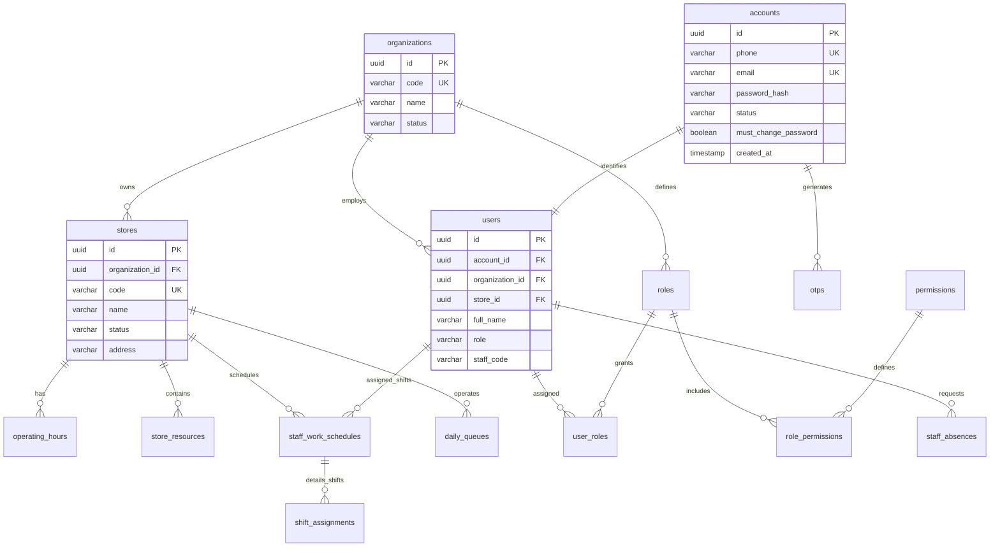
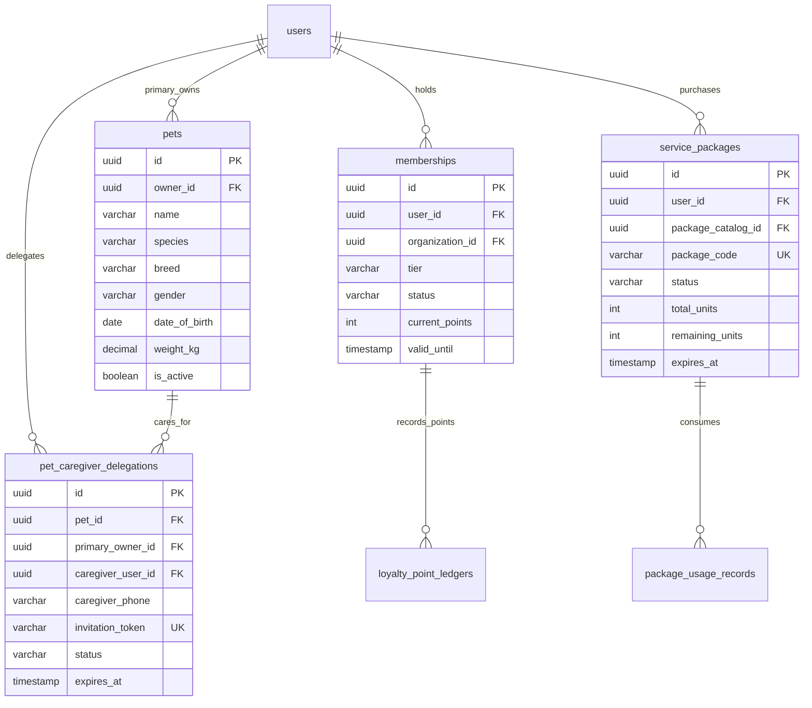
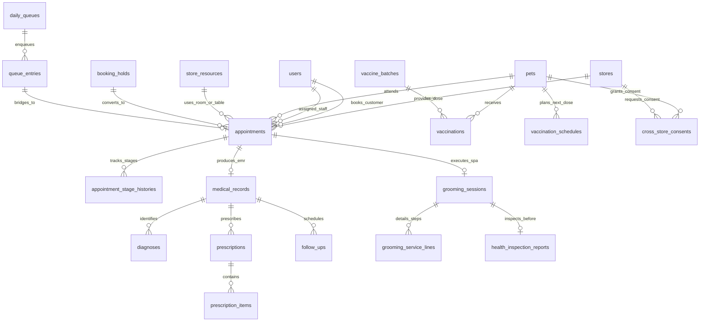
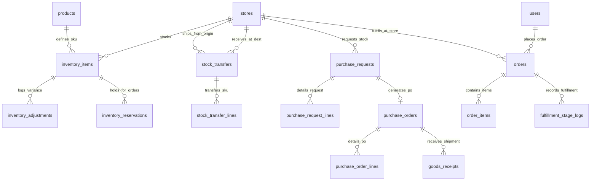
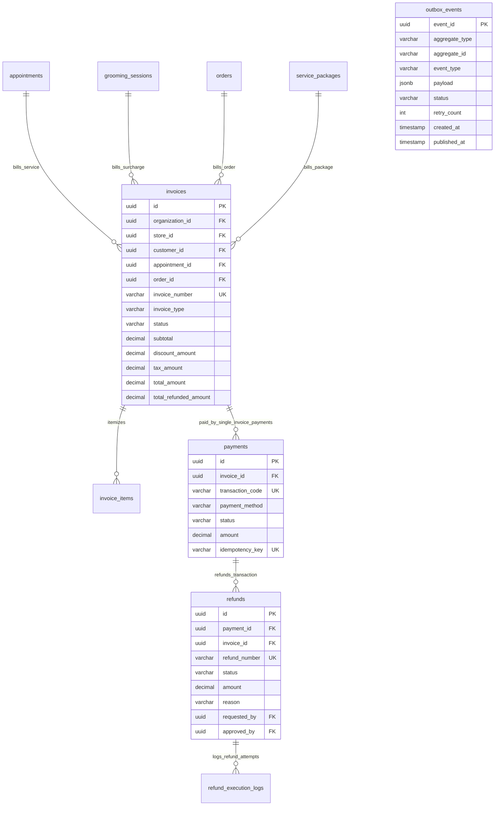

# Pet Care Ecosystem — Entity Relationship Diagram (ERD) & Database Schema Specification

> **Tài liệu Đặc tả Mô hình Dữ liệu Quan hệ (ERD & Database Schema)** cho toàn bộ hệ sinh thái Pet Care Ecosystem.
> **Nguồn chân lý nghiệp vụ (Source of Truth):** `docs/01-business-operations.md`.
> **Tài liệu bổ trợ đồng bộ:** `docs/02-business-rules.md` (Business Rules & Invariants), `docs/03-state-machines.md` (FSM & Event Bridges), `docs/04-glossary.md` (Ubiquitous Language & RBAC), `docs/05-domain-model.md` (Domain Model).
> **Chuẩn thiết kế CSDL:** PostgreSQL 17, Chuẩn hóa 3NF (Third Normal Form), toàn vẹn tham chiếu (Foreign Keys), phân đoạn Multi-tenancy qua `organization_id` & `store_id`, khóa lạc quan (`version` BIGINT) cho các Aggregate dễ tranh chấp và Transactional Outbox Pattern cho phân phối sự kiện.

---

# 1. Tổng quan Kiến trúc Dữ liệu Quan hệ (Relational Data Architecture)

1. **Khóa chính & Định danh (Primary Keys):**
   - Hầu hết các bảng Aggregate Root và Transactional Entities sử dụng `UUID` (chuẩn UUID v4 qua hàm `gen_random_uuid()` hoặc `uuid_generate_v4()`) để bảo mật, chống đoán ID và phân tán ghi tốt.
   - Các bảng danh mục mẫu, bảng tham chiếu cấu hình hoặc bảng tra cứu nhẹ có thể sử dụng `BIGSERIAL` / `BIGINT GENERATED ALWAYS AS IDENTITY`.

2. **Dấu vết Kiểm toán (Auditing Fields):**
   - Mọi bảng kế thừa `BaseEntity` đều có các cột kiểm toán cốt lõi:
     - `created_at TIMESTAMPTZ NOT NULL DEFAULT CURRENT_TIMESTAMP`
     - `updated_at TIMESTAMPTZ NOT NULL DEFAULT CURRENT_TIMESTAMP`
     - `created_by UUID NULL` (gắn với `accounts.id`)
     - `updated_by UUID NULL` (gắn với `accounts.id`)
     - `deleted_at TIMESTAMPTZ NULL` (cho các thực thể hỗ trợ Soft-delete)
     - `version BIGINT NOT NULL DEFAULT 0` (cho Optimistic Locking chống race condition)

3. **Phân lập Dữ liệu Đa chi nhánh (Multi-Tenancy Isolation):**
   - Các bảng ở mức Tổ chức chứa `organization_id UUID NOT NULL REFERENCES organizations(id)`.
   - Các bảng ở mức Chi nhánh chứa `store_id UUID NOT NULL REFERENCES stores(id)`.
   - Bảng tài khoản khách hàng và cấu hình hệ thống toàn cục ở mức `PLATFORM` không gắn cứng `organization_id` hoặc để `NULL`.

---

# 2. Sơ đồ Thực thể Quan hệ Toàn cục (Mermaid ERD Diagrams)

## 2.1. Phân hệ Tài khoản, IAM, Tổ chức & Nhân sự (Auth, IAM, Org & Workforce)



## 2.2. Phân hệ Khách hàng, Thú cưng, Ủy quyền, Gói dịch vụ & Hội viên



## 2.3. Phân hệ Đặt lịch hẹn, Xếp hàng, Khám bệnh (EMR), Tiêm chủng & Grooming



## 2.4. Phân hệ Đơn hàng, Kho, Chuyển kho & Mua sắm (Order, Inventory & Procurement)



## 2.5. Phân hệ Tài chính, Hóa đơn, Thanh toán, Hoàn tiền & Outbox Sự kiện



---
# 3. Đặc tả Chi tiết Toàn bộ Các Bảng Dữ liệu (Detailed Table Schemas)

---

## 3.1. Nhóm Bảng Xác thực & Phân quyền IAM (Modules 01 & 02)

### Bảng: `accounts`
- **Mục đích:** Lưu trữ thông tin tài khoản xác thực đăng nhập (khách hàng & nhân viên).
- **Primary Key:** `id UUID DEFAULT gen_random_uuid()`
- **Cột:**
  | Tên Cột | Kiểu Dữ liệu | Bắt buộc | Default | Mô tả |
  |---|---|---|---|---|
  | `id` | UUID | YES | `gen_random_uuid()` | Khóa chính tài khoản |
  | `phone` | VARCHAR(20) | YES | - | Số điện thoại duy nhất dùng đăng nhập |
  | `email` | VARCHAR(100) | NO | NULL | Email liên hệ duy nhất |
  | `password_hash` | VARCHAR(255) | YES | - | Chuỗi băm mật khẩu BCrypt |
  | `status` | VARCHAR(30) | YES | `'PENDING_VERIFICATION'` | Enum `AccountStatus` (`docs/03-state-machines.md#1`) |
  | `must_change_password` | BOOLEAN | YES | `false` | Cờ ép đổi mật khẩu (Staff D-04) |
  | `failed_login_attempts` | INT | YES | `0` | Đếm số lần đăng nhập sai |
  | `locked_until` | TIMESTAMPTZ | NO | NULL | Thời điểm mở khóa tự động |
  | `created_at` | TIMESTAMPTZ | YES | `CURRENT_TIMESTAMP` | Thời điểm tạo |
  | `updated_at` | TIMESTAMPTZ | YES | `CURRENT_TIMESTAMP` | Thời điểm cập nhật |
- **Ràng buộc & Chỉ mục:**
  - `CONSTRAINT uq_accounts_phone UNIQUE (phone)`
  - `CONSTRAINT uq_accounts_email UNIQUE (email)`
  - `INDEX idx_accounts_status (status)`

### Bảng: `otps`
- **Mục đích:** Quản lý mã OTP xác thực số điện thoại và đổi mật khẩu.
- **Primary Key:** `id UUID DEFAULT gen_random_uuid()`
- **Cột:**
  | Tên Cột | Kiểu Dữ liệu | Bắt buộc | Default | Mô tả |
  |---|---|---|---|---|
  | `id` | UUID | YES | `gen_random_uuid()` | Khóa chính phiên OTP |
  | `phone` | VARCHAR(20) | YES | - | Số điện thoại nhận mã OTP |
  | `otp_code` | VARCHAR(10) | YES | - | Mã OTP 6 chữ số |
  | `purpose` | VARCHAR(50) | YES | `'REGISTRATION'` | Mục đích: `REGISTRATION`, `PASSWORD_RESET`, `CONSENT` |
  | `is_used` | BOOLEAN | YES | `false` | Trạng thái đã sử dụng |
  | `attempt_count` | INT | YES | `0` | Số lần nhập thử (tối đa 5 - `RULE-01-02`) |
  | `expires_at` | TIMESTAMPTZ | YES | - | Thời điểm hết hạn (TTL 300s) |
  | `created_at` | TIMESTAMPTZ | YES | `CURRENT_TIMESTAMP` | Thời điểm gửi |
- **Ràng buộc & Chỉ mục:**
  - `INDEX idx_otps_phone_purpose (phone, purpose, is_used, expires_at)`

### Bảng: `users`
- **Mục đích:** Thông tin hồ sơ cá nhân của khách hàng và nhân viên hệ thống.
- **Primary Key:** `id UUID DEFAULT gen_random_uuid()`
- **Cột:**
  | Tên Cột | Kiểu Dữ liệu | Bắt buộc | Default | Mô tả |
  |---|---|---|---|---|
  | `id` | UUID | YES | `gen_random_uuid()` | Khóa chính hồ sơ người dùng |
  | `account_id` | UUID | YES | - | FK -> `accounts.id` (1:1) |
  | `organization_id` | UUID | NO | NULL | FK -> `organizations.id` (Staff gắn Org) |
  | `store_id` | UUID | NO | NULL | FK -> `stores.id` (Staff gắn Store) |
  | `full_name` | VARCHAR(100) | YES | - | Họ và tên đầy đủ |
  | `gender` | VARCHAR(10) | NO | NULL | Giới tính: `MALE`, `FEMALE`, `OTHER` |
  | `date_of_birth` | DATE | NO | NULL | Ngày sinh |
  | `avatar_url` | VARCHAR(255) | NO | NULL | Ảnh đại diện |
  | `role` | VARCHAR(30) | YES | `'CUSTOMER'` | Enum `UserRole` (`docs/04-glossary.md#2.2`) |
  | `staff_code` | VARCHAR(50) | NO | NULL | Mã nhân viên nội bộ |
  | `created_at` | TIMESTAMPTZ | YES | `CURRENT_TIMESTAMP` | Thời điểm tạo |
  | `updated_at` | TIMESTAMPTZ | YES | `CURRENT_TIMESTAMP` | Thời điểm cập nhật |
- **Ràng buộc & Chỉ mục:**
  - `CONSTRAINT fk_users_account FOREIGN KEY (account_id) REFERENCES accounts(id) ON DELETE RESTRICT`
  - `CONSTRAINT fk_users_org FOREIGN KEY (organization_id) REFERENCES organizations(id) ON DELETE SET NULL`
  - `CONSTRAINT fk_users_store FOREIGN KEY (store_id) REFERENCES stores(id) ON DELETE SET NULL`
  - `INDEX idx_users_org_store (organization_id, store_id)`
  - `INDEX idx_users_role (role)`

### Bảng: `roles`
- **Mục đích:** Định nghĩa các vai trò trong hệ thống (9 Canonical Roles + Custom Roles theo Tổ chức).
- **Primary Key:** `id UUID DEFAULT gen_random_uuid()`
- **Cột:**
  | Tên Cột | Kiểu Dữ liệu | Bắt buộc | Default | Mô tả |
  |---|---|---|---|---|
  | `id` | UUID | YES | `gen_random_uuid()` | Khóa chính vai trò |
  | `organization_id` | UUID | NO | NULL | FK -> `organizations.id` (NULL = System Global Role) |
  | `code` | VARCHAR(50) | YES | - | Mã vai trò (ví dụ: `STORE_MANAGER`, `VETERINARIAN`) |
  | `name` | VARCHAR(100) | YES | - | Tên hiển thị vai trò |
  | `scope` | VARCHAR(30) | YES | `'STORE'` | Enum `SecurityScope` (`PLATFORM`, `ORGANIZATION`, `STORE`, `WAREHOUSE`, `CUSTOMER`) |
  | `description` | TEXT | NO | NULL | Mô tả quyền hạn vai trò |
  | `created_at` | TIMESTAMPTZ | YES | `CURRENT_TIMESTAMP` | Thời điểm tạo |
- **Ràng buộc:**
  - `CONSTRAINT uq_roles_org_code UNIQUE (organization_id, code)`

### Bảng: `permissions`
- **Mục đích:** Danh mục quyền hạn nguyên tử trong hệ thống (Fine-grained Permissions).
- **Primary Key:** `id UUID DEFAULT gen_random_uuid()`
- **Cột:**
  | Tên Cột | Kiểu Dữ liệu | Bắt buộc | Default | Mô tả |
  |---|---|---|---|---|
  | `id` | UUID | YES | `gen_random_uuid()` | Khóa chính quyền hạn |
  | `code` | VARCHAR(100) | YES | - | Mã quyền duy nhất (ví dụ: `REFUND_APPROVE`, `EMR_BREAK_GLASS`) |
  | `module` | VARCHAR(50) | YES | - | Tên module nghiệp vụ (01 đến 25) |
  | `description` | TEXT | NO | NULL | Mô tả thao tác được cấp phép |
- **Ràng buộc:**
  - `CONSTRAINT uq_permissions_code UNIQUE (code)`

### Bảng: `role_permissions`
- **Mục đích:** Bảng liên kết nhiều-nhiều giữa Vai trò và Quyền hạn.
- **Primary Key:** `(role_id, permission_id)`
- **Cột:**
  | Tên Cột | Kiểu Dữ liệu | Bắt buộc | Default | Mô tả |
  |---|---|---|---|---|
  | `role_id` | UUID | YES | - | FK -> `roles.id` ON DELETE CASCADE |
  | `permission_id` | UUID | YES | - | FK -> `permissions.id` ON DELETE CASCADE |

### Bảng: `user_roles`
- **Mục đích:** Gán vai trò cho người dùng trong một phạm vi cụ thể (Scope Assignment).
- **Primary Key:** `id UUID DEFAULT gen_random_uuid()`
- **Cột:**
  | Tên Cột | Kiểu Dữ liệu | Bắt buộc | Default | Mô tả |
  |---|---|---|---|---|
  | `id` | UUID | YES | `gen_random_uuid()` | Khóa chính gán vai trò |
  | `user_id` | UUID | YES | - | FK -> `users.id` ON DELETE CASCADE |
  | `role_id` | UUID | YES | - | FK -> `roles.id` ON DELETE CASCADE |
  | `scope_id` | UUID | NO | NULL | ID của Store hoặc Organization tương ứng |
  | `created_at` | TIMESTAMPTZ | YES | `CURRENT_TIMESTAMP` | Thời điểm gán |

---

## 3.2. Nhóm Bảng Tổ chức, Chi nhánh & Danh mục (Modules 03 & 05)

### Bảng: `organizations`
- **Mục đích:** Định danh doanh nghiệp / Chuỗi phòng khám thú cưng (Tenant cha).
- **Primary Key:** `id UUID DEFAULT gen_random_uuid()`
- **Cột:**
  | Tên Cột | Kiểu Dữ liệu | Bắt buộc | Default | Mô tả |
  |---|---|---|---|---|
  | `id` | UUID | YES | `gen_random_uuid()` | Khóa chính tổ chức |
  | `code` | VARCHAR(50) | YES | - | Mã viết tắt tổ chức (Unique) |
  | `name` | VARCHAR(255) | YES | - | Tên đầy đủ của doanh nghiệp/chuỗi |
  | `tax_code` | VARCHAR(50) | NO | NULL | Mã số thuế |
  | `status` | VARCHAR(30) | YES | `'ACTIVE'` | Trạng thái: `ACTIVE`, `SUSPENDED`, `INACTIVE` |
  | `created_at` | TIMESTAMPTZ | YES | `CURRENT_TIMESTAMP` | Thời điểm tạo |
  | `updated_at` | TIMESTAMPTZ | YES | `CURRENT_TIMESTAMP` | Thời điểm cập nhật |

### Bảng: `stores`
- **Mục đích:** Điểm kinh doanh / Chi nhánh phòng khám & spa thú cưng hoặc Kho tổng trung tâm (Facility).
- **Primary Key:** `id UUID DEFAULT gen_random_uuid()`
- **Cột:**
  | Tên Cột | Kiểu Dữ liệu | Bắt buộc | Default | Mô tả |
  |---|---|---|---|---|
  | `id` | UUID | YES | `gen_random_uuid()` | Khóa chính chi nhánh / cơ sở |
  | `organization_id` | UUID | YES | - | FK -> `organizations.id` |
  | `code` | VARCHAR(50) | YES | - | Mã chi nhánh (Unique trong Org) |
  | `name` | VARCHAR(255) | YES | - | Tên chi nhánh / kho trung tâm |
  | `facility_type` | VARCHAR(30) | YES | `'RETAIL_STORE'` | `RETAIL_STORE` (Chi nhánh bán lẻ/khám/spa), `CENTRAL_WAREHOUSE` (Kho tổng) |
  | `address` | TEXT | YES | - | Địa chỉ đầy đủ |
  | `phone` | VARCHAR(20) | YES | - | Số hotline chi nhánh / kho |
  | `status` | VARCHAR(30) | YES | `'DRAFT'` | Enum `StoreStatus` (`docs/03-state-machines.md#2`) |
  | `created_at` | TIMESTAMPTZ | YES | `CURRENT_TIMESTAMP` | Thời điểm tạo |
  | `updated_at` | TIMESTAMPTZ | YES | `CURRENT_TIMESTAMP` | Thời điểm cập nhật |
- **Ràng buộc:**
  - `CONSTRAINT fk_stores_org FOREIGN KEY (organization_id) REFERENCES organizations(id) ON DELETE CASCADE`
  - `CONSTRAINT uq_stores_org_code UNIQUE (organization_id, code)`

### Bảng: `operating_hours`
- **Mục đích:** Cấu hình thời gian mở/đóng cửa từng ngày trong tuần của Store.
- **Primary Key:** `id UUID DEFAULT gen_random_uuid()`
- **Cột:**
  | Tên Cột | Kiểu Dữ liệu | Bắt buộc | Default | Mô tả |
  |---|---|---|---|---|
  | `id` | UUID | YES | `gen_random_uuid()` | Khóa chính |
  | `store_id` | UUID | YES | - | FK -> `stores.id` |
  | `day_of_week` | INT | YES | - | 1 (Chủ nhật) đến 7 (Thứ bảy) |
  | `open_time` | TIME | NO | NULL | Giờ mở cửa |
  | `close_time` | TIME | NO | NULL | Giờ đóng cửa |
  | `is_closed` | BOOLEAN | YES | `false` | Cờ đóng cửa nguyên ngày |
- **Ràng buộc:**
  - `CONSTRAINT fk_operating_hours_store FOREIGN KEY (store_id) REFERENCES stores(id) ON DELETE CASCADE`
  - `CONSTRAINT uq_operating_hours_store_day UNIQUE (store_id, day_of_week)`

### Bảng: `store_resources`
- **Mục đích:** Quản lý cơ sở vật chất phòng khám, bàn grooming và máy móc kỹ thuật.
- **Primary Key:** `id UUID DEFAULT gen_random_uuid()`
- **Cột:**
  | Tên Cột | Kiểu Dữ liệu | Bắt buộc | Default | Mô tả |
  |---|---|---|---|---|
  | `id` | UUID | YES | `gen_random_uuid()` | Khóa chính tài nguyên |
  | `store_id` | UUID | YES | - | FK -> `stores.id` |
  | `resource_code` | VARCHAR(50) | YES | - | Mã phòng/bàn (ví dụ: `ROOM_01`, `TABLE_02`) |
  | `resource_name` | VARCHAR(100) | YES | - | Tên hiển thị tài nguyên |
  | `resource_type` | VARCHAR(50) | YES | - | `CLINIC_ROOM`, `GROOMING_TABLE`, `ULTRASOUND_MACHINE` |
  | `is_active` | BOOLEAN | YES | `true` | Trạng thái sẵn sàng sử dụng |
  | `created_at` | TIMESTAMPTZ | YES | `CURRENT_TIMESTAMP` | Thời điểm tạo |
- **Ràng buộc:**
  - `CONSTRAINT fk_resources_store FOREIGN KEY (store_id) REFERENCES stores(id) ON DELETE CASCADE`
  - `CONSTRAINT uq_store_resources_code UNIQUE (store_id, resource_code)`

### Bảng: `services` & `service_required_resources`
- **Mục đích:** Danh mục dịch vụ chuẩn và khai báo tài nguyên bắt buộc (Triple Collision Guard).
- **Primary Key:** `id UUID DEFAULT gen_random_uuid()`
- **Cột (`services`):**
  | Tên Cột | Kiểu Dữ liệu | Bắt buộc | Default | Mô tả |
  |---|---|---|---|---|
  | `id` | UUID | YES | `gen_random_uuid()` | Khóa chính dịch vụ |
  | `organization_id` | UUID | YES | - | FK -> `organizations.id` |
  | `code` | VARCHAR(50) | YES | - | Mã dịch vụ |
  | `name` | VARCHAR(255) | YES | - | Tên dịch vụ hiển thị |
  | `category` | VARCHAR(50) | YES | - | `CLINICAL`, `VACCINATION`, `GROOMING`, `SPA` |
  | `base_price` | DECIMAL(12,2) | YES | `0.00` | Giá niêm yết chuẩn |
  | `duration_minutes` | INT | YES | `30` | Thời lượng phục vụ định mức |
  | `is_active` | BOOLEAN | YES | `true` | Trạng thái phát hành |
  | `created_at` | TIMESTAMPTZ | YES | `CURRENT_TIMESTAMP` | Thời điểm tạo |
- **Cột (`service_required_resources`):**
  | Tên Cột | Kiểu Dữ liệu | Bắt buộc | Default | Mô tả |
  |---|---|---|---|---|
  | `id` | UUID | YES | `gen_random_uuid()` | Khóa chính |
  | `service_id` | UUID | YES | - | FK -> `services.id` ON DELETE CASCADE |
  | `resource_type` | VARCHAR(50) | YES | - | `CLINIC_ROOM`, `GROOMING_TABLE`, `ULTRASOUND_MACHINE` |
  | `quantity_required` | INT | YES | `1` | Số lượng tài nguyên cần |

### Bảng: `products`
- **Mục đích:** Danh mục sản phẩm hàng hóa bán lẻ gốc, sở hữu và quản lý toàn quyền ở cấp Organization.
- **Primary Key:** `id UUID DEFAULT gen_random_uuid()`
- **Cột:**
  | Tên Cột | Kiểu Dữ liệu | Bắt buộc | Default | Mô tả |
  |---|---|---|---|---|
  | `id` | UUID | YES | `gen_random_uuid()` | Khóa chính sản phẩm |
  | `organization_id` | UUID | YES | - | FK -> `organizations.id` |
  | `sku` | VARCHAR(50) | YES | - | Mã quản lý tồn kho duy nhất (SKU) |
  | `barcode` | VARCHAR(50) | NO | NULL | Mã vạch quét POS |
  | `name` | VARCHAR(255) | YES | - | Tên sản phẩm |
  | `category` | VARCHAR(50) | YES | - | `FOOD`, `MEDICINE`, `ACCESSORY`, `HYGIENE` |
  | `unit` | VARCHAR(20) | YES | `'ITEM'` | Đơn vị tính: `ITEM`, `BOX`, `BOTTLE`, `BAG` |
  | `base_price` | DECIMAL(12,2) | YES | `0.00` | Giá bán lẻ đề xuất |
  | `cost_price` | DECIMAL(12,2) | YES | `0.00` | Giá vốn nhập hàng |
  | `is_active` | BOOLEAN | YES | `true` | Trạng thái mở bán |
  | `created_at` | TIMESTAMPTZ | YES | `CURRENT_TIMESTAMP` | Thời điểm tạo |
- **Ràng buộc:**
  - `CONSTRAINT uq_products_org_sku UNIQUE (organization_id, sku)`

### Bảng: `store_products` & `store_services`
- **Mục đích:** Override giá bán lẻ (Product/Service) và khả dụng (Service) riêng theo từng Store (`RULE-05-04`, `RULE-05-05`, `RULE-05-07`). Bản ghi được hệ thống tự động khởi tạo, kế thừa `base_price`/`is_active` từ `products`/`services`, khi Store chuyển sang `ACTIVE`.
- **Primary Key:** `id UUID DEFAULT gen_random_uuid()`
- **Cột (`store_products`):**
  | Tên Cột | Kiểu Dữ liệu | Bắt buộc | Default | Mô tả |
  |---|---|---|---|---|
  | `id` | UUID | YES | `gen_random_uuid()` | Khóa chính override |
  | `store_id` | UUID | YES | - | FK -> `stores.id` ON DELETE CASCADE |
  | `product_id` | UUID | YES | - | FK -> `products.id` ON DELETE CASCADE |
  | `price` | DECIMAL(12,2) | YES | kế thừa `products.base_price` | Giá bán lẻ override riêng tại Store |
  | `created_at` | TIMESTAMPTZ | YES | `CURRENT_TIMESTAMP` | Thời điểm tạo override |
  | `updated_at` | TIMESTAMPTZ | YES | `CURRENT_TIMESTAMP` | Thời điểm cập nhật gần nhất |
- **Cột (`store_services`):**
  | Tên Cột | Kiểu Dữ liệu | Bắt buộc | Default | Mô tả |
  |---|---|---|---|---|
  | `id` | UUID | YES | `gen_random_uuid()` | Khóa chính override |
  | `store_id` | UUID | YES | - | FK -> `stores.id` ON DELETE CASCADE |
  | `service_id` | UUID | YES | - | FK -> `services.id` ON DELETE CASCADE |
  | `price` | DECIMAL(12,2) | YES | kế thừa `services.base_price` | Giá dịch vụ override riêng tại Store |
  | `is_active` | BOOLEAN | YES | kế thừa `services.is_active` | Khả dụng override riêng tại Store (`RULE-05-04`) |
  | `created_at` | TIMESTAMPTZ | YES | `CURRENT_TIMESTAMP` | Thời điểm tạo override |
  | `updated_at` | TIMESTAMPTZ | YES | `CURRENT_TIMESTAMP` | Thời điểm cập nhật gần nhất |
- **Ràng buộc:**
  - `CONSTRAINT uq_store_products_store_product UNIQUE (store_id, product_id)`
  - `CONSTRAINT uq_store_services_store_service UNIQUE (store_id, service_id)`

## 3.3. Nhóm Bảng Thú cưng, Lịch hẹn, Ca trực & Xếp hàng (Modules 04, 06, 07 & 08)

### Bảng: `pets` & `pet_caregiver_delegations`
- **Mục đích:** Lý lịch thú cưng và phân quyền ủy quyền chăm sóc (ReBAC).
- **Primary Key:** `id UUID DEFAULT gen_random_uuid()`
- **Cột (`pets`):**
  | Tên Cột | Kiểu Dữ liệu | Bắt buộc | Default | Mô tả |
  |---|---|---|---|---|
  | `id` | UUID | YES | `gen_random_uuid()` | Khóa chính thú cưng |
  | `owner_id` | UUID | YES | - | FK -> `users.id` (Chủ sở hữu chính) |
  | `name` | VARCHAR(100) | YES | - | Tên thú cưng |
  | `species` | VARCHAR(50) | YES | `'DOG'` | `DOG`, `CAT`, `BIRD`, `OTHER` |
  | `breed` | VARCHAR(100) | NO | NULL | Giống thú cưng |
  | `gender` | VARCHAR(10) | YES | `'UNKNOWN'` | `MALE`, `FEMALE`, `UNKNOWN` |
  | `date_of_birth` | DATE | NO | NULL | Ngày sinh |
  | `weight_kg` | DECIMAL(5,2) | NO | NULL | Cân nặng gần nhất |
  | `microchip_number` | VARCHAR(50) | NO | NULL | Số gắn chip định danh |
  | `avatar_url` | VARCHAR(255) | NO | NULL | Ảnh thú cưng |
  | `is_active` | BOOLEAN | YES | `true` | Cờ hoạt động |
  | `created_at` | TIMESTAMPTZ | YES | `CURRENT_TIMESTAMP` | Thời điểm tạo |
- **Cột (`pet_caregiver_delegations`):**
  | Tên Cột | Kiểu Dữ liệu | Bắt buộc | Default | Mô tả |
  |---|---|---|---|---|
  | `id` | UUID | YES | `gen_random_uuid()` | Khóa chính ủy quyền |
  | `pet_id` | UUID | YES | - | FK -> `pets.id` |
  | `primary_owner_id` | UUID | YES | - | FK -> `users.id` |
  | `caregiver_user_id` | UUID | NO | NULL | FK -> `users.id` |
  | `caregiver_phone` | VARCHAR(20) | YES | - | SĐT nhận lời mời |
  | `invitation_token` | VARCHAR(100) | YES | - | Token định danh lời mời |
  | `status` | VARCHAR(30) | YES | `'INVITED'` | Enum `CaregiverStatus` (`docs/03-state-machines.md#3`) |
  | `expires_at` | TIMESTAMPTZ | YES | - | Hết hạn sau 7 ngày (`RULE-04-05`) |

### Bảng: `booking_holds`
- **Mục đích:** Giữ chỗ tạm thời trong 15 phút (Hold TTL 900s).
- **Primary Key:** `id UUID DEFAULT gen_random_uuid()`
- **Cột:**
  | Tên Cột | Kiểu Dữ liệu | Bắt buộc | Default | Mô tả |
  |---|---|---|---|---|
  | `id` | UUID | YES | `gen_random_uuid()` | Khóa chính phiên giữ chỗ |
  | `store_id` | UUID | YES | - | FK -> `stores.id` |
  | `resource_id` | UUID | NO | NULL | FK -> `store_resources.id` |
  | `staff_id` | UUID | NO | NULL | FK -> `users.id` |
  | `customer_id` | UUID | YES | - | FK -> `users.id` |
  | `pet_id` | UUID | YES | - | FK -> `pets.id` |
  | `service_id` | UUID | YES | - | FK -> `services.id` |
  | `start_time` | TIMESTAMPTZ | YES | - | Bắt đầu slot |
  | `end_time` | TIMESTAMPTZ | YES | - | Kết thúc slot |
  | `status` | VARCHAR(30) | YES | `'HOLDING'` | Enum `BookingHoldStatus` (`docs/03-state-machines.md#4.1`) |
  | `expires_at` | TIMESTAMPTZ | YES | - | Hết hạn giữ slot (Now + 15m) |

### Bảng: `appointments` & `appointment_stage_histories`
- **Mục đích:** Quản lý vòng đời cuộc hẹn và lịch sử chuyển đổi trạng thái phục vụ.
- **Primary Key:** `id UUID DEFAULT gen_random_uuid()`
- **Cột (`appointments`):**
  | Tên Cột | Kiểu Dữ liệu | Bắt buộc | Default | Mô tả |
  |---|---|---|---|---|
  | `id` | UUID | YES | `gen_random_uuid()` | Khóa chính cuộc hẹn |
  | `store_id` | UUID | YES | - | FK -> `stores.id` |
  | `customer_id` | UUID | YES | - | FK -> `users.id` |
  | `pet_id` | UUID | YES | - | FK -> `pets.id` |
  | `service_id` | UUID | YES | - | FK -> `services.id` |
  | `staff_id` | UUID | NO | NULL | FK -> `users.id` |
  | `resource_id` | UUID | NO | NULL | FK -> `store_resources.id` |
  | `queue_entry_id`| UUID | NO | NULL | FK -> `queue_entries.id` (Cầu nối Walk-in `RULE-07-05`) |
  | `appointment_number`| VARCHAR(50)| YES | - | Mã số cuộc hẹn duy nhất |
  | `start_time` | TIMESTAMPTZ | YES | - | Bắt đầu dự kiến |
  | `end_time` | TIMESTAMPTZ | YES | - | Kết thúc dự kiến |
  | `actual_start_time`| TIMESTAMPTZ | NO | NULL | Bắt đầu thực tế |
  | `actual_end_time` | TIMESTAMPTZ | NO | NULL | Kết thúc thực tế |
  | `channel` | VARCHAR(20) | YES | `'ONLINE'` | `ONLINE`, `WALK_IN`, `PHONE` |
  | `status` | VARCHAR(30) | YES | `'BOOKED'` | Enum `AppointmentStatus` (`docs/03-state-machines.md#4.2`) |
  | `cancellation_reason`| TEXT | NO | NULL | Lý do hủy hẹn |
  | `abort_reason` | TEXT | NO | NULL | Lý do dừng khẩn cấp (`RULE-06-08`) |
  | `version` | BIGINT | YES | `0` | Khóa lạc quan chống xung đột |
- **Ràng buộc:**
  - `CONSTRAINT chk_appointment_walkin_queue CHECK ((channel = 'WALK_IN' AND queue_entry_id IS NOT NULL) OR (channel != 'WALK_IN' AND queue_entry_id IS NULL))`
- **Cột (`appointment_stage_histories`):**
  | Tên Cột | Kiểu Dữ liệu | Bắt buộc | Default | Mô tả |
  |---|---|---|---|---|
  | `id` | UUID | YES | `gen_random_uuid()` | Khóa chính lịch sử |
  | `appointment_id` | UUID | YES | - | FK -> `appointments.id` ON DELETE CASCADE |
  | `from_status` | VARCHAR(30) | YES | - | Trạng thái trước |
  | `to_status` | VARCHAR(30) | YES | - | Trạng thái chuyển đến |
  | `changed_by` | UUID | YES | - | FK -> `users.id` |
  | `notes` | TEXT | NO | NULL | Ghi chú chuyển trạng thái |
  | `created_at` | TIMESTAMPTZ | YES | `CURRENT_TIMESTAMP` | Thời điểm chuyển |

### Bảng: `staff_work_schedules`, `shift_assignments` & `staff_absences`
- **Mục đích:** Quản lý lịch phân ca kíp nhân sự và đơn xin nghỉ phép tại Store (Module 08).
- **Primary Key:** `id UUID DEFAULT gen_random_uuid()`
- **Cột (`staff_work_schedules`):**
  | Tên Cột | Kiểu Dữ liệu | Bắt buộc | Default | Mô tả |
  |---|---|---|---|---|
  | `id` | UUID | YES | `gen_random_uuid()` | Khóa chính bảng phân ca |
  | `store_id` | UUID | YES | - | FK -> `stores.id` |
  | `schedule_date` | DATE | YES | - | Ngày phân ca |
  | `created_by` | UUID | YES | - | FK -> `users.id` (Store Manager) |
- **Cột (`shift_assignments`):**
  | Tên Cột | Kiểu Dữ liệu | Bắt buộc | Default | Mô tả |
  |---|---|---|---|---|
  | `id` | UUID | YES | `gen_random_uuid()` | Khóa chính ca làm việc |
  | `schedule_id` | UUID | YES | - | FK -> `staff_work_schedules.id` ON DELETE CASCADE |
  | `staff_id` | UUID | YES | - | FK -> `users.id` |
  | `shift_type` | VARCHAR(30) | YES | `'MORNING'` | `MORNING`, `AFTERNOON`, `FULL_DAY` |
  | `start_time` | TIME | YES | - | Giờ bắt đầu ca |
  | `end_time` | TIME | YES | - | Giờ kết thúc ca |
- **Cột (`staff_absences`):**
  | Tên Cột | Kiểu Dữ liệu | Bắt buộc | Default | Mô tả |
  |---|---|---|---|---|
  | `id` | UUID | YES | `gen_random_uuid()` | Khóa chính đơn nghỉ phép |
  | `staff_id` | UUID | YES | - | FK -> `users.id` |
  | `store_id` | UUID | YES | - | FK -> `stores.id` |
  | `absence_type` | VARCHAR(30) | YES | `'VACATION'` | `SICK`, `VACATION`, `UNPAID` |
  | `start_date` | DATE | YES | - | Ngày bắt đầu nghỉ |
  | `end_date` | DATE | YES | - | Ngày kết thúc nghỉ |
  | `status` | VARCHAR(30) | YES | `'PENDING'` | `PENDING`, `APPROVED`, `REJECTED` |
  | `approved_by` | UUID | NO | NULL | FK -> `users.id` |

### Bảng: `daily_queues` & `queue_entries`
- **Mục đích:** Quản lý thứ tự phục vụ khách vãng lai (Walk-in) tại chi nhánh (Module 07).
- **Primary Key:** `id UUID DEFAULT gen_random_uuid()`
- **Cột (`daily_queues`):**
  | Tên Cột | Kiểu Dữ liệu | Bắt buộc | Default | Mô tả |
  |---|---|---|---|---|
  | `id` | UUID | YES | `gen_random_uuid()` | Khóa chính phiên hàng đợi |
  | `store_id` | UUID | YES | - | FK -> `stores.id` |
  | `queue_date` | DATE | YES | `CURRENT_DATE` | Ngày phục vụ |
  | `is_active` | BOOLEAN | YES | `true` | Trạng thái tiếp nhận |
  | `created_at` | TIMESTAMPTZ | YES | `CURRENT_TIMESTAMP` | Thời điểm tạo |
- **Cột (`queue_entries`):**
  | Tên Cột | Kiểu Dữ liệu | Bắt buộc | Default | Mô tả |
  |---|---|---|---|---|
  | `id` | UUID | YES | `gen_random_uuid()` | Khóa chính lượt xếp hàng |
  | `queue_id` | UUID | YES | - | FK -> `daily_queues.id` ON DELETE CASCADE |
  | `store_id` | UUID | YES | - | FK -> `stores.id` |
  | `customer_id` | UUID | NO | NULL | FK -> `users.id` |
  | `pet_id` | UUID | NO | NULL | FK -> `pets.id` |
  | `service_id` | UUID | YES | - | FK -> `services.id` |
  | `appointment_id` | UUID | NO | NULL | FK -> `appointments.id` (Walk-in bridge `RULE-07-05`) |
  | `queue_number` | VARCHAR(20) | YES | - | Số thứ tự cấp (ví dụ: `A-001`, `E-001`) |
  | `priority` | VARCHAR(30) | YES | `'NORMAL'` | `NORMAL`, `URGENT`, `TRIAGE_EMERGENCY` |
  | `status` | VARCHAR(30) | YES | `'WAITING'` | Enum `QueueEntryStatus` (`docs/03-state-machines.md#17`) |
  | `called_times` | INT | YES | `0` | Đếm số lần gọi (tối đa 3 - `RULE-07-06`) |
  | `created_at` | TIMESTAMPTZ | YES | `CURRENT_TIMESTAMP` | Thời điểm lấy số |
- **Ràng buộc:**
  - `CONSTRAINT uq_queue_entries_appointment_id UNIQUE (appointment_id)`

---

## 3.4. Nhóm Bảng Khám bệnh (EMR), Tiêm chủng, Grooming & Quyền riêng tư (Modules 09, 10, 11 & 22)

### Bảng: `medical_records`, `diagnoses`, `prescriptions` & `prescription_items`
- **Mục đích:** Bệnh án điện tử EMR bất biến 24h (`RULE-09-06`), chẩn đoán và đơn thuốc điều trị.
- **Primary Key:** `id UUID DEFAULT gen_random_uuid()`
- **Cột (`medical_records`):**
  | Tên Cột | Kiểu Dữ liệu | Bắt buộc | Default | Mô tả |
  |---|---|---|---|---|
  | `id` | UUID | YES | `gen_random_uuid()` | Khóa chính bệnh án |
  | `appointment_id` | UUID | NO | NULL | FK -> `appointments.id` |
  | `store_id` | UUID | YES | - | FK -> `stores.id` |
  | `pet_id` | UUID | YES | - | FK -> `pets.id` |
  | `veterinarian_id` | UUID | YES | - | FK -> `users.id` |
  | `record_number` | VARCHAR(50) | YES | - | Mã hồ sơ bệnh án duy nhất |
  | `chief_complaint` | TEXT | YES | - | Triệu chứng ban đầu |
  | `clinical_signs` | TEXT | NO | NULL | Dấu hiệu lâm sàng |
  | `temperature_celsius`| DECIMAL(4,1)| NO | NULL | Thân nhiệt |
  | `weight_kg` | DECIMAL(5,2) | YES | - | Cân nặng tại thời điểm khám |
  | `treatment_plan` | TEXT | NO | NULL | Phác đồ điều trị |
  | `is_locked` | BOOLEAN | YES | `false` | Cờ đóng băng bệnh án sau 24h (`RULE-09-06`) |
  | `locked_at` | TIMESTAMPTZ | NO | NULL | Thời điểm đóng băng bất biến |
- **Cột (`diagnoses`):**
  | Tên Cột | Kiểu Dữ liệu | Bắt buộc | Default | Mô tả |
  |---|---|---|---|---|
  | `id` | UUID | YES | `gen_random_uuid()` | Khóa chính chẩn đoán |
  | `medical_record_id`| UUID | YES | - | FK -> `medical_records.id` ON DELETE CASCADE |
  | `diagnostic_code` | VARCHAR(50) | YES | - | Mã bệnh học danh mục |
  | `description` | TEXT | YES | - | Mô tả chi tiết kết luận bệnh lý |
- **Cột (`prescriptions` & `prescription_items`):**
  | Tên Cột | Kiểu Dữ liệu | Bắt buộc | Default | Mô tả |
  |---|---|---|---|---|
  | `id` | UUID | YES | `gen_random_uuid()` | Khóa chính dòng đơn thuốc |
  | `prescription_id` | UUID | YES | - | FK -> `prescriptions.id` ON DELETE CASCADE |
  | `product_id` | UUID | YES | - | FK -> `products.id` (Thuốc) |
  | `quantity` | INT | YES | - | Số lượng thuốc kê |
  | `dosage` | VARCHAR(100) | YES | - | Liều lượng dùng |
  | `frequency` | VARCHAR(100) | YES | - | Tần suất dùng |
  | `duration_days` | INT | YES | - | Số ngày dùng |
  | `instructions` | TEXT | NO | NULL | Hướng dẫn sử dụng chi tiết |

### Bảng: `vaccines`, `vaccine_batches`, `vaccinations` & `vaccination_schedules`
- **Mục đích:** Quản lý lô vaccine theo hạn dùng (FEFO) và lịch sử tiêm chủng thú cưng (Module 10).
- **Primary Key:** `id UUID DEFAULT gen_random_uuid()`
- **Cột (`vaccine_batches`):**
  | Tên Cột | Kiểu Dữ liệu | Bắt buộc | Default | Mô tả |
  |---|---|---|---|---|
  | `id` | UUID | YES | `gen_random_uuid()` | Khóa chính lô vaccine |
  | `store_id` | UUID | YES | - | FK -> `stores.id` |
  | `vaccine_id` | UUID | YES | - | FK -> `products.id` |
  | `batch_number` | VARCHAR(50) | YES | - | Số lô sản xuất |
  | `expiry_date` | DATE | YES | - | Hạn sử dụng |
  | `quantity_initial` | INT | YES | - | Số liều ban đầu |
  | `quantity_remaining`| INT | YES | - | Số liều còn lại khả dụng |
- **Cột (`vaccinations`):**
  | Tên Cột | Kiểu Dữ liệu | Bắt buộc | Default | Mô tả |
  |---|---|---|---|---|
  | `id` | UUID | YES | `gen_random_uuid()` | Khóa chính mũi tiêm |
  | `pet_id` | UUID | YES | - | FK -> `pets.id` |
  | `store_id` | UUID | YES | - | FK -> `stores.id` |
  | `vaccine_id` | UUID | YES | - | FK -> `products.id` |
  | `batch_id` | UUID | YES | - | FK -> `vaccine_batches.id` |
  | `veterinarian_id` | UUID | YES | - | FK -> `users.id` |
  | `dose_volume_ml` | DECIMAL(4,2) | YES | `1.00` | Dung tích tiêm |
  | `administered_at` | TIMESTAMPTZ | YES | `CURRENT_TIMESTAMP` | Thời điểm tiêm thực tế |
  | `next_due_date` | DATE | NO | NULL | Ngày hẹn tiêm mũi tiếp |

### Bảng: `grooming_sessions`, `health_inspection_reports` & `grooming_service_lines`
- **Mục đích:** Quy trình spa làm đẹp, biên bản kiểm tra thể trạng tiền phục vụ và chi tiết dịch vụ (Module 11).
- **Primary Key:** `id UUID DEFAULT gen_random_uuid()`
- **Cột (`grooming_sessions`):**
  | Tên Cột | Kiểu Dữ liệu | Bắt buộc | Default | Mô tả |
  |---|---|---|---|---|
  | `id` | UUID | YES | `gen_random_uuid()` | Khóa chính phiên grooming |
  | `appointment_id` | UUID | YES | - | FK -> `appointments.id` (1:1) |
  | `store_id` | UUID | YES | - | FK -> `stores.id` |
  | `pet_id` | UUID | YES | - | FK -> `pets.id` |
  | `groomer_id` | UUID | YES | - | FK -> `users.id` |
  | `status` | VARCHAR(30) | YES | `'WAITING'` | Enum `GroomingStatus` (`docs/03-state-machines.md#15`) |
  | `has_surcharge` | BOOLEAN | YES | `false` | Cờ phát sinh phụ phí |
  | `surcharge_invoice_id`| UUID | NO | NULL | FK -> `invoices.id` (Surcharge Invoice D-02) |
  | `abort_reason` | TEXT | NO | NULL | Lý do dừng khẩn cấp (`RULE-11-06`) |
- **Cột (`health_inspection_reports`):**
  | Tên Cột | Kiểu Dữ liệu | Bắt buộc | Default | Mô tả |
  |---|---|---|---|---|
  | `id` | UUID | YES | `gen_random_uuid()` | Khóa chính biên bản kiểm tra |
  | `grooming_session_id`| UUID | YES | - | FK -> `grooming_sessions.id` ON DELETE CASCADE |
  | `skin_coat_condition`| TEXT | YES | - | Tình trạng da lông (ve, bọ chét, nấm, viêm da) |
  | `ear_eye_condition` | TEXT | YES | - | Tình trạng tai mắt |
  | `temperament` | VARCHAR(30) | YES | `'CALM'` | Tính khí: `CALM`, `AGGRESSIVE`, `FEARFUL` |
  | `is_accepted` | BOOLEAN | YES | `true` | Đủ điều kiện nhận phục vụ (`RULE-11-02`) |
  | `rejection_reason` | TEXT | NO | NULL | Lý do từ chối phục vụ |
- **Cột (`grooming_service_lines`):**
  | Tên Cột | Kiểu Dữ liệu | Bắt buộc | Default | Mô tả |
  |---|---|---|---|---|
  | `id` | UUID | YES | `gen_random_uuid()` | Khóa chính dòng dịch vụ |
  | `grooming_session_id`| UUID | YES | - | FK -> `grooming_sessions.id` ON DELETE CASCADE |
  | `service_id` | UUID | YES | - | FK -> `services.id` |
  | `is_addon` | BOOLEAN | YES | `false` | Cờ dịch vụ phụ phát sinh tại bàn |
  | `price` | DECIMAL(12,2) | YES | - | Đơn giá phụ thu |
  | `customer_approved`| BOOLEAN | YES | `false` | Khách đã duyệt dịch vụ phát sinh |

### Bảng: `cross_store_consents`
- **Mục đích:** Cấp phép truy cập bệnh án liên Store (OTP 24h & Break-Glass - `RULE-22-02`, `RULE-22-08`).
- **Primary Key:** `id UUID DEFAULT gen_random_uuid()`
- **Cột:**
  | Tên Cột | Kiểu Dữ liệu | Bắt buộc | Default | Mô tả |
  |---|---|---|---|---|
  | `id` | UUID | YES | `gen_random_uuid()` | Khóa chính phiên đồng thuận |
  | `pet_id` | UUID | YES | - | FK -> `pets.id` |
  | `requesting_store_id`| UUID | YES | - | FK -> `stores.id` (Store xin quyền truy cập EMR) |
  | `source_store_id` | UUID | NO | NULL | FK -> `stores.id` (Store sở hữu hồ sơ gốc hoặc NULL nếu cấp toàn chuỗi) |
  | `scope_type` | VARCHAR(30) | YES | `'ALL_STORES'` | `ALL_STORES`, `SPECIFIC_STORE` |
  | `requesting_doctor_id`| UUID | YES | - | FK -> `users.id` (Bác sĩ thực hiện yêu cầu) |
  | `status` | VARCHAR(30) | YES | `'REQUESTED'` | Enum `ConsentStatus` (`docs/03-state-machines.md#16`) |
  | `is_emergency` | BOOLEAN | YES | `false` | Cờ vượt quyền cấp cứu Break-Glass |
  | `emergency_reason` | TEXT | NO | NULL | Lý do truy cập cấp cứu |
  | `expires_at` | TIMESTAMPTZ | YES | - | Thời điểm hết hạn (Now + 24h) |
  | `created_at` | TIMESTAMPTZ | YES | `CURRENT_TIMESTAMP` | Thời điểm tạo |
## 3.5. Nhóm Bảng Tồn kho, Chuyển kho & Mua sắm (Modules 12 & 13)

### Bảng: `inventory_items`, `inventory_reservations` & `inventory_adjustments`
- **Mục đích:** Tồn kho vật lý/khả dụng, giữ chỗ 15m đơn Online và phiếu điều chỉnh kho (Maker-Checker `RULE-12-03`).
- **Primary Key:** `id UUID DEFAULT gen_random_uuid()`
- **Cột (`inventory_items`):**
  | Tên Cột | Kiểu Dữ liệu | Bắt buộc | Default | Mô tả |
  |---|---|---|---|---|
  | `id` | UUID | YES | `gen_random_uuid()` | Khóa chính |
  | `store_id` | UUID | YES | - | FK -> `stores.id` |
  | `product_id` | UUID | YES | - | FK -> `products.id` |
  | `quantity_physical`| INT | YES | `0` | Tồn kho vật lý |
  | `quantity_reserved`| INT | YES | `0` | Số lượng tạm giữ 15m |
  | `quantity_available`| INT | YES | `0` | Tồn khả dụng = Physical - Reserved |
  | `min_stock_level` | INT | YES | `5` | Ngưỡng báo động tồn thấp |
  | `version` | BIGINT | YES | `0` | Khóa lạc quan chống overselling |
- **Cột (`inventory_adjustments`):**
  | Tên Cột | Kiểu Dữ liệu | Bắt buộc | Default | Mô tả |
  |---|---|---|---|---|
  | `id` | UUID | YES | `gen_random_uuid()` | Khóa chính phiếu điều chỉnh |
  | `store_id` | UUID | YES | - | FK -> `stores.id` |
  | `product_id` | UUID | YES | - | FK -> `products.id` |
  | `quantity_adjusted`| INT | YES | - | Số lượng điều chỉnh (+ hoặc -) |
  | `reason` | VARCHAR(50) | YES | - | `DAMAGE`, `EXPIRY`, `THEFT`, `TRANSIT_VARIANCE` |
  | `status` | VARCHAR(30) | YES | `'PENDING'` | `PENDING`, `APPROVED`, `REJECTED` |
  | `created_by` | UUID | YES | - | FK -> `users.id` |
  | `approved_by` | UUID | NO | NULL | FK -> `users.id` (Maker-Checker `RULE-12-03`) |
  | `created_at` | TIMESTAMPTZ | YES | `CURRENT_TIMESTAMP` | Thời điểm lập phiếu |
- **Cột (`inventory_reservations`):**
  | Tên Cột | Kiểu Dữ liệu | Bắt buộc | Default | Mô tả |
  |---|---|---|---|---|
  | `id` | UUID | YES | `gen_random_uuid()` | Khóa chính |
  | `order_id` | UUID | YES | - | FK -> `orders.id` |
  | `inventory_item_id`| UUID | YES | - | FK -> `inventory_items.id` |
  | `quantity` | INT | YES | - | Số lượng tạm giữ |
  | `status` | VARCHAR(30) | YES | `'HELD'` | `HELD`, `COMMITTED`, `RELEASED` |
  | `expires_at` | TIMESTAMPTZ | YES | - | Hết hạn giữ slot tồn kho (Now + 15m) |

### Bảng: `stock_transfers` & `stock_transfer_lines`
- **Mục đích:** Điều chuyển kho liên chi nhánh 2 bước và cân bằng sai lệch vận chuyển (`RULE-12-08`).
- **Primary Key:** `id UUID DEFAULT gen_random_uuid()`
- **Cột (`stock_transfers`):**
  | Tên Cột | Kiểu Dữ liệu | Bắt buộc | Default | Mô tả |
  |---|---|---|---|---|
  | `id` | UUID | YES | `gen_random_uuid()` | Khóa chính phiếu chuyển kho |
  | `transfer_number` | VARCHAR(50) | YES | - | Mã phiếu chuyển kho duy nhất |
  | `from_store_id` | UUID | YES | - | FK -> `stores.id` (Kho xuất) |
  | `to_store_id` | UUID | YES | - | FK -> `stores.id` (Kho nhận) |
  | `status` | VARCHAR(30) | YES | `'REQUESTED'` | Enum `StockTransferStatus` (`docs/03-state-machines.md#11`) |
  | `created_by` | UUID | YES | - | FK -> `users.id` |
  | `approved_by` | UUID | NO | NULL | FK -> `users.id` (Maker-Checker `RULE-12-06`) |
  | `shipped_at` | TIMESTAMPTZ | NO | NULL | Thời điểm xuất kho |
  | `received_at` | TIMESTAMPTZ | NO | NULL | Thời điểm nhận hàng |
- **Cột (`stock_transfer_lines`):**
  | Tên Cột | Kiểu Dữ liệu | Bắt buộc | Default | Mô tả |
  |---|---|---|---|---|
  | `id` | UUID | YES | `gen_random_uuid()` | Khóa chính dòng chuyển kho |
  | `stock_transfer_id`| UUID | YES | - | FK -> `stock_transfers.id` ON DELETE CASCADE |
  | `product_id` | UUID | YES | - | FK -> `products.id` |
  | `shipped_quantity` | INT | YES | - | Số lượng gửi đi |
  | `received_quantity`| INT | YES | `0` | Số lượng nhận nguyên vẹn |
  | `damaged_quantity` | INT | YES | `0` | Số lượng hư hại trong vận chuyển |
  | `lost_quantity` | INT | YES | `0` | Số lượng thất thoát |

### Bảng: `purchase_requests`, `purchase_orders` & `goods_receipts`
- **Mục đích:** Mua hàng từ Nhà cung cấp ngoài (Module 13).
- **Primary Key:** `id UUID DEFAULT gen_random_uuid()`
- **Cột (`purchase_orders`):**
  | Tên Cột | Kiểu Dữ liệu | Bắt buộc | Default | Mô tả |
  |---|---|---|---|---|
  | `id` | UUID | YES | `gen_random_uuid()` | Khóa chính PO |
  | `po_number` | VARCHAR(50) | YES | - | Mã số PO duy nhất |
  | `store_id` | UUID | YES | - | FK -> `stores.id` |
  | `supplier_name` | VARCHAR(255) | YES | - | Tên nhà cung cấp |
  | `status` | VARCHAR(30) | YES | `'ISSUED'` | Enum `PurchaseOrderStatus` (`docs/03-state-machines.md#13`) |
  | `total_amount` | DECIMAL(14,2)| YES | `0.00` | Tổng giá trị đặt |
  | `created_by` | UUID | YES | - | FK -> `users.id` |
  | `created_at` | TIMESTAMPTZ | YES | `CURRENT_TIMESTAMP` | Thời điểm lập đơn |
- **Cột (`goods_receipts`):**
  | Tên Cột | Kiểu Dữ liệu | Bắt buộc | Default | Mô tả |
  |---|---|---|---|---|
  | `id` | UUID | YES | `gen_random_uuid()` | Khóa chính biên bản nhận hàng |
  | `purchase_order_id`| UUID | YES | - | FK -> `purchase_orders.id` |
  | `received_by` | UUID | YES | - | FK -> `users.id` |
  | `inspected_by` | UUID | YES | - | FK -> `users.id` (`RULE-13-05`) |
  | `received_at` | TIMESTAMPTZ | YES | `CURRENT_TIMESTAMP` | Thời điểm nhập kho |

---

## 3.6. Nhóm Bảng Đơn hàng, Hóa đơn & Thanh toán (Modules 14, 15, 16 & 17)

### Bảng: `orders`, `order_items` & `fulfillment_stage_logs`
- **Mục đích:** Đơn hàng bán lẻ và nhật ký hoàn tất đa bước (Fulfillment Split D-03).
- **Primary Key:** `id UUID DEFAULT gen_random_uuid()`
- **Cột (`orders`):**
  | Tên Cột | Kiểu Dữ liệu | Bắt buộc | Default | Mô tả |
  |---|---|---|---|---|
  | `id` | UUID | YES | `gen_random_uuid()` | Khóa chính đơn hàng |
  | `store_id` | UUID | YES | - | FK -> `stores.id` |
  | `customer_id` | UUID | YES | - | FK -> `users.id` |
  | `order_number` | VARCHAR(50) | YES | - | Mã số đơn hàng duy nhất |
  | `channel` | VARCHAR(20) | YES | `'POS_RETAIL'` | `POS_RETAIL`, `ONLINE_APP` |
  | `status` | VARCHAR(30) | YES | `'PENDING_PAYMENT'`| Enum `OrderStatus` (`docs/03-state-machines.md#5`) |
  | `subtotal` | DECIMAL(12,2) | YES | `0.00` | Tiền hàng |
  | `discount_amount` | DECIMAL(12,2) | YES | `0.00` | Giảm trừ voucher |
  | `total_amount` | DECIMAL(12,2) | YES | `0.00` | Tổng thanh toán sau giảm |
  | `total_refunded_amount`| DECIMAL(12,2)| YES| `0.00` | Tiền đã hoàn lũy kế |
  | `version` | BIGINT | YES | `0` | Khóa lạc quan |
  | `created_at` | TIMESTAMPTZ | YES | `CURRENT_TIMESTAMP` | Thời điểm tạo |
- **Cột (`fulfillment_stage_logs`):**
  | Tên Cột | Kiểu Dữ liệu | Bắt buộc | Default | Mô tả |
  |---|---|---|---|---|
  | `id` | UUID | YES | `gen_random_uuid()` | Khóa chính nhật ký hoàn tất |
  | `order_id` | UUID | YES | - | FK -> `orders.id` ON DELETE CASCADE |
  | `stage` | VARCHAR(30) | YES | - | `PROCESSING`, `READY`, `DELIVERED` |
  | `handled_by` | UUID | YES | - | FK -> `users.id` (Nhân viên đóng gói/giao hàng) |
  | `notes` | TEXT | NO | NULL | Ghi chú giai đoạn |
  | `created_at` | TIMESTAMPTZ | YES | `CURRENT_TIMESTAMP` | Thời điểm hoàn thành bước |

### Bảng: `invoices` & `invoice_items`
- **Mục đích:** Hóa đơn dịch vụ, hóa đơn gói, hóa đơn phụ phí phát sinh (Settlement Immutability D-01 & Surcharge D-02).
- **Primary Key:** `id UUID DEFAULT gen_random_uuid()`
- **Cột (`invoices`):**
  | Tên Cột | Kiểu Dữ liệu | Bắt buộc | Default | Mô tả |
  |---|---|---|---|---|
  | `id` | UUID | YES | `gen_random_uuid()` | Khóa chính hóa đơn |
  | `organization_id` | UUID | YES | - | FK -> `organizations.id` |
  | `store_id` | UUID | YES | - | FK -> `stores.id` |
  | `customer_id` | UUID | YES | - | FK -> `users.id` |
  | `appointment_id` | UUID | NO | NULL | FK -> `appointments.id` |
  | `order_id` | UUID | NO | NULL | FK -> `orders.id` |
  | `invoice_number` | VARCHAR(50) | YES | - | Mã hóa đơn duy nhất |
  | `invoice_type` | VARCHAR(30) | YES | `'SERVICE_INVOICE'` | `SERVICE_INVOICE`, `PACKAGE_INVOICE`, `SURCHARGE_INVOICE` |
  | `status` | VARCHAR(30) | YES | `'DRAFT'` | Enum `InvoiceStatus` (`docs/03-state-machines.md#6`) |
  | `subtotal` | DECIMAL(12,2) | YES | `0.00` | Tiền trước giảm |
  | `discount_amount` | DECIMAL(12,2) | YES | `0.00` | Giảm trừ khuyến mãi |
  | `tax_amount` | DECIMAL(12,2) | YES | `0.00` | Thuế VAT |
  | `total_amount` | DECIMAL(12,2) | YES | `0.00` | Tổng thanh toán |
  | `total_refunded_amount`| DECIMAL(12,2)| YES| `0.00` | Tiền đã hoàn lũy kế (D-01) |
  | `created_at` | TIMESTAMPTZ | YES | `CURRENT_TIMESTAMP` | Thời điểm tạo |
  | `paid_at` | TIMESTAMPTZ | NO | NULL | Thời điểm tất toán 100% |

### Bảng: `payments`
- **Mục đích:** Xử lý giao dịch thanh toán (Mô hình `Invoice (1) <---> (0..N) Payments`, mỗi giao dịch thanh toán thuộc về 1 Invoice mục tiêu theo `RULE-16-01`, hỗ trợ Split Payment và thanh toán theo đợt cho đến khi đạt 100% `TotalAmount`).
- **Primary Key:** `id UUID DEFAULT gen_random_uuid()`
- **Cột:**
  | Tên Cột | Kiểu Dữ liệu | Bắt buộc | Default | Mô tả |
  |---|---|---|---|---|
  | `id` | UUID | YES | `gen_random_uuid()` | Khóa chính giao dịch |
  | `invoice_id` | UUID | YES | - | FK -> `invoices.id` ON DELETE RESTRICT (Quan hệ 1-N `RULE-16-01`) |
  | `transaction_code` | VARCHAR(100) | YES | - | Mã giao dịch thanh toán duy nhất |
  | `payment_method` | VARCHAR(30) | YES | `'CASH'` | `CASH`, `ONLINE_GATEWAY` (`RULE-16-02`) |
  | `amount` | DECIMAL(12,2) | YES | `0.00` | Số tiền thanh toán cho hóa đơn |
  | `status` | VARCHAR(30) | YES | `'PENDING'` | Enum `PaymentStatus` (`docs/03-state-machines.md#7`) |
  | `idempotency_key` | VARCHAR(100) | NO | NULL | Khóa chống trùng lặp (`RULE-16-03`) |
  | `gateway_response` | JSONB | NO | NULL | Payload phản hồi từ cổng thanh toán VNPay |
  | `created_at` | TIMESTAMPTZ | YES | `CURRENT_TIMESTAMP` | Thời điểm tạo |
- **Chỉ mục:**
  - `INDEX idx_payments_invoice_id (invoice_id)`

### Bảng: `refunds` & `refund_execution_logs`
- **Mục đích:** Quản lý yêu cầu hoàn tiền, phê duyệt Maker-Checker và lịch sử gọi cổng hoàn tiền (Module 17).
- **Primary Key:** `id UUID DEFAULT gen_random_uuid()`
- **Cột (`refunds`):**
  | Tên Cột | Kiểu Dữ liệu | Bắt buộc | Default | Mô tả |
  |---|---|---|---|---|
  | `id` | UUID | YES | `gen_random_uuid()` | Khóa chính bản ghi hoàn tiền |
  | `payment_id` | UUID | YES | - | FK -> `payments.id` (Giao dịch gốc) |
  | `invoice_id` | UUID | YES | - | FK -> `invoices.id` (Hóa đơn gốc) |
  | `refund_number` | VARCHAR(50) | YES | - | Mã số hoàn tiền duy nhất |
  | `amount` | DECIMAL(12,2) | YES | - | Số tiền hoàn |
  | `reason` | TEXT | YES | - | Lý do hoàn tiền |
  | `status` | VARCHAR(30) | YES | `'REQUESTED'` | Enum `RefundStatus` (`docs/03-state-machines.md#8`) |
  | `requested_by` | UUID | YES | - | FK -> `users.id` |
  | `approved_by` | UUID | NO | NULL | FK -> `users.id` (Maker-Checker `RULE-17-04`) |
  | `retry_count` | INT | YES | `0` | Số lần thử lại chi tiền |
  | `created_at` | TIMESTAMPTZ | YES | `CURRENT_TIMESTAMP` | Thời điểm lập phiếu |
  | `completed_at` | TIMESTAMPTZ | NO | NULL | Thời điểm hoàn tất chi tiền |
- **Cột (`refund_execution_logs`):**
  | Tên Cột | Kiểu Dữ liệu | Bắt buộc | Default | Mô tả |
  |---|---|---|---|---|
  | `id` | UUID | YES | `gen_random_uuid()` | Khóa chính log chi tiền |
  | `refund_id` | UUID | YES | - | FK -> `refunds.id` ON DELETE CASCADE |
  | `attempt_number` | INT | YES | `1` | Lần gọi thực thi thứ mấy |
  | `gateway_status` | VARCHAR(50) | YES | - | Phản hồi từ cổng/ngân hàng |
  | `response_payload`| JSONB | NO | NULL | Payload chi tiết phản hồi |
  | `error_message` | TEXT | NO | NULL | Chi tiết lỗi nếu thất bại |
  | `executed_at` | TIMESTAMPTZ | YES | `CURRENT_TIMESTAMP` | Thời điểm thực thi |

---

## 3.7. Nhóm Bảng Hội viên, Gói, Sự cố, Kiểm toán & Outbox (Modules 19, 20, 21, 23 & 25)

### Bảng: `memberships` & `loyalty_point_ledgers`
- **Mục đích:** Quản lý hạng thẻ thành viên và lịch sử tích/tiêu điểm thưởng (Module 19).
- **Primary Key:** `id UUID DEFAULT gen_random_uuid()`
- **Cột (`memberships`):**
  | Tên Cột | Kiểu Dữ liệu | Bắt buộc | Default | Mô tả |
  |---|---|---|---|---|
  | `id` | UUID | YES | `gen_random_uuid()` | Khóa chính hội viên |
  | `user_id` | UUID | YES | - | FK -> `users.id` |
  | `organization_id` | UUID | YES | - | FK -> `organizations.id` |
  | `tier` | VARCHAR(30) | YES | `'BRONZE'` | `BRONZE`, `SILVER`, `GOLD`, `PLATINUM`, `DIAMOND` |
  | `status` | VARCHAR(30) | YES | `'ACTIVE'` | Enum `MembershipStatus` (`docs/03-state-machines.md#9`) |
  | `current_points` | INT | YES | `0` | Điểm thưởng tích lũy |
  | `valid_until` | TIMESTAMPTZ | YES | - | Thời hạn duy trì hạng thẻ |
- **Cột (`loyalty_point_ledgers`):**
  | Tên Cột | Kiểu Dữ liệu | Bắt buộc | Default | Mô tả |
  |---|---|---|---|---|
  | `id` | UUID | YES | `gen_random_uuid()` | Khóa chính sổ cái điểm |
  | `membership_id` | UUID | YES | - | FK -> `memberships.id` ON DELETE CASCADE |
  | `points_change` | INT | YES | - | Điểm cộng (+) hoặc điểm trừ (-) |
  | `transaction_type`| VARCHAR(30)| YES | - | `EARNED_INVOICE`, `REDEEMED_DISCOUNT`, `MANUAL_ADJUSTMENT` |
  | `reference_id` | UUID | NO | NULL | ID của Invoice hoặc đơn hàng liên quan |
  | `created_at` | TIMESTAMPTZ | YES | `CURRENT_TIMESTAMP` | Thời điểm ghi nhận |

### Bảng: `service_packages` & `package_usage_records`
- **Mục đích:** Gói dịch vụ trả trước nhiều lượt (Combo spa/khám) và lịch sử trừ lượt (Module 20).
- **Primary Key:** `id UUID DEFAULT gen_random_uuid()`
- **Cột (`service_packages`):**
  | Tên Cột | Kiểu Dữ liệu | Bắt buộc | Default | Mô tả |
  |---|---|---|---|---|
  | `id` | UUID | YES | `gen_random_uuid()` | Khóa chính gói |
  | `user_id` | UUID | YES | - | FK -> `users.id` |
  | `service_id` | UUID | YES | - | FK -> `services.id` |
  | `package_code` | VARCHAR(50) | YES | - | Mã số gói duy nhất |
  | `status` | VARCHAR(30) | YES | `'PURCHASED'` | Enum `PackageStatus` (`docs/03-state-machines.md#10`) |
  | `total_units` | INT | YES | - | Tổng số lượt dịch vụ |
  | `remaining_units` | INT | YES | - | Số lượt còn lại |
  | `purchase_price` | DECIMAL(12,2) | YES | - | Giá mua ban đầu |
  | `expires_at` | TIMESTAMPTZ | YES | - | Thời hạn sử dụng gói |
- **Cột (`package_usage_records`):**
  | Tên Cột | Kiểu Dữ liệu | Bắt buộc | Default | Mô tả |
  |---|---|---|---|---|
  | `id` | UUID | YES | `gen_random_uuid()` | Khóa chính lịch sử trừ lượt |
  | `service_package_id`| UUID | YES | - | FK -> `service_packages.id` ON DELETE CASCADE |
  | `appointment_id` | UUID | YES | - | FK -> `appointments.id` |
  | `units_consumed` | INT | YES | `1` | Số lượt cấn trừ |
  | `consumed_at` | TIMESTAMPTZ | YES | `CURRENT_TIMESTAMP` | Thời điểm trừ lượt (`RULE-20-02`) |

### Bảng: `incident_reports`
- **Mục đích:** Hồ sơ ghi nhận và xử lý sự cố y tế lâm sàng, sự cố spa (Module 21).
- **Primary Key:** `id UUID DEFAULT gen_random_uuid()`
- **Cột:**
  | Tên Cột | Kiểu Dữ liệu | Bắt buộc | Default | Mô tả |
  |---|---|---|---|---|
  | `id` | UUID | YES | `gen_random_uuid()` | Khóa chính sự cố |
  | `incident_number` | VARCHAR(50) | YES | - | Mã sự cố duy nhất |
  | `store_id` | UUID | YES | - | FK -> `stores.id` |
  | `pet_id` | UUID | NO | NULL | FK -> `pets.id` |
  | `category` | VARCHAR(50) | YES | - | `CLINICAL_EMERGENCY`, `GROOMING_INJURY`, `BREAK_GLASS_OVERRIDE` |
  | `severity` | VARCHAR(30) | YES | `'MEDIUM'` | `LOW`, `MEDIUM`, `HIGH`, `CRITICAL` |
  | `status` | VARCHAR(30) | YES | `'RECORDED'` | Enum `IncidentStatus` (`docs/03-state-machines.md#14`) |
  | `description` | TEXT | YES | - | Chi tiết sự cố |
  | `created_by` | UUID | YES | - | FK -> `users.id` |
  | `created_at` | TIMESTAMPTZ | YES | `CURRENT_TIMESTAMP` | Thời điểm ghi nhận |

### Bảng: `audit_logs`
- **Mục đích:** Nhật ký kiểm toán bảo mật bất biến (Module 25 & `RULE-25-04`).
- **Primary Key:** `id UUID DEFAULT gen_random_uuid()`
- **Cột:**
  | Tên Cột | Kiểu Dữ liệu | Bắt buộc | Default | Mô tả |
  |---|---|---|---|---|
  | `id` | UUID | YES | `gen_random_uuid()` | Khóa chính nhật ký |
  | `account_id` | UUID | NO | NULL | FK -> `accounts.id` |
  | `organization_id` | UUID | NO | NULL | FK -> `organizations.id` |
  | `store_id` | UUID | NO | NULL | FK -> `stores.id` |
  | `action` | VARCHAR(100) | YES | - | Hành vi (ví dụ: `BREAK_GLASS_OVERRIDE`, `REFUND_APPROVE`) |
  | `resource_type` | VARCHAR(50) | YES | - | Loại tài nguyên bị tác động (`MedicalRecord`, `Refund`) |
  | `resource_id` | VARCHAR(100) | YES | - | ID của tài nguyên |
  | `client_ip` | VARCHAR(50) | NO | NULL | Địa chỉ IP người thực hiện |
  | `user_agent` | TEXT | NO | NULL | Thông tin trình duyệt/ứng dụng |
  | `snapshot_before` | JSONB | NO | NULL | Trạng thái dữ liệu trước thay đổi |
  | `snapshot_after` | JSONB | NO | NULL | Trạng thái dữ liệu sau thay đổi |
  | `created_at` | TIMESTAMPTZ | YES | `CURRENT_TIMESTAMP` | Thời điểm ghi nhật ký bất biến |

### Bảng: `system_configs`
- **Mục đích:** Cấu hình tham số hệ thống toàn cục và theo từng Tenant/Store (Module 25).
- **Primary Key:** `id UUID DEFAULT gen_random_uuid()`
- **Cột:**
  | Tên Cột | Kiểu Dữ liệu | Bắt buộc | Default | Mô tả |
  |---|---|---|---|---|
  | `id` | UUID | YES | `gen_random_uuid()` | Khóa chính cấu hình |
  | `organization_id` | UUID | NO | NULL | FK -> `organizations.id` (NULL = Global Platform Config) |
  | `store_id` | UUID | NO | NULL | FK -> `stores.id` |
  | `config_key` | VARCHAR(100) | YES | - | Khóa tham số (ví dụ: `HOLD_TTL_SECONDS`, `OTP_MAX_ATTEMPTS`) |
  | `config_value` | TEXT | YES | - | Giá trị tham số |
  | `value_type` | VARCHAR(30) | YES | `'STRING'` | `STRING`, `INTEGER`, `BOOLEAN`, `JSON` |
  | `updated_at` | TIMESTAMPTZ | YES | `CURRENT_TIMESTAMP` | Thời điểm cập nhật |
- **Ràng buộc:**
  - `CONSTRAINT uq_system_configs_key UNIQUE (organization_id, store_id, config_key)`

### Bảng: `promotion_campaigns`, `vouchers` & `voucher_usages`
- **Mục đích:** Quản lý chương trình khuyến mãi, mã voucher giảm giá và lịch sử cấn trừ ưu đãi (Module 18).
- **Primary Key:** `id UUID DEFAULT gen_random_uuid()`
- **Cột (`promotion_campaigns`):**
  | Tên Cột | Kiểu Dữ liệu | Bắt buộc | Default | Mô tả |
  |---|---|---|---|---|
  | `id` | UUID | YES | `gen_random_uuid()` | Khóa chính chiến dịch |
  | `organization_id` | UUID | YES | - | FK -> `organizations.id` |
  | `name` | VARCHAR(150) | YES | - | Tên chương trình ưu đãi |
  | `campaign_code` | VARCHAR(50) | YES | - | Mã chiến dịch duy nhất |
  | `start_date` | TIMESTAMPTZ | YES | - | Thời điểm bắt đầu |
  | `end_date` | TIMESTAMPTZ | YES | - | Thời điểm kết thúc |
  | `status` | VARCHAR(30) | YES | `'DRAFT'` | `DRAFT`, `ACTIVE`, `PAUSED`, `EXPIRED` |
  | `created_at` | TIMESTAMPTZ | YES | `CURRENT_TIMESTAMP` | Thời điểm tạo |
- **Cột (`vouchers`):**
  | Tên Cột | Kiểu Dữ liệu | Bắt buộc | Default | Mô tả |
  |---|---|---|---|---|
  | `id` | UUID | YES | `gen_random_uuid()` | Khóa chính mã voucher |
  | `campaign_id` | UUID | YES | - | FK -> `promotion_campaigns.id` ON DELETE CASCADE |
  | `code` | VARCHAR(50) | YES | - | Mã code nhập khi thanh toán (Unique) |
  | `discount_type` | VARCHAR(20) | YES | `'PERCENTAGE'` | `PERCENTAGE`, `FIXED_AMOUNT` |
  | `discount_value` | DECIMAL(12,2)| YES | - | Tỷ lệ giảm (%) hoặc số tiền giảm cố định |
  | `max_discount_amount`| DECIMAL(12,2)| NO | NULL | Số tiền giảm tối đa (nếu giảm %) |
  | `min_order_amount` | DECIMAL(12,2)| YES | `0.00` | Giá trị đơn tối thiểu áp dụng |
  | `total_usage_limit`| INT | YES | `100` | Tổng lượt sử dụng tối đa của mã |
  | `used_count` | INT | YES | `0` | Số lượt đã sử dụng |
  | `valid_from` | TIMESTAMPTZ | YES | - | Bắt đầu hiệu lực |
  | `valid_until` | TIMESTAMPTZ | YES | - | Hết hạn hiệu lực |
  | `status` | VARCHAR(30) | YES | `'ACTIVE'` | `ACTIVE`, `DISABLED`, `EXPIRED` |
- **Cột (`voucher_usages`):**
  | Tên Cột | Kiểu Dữ liệu | Bắt buộc | Default | Mô tả |
  |---|---|---|---|---|
  | `id` | UUID | YES | `gen_random_uuid()` | Khóa chính lượt dùng voucher |
  | `voucher_id` | UUID | YES | - | FK -> `vouchers.id` |
  | `customer_id` | UUID | YES | - | FK -> `users.id` |
  | `order_id` | UUID | NO | NULL | FK -> `orders.id` |
  | `invoice_id` | UUID | NO | NULL | FK -> `invoices.id` |
  | `discount_amount`| DECIMAL(12,2)| YES | - | Số tiền thực tế đã giảm trừ |
  | `used_at` | TIMESTAMPTZ | YES | `CURRENT_TIMESTAMP` | Thời điểm áp dụng |
- **Ràng buộc:**
  - `CONSTRAINT uq_voucher_customer_usage UNIQUE (voucher_id, customer_id, order_id)`

### Bảng: `notification_tasks` & `notification_delivery_logs`
- **Mục đích:** Hàng đợi tác vụ thông báo đa kênh (SMS, App Push, Zalo ZNS, Email) và nhật ký chuyển phát (Module 23).
- **Primary Key:** `id UUID DEFAULT gen_random_uuid()`
- **Cột (`notification_tasks`):**
  | Tên Cột | Kiểu Dữ liệu | Bắt buộc | Default | Mô tả |
  |---|---|---|---|---|
  | `id` | UUID | YES | `gen_random_uuid()` | Khóa chính tác vụ thông báo |
  | `recipient_user_id`| UUID | YES | - | FK -> `users.id` |
  | `channel` | VARCHAR(30) | YES | `'IN_APP'` | `IN_APP`, `SMS`, `EMAIL`, `PUSH` |
  | `event_type` | VARCHAR(100) | YES | - | `APPOINTMENT_REMINDER`, `QUEUE_TURN`, `EMERGENCY_ALERT`, `OTP` |
  | `title` | VARCHAR(255) | NO | NULL | Tiêu đề thông báo |
  | `content` | TEXT | YES | - | Nội dung chi tiết |
  | `status` | VARCHAR(30) | YES | `'PENDING'` | `PENDING`, `PROCESSING`, `SENT`, `FAILED` |
  | `scheduled_at` | TIMESTAMPTZ | YES | `CURRENT_TIMESTAMP` | Thời điểm lên lịch gửi |
  | `created_at` | TIMESTAMPTZ | YES | `CURRENT_TIMESTAMP` | Thời điểm tạo |
- **Cột (`notification_delivery_logs`):**
  | Tên Cột | Kiểu Dữ liệu | Bắt buộc | Default | Mô tả |
  |---|---|---|---|---|
  | `id` | UUID | YES | `gen_random_uuid()` | Khóa chính nhật ký chuyển phát |
  | `task_id` | UUID | YES | - | FK -> `notification_tasks.id` ON DELETE CASCADE |
  | `gateway_provider` | VARCHAR(50) | YES | - | `TWILIO`, `FCM`, `ZALO_ZNS`, `SENDGRID` |
  | `gateway_message_id`| VARCHAR(100)| NO| NULL | Mã định danh tin nhắn từ phía Gateway |
  | `status` | VARCHAR(30) | YES | - | `SUCCESS`, `FAILED` |
  | `response_payload` | JSONB | NO | NULL | Phản hồi chi tiết từ đối tác viễn thông/cổng push |
  | `delivered_at` | TIMESTAMPTZ | YES | `CURRENT_TIMESTAMP` | Thời điểm chuyển phát |

### Bảng: `outbox_events`
- **Mục đích:** Hàng đợi sự kiện miền giao dịch (Transactional Outbox Pattern - Chuẩn hóa 100% theo `docs/03-state-machines.md#18, #19`).
- **Primary Key:** `event_id UUID DEFAULT gen_random_uuid()`
- **Cột:**
  | Tên Cột | Kiểu Dữ liệu | Bắt buộc | Default | Mô tả |
  |---|---|---|---|---|
  | `event_id` | UUID | YES | `gen_random_uuid()` | Khóa chính sự kiện (chuẩn hóa `docs/03-state-machines.md:764`) |
  | `aggregate_type` | VARCHAR(50) | YES | - | Tên Aggregate (`Appointment`, `Payment`, `GroomingSession`) |
  | `aggregate_id` | VARCHAR(100) | YES | - | ID của Aggregate |
  | `event_type` | VARCHAR(100) | YES | - | Tên sự kiện (`PaymentSucceeded`, `SlotHeld`, `AdditionalServiceConfirmed`) |
  | `payload` | JSONB | YES | - | Chi tiết payload sự kiện |
  | `status` | VARCHAR(30) | YES | `'PENDING'` | Enum `outbox_status_enum` (`PENDING`, `PROCESSING`, `PUBLISHED`, `FAILED`) |
  | `retry_count` | INT | YES | `0` | Số lần thử lại điều phối |
  | `error_message` | TEXT | NO | NULL | Chi tiết lỗi nếu dispatch thất bại |
  | `created_at` | TIMESTAMPTZ | YES | `CURRENT_TIMESTAMP` | Thời điểm ghi nhận trong transaction |
  | `published_at` | TIMESTAMPTZ | NO | NULL | Thời điểm dispatch thành công sang Broker (`docs/03-state-machines.md:769`) |
- **Ràng buộc & Chỉ mục:**
  - `INDEX idx_outbox_status_created (status, created_at)`
---

# 4. Danh mục Kiểu Dữ liệu Liệt kê Hệ thống (PostgreSQL Enums Catalog)

Các kiểu enum dưới đây được định nghĩa chuẩn hóa trong cơ sở dữ liệu và ánh xạ 1:1 với các State Machines trong `docs/03-state-machines.md`:

```sql
-- 1. Account & IAM
CREATE TYPE account_status_enum AS ENUM ('PENDING_VERIFICATION', 'ACTIVE', 'LOCKED', 'DEACTIVATED');
CREATE TYPE user_role_enum AS ENUM ('SUPER_ADMIN', 'ORGANIZATION_ADMIN', 'STORE_MANAGER', 'RECEPTIONIST', 'VETERINARIAN', 'GROOMER', 'INVENTORY_STAFF', 'FINANCE_STAFF', 'CUSTOMER');
CREATE TYPE security_scope_enum AS ENUM ('PLATFORM', 'ORGANIZATION', 'STORE', 'WAREHOUSE', 'CUSTOMER');

-- 2. Store & Caregiver
CREATE TYPE facility_type_enum AS ENUM ('RETAIL_STORE', 'CENTRAL_WAREHOUSE');
CREATE TYPE store_status_enum AS ENUM ('DRAFT', 'ACTIVE', 'SUSPENDED', 'DEACTIVATED', 'ARCHIVED');
CREATE TYPE caregiver_status_enum AS ENUM ('INVITED', 'ACTIVE', 'REJECTED', 'EXPIRED', 'REVOKED');

-- 3. Appointment & Queue
CREATE TYPE booking_hold_status_enum AS ENUM ('HOLDING', 'CONFIRMED', 'RELEASED', 'EXPIRED');
CREATE TYPE appointment_status_enum AS ENUM ('BOOKED', 'CONFIRMED', 'CHECKED_IN', 'IN_PROGRESS', 'COMPLETED', 'CANCELLED', 'NO_SHOW', 'ABORTED');
CREATE TYPE queue_entry_status_enum AS ENUM ('WAITING', 'CALLED', 'IN_SERVICE', 'COMPLETED', 'CANCELLED', 'NO_SHOW');

-- 4. Grooming & Clinical
CREATE TYPE grooming_status_enum AS ENUM ('WAITING', 'IN_PROGRESS', 'AWAITING_CUSTOMER_APPROVAL', 'COMPLETED', 'CANCELLED', 'ABORTED', 'REJECTED');
CREATE TYPE consent_status_enum AS ENUM ('REQUESTED', 'ACTIVE', 'REVOKED', 'EXPIRED');

-- 5. Orders, Invoices, Payments & Refunds
CREATE TYPE order_status_enum AS ENUM ('PENDING_PAYMENT', 'PAID', 'CONFIRMED', 'PROCESSING', 'READY', 'DELIVERED', 'CANCELLED', 'REFUNDED');
CREATE TYPE invoice_status_enum AS ENUM ('DRAFT', 'ISSUED', 'PAID', 'VOID', 'CANCELLED');
CREATE TYPE invoice_type_enum AS ENUM ('SERVICE_INVOICE', 'PACKAGE_INVOICE', 'SURCHARGE_INVOICE');
CREATE TYPE payment_status_enum AS ENUM ('PENDING', 'PROCESSING', 'SUCCESS', 'FAILED', 'CANCELLED', 'PARTIALLY_REFUNDED', 'REFUNDED');
CREATE TYPE payment_method_enum AS ENUM ('CASH', 'ONLINE_GATEWAY');
CREATE TYPE refund_status_enum AS ENUM ('REQUESTED', 'APPROVED', 'REJECTED', 'PROCESSING', 'COMPLETED', 'FAILED');

-- 6. Inventory, Procurement & Value-Add
CREATE TYPE stock_transfer_status_enum AS ENUM ('REQUESTED', 'APPROVED', 'REJECTED', 'CANCELLED', 'IN_TRANSIT', 'DISCREPANCY_RECORDED', 'RECEIVED');
CREATE TYPE purchase_request_status_enum AS ENUM ('DRAFT', 'SUBMITTED', 'APPROVED', 'REJECTED', 'CANCELLED');
CREATE TYPE purchase_order_status_enum AS ENUM ('ISSUED', 'PARTIALLY_RECEIVED', 'RECEIVED', 'CLOSED', 'CANCELLED');
CREATE TYPE membership_status_enum AS ENUM ('ACTIVE', 'UPGRADED', 'EXPIRED');
CREATE TYPE package_status_enum AS ENUM ('PURCHASED', 'ACTIVATED', 'PARTIALLY_CONSUMED', 'FULLY_CONSUMED', 'CANCELLED', 'EXPIRED');
CREATE TYPE incident_status_enum AS ENUM ('RECORDED', 'CLASSIFIED', 'UNDER_INVESTIGATION', 'ESCALATED', 'RESOLVED', 'CLOSED');

-- 7. Promotion & Notification Enums
CREATE TYPE promotion_status_enum AS ENUM ('DRAFT', 'ACTIVE', 'PAUSED', 'EXPIRED');
CREATE TYPE voucher_discount_type_enum AS ENUM ('PERCENTAGE', 'FIXED_AMOUNT');
CREATE TYPE voucher_status_enum AS ENUM ('ACTIVE', 'DISABLED', 'EXPIRED');
CREATE TYPE notification_channel_enum AS ENUM ('IN_APP', 'SMS', 'EMAIL', 'PUSH');
CREATE TYPE notification_status_enum AS ENUM ('PENDING', 'PROCESSING', 'SENT', 'FAILED');

-- 8. Outbox Transactional Dispatcher (Chuẩn hóa docs/03-state-machines.md:769)
CREATE TYPE outbox_status_enum AS ENUM ('PENDING', 'PROCESSING', 'PUBLISHED', 'FAILED');
```

---

# 5. Ma trận Đối soát Truy vết Toàn diện 6 Chiều (6-Way Traceability Matrix)

Bảng ma trận đối soát dưới đây chứng minh tính nhất quán 100% không đứt đoạn từ Nghiệp vụ (01), Luật kinh doanh (02), Máy trạng thái (03), Thuật ngữ (04), Mô hình miền (05) đến Cấu trúc CSDL ERD (06):

| Mã Module | 01. Nghiệp vụ (Operations) | 02. Luật & Invariants | 03. State Machines (FSM) | 04. Thuật ngữ (Glossary) | 05. Domain Model (DDD) | 06. CSDL / Bảng ERD |
|---|---|---|---|---|---|---|
| **01** | `RegisterAccount`, `VerifyOTP`, `CreateStaff` | `RULE-01-01` -> `RULE-01-08`, D-04 | FSM 1 (`AccountStatus`) | Section 1 (Actor & Role) | `Account`, `OtpSession` | `accounts`, `otps` |
| **02** | `ManageUser`, `AssignPermission`, `LockAccount` | `RULE-02-01` -> `RULE-02-07` | FSM 1 (Account locking) | Section 2 (IAM & RBAC) | `UserAccount`, `Role`, `Permission` | `users`, `roles`, `permissions`, `user_roles`, `role_permissions` |
| **03** | `CreateStore`, `ActivateStore`, `ArchiveStore` | `RULE-03-01` -> `RULE-03-08` | FSM 2 (`StoreStatus`) | Section 3 (Org & Store) | `Organization`, `Store`, `OperatingHours` | `organizations`, `stores`, `operating_hours`, `store_resources` |
| **04** | `AddPet`, `InviteCaregiver`, `RevokeCaregiver` | `RULE-04-01` -> `RULE-04-09` | FSM 3 (`CaregiverStatus`) | Section 4 (Pet & Owner) | `CustomerProfile`, `Pet`, `CaregiverDelegation` | `pets`, `pet_caregiver_delegations` |
| **05** | `ManageService`, `ConfigureProductPrice` | `RULE-05-01` -> `RULE-05-07` | N/A (Catalog status) | Section 5 (Catalog) | `ServiceMaster`, `ProductMaster` | `services`, `products`, `service_required_resources` |
| **06** | `HoldSlot`, `BookAppointment`, `AbortAppointment` | `RULE-06-01` -> `RULE-06-14` | FSM 4.1 & FSM 4.2 (`ApptStatus`) | Section 6 (Appointment) | `BookingHold`, `Appointment` | `booking_holds`, `appointments`, `appointment_stage_histories` |
| **07** | `RegisterQueueEntry`, `StartQueueService` | `RULE-07-01` -> `RULE-07-08` | FSM 17 (`QueueEntryStatus`) | Section 7 (Queue) | `DailyQueue`, `QueueEntry` | `daily_queues`, `queue_entries` |
| **08** | `ManageWorkSchedule`, `ManageLeave`, `HandleStaffAbsence` | `RULE-08-01` -> `RULE-08-07` | N/A (Absence là trường status đơn giản, chưa có FSM riêng trong `docs/03-state-machines.md`) | Section 8 (Workforce) | `StaffWorkSchedule`, `StaffAbsence` | `staff_work_schedules`, `shift_assignments`, `staff_absences` |
| **09** | `CreateMedicalRecord`, `EmergencyOverrideAccess` | `RULE-09-01` -> `RULE-09-08` | N/A (không có FSM riêng; `MedicalRecord` không có trạng thái khóa bất biến theo giờ) | Section 9 (EMR) | `MedicalRecord`, `Prescription`, `Diagnosis` | `medical_records`, `diagnoses`, `prescriptions`, `prescription_items` |
| **10** | `AdministerVaccine`, `ManageVaccineBatch` | `RULE-10-01` -> `RULE-10-07` | N/A (FEFO batch) | Section 10 (Vaccine) | `VaccineBatch`, `VaccinationRecord` | `vaccines`, `vaccine_batches`, `vaccinations`, `vaccination_schedules` |
| **11** | `CheckInGrooming`, `ConfirmAdditionalService` | `RULE-11-01` -> `RULE-11-06`, D-02 | FSM 15 (`GroomingStatus`) | Section 11 (Grooming) | `GroomingSession`, `HealthInspection` | `grooming_sessions`, `health_inspection_reports`, `grooming_service_lines` |
| **12** | `CreateStockTransfer`, `ShipStockTransfer` | `RULE-12-01` -> `RULE-12-13` | FSM 11 (`StockTransferStatus`) | Section 12 (Inventory) | `InventoryItem`, `StockTransfer` | `inventory_items`, `inventory_adjustments`, `stock_transfers`, `stock_transfer_lines` |
| **13** | `CreatePurchaseRequest`, `CreatePurchaseOrder` | `RULE-13-01` -> `RULE-13-08` | FSM 12 & FSM 13 (`POStatus`) | Section 13 (Procurement) | `PurchaseRequest`, `PurchaseOrder` | `purchase_requests`, `purchase_orders`, `goods_receipts` |
| **14** | `CreateOrder`, `CheckoutOrder`, `CancelOrder` | `RULE-14-01` -> `RULE-14-09`, D-03 | FSM 5 (`OrderStatus`) | Section 14 (Order) | `Order`, `OrderItem` | `orders`, `order_items`, `fulfillment_stage_logs`, `inventory_reservations` |
| **15** | `CreateInvoice`, `IssueInvoice`, `VoidInvoice` | `RULE-15-01` -> `RULE-15-08`, D-01 | FSM 6 (`InvoiceStatus`) | Section 15 (Billing) | `Invoice`, `InvoiceItem` | `invoices`, `invoice_items` |
| **16** | `MakePayment`, `RecordCashPayment` | `RULE-16-01` -> `RULE-16-07` | FSM 7 (`PaymentStatus`) | Section 16 (Payment) | `Payment` (1-1 Invoice) | `payments` (khóa trực tiếp `invoice_id`) |
| **17** | `RequestRefund`, `ApproveRefund`, `ProcessRefund` | `RULE-17-01` -> `RULE-17-10` | FSM 8 (`RefundStatus`) | Section 17 (Refund) | `Refund`, `RefundExecutionLog` | `refunds`, `refund_execution_logs` |
| **18** | `CreateVoucher`, `UseVoucher` | `RULE-18-01` -> `RULE-18-08` | N/A (Stateless Rule) | Section 18 (Promotion) | `PromotionCampaign`, `Voucher` | `promotion_campaigns`, `vouchers`, `voucher_usages` |
| **19** | `RegisterMembership`, `UpgradeMembership` | `RULE-19-01` -> `RULE-19-10` | FSM 9 (`MembershipStatus`) | Section 19 (Membership) | `CustomerMembership`, `LoyaltyLedger` | `memberships`, `loyalty_point_ledgers` |
| **20** | `PurchasePackage`, `ConfirmPackageUsage` | `RULE-20-01` -> `RULE-20-08` | FSM 10 (`PackageStatus`) | Section 20 (Package) | `ServicePackage`, `PackageUsage` | `service_packages`, `package_usage_records` |
| **21** | `RecordIncident`, `EscalateIncident`, `CloseIncident` | `RULE-21-01` -> `RULE-21-08` | FSM 14 (`IncidentStatus`) | Section 21 (Incident) | `IncidentReport`, `Investigation` | `incident_reports` |
| **22** | `RequestCrossStoreConsent`, `VerifyCrossStoreConsentOTP` | `RULE-22-01` -> `RULE-22-10` | FSM 16 (`ConsentStatus`) | Section 22 (Consent) | `ClinicalConsent`, `CrossStoreGrant` | `cross_store_consents` |
| **23** | `SendNotification`, `SendRegistrationOTP` | `RULE-23-01` -> `RULE-23-06` | N/A (Task log) | Section 23 (Notification) | `NotificationTask` | `notification_tasks`, `notification_delivery_logs` |
| **24** | `ViewRevenueReport`, `ReconcileRevenue` | `RULE-24-01` -> `RULE-24-08` | N/A (Read Model) | Section 24 (Analytics) | `AnalyticsReport` | Read-only analytics views / materialized views |
| **25** | `RecordAuditLog`, `ViewAuditLog` | `RULE-25-01` -> `RULE-25-07` | N/A (Immutable Log) | Section 25 (Audit) | `SystemAuditLog`, `TenantConfig` | `audit_logs`, `outbox_events`, `system_configs` |

---

# 6. Ghi nhận Vấn đề Chờ Quyết định từ Con người về Cơ sở Dữ liệu (Data / ERD Requires Human Decision Log)

> **Lưu ý:** Các mục dưới đây phản ánh các tình huống kỹ thuật CSDL đang ở trạng thái **Chờ phê duyệt (Pending Decision)**, không tự ý làm thay đổi cấu trúc cốt lõi:

| Mã Ghi nhận | Bảng Liên quan | Vấn đề Kiến trúc / Cơ sở Dữ liệu Cần Quyết định | Đề xuất Giải pháp Kỹ thuật (Chờ phê duyệt) |
|---|---|---|---|
| **RHD-DB-01** | `invoices` & `appointments` | Khi một cuộc hẹn khám bệnh phát sinh cả đơn thuốc mua tại quầy và phụ phí spa, hệ thống nên tách thành nhiều Invoice riêng hay gộp chung 1 Invoice tổng hợp với nhiều `invoice_items`? | **Đề xuất:** Tuân thủ D-02: Dịch vụ ban đầu có 1 Invoice, Đơn thuốc/Sản phẩm có 1 Invoice bán lẻ, Phụ phí phát sinh có 1 Surcharge Invoice riêng biệt để hạch toán độc lập. |
| **RHD-DB-02** | `inventory_items` | Xử lý số lượng lẻ (Decimals) đối với các mặt hàng chiết rót (dầu tắm spa, thuốc dung dịch tiêm) hay làm tròn thành đơn vị nhỏ nhất (ml, gram)? | **Đề xuất:** Lưu trữ số nguyên theo đơn vị cơ bản nhỏ nhất (`ml` hoặc `mg`) để tránh sai số số thực dấu phẩy động (`DECIMAL` float rounding). |
| **RHD-DB-03** | `audit_logs` & `outbox_events` | Chính sách lưu trữ dài hạn (Data Retention) và dọn dẹp (Purge) dữ liệu lịch sử bảng `outbox_events` (khi status = `PUBLISHED`) và `audit_logs`? | **Đề xuất:** Tự động xóa bản ghi outbox đã xử lý thành công sau 30 ngày (`PurgeExpiredOutboxEvents`); lưu trữ `audit_logs` tối thiểu 2 năm theo quy định kiểm toán y tế và tài chính. |