# Pet-care Database Schema

> Generated: 2026-08-25

## Entity-Relationship Diagram

```mermaid
erDiagram
    ACCOUNTS ||--o{ USERS : has
    ACCOUNTS ||--o{ OTPS : has
    ORGANIZATIONS ||--o{ STORES : contains
    STORES ||--o{ OPERATING_HOURS : has
    STORES ||--o{ STORE_SERVICES : offers
    STORES ||--o{ USERS : employs
    USERS ||--o{ PETS : owns
    USERS ||--o{ CARTS : owns
    CARTS ||--o{ CART_ITEMS : contains
    STORES ||--o{ CARTS : belongs
    CARTS ||--o{ ORDERS : converts_to
    ORDERS ||--o{ ORDER_ITEMS : contains
    ORDERS ||--o{ PAYMENTS : has
    PAYMENTS ||--o{ REFUNDS : triggers
    ORDERS ||--o{ INVOICES : generates
    APPOINTMENTS ||--o| INVOICES : linked_to
    USERS ||--o{ APPOINTMENTS : books
    USERS ||--o{ APPOINTMENTS : assigned_to
    PETS ||--o{ APPOINTMENTS : attends
    STORES ||--o{ APPOINTMENTS : at
    SERVICES ||--o{ APPOINTMENTS : for
    PETS ||--o{ MEDICAL_RECORDS : has
    MEDICAL_RECORDS ||--o{ DIAGNOSES : contains
    MEDICAL_RECORDS ||--o{ PRESCRIPTIONS : includes
    PRESCRIPTIONS ||--o{ PRESCRIPTION_ITEMS : contains
    MEDICAL_RECORDS ||--o{ FOLLOW_UPS : schedules
    PETS ||--o{ VACCINATIONS : receives
    VACCINES ||--o{ VACCINE_BATCHES : batches
    VACCINE_BATCHES ||--o{ VACCINATIONS : used_in
    PETS ||--o{ VACCINATION_SCHEDULES : scheduled
    STORES ||--o{ VACCINE_BATCHES : stocks
    STORES ||--o{ INVENTORY : tracks
    PRODUCTS ||--o{ INVENTORY : tracked
    USERS ||--o{ WORK_SCHEDULES : scheduled
    USERS ||--o{ STAFF_ABSENCES : takes
    USERS ||--o{ NOTIFICATIONS : receives
    STORES ||--o{ QUEUES : manages
    QUEUES ||--o{ QUEUE_ENTRIES : contains
    WALKINS ||--o{ QUEUE_ENTRIES : enters
    PETS ||--o{ WALKINS : for
    APPOINTMENTS ||--o| WALKINS : bridges
    GROOMING_SESSIONS ||--o| APPOINTMENTS : linked
    GROOMING_SESSIONS ||--o{ GROOMING_SERVICES : includes
    USERS ||--o{ AUDIT_LOGS : creates
    USERS ||--o{ REFUNDS : approves
    USERS ||--o{ VOUCHER_USAGES : uses
    VOUCHERS ||--o{ VOUCHER_USAGES : redeemed
    ORDERS ||--o{ VOUCHER_USAGES : applied_to

    ACCOUNTS {
        bigint id PK
        varchar phone UK
        varchar email UK
        varchar password_hash
        account_status status
        user_role role
        varchar refresh_token
        timestamp refresh_token_expiry
        timestamp created_at
        timestamp updated_at
    }

    USERS {
        bigint id PK
        bigint account_id FK
        varchar name
        varchar avatar
        bigint organization_id FK
        bigint store_id FK
        timestamp created_at
        timestamp updated_at
    }

    OTPS {
        bigint id PK
        bigint account_id FK
        varchar code
        varchar type
        timestamp expires_at
        timestamp used_at
        int attempts
        timestamp created_at
    }

    ORGANIZATIONS {
        bigint id PK
        varchar name
        varchar code UK
        text description
        timestamp created_at
        timestamp updated_at
    }

    STORES {
        bigint id PK
        bigint organization_id FK
        varchar name
        varchar code UK
        varchar address
        varchar phone
        store_status status
        timestamp created_at
        timestamp updated_at
    }

    OPERATING_HOURS {
        bigint id PK
        bigint store_id FK
        smallint day_of_week
        time open_time
        time close_time
        boolean is_closed
    }

    STORE_SERVICES {
        bigint id PK
        bigint store_id FK
        bigint service_id FK
        decimal price
        boolean is_available
    }

    PETS {
        bigint id PK
        bigint owner_id FK
        varchar name
        varchar species
        varchar breed
        date birth_date
        decimal weight
        varchar image_url
        text notes
        timestamp created_at
        timestamp updated_at
    }

    SERVICES {
        bigint id PK
        varchar name
        text description
        varchar category
        int duration_minutes
        decimal price
        boolean is_active
        timestamp created_at
    }

    PRODUCTS {
        bigint id PK
        varchar name
        text description
        varchar category
        decimal price
        int discount_percent
        varchar image_url
        boolean is_active
        timestamp created_at
        timestamp updated_at
    }

    INVENTORY {
        bigint id PK
        bigint store_id FK
        bigint product_id FK
        int quantity
        int min_threshold
        timestamp updated_at
    }

    CARTS {
        bigint id PK
        bigint customer_id FK
        bigint store_id FK
        timestamp created_at
        timestamp updated_at
    }

    CART_ITEMS {
        bigint id PK
        bigint cart_id FK
        bigint product_id FK
        int quantity
        decimal unit_price
        timestamp created_at
    }

    ORDERS {
        bigint id PK
        varchar order_number UK
        bigint customer_id FK
        bigint store_id FK
        order_status status
        decimal subtotal
        decimal discount
        decimal total
        varchar voucher_code
        text notes
        timestamp created_at
        timestamp updated_at
    }

    ORDER_ITEMS {
        bigint id PK
        bigint order_id FK
        bigint product_id FK
        int quantity
        decimal unit_price
        decimal subtotal
        timestamp created_at
    }

    PAYMENTS {
        bigint id PK
        bigint order_id FK
        decimal amount
        varchar method
        payment_status status
        varchar transaction_id
        jsonb gateway_response
        timestamp paid_at
        timestamp created_at
        timestamp updated_at
    }

    REFUNDS {
        bigint id PK
        bigint payment_id FK
        bigint order_id FK
        decimal amount
        text reason
        refund_status status
        bigint approved_by FK
        timestamp approved_at
        text rejection_reason
        timestamp processed_at
        timestamp completed_at
        timestamp created_at
        timestamp updated_at
    }

    APPOINTMENTS {
        bigint id PK
        bigint pet_id FK
        bigint store_id FK
        bigint service_id FK
        bigint staff_id FK
        bigint customer_id FK
        timestamp scheduled_at
        appointment_status status
        text notes
        timestamp checked_in_at
        timestamp started_at
        timestamp completed_at
        timestamp cancelled_at
        text cancellation_reason
        timestamp created_at
        timestamp updated_at
    }

    INVOICES {
        bigint id PK
        varchar invoice_number UK
        bigint order_id FK
        bigint appointment_id FK
        bigint customer_id FK
        bigint store_id FK
        invoice_status status
        decimal subtotal
        decimal tax
        decimal discount
        decimal total
        decimal paid_amount
        timestamp issued_at
        timestamp voided_at
        text void_reason
        timestamp created_at
        timestamp updated_at
    }

    INVOICE_ITEMS {
        bigint id PK
        bigint invoice_id FK
        varchar type
        bigint reference_id
        varchar name
        int quantity
        decimal unit_price
        decimal subtotal
    }

    MEDICAL_RECORDS {
        bigint id PK
        bigint pet_id FK
        bigint appointment_id FK
        bigint veterinarian_id FK
        bigint store_id FK
        timestamp examination_date
        text chief_complaint
        text[] symptoms
        jsonb examination_results
        text diagnosis
        text treatment_plan
        varchar status
        timestamp created_at
        timestamp updated_at
    }

    DIAGNOSES {
        bigint id PK
        bigint medical_record_id FK
        varchar diagnosis_code
        varchar diagnosis_name
        varchar severity
        text notes
        timestamp created_at
    }

    PRESCRIPTIONS {
        bigint id PK
        bigint medical_record_id FK
        bigint veterinarian_id FK
        timestamp prescription_date
        text instructions
        text notes
        varchar status
        timestamp created_at
    }

    PRESCRIPTION_ITEMS {
        bigint id PK
        bigint prescription_id FK
        varchar medication_name
        varchar dosage
        varchar frequency
        varchar duration
        varchar quantity
        text instructions
        decimal price
        timestamp created_at
    }

    FOLLOW_UPS {
        bigint id PK
        bigint medical_record_id FK
        bigint pet_id FK
        timestamp scheduled_date
        varchar purpose
        text notes
        varchar status
        timestamp created_at
    }

    VACCINES {
        bigint id PK
        varchar name
        text description
        varchar manufacturer
        int valid_months
        boolean is_active
        timestamp created_at
    }

    VACCINE_BATCHES {
        bigint id PK
        bigint vaccine_id FK
        bigint store_id FK
        varchar batch_number
        varchar barcode
        date expiry_date
        int quantity
        int available_quantity
        decimal price
        varchar status
        varchar manufacturer
        timestamp created_at
    }

    VACCINATIONS {
        bigint id PK
        bigint pet_id FK
        bigint vaccine_id FK
        bigint batch_id FK
        bigint store_id FK
        bigint veterinarian_id FK
        timestamp administered_at
        date next_due_date
        varchar site
        varchar batch_number
        text notes
        timestamp created_at
    }

    VACCINATION_SCHEDULES {
        bigint id PK
        bigint pet_id FK
        bigint vaccine_id FK
        date due_date
        boolean reminder_sent
        varchar status
        timestamp created_at
    }

    VOUCHERS {
        bigint id PK
        varchar code UK
        text description
        varchar discount_type
        decimal discount_value
        decimal min_order_value
        int max_usage
        int current_usage
        int max_per_user
        timestamp valid_from
        timestamp valid_to
        boolean is_active
        timestamp created_at
    }

    VOUCHER_USAGES {
        bigint id PK
        bigint voucher_id FK
        bigint customer_id FK
        bigint order_id FK
        decimal discount_amount
        timestamp used_at
    }

    NOTIFICATIONS {
        bigint id PK
        bigint user_id FK
        varchar type
        varchar title
        text message
        varchar reference_type
        bigint reference_id
        boolean is_read
        timestamp read_at
        timestamp created_at
    }

    QUEUES {
        bigint id PK
        bigint store_id FK
        date date
        int current_position
        varchar status
        timestamp created_at
    }

    QUEUE_ENTRIES {
        bigint id PK
        bigint queue_id FK
        bigint walkin_id FK
        int position
        queue_entry_status status
        timestamp called_at
        timestamp service_started_at
        timestamp completed_at
        timestamp created_at
    }

    WALKINS {
        bigint id PK
        bigint store_id FK
        bigint pet_id FK
        bigint customer_id FK
        bigint service_id FK
        int queue_number
        varchar status
        timestamp called_at
        timestamp served_at
        int estimated_wait_minutes
        bigint appointment_id FK
        timestamp created_at
    }

    GROOMING_SESSIONS {
        bigint id PK
        bigint appointment_id FK
        bigint pet_id FK
        bigint store_id FK
        bigint groomer_id FK
        grooming_status status
        timestamp scheduled_at
        timestamp started_at
        timestamp completed_at
        text notes
        timestamp created_at
        timestamp updated_at
    }

    GROOMING_SERVICES {
        bigint id PK
        bigint session_id FK
        varchar service_type
        decimal price
        boolean is_additional
        boolean customer_confirmed
        timestamp created_at
    }

    WORK_SCHEDULES {
        bigint id PK
        bigint user_id FK
        bigint store_id FK
        smallint day_of_week
        time start_time
        time end_time
        boolean is_active
        timestamp created_at
    }

    STAFF_ABSENCES {
        bigint id PK
        bigint user_id FK
        bigint store_id FK
        date start_date
        date end_date
        varchar reason
        varchar status
        bigint approved_by FK
        timestamp created_at
    }

    AUDIT_LOGS {
        bigint id PK
        bigint user_id FK
        varchar action
        varchar entity_type
        bigint entity_id
        jsonb changes
        varchar ip_address
        text user_agent
        timestamp created_at
    }

    STORE_RESOURCES {
        bigint id PK
        bigint store_id FK
        varchar resource_type
        varchar name
        int capacity
        boolean is_active
        timestamp created_at
    }

    SERVICE_REQUIRED_RESOURCES {
        bigint id PK
        bigint service_id FK
        varchar resource_type
        int quantity_required
    }
```

## Module Overview

| Module | Tables | FSM |
|--------|--------|-----|
| **Auth** | accounts, users, otps | ✅ Account |
| **Organization** | organizations, stores, operating_hours, store_services | ✅ Store |
| **Pets** | pets | - |
| **Products** | products, services | - |
| **Inventory** | inventory, store_resources, service_required_resources | - |
| **Appointments** | appointments | ✅ Appointment (7 states) |
| **Orders** | carts, cart_items, orders, order_items | ✅ Order (8 states) |
| **Payments** | payments | ✅ Payment (7 states) |
| **Invoices** | invoices, invoice_items | ✅ Invoice (6 states) |
| **Refunds** | refunds | ✅ Refund (6 states) |
| **Promotions** | vouchers, voucher_usages | - |
| **Clinical** | medical_records, diagnoses, prescriptions, prescription_items, follow_ups | - |
| **Vaccinations** | vaccines, vaccine_batches, vaccinations, vaccination_schedules | - |
| **Notifications** | notifications | - |
| **Walk-ins** | queues, queue_entries, walkins | - |
| **Grooming** | grooming_sessions, grooming_services | ✅ Grooming (5 states) |
| **Workforce** | work_schedules, staff_absences | - |
| **Audit** | audit_logs | - |

**Total: 38 tables, 8 FSMs**
