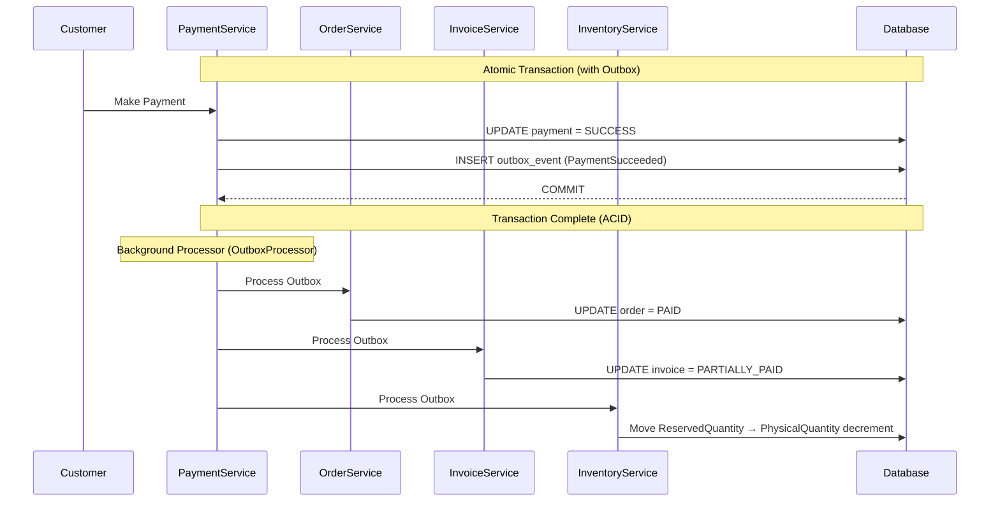

# Pet-care-new: Event Bridges & Cross-Aggregate Flows

> **Date:** 2026-08-24 (Updated)  
> **Scope:** Event bridges cho 7 FSMs  
> **Pattern:** Transactional Outbox Pattern (D-04 Approved)

---

## ⚠️ CRITICAL: Pattern Change (D-04 Approved)

> **DO NOT use** `@TransactionalEventListener(phase = AFTER_COMMIT)` — it has race condition risk.
> 
> **USE:** Transactional Outbox Pattern hoặc synchronous trong cùng transaction.

### Why?

```
❌ @TransactionalEventListener(AFTER_COMMIT) Problem:
1. Payment transaction commits to DB
2. Listener tries to update Order
3. Order update fails / crash / network issue
4. Payment = SUCCESS but Order still PENDING_PAYMENT
5. DATA INCONSISTENCY

✅ Transactional Outbox Solution:
1. PaymentService saves Payment + OutboxEvent in SAME transaction
2. Background job reads OutboxEvent table
3. Processes Order update
4. Marks OutboxEvent as processed
5. ATOMIC: Either both commit or neither
```

---

## 1. Transactional Outbox Pattern (D-04 Approved - C-565e7b1)

### 1.1 Outbox Table

```sql
CREATE TABLE outbox_events (
    id UUID PRIMARY KEY DEFAULT gen_random_uuid(),
    aggregate_type VARCHAR(100) NOT NULL,
    aggregate_id UUID NOT NULL,
    event_type VARCHAR(100) NOT NULL,
    payload JSONB NOT NULL,
    status VARCHAR(20) NOT NULL DEFAULT 'PENDING',
    retry_count INT DEFAULT 0,
    max_retries INT DEFAULT 3,
    processed_at TIMESTAMP,
    created_at TIMESTAMP NOT NULL DEFAULT CURRENT_TIMESTAMP
);

CREATE INDEX idx_outbox_status ON outbox_events(status, created_at);
```

### 1.2 Base Event with Outbox

```java
@Service
public class OutboxPublisher {
    
    @Transactional
    public void publish(DomainEvent event) {
        OutboxEvent outboxEvent = OutboxEvent.builder()
            .aggregateType(event.getAggregateType())
            .aggregateId(event.getAggregateId())
            .eventType(event.getEventType())
            .payload(toJson(event))
            .status(OutboxStatus.PENDING)
            .build();
        
        outboxRepository.save(outboxEvent);
        // Same transaction - either both commit or neither
    }
}

@Service
public class PaymentService {
    
    @Transactional
    public void processPayment(Payment payment) {
        // 1. Update payment status
        payment.setStatus(PaymentStatus.SUCCESS);
        paymentRepository.save(payment);
        
        // 2. Publish outbox event (same transaction)
        outboxPublisher.publish(new PaymentSucceededEvent(payment));
        
        // 3. Commit atomically
    }
}
```

### 1.3 Outbox Processor

```java
@Component
@RequiredArgsConstructor
public class OutboxProcessor {
    
    private final OutboxRepository outboxRepository;
    private final PaymentEventHandler paymentEventHandler;
    
    @Scheduled(fixedDelay = 1000) // Run every second
    @Transactional
    public void processOutbox() {
        List<OutboxEvent> events = outboxRepository
            .findByStatusOrderByCreatedAtAsc(OutboxStatus.PENDING, PageRequest.of(0, 100));
        
        for (OutboxEvent event : events) {
            try {
                switch (event.getEventType()) {
                    case "PaymentSucceeded":
                        paymentEventHandler.handlePaymentSucceeded(parsePayload(event));
                        break;
                    // ... other handlers
                }
                
                event.setStatus(OutboxStatus.PROCESSED);
                event.setProcessedAt(Instant.now());
            } catch (Exception e) {
                event.setRetryCount(event.getRetryCount() + 1);
                if (event.getRetryCount() >= event.getMaxRetries()) {
                    event.setStatus(OutboxStatus.DEAD_LETTER);
                }
            }
            outboxRepository.save(event);
        }
    }
}
```

---

## 2. Event Bridge Flows (Updated per C-565e7b1)

### Flow 1: Order → Payment → Invoice (Synchronous + Outbox)



### Flow 2: Refund → Payment/Order/Invoice (With 30-day window + Partial support)

```
Refund.COMPLETED (via PROCESSING → COMPLETED)
       │
       ├──▶ OutboxEvent: RefundCompleted (with amount)
       │
       ▼ Background Processor
       │
       ├──▶ Payment: 
       │     ├── If CumulativeRefund < TotalAmount → PARTIALLY_REFUNDED
       │     └── If CumulativeRefund == TotalAmount → REFUNDED
       │
       ├──▶ Order: → REFUNDED (if full refund)
       │
       └──▶ Invoice: → REFUNDED (if AllPaymentsRefunded)
```

### Flow 3: Walk-in → Appointment (NEW - C-565e7b1)

```
WalkIn CheckInWalkIn (RULE-07-05)
       │
       ▼ (Synchronous - same transaction)
       │
       └──▶ Create internal Appointment
              ├── Channel = WALK_IN
              ├── Status = IN_PROGRESS (direct)
              ├── StoreId, StaffId, StoreResourceId
              └── QueueTicketId linked
```

---

## 3. Event Listeners Mapping (Updated per C-565e7b1)

| Event | Handler | Side Effects |
|-------|---------|--------------|
| **PaymentSucceeded** | PaymentEventHandler | Update Order (PAID), Invoice (PARTIALLY_PAID/PAID), Inventory (Reserved → Deducted) |
| **PartialRefundCompleted** | RefundEventHandler | Update Payment to PARTIALLY_REFUNDED, Invoice remains |
| **FullRefundCompleted** | RefundEventHandler | Update Payment to REFUNDED, Order to REFUNDED, Invoice to REFUNDED |
| **OrderPaid** | OrderEventHandler | Log audit |
| **OrderTimedOut** | OrderEventHandler | Cancel order + Release ReservedQuantity |
| **AppointmentRescheduled** | AppointmentEventHandler | Re-check StoreResource availability |
| **AppointmentCompleted** | AppointmentEventHandler | Create/Update Invoice with services |
| **ClinicalExaminationCreated** | ClinicalEventHandler | Create Invoice with medical services |
| **VaccinationAdministered** | VaccinationEventHandler | Decrement VaccineBatch, Schedule next, Create FollowUp |
| **GroomingCompleted** | GroomingEventHandler | Sync additional services to Invoice, CheckOutAppointment |
| **GroomingAdditionalRequested** | GroomingEventHandler | Notify customer for approval |
| **CrossStoreConsentApproved** | ConsentEventHandler | Grant medical access (24h TTL) |
| **EmergencyOverrideTriggered** | ConsentEventHandler | Log EMERGENCY_ACCESS_LOG + notify pet owner |

---

## 4. Implementation Checklist

### Phase 1: Core (W2)

- [ ] Create `outbox_events` table
- [ ] Implement `OutboxPublisher` service
- [ ] Implement `OutboxProcessor` with scheduler
- [ ] Migrate Payment → Order bridge to Outbox
- [ ] Migrate Payment → Invoice bridge to Outbox
- [ ] Unit tests for OutboxProcessor

### Phase 2: Commerce (W3)

- [ ] Migrate Refund → Payment bridge to Outbox
- [ ] Migrate Refund → Order bridge to Outbox
- [ ] Migrate Refund → Invoice bridge to Outbox

### Phase 3: Integration

- [ ] Dead letter queue for failed events
- [ ] Monitoring dashboard for Outbox lag
- [ ] Alert when lag > threshold (e.g., 5 minutes)

---

## 5. Event Definitions

```java
// Domain Events (immutable records)
public sealed interface DomainEvent permits 
    PaymentSucceededEvent,
    PaymentFailedEvent,
    PartialRefundCompletedEvent,
    FullRefundCompletedEvent,
    OrderPaidEvent,
    OrderTimedOutEvent,           // NEW - C-565e7b1
    OrderDeliveredEvent,
    OrderRefundedEvent,
    AppointmentCompletedEvent,
    AppointmentRescheduledEvent,  // NEW - C-565e7b1
    GroomingCompletedEvent,       // NEW - C-565e7b1
    GroomingAdditionalRequestedEvent, // NEW - C-565e7b1
    ClinicalExaminationCreatedEvent,
    VaccinationAdministeredEvent,
    VaccineExpiredEvent,          // NEW - C-565e7b1
    CrossStoreConsentApprovedEvent, // NEW - C-565e7b1
    EmergencyOverrideTriggeredEvent, // NEW - C-565e7b1
    InvoiceCreatedEvent { ... }

// Outbox Events (persisted)
@Entity
@Table(name = "outbox_events")
public class OutboxEvent {
    @Id
    private UUID id;
    private String aggregateType;  // "Payment", "Order", etc.
    private UUID aggregateId;
    private String eventType;        // "PaymentSucceeded", etc.
    private String payload;          // JSON
    @Enumerated(EnumType.STRING)
    private OutboxStatus status;     // PENDING, PROCESSED, DEAD_LETTER
    private int retryCount;
    private Instant processedAt;
    private Instant createdAt;
}
```

---

## 6. Outbox Status Flow

```
PENDING → PROCESSED (success)
PENDING → DEAD_LETTER (max retries exceeded: 3)

Manual Recovery:
DEAD_LETTER → PENDING (manual retry after fixing issue)
```

---

## 7. Monitoring Metrics

```java
// Metrics for monitoring
- outbox_pending_count (gauge)
- outbox_processing_duration_seconds (histogram)
- outbox_dead_letter_count (counter)
- outbox_lag_seconds (gauge)
```

---

## 8. Next Steps

1. [x] ~~@TransactionalEventListener pattern~~ → Outbox Pattern (D-04)
2. [ ] Create outbox_events table migration
3. [ ] Implement OutboxPublisher
4. [ ] Implement OutboxProcessor
5. [ ] Migrate all event handlers
6. [ ] Add monitoring/metrics
7. [ ] Write integration tests
